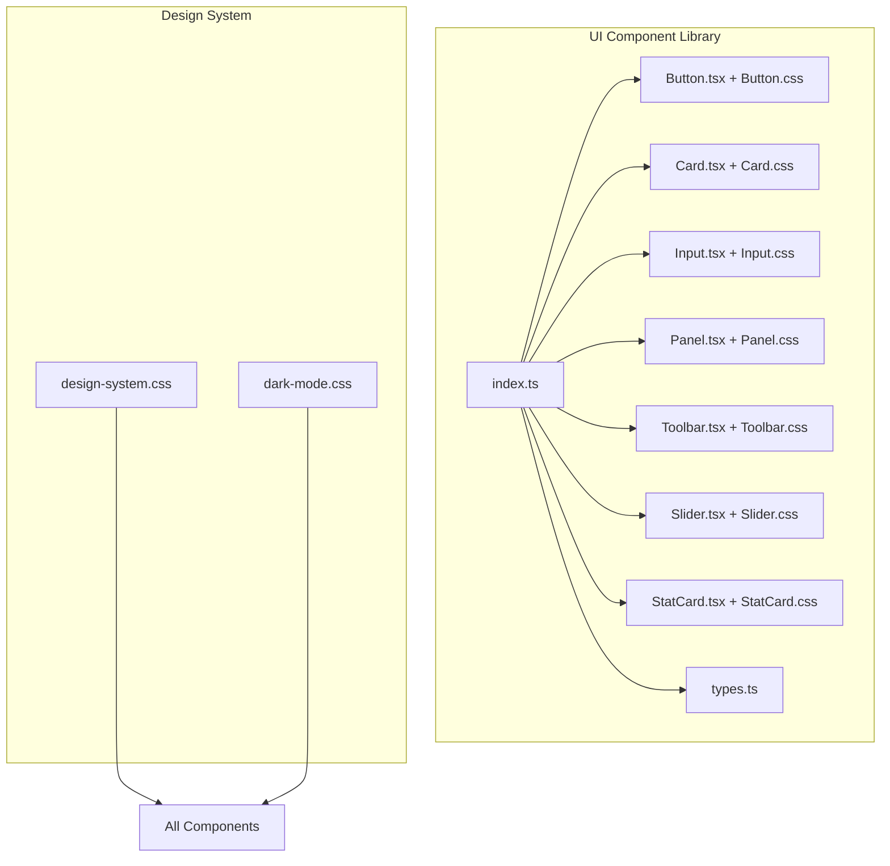
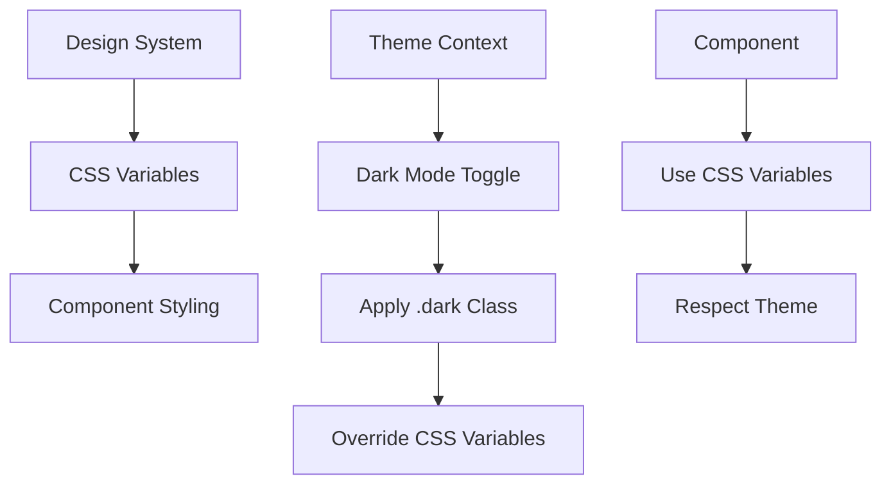
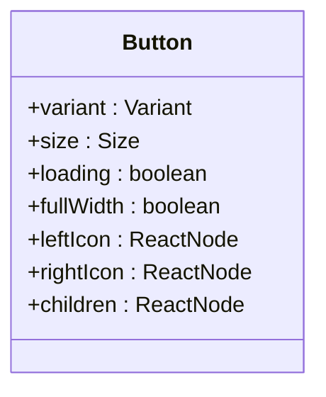
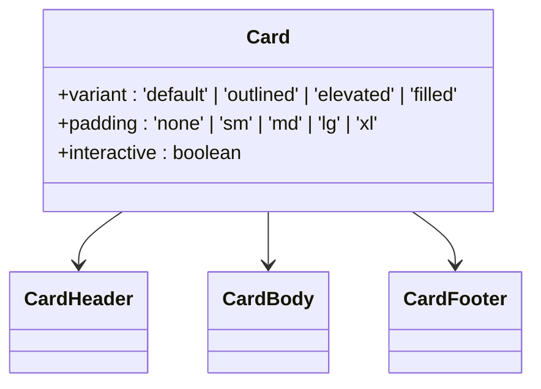
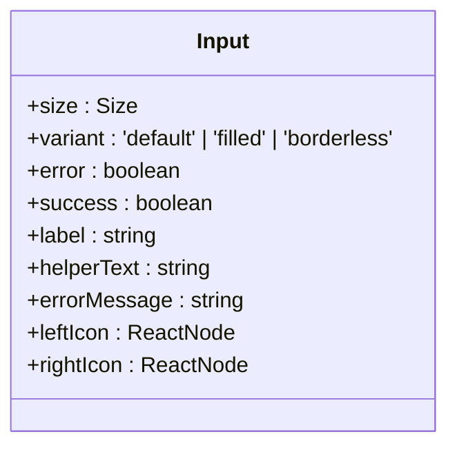
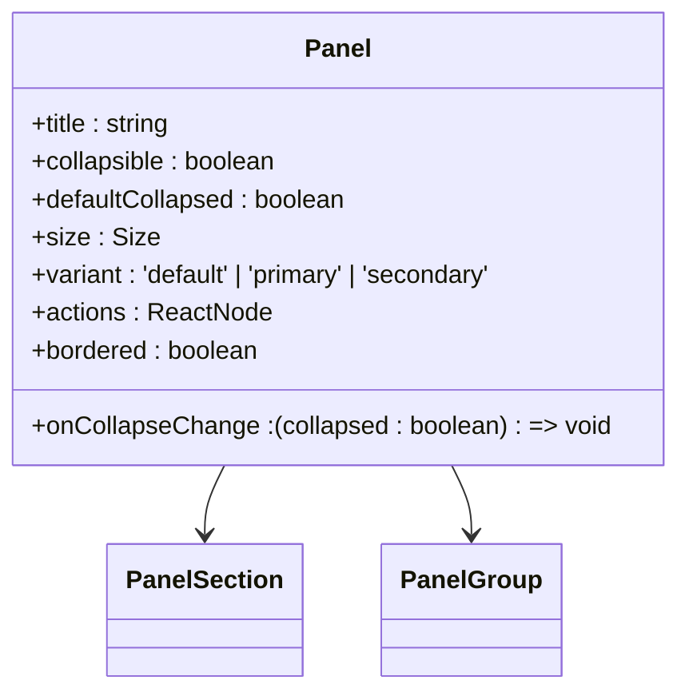
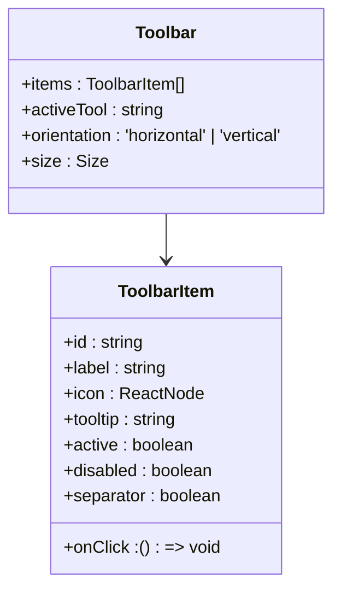
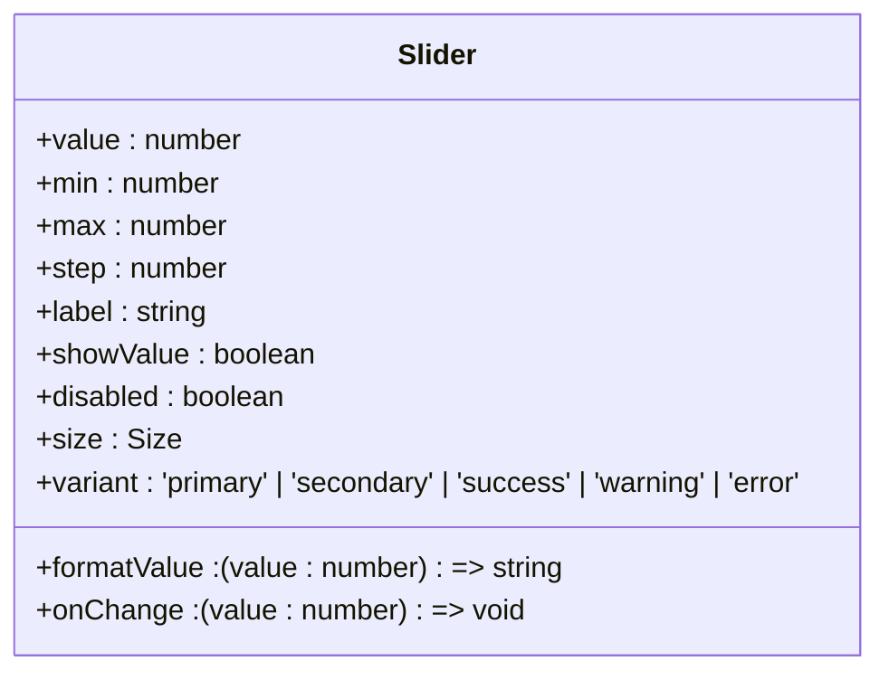
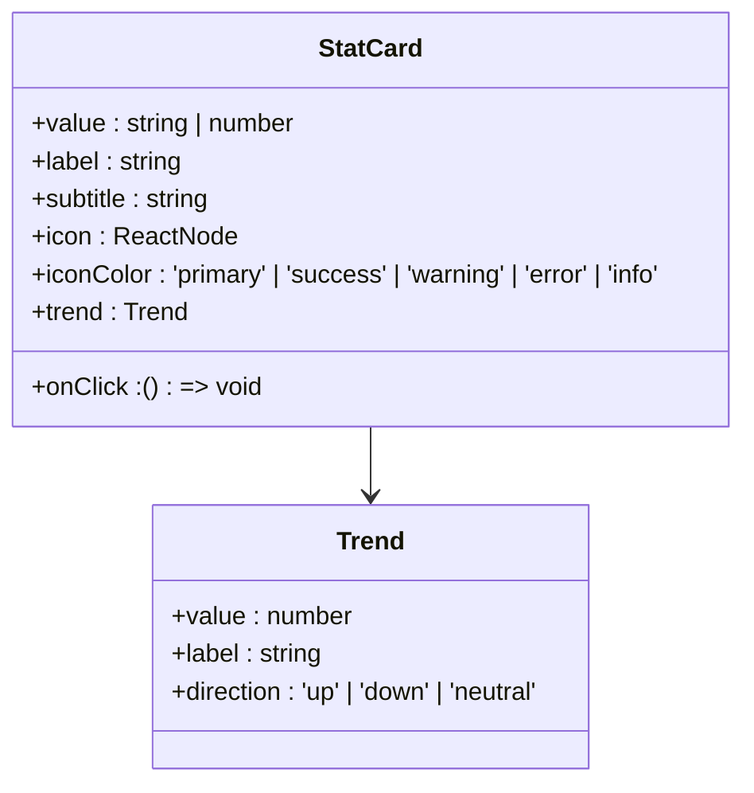
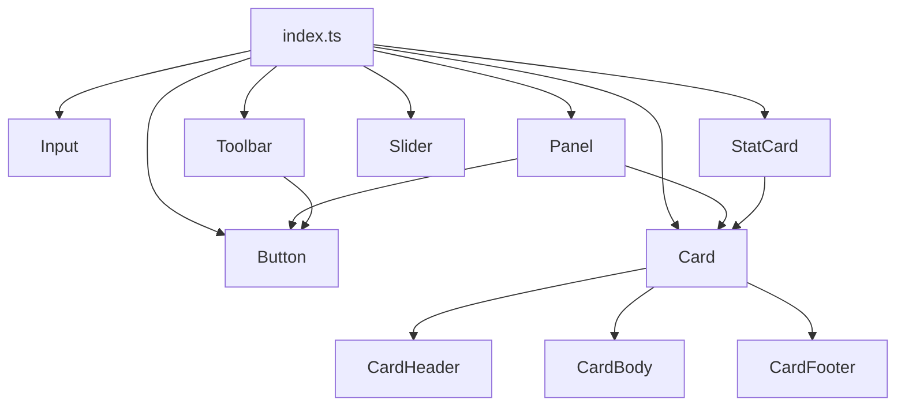

# UI Component Library

<cite>
**Referenced Files in This Document**   
- [Button.tsx](file://pikzels-clone\client\src\components\ui\Button.tsx)
- [Card.tsx](file://pikzels-clone\client\src\components\ui\Card.tsx)
- [Input.tsx](file://pikzels-clone\client\src\components\ui\Input.tsx)
- [Panel.tsx](file://pikzels-clone\client\src\components\ui\Panel.tsx)
- [Toolbar.tsx](file://pikzels-clone\client\src\components\ui\Toolbar.tsx)
- [Slider.tsx](file://pikzels-clone\client\src\components\ui\Slider.tsx)
- [StatCard.tsx](file://pikzels-clone\client\src\components\ui\StatCard.tsx)
- [index.ts](file://pikzels-clone\client\src\components\ui\index.ts)
- [types.ts](file://pikzels-clone\client\src\components\ui\types.ts)
- [design-system.css](file://pikzels-clone\client\src\styles\design-system.css)
- [dark-mode.css](file://pikzels-clone\client\src\styles\dark-mode.css)
</cite>

## Table of Contents
1. [Introduction](#introduction)
2. [Project Structure](#project-structure)
3. [Core Components](#core-components)
4. [Architecture Overview](#architecture-overview)
5. [Detailed Component Analysis](#detailed-component-analysis)
6. [Dependency Analysis](#dependency-analysis)
7. [Performance Considerations](#performance-considerations)
8. [Troubleshooting Guide](#troubleshooting-guide)
9. [Conclusion](#conclusion)

## Introduction
The UI Component Library in Thumbnail Maker Studio provides a consistent, accessible, and reusable set of components that adhere to the application's design system. These components are built using React with TypeScript and styled via CSS modules, ensuring type safety and encapsulation. The library supports responsive design, theming via CSS variables, and global dark mode integration. This documentation details each component's visual design, behavior, accessibility features, props, events, and customization options, along with usage examples and extension guidelines.

## Project Structure
The UI component library is located in the `client/src/components/ui` directory and includes reusable components such as Button, Card, Input, Panel, Toolbar, Slider, and StatCard. Each component has a corresponding `.tsx` file for logic and a `.css` file for styles. The library exports all components through a centralized `index.ts` file, enabling clean imports across the application. Shared types are defined in `types.ts`, and global design tokens are managed in `design-system.css` and `dark-mode.css`.

**Diagram sources**
- [index.ts](file://pikzels-clone\client\src\components\ui\index.ts)
- [design-system.css](file://pikzels-clone\client\src\styles\design-system.css)
- [dark-mode.css](file://pikzels-clone\client\src\styles\dark-mode.css)

**Section sources**
- [Button.tsx](file://pikzels-clone\client\src\components\ui\Button.tsx)
- [Card.tsx](file://pikzels-clone\client\src\components\ui\Card.tsx)
- [Input.tsx](file://pikzels-clone\client\src\components\ui\Input.tsx)
- [Panel.tsx](file://pikzels-clone\client\src\components\ui\Panel.tsx)
- [Toolbar.tsx](file://pikzels-clone\client\src\components\ui\Toolbar.tsx)
- [Slider.tsx](file://pikzels-clone\client\src\components\ui\Slider.tsx)
- [StatCard.tsx](file://pikzels-clone\client\src\components\ui\StatCard.tsx)
- [index.ts](file://pikzels-clone\client\src\components\ui\index.ts)
- [types.ts](file://pikzels-clone\client\src\components\ui\types.ts)

## Core Components
The core components of the UI library include Button, Card, Input, Panel, Toolbar, Slider, and StatCard. Each component is designed with accessibility in mind, supporting keyboard navigation, ARIA attributes, and screen reader compatibility. Components are built using TypeScript interfaces to define props, ensuring type safety and developer experience. Styling is achieved through CSS modules and design system tokens, enabling consistent theming and dark mode support.

**Section sources**
- [Button.tsx](file://pikzels-clone\client\src\components\ui\Button.tsx)
- [Card.tsx](file://pikzels-clone\client\src\components\ui\Card.tsx)
- [Input.tsx](file://pikzels-clone\client\src\components\ui\Input.tsx)
- [Panel.tsx](file://pikzels-clone\client\src\components\ui\Panel.tsx)
- [Toolbar.tsx](file://pikzels-clone\client\src\components\ui\Toolbar.tsx)
- [Slider.tsx](file://pikzels-clone\client\src\components\ui\Slider.tsx)
- [StatCard.tsx](file://pikzels-clone\client\src\components\ui\StatCard.tsx)

## Architecture Overview
The UI component library follows a modular architecture where each component is self-contained with its own styles and logic. Components are composed using sub-components (e.g., CardHeader, CardBody) for better flexibility. The design system uses CSS custom properties (variables) defined in `design-system.css` for consistent spacing, typography, colors, and shadows. Dark mode is implemented by overriding these variables in the `.dark` class, applied globally via a theme context. Components are exported through `index.ts` for easy consumption, and types are shared via `types.ts`.

**Diagram sources**
- [design-system.css](file://pikzels-clone\client\src\styles\design-system.css)
- [dark-mode.css](file://pikzels-clone\client\src\styles\dark-mode.css)

## Detailed Component Analysis

### Button Analysis
The Button component supports multiple variants (primary, secondary, ghost, danger, success), sizes (sm, md, lg), and states (loading, disabled, full-width). It accepts left and right icons and is fully accessible with proper focus indicators and ARIA attributes. The loading state displays a spinner, and the button is disabled during loading.

**Diagram sources**
- [Button.tsx](file://pikzels-clone\client\src\components\ui\Button.tsx)

**Section sources**
- [Button.tsx](file://pikzels-clone\client\src\components\ui\Button.tsx)

### Card Analysis
The Card component provides a container with variants (default, outlined, elevated, filled), padding options, and interactive states. It includes sub-components CardHeader, CardBody, and CardFooter for structured content layout. Cards support hover effects when marked as interactive.

**Diagram sources**
- [Card.tsx](file://pikzels-clone\client\src\components\ui\Card.tsx)

**Section sources**
- [Card.tsx](file://pikzels-clone\client\src\components\ui\Card.tsx)

### Input Analysis
The Input component supports labels, helper text, error messages, left/right icons, and validation states. It is fully accessible with proper labeling, ARIA attributes, and error announcements. The component handles focus states and integrates with form validation systems.

**Diagram sources**
- [Input.tsx](file://pikzels-clone\client\src\components\ui\Input.tsx)

**Section sources**
- [Input.tsx](file://pikzels-clone\client\src\components\ui\Input.tsx)

### Panel Analysis
The Panel component is a collapsible container built on top of Card. It supports titles, actions, collapsible behavior, and nested sections via PanelSection and PanelGroup. Panels can be bordered or borderless and support different sizes and variants.

**Diagram sources**
- [Panel.tsx](file://pikzels-clone\client\src\components\ui\Panel.tsx)

**Section sources**
- [Panel.tsx](file://pikzels-clone\client\src\components\ui\Panel.tsx)

### Toolbar Analysis
The Toolbar component displays a set of tools with active state indication. It supports horizontal or vertical orientation and integrates with Button components. Tool items can have icons, labels, tooltips, and separators.

**Diagram sources**
- [Toolbar.tsx](file://pikzels-clone\client\src\components\ui\Toolbar.tsx)

**Section sources**
- [Toolbar.tsx](file://pikzels-clone\client\src\components\ui\Toolbar.tsx)

### Slider Analysis
The Slider component provides a range input with visual feedback, supporting mouse and keyboard interaction. It displays the current value and supports formatting. The component is accessible with proper ARIA labeling and keyboard navigation (arrow keys, Page Up/Down, Home/End).

**Diagram sources**
- [Slider.tsx](file://pikzels-clone\client\src\components\ui\Slider.tsx)

**Section sources**
- [Slider.tsx](file://pikzels-clone\client\src\components\ui\Slider.tsx)

### StatCard Analysis
The StatCard component displays key metrics with icons, trends, and optional interactivity. It supports trend indicators (up, down, neutral) with directional icons and percentage changes. The component is built on Card and supports click handling for interactive dashboards.

**Diagram sources**
- [StatCard.tsx](file://pikzels-clone\client\src\components\ui\StatCard.tsx)

**Section sources**
- [StatCard.tsx](file://pikzels-clone\client\src\components\ui\StatCard.tsx)

## Dependency Analysis
The UI components have a hierarchical dependency structure where higher-level components compose lower-level ones. For example, Panel uses Card and Button, while StatCard uses Card. All components rely on the design system CSS variables for consistent styling. The export mechanism in `index.ts` centralizes component access, reducing direct file path dependencies.

**Diagram sources**
- [index.ts](file://pikzels-clone\client\src\components\ui\index.ts)
- [Panel.tsx](file://pikzels-clone\client\src\components\ui\Panel.tsx)
- [StatCard.tsx](file://pikzels-clone\client\src\components\ui\StatCard.tsx)
- [Toolbar.tsx](file://pikzels-clone\client\src\components\ui\Toolbar.tsx)

**Section sources**
- [index.ts](file://pikzels-clone\client\src\components\ui\index.ts)

## Performance Considerations
The UI component library is optimized for performance through several strategies:
- **Memoization**: Components use React.memo where appropriate to prevent unnecessary re-renders.
- **Event Delegation**: Interactive components use efficient event handling.
- **CSS Variables**: Design tokens enable fast theme switching without re-rendering.
- **Lazy Loading**: Components are imported on demand via the index export.
- **Minimal DOM**: Components generate minimal markup for better rendering performance.

## Troubleshooting Guide
Common issues and solutions for the UI component library:
- **Dark mode not applying**: Ensure the `.dark` class is applied to the root element and `dark-mode.css` is imported.
- **Component not rendering**: Verify the component is exported in `index.ts` and imported correctly.
- **Styling conflicts**: Use CSS modules and avoid global styles; prefer design system utilities.
- **Accessibility issues**: Check ARIA attributes, keyboard navigation, and screen reader announcements.
- **Type errors**: Ensure `types.ts` is up to date and interfaces match implementation.

**Section sources**
- [design-system.css](file://pikzels-clone\client\src\styles\design-system.css)
- [dark-mode.css](file://pikzels-clone\client\src\styles\dark-mode.css)
- [index.ts](file://pikzels-clone\client\src\components\ui\index.ts)
- [types.ts](file://pikzels-clone\client\src\components\ui\types.ts)

## Conclusion
The UI Component Library in Thumbnail Maker Studio provides a robust, accessible, and themable set of components that ensure consistency across the application. By leveraging TypeScript, CSS modules, and design system tokens, the library enables efficient development and maintenance. Components are well-documented, composable, and support responsive design and dark mode. Developers can extend existing components or create new ones following the established patterns in `types.ts` and `design-system.css`.