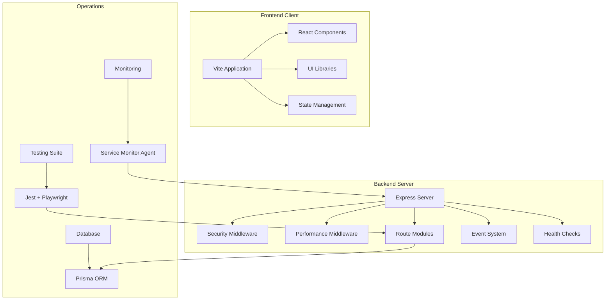
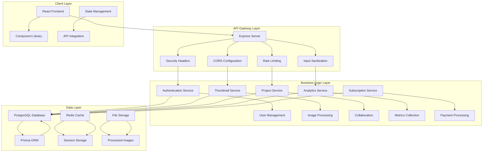
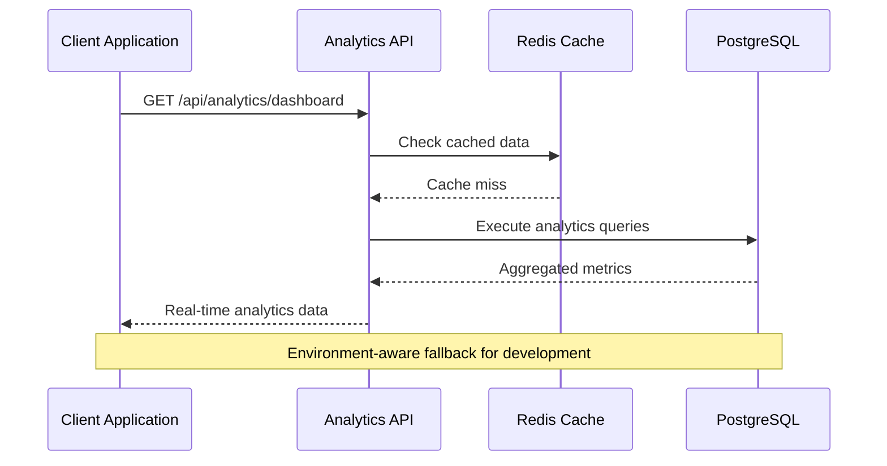
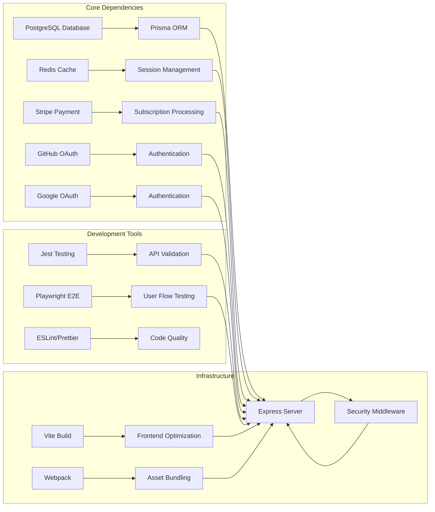

# Production Readiness Roadmap

<cite>
**Referenced Files in This Document**
- [PRODUCTION_READINESS_ROADMAP.md](file://PRODUCTION_READINESS_ROADMAP.md)
- [server.ts](file://pikzels-clone/src/server.ts)
- [package.json](file://pikzels-clone/package.json)
- [client/package.json](file://pikzels-clone/client/package.json)
</cite>

## Table of Contents
1. [Introduction](#introduction)
2. [Project Structure](#project-structure)
3. [Core Components](#core-components)
4. [Architecture Overview](#architecture-overview)
5. [Detailed Component Analysis](#detailed-component-analysis)
6. [Dependency Analysis](#dependency-analysis)
7. [Performance Considerations](#performance-considerations)
8. [Troubleshooting Guide](#troubleshooting-guide)
9. [Conclusion](#conclusion)

## Introduction
This Production Readiness Roadmap documents the systematic transition from mock/static data to production-ready implementation across all application pages. It tracks the current status of 14 target pages, categorizing them into three states: production-ready, needing integration, and not yet implemented. The roadmap provides implementation guidelines, environment-aware patterns, recommended order of operations, and verification criteria to ensure robust, secure, and scalable production deployment.

## Project Structure
The project follows a modular backend architecture with a separate frontend client, extensive testing infrastructure, and comprehensive operational tooling. The backend server initializes security middleware, performance monitoring, and route registration, while the frontend provides a modern React-based interface with advanced UI components and state management.

**Diagram sources**
- [server.ts](file://pikzels-clone/src/server.ts#L1-L369)
- [package.json](file://pikzels-clone/package.json#L1-L200)
- [client/package.json](file://pikzels-clone/client/package.json#L1-L97)

**Section sources**
- [server.ts](file://pikzels-clone/src/server.ts#L1-L369)
- [package.json](file://pikzels-clone/package.json#L1-L200)
- [client/package.json](file://pikzels-clone/client/package.json#L1-L97)

## Core Components
The production readiness framework centers around four pillars: environment-aware data handling, security-first middleware, performance monitoring, and comprehensive testing. The backend implements a sophisticated pattern where services gracefully fall back to mock data in development environments while enforcing strict production requirements.

### Environment-Aware Data Pattern
All pages follow a standardized pattern that distinguishes between test, development, staging, and production environments. The pattern ensures deterministic behavior during testing while maintaining production-grade reliability in live environments.

### Security Infrastructure
The server incorporates multiple layers of security including HTTPS redirection, security headers, input sanitization, rate limiting, CORS configuration, and request size limiting. These controls protect against common web vulnerabilities while maintaining performance.

### Performance Monitoring
Comprehensive performance monitoring includes response time tracking, caching mechanisms, compression, and event system instrumentation. The monitoring system provides insights into system health and performance bottlenecks.

**Section sources**
- [PRODUCTION_READINESS_ROADMAP.md](file://PRODUCTION_READINESS_ROADMAP.md#L243-L344)
- [server.ts](file://pikzels-clone/src/server.ts#L12-L117)

## Architecture Overview
The system architecture implements a microservices-like approach within a single Express application, with clear separation of concerns across authentication, content management, analytics, collaboration, and administrative functions. The architecture supports horizontal scaling through Redis caching and maintains backward compatibility through API versioning.

**Diagram sources**
- [server.ts](file://pikzels-clone/src/server.ts#L34-L59)
- [package.json](file://pikzels-clone/package.json#L96-L137)

## Detailed Component Analysis

### AnalyticsPage Implementation
The AnalyticsPage represents the highest priority integration requiring immediate attention. Currently containing hardcoded data, it requires comprehensive API integration to deliver real-time analytics and reporting capabilities.

#### Current State Analysis
- **Data Source**: Hardcoded statistics and chart configurations
- **Backend Availability**: Analytics service exists with multiple endpoint categories
- **Integration Complexity**: Medium-high due to diverse data types and real-time requirements

#### Implementation Requirements
The implementation requires replacing hardcoded data with dynamic API calls, implementing proper state management, and adding comprehensive error handling and loading states.

**Diagram sources**
- [PRODUCTION_READINESS_ROADMAP.md](file://PRODUCTION_READINESS_ROADMAP.md#L30-L86)

#### Risk Mitigation Strategy
Given the critical nature of analytics data, the implementation should prioritize:
- Comprehensive error handling with graceful degradation
- Caching strategies for frequently accessed reports
- Performance optimization for large dataset queries
- Real-time data refresh mechanisms

**Section sources**
- [PRODUCTION_READINESS_ROADMAP.md](file://PRODUCTION_READINESS_ROADMAP.md#L30-L86)

### ProjectsPage Enhancement
The ProjectsPage currently implements full CRUD operations with hierarchical structure and filtering capabilities. However, it requires additional integration with the analytics system to provide trending metrics and collaborative features.

#### Integration Opportunities
- Trending score calculation based on user engagement
- Collaborative project features with real-time updates
- Advanced filtering and search capabilities
- Performance metrics integration

**Section sources**
- [PRODUCTION_READINESS_ROADMAP.md](file://PRODUCTION_READINESS_ROADMAP.md#L356-L361)

### Teams Page Development
The Teams Page requires complete implementation with new backend services and frontend integration. This represents a significant enhancement requiring substantial development effort.

#### Development Requirements
- New team management service creation
- Invitation system implementation
- Role-based permission system
- Collaboration features integration
- Real-time communication capabilities

**Section sources**
- [PRODUCTION_READINESS_ROADMAP.md](file://PRODUCTION_READINESS_ROADMAP.md#L208-L240)

### BrandPage Implementation
The BrandPage requires backend service creation with file upload capabilities and asset management. This involves establishing new database models and API endpoints.

#### Technical Requirements
- File upload service integration
- Asset storage management (S3/Cloudinary)
- Color picker integration
- Font selection system
- Preview functionality

**Section sources**
- [PRODUCTION_READINESS_ROADMAP.md](file://PRODUCTION_READINESS_ROADMAP.md#L92-L123)

## Dependency Analysis
The production readiness implementation depends on several critical systems and services that require careful coordination and testing.

**Diagram sources**
- [package.json](file://pikzels-clone/package.json#L96-L137)
- [client/package.json](file://pikzels-clone/client/package.json#L16-L61)

### Testing Infrastructure
The project implements comprehensive testing across unit, integration, and end-to-end levels with specialized tooling for different aspects of the application.

**Section sources**
- [package.json](file://pikzels-clone/package.json#L16-L28)
- [client/package.json](file://pikzels-clone/client/package.json#L11-L14)

## Performance Considerations
Production readiness requires careful attention to performance optimization, scalability, and resource management. The current architecture implements several performance optimization strategies that must be maintained and enhanced.

### Caching Strategy
The system utilizes Redis caching for frequently accessed data, session management, and API response caching. Proper cache invalidation and warming strategies are essential for maintaining performance under load.

### Database Optimization
Prisma ORM provides type-safe database operations with built-in query optimization. Indexing strategies, connection pooling, and query optimization are critical for handling production-scale workloads.

### Frontend Performance
The React frontend implements modern optimization techniques including lazy loading, code splitting, and efficient state management. Bundle optimization and asset compression contribute to improved user experience.

## Troubleshooting Guide
Effective troubleshooting requires understanding the layered architecture and implementing systematic diagnostic approaches.

### Common Issues and Solutions
- **API Integration Failures**: Verify endpoint availability, authentication tokens, and network connectivity
- **Performance Degradation**: Monitor cache hit rates, database query performance, and memory usage
- **Authentication Problems**: Check token validity, session state, and OAuth provider status
- **Database Connectivity**: Validate connection strings, network security groups, and resource limits

### Monitoring and Alerting
The service monitor agent provides comprehensive system health monitoring with configurable alerting thresholds. Regular monitoring of key metrics helps prevent issues before they impact users.

**Section sources**
- [server.ts](file://pikzels-clone/src/server.ts#L196-L232)
- [package.json](file://pikzels-clone/package.json#L61-L72)

## Conclusion
The Production Readiness Roadmap provides a comprehensive framework for transitioning the application from development to production deployment. With 57% of pages already production-ready and a clear implementation plan for remaining features, the project demonstrates strong progress toward full production capability.

The phased implementation approach prioritizes high-impact features first, ensuring maximum business value while maintaining system stability. The environment-aware patterns, comprehensive security measures, and robust testing infrastructure provide a solid foundation for production deployment.

Success requires adherence to the established patterns, thorough testing across all environments, and continuous monitoring of system health and performance metrics. The roadmap serves as both a progress tracker and implementation guide, ensuring systematic advancement toward production readiness.