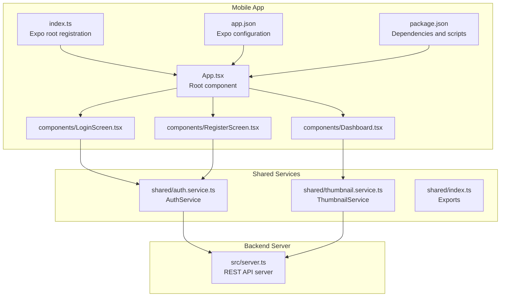
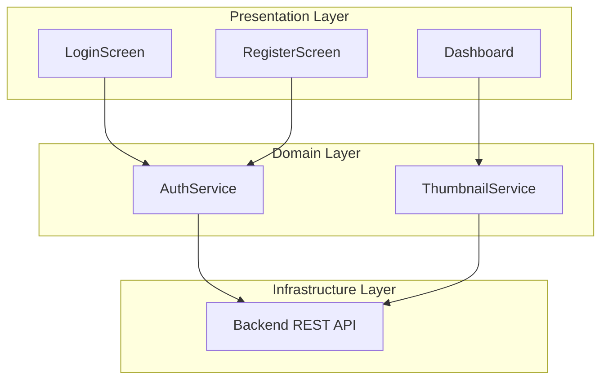
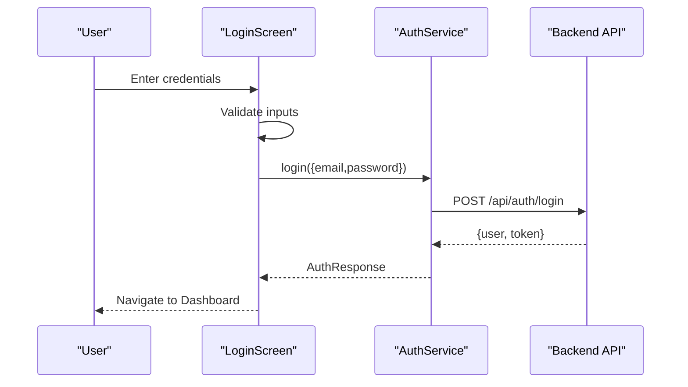
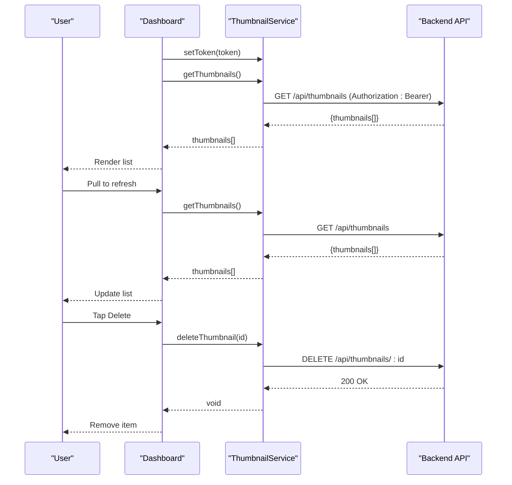
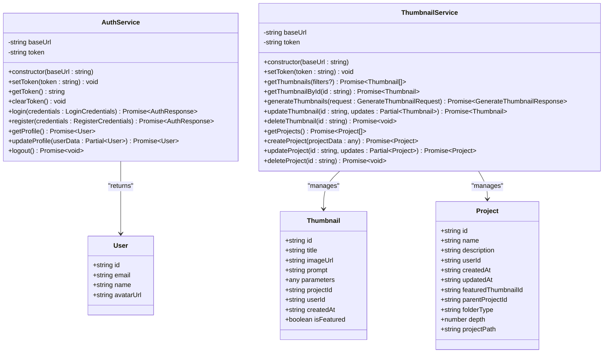
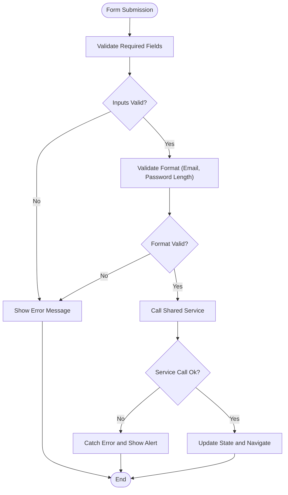
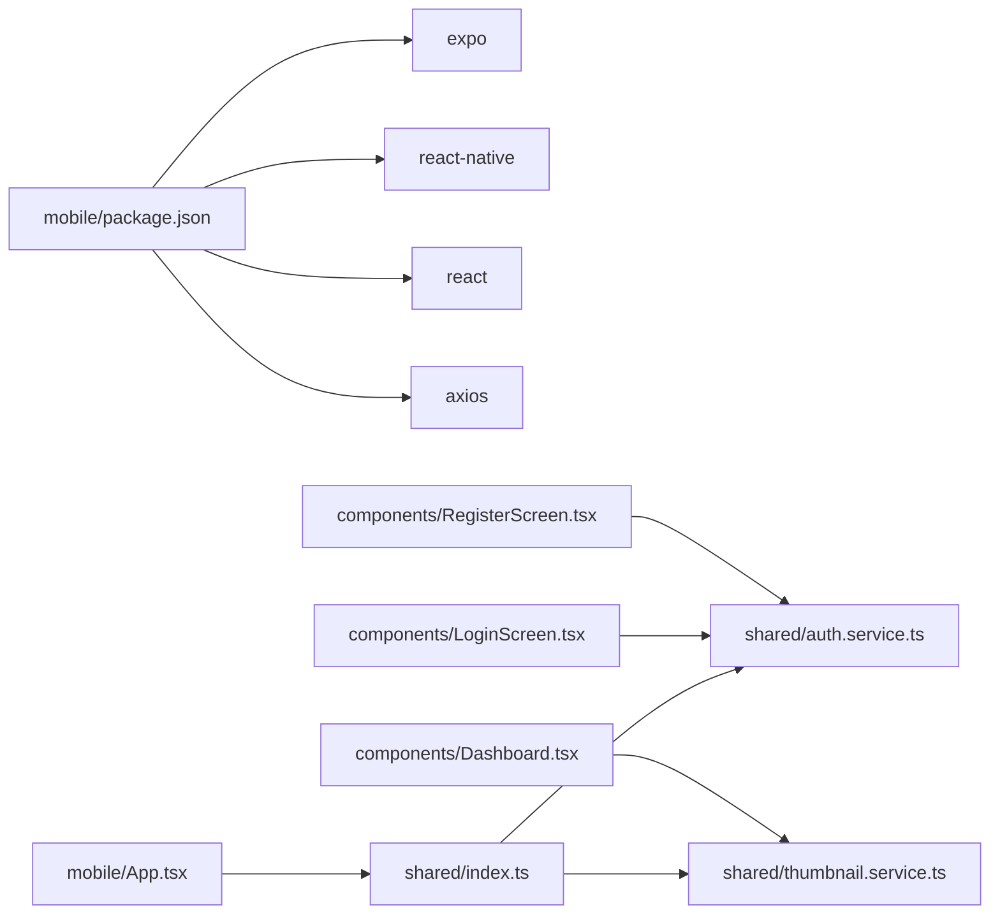

# Mobile App

<cite>
**Referenced Files in This Document**
- [mobile/package.json](file://pikzels-clone/mobile/package.json)
- [mobile/app.json](file://pikzels-clone/mobile/app.json)
- [mobile/index.ts](file://pikzels-clone/mobile/index.ts)
- [mobile/App.tsx](file://pikzels-clone/mobile/App.tsx)
- [mobile/components/LoginScreen.tsx](file://pikzels-clone/mobile/components/LoginScreen.tsx)
- [mobile/components/RegisterScreen.tsx](file://pikzels-clone/mobile/components/RegisterScreen.tsx)
- [mobile/components/Dashboard.tsx](file://pikzels-clone/mobile/components/Dashboard.tsx)
- [shared/auth.service.ts](file://pikzels-clone/shared/auth.service.ts)
- [shared/thumbnail.service.ts](file://pikzels-clone/shared/thumbnail.service.ts)
- [shared/index.ts](file://pikzels-clone/shared/index.ts)
- [src/server.ts](file://pikzels-clone/src/server.ts)
- [docs/mobile-app.md](file://pikzels-clone/docs/mobile-app.md)
- [README.md](file://pikzels-clone/README.md)
</cite>

## Table of Contents
1. [Introduction](#introduction)
2. [Project Structure](#project-structure)
3. [Core Components](#core-components)
4. [Architecture Overview](#architecture-overview)
5. [Detailed Component Analysis](#detailed-component-analysis)
6. [Dependency Analysis](#dependency-analysis)
7. [Performance Considerations](#performance-considerations)
8. [Troubleshooting Guide](#troubleshooting-guide)
9. [Conclusion](#conclusion)

## Introduction
This document describes the Mobile App for Thumbnail Maker, a React Native application built with Expo that provides a native mobile experience for creating and managing thumbnails. The mobile app shares core business logic with the web application via a shared services layer, enabling consistent authentication and thumbnail operations across platforms.

The mobile app currently supports:
- User authentication (login and registration)
- Viewing and managing thumbnails
- Pull-to-refresh and deletion workflows
- Token-based authentication with backend APIs

Future enhancements include direct thumbnail generation, advanced editing tools, offline support, and platform-specific integrations.

## Project Structure
The mobile application is organized into three primary areas:
- Mobile application code (React Native + Expo)
- Shared services for authentication and thumbnail operations
- Backend server exposing RESTful APIs consumed by the mobile app

**Diagram sources**
- [mobile/App.tsx](file://pikzels-clone/mobile/App.tsx#L1-L68)
- [mobile/components/LoginScreen.tsx](file://pikzels-clone/mobile/components/LoginScreen.tsx#L1-L142)
- [mobile/components/RegisterScreen.tsx](file://pikzels-clone/mobile/components/RegisterScreen.tsx#L1-L173)
- [mobile/components/Dashboard.tsx](file://pikzels-clone/mobile/components/Dashboard.tsx#L1-L194)
- [mobile/index.ts](file://pikzels-clone/mobile/index.ts#L1-L9)
- [mobile/app.json](file://pikzels-clone/mobile/app.json#L1-L31)
- [mobile/package.json](file://pikzels-clone/mobile/package.json#L1-L23)
- [shared/auth.service.ts](file://pikzels-clone/shared/auth.service.ts#L1-L141)
- [shared/thumbnail.service.ts](file://pikzels-clone/shared/thumbnail.service.ts#L1-L266)
- [shared/index.ts](file://pikzels-clone/shared/index.ts#L1-L3)
- [src/server.ts](file://pikzels-clone/src/server.ts#L1-L422)

**Section sources**
- [mobile/package.json](file://pikzels-clone/mobile/package.json#L1-L23)
- [mobile/app.json](file://pikzels-clone/mobile/app.json#L1-L31)
- [mobile/index.ts](file://pikzels-clone/mobile/index.ts#L1-L9)
- [mobile/App.tsx](file://pikzels-clone/mobile/App.tsx#L1-L68)
- [shared/index.ts](file://pikzels-clone/shared/index.ts#L1-L3)
- [src/server.ts](file://pikzels-clone/src/server.ts#L1-L422)

## Core Components
This section outlines the primary building blocks of the mobile application and their responsibilities.

- App root component
  - Manages application state (user, token, current view)
  - Handles navigation between login, register, and dashboard views
  - Passes authentication callbacks and logout actions to child components

- LoginScreen
  - Collects email and password
  - Performs basic validation and displays errors
  - Calls AuthService.login and forwards successful responses to parent

- RegisterScreen
  - Collects name, email, password, and confirmation
  - Validates inputs and compares passwords
  - Calls AuthService.register and forwards successful responses to parent

- Dashboard
  - Displays user thumbnails in a scrollable list
  - Supports pull-to-refresh and error feedback
  - Provides delete action with confirmation dialog
  - Uses ThumbnailService to fetch and delete thumbnails

- Shared services
  - AuthService: handles login, registration, profile retrieval, and token lifecycle
  - ThumbnailService: manages thumbnail CRUD operations and project queries

**Section sources**
- [mobile/App.tsx](file://pikzels-clone/mobile/App.tsx#L8-L61)
- [mobile/components/LoginScreen.tsx](file://pikzels-clone/mobile/components/LoginScreen.tsx#L10-L87)
- [mobile/components/RegisterScreen.tsx](file://pikzels-clone/mobile/components/RegisterScreen.tsx#L10-L118)
- [mobile/components/Dashboard.tsx](file://pikzels-clone/mobile/components/Dashboard.tsx#L10-L108)
- [shared/auth.service.ts](file://pikzels-clone/shared/auth.service.ts#L25-L141)
- [shared/thumbnail.service.ts](file://pikzels-clone/shared/thumbnail.service.ts#L39-L266)

## Architecture Overview
The mobile app follows a layered architecture:
- Presentation layer: React Native components (LoginScreen, RegisterScreen, Dashboard)
- Domain layer: Shared services (AuthService, ThumbnailService)
- Infrastructure layer: Backend REST API (src/server.ts)

**Diagram sources**
- [mobile/components/LoginScreen.tsx](file://pikzels-clone/mobile/components/LoginScreen.tsx#L3-L35)
- [mobile/components/RegisterScreen.tsx](file://pikzels-clone/mobile/components/RegisterScreen.tsx#L3-L49)
- [mobile/components/Dashboard.tsx](file://pikzels-clone/mobile/components/Dashboard.tsx#L3-L20)
- [shared/auth.service.ts](file://pikzels-clone/shared/auth.service.ts#L49-L86)
- [shared/thumbnail.service.ts](file://pikzels-clone/shared/thumbnail.service.ts#L52-L89)
- [src/server.ts](file://pikzels-clone/src/server.ts#L174-L203)

## Detailed Component Analysis

### Authentication Flow
The authentication flow demonstrates how the mobile app integrates with the backend via shared services.

**Diagram sources**
- [mobile/components/LoginScreen.tsx](file://pikzels-clone/mobile/components/LoginScreen.tsx#L18-L43)
- [shared/auth.service.ts](file://pikzels-clone/shared/auth.service.ts#L49-L66)
- [src/server.ts](file://pikzels-clone/src/server.ts#L174-L175)

**Section sources**
- [mobile/components/LoginScreen.tsx](file://pikzels-clone/mobile/components/LoginScreen.tsx#L10-L87)
- [shared/auth.service.ts](file://pikzels-clone/shared/auth.service.ts#L25-L86)
- [src/server.ts](file://pikzels-clone/src/server.ts#L174-L175)

### Thumbnail Management Flow
The dashboard fetches and manages thumbnails using the shared service.

**Diagram sources**
- [mobile/components/Dashboard.tsx](file://pikzels-clone/mobile/components/Dashboard.tsx#L18-L67)
- [shared/thumbnail.service.ts](file://pikzels-clone/shared/thumbnail.service.ts#L52-L89)
- [shared/thumbnail.service.ts](file://pikzels-clone/shared/thumbnail.service.ts#L160-L177)
- [src/server.ts](file://pikzels-clone/src/server.ts#L177-L178)

**Section sources**
- [mobile/components/Dashboard.tsx](file://pikzels-clone/mobile/components/Dashboard.tsx#L10-L108)
- [shared/thumbnail.service.ts](file://pikzels-clone/shared/thumbnail.service.ts#L39-L177)

### Component Class Model
The following class diagram shows the structure of shared services used by the mobile app.

**Diagram sources**
- [shared/auth.service.ts](file://pikzels-clone/shared/auth.service.ts#L25-L141)
- [shared/thumbnail.service.ts](file://pikzels-clone/shared/thumbnail.service.ts#L39-L266)

**Section sources**
- [shared/auth.service.ts](file://pikzels-clone/shared/auth.service.ts#L1-L141)
- [shared/thumbnail.service.ts](file://pikzels-clone/shared/thumbnail.service.ts#L1-L266)

### Validation and Error Handling Logic
The mobile app performs client-side validation and error handling during authentication and thumbnail operations.

**Diagram sources**
- [mobile/components/LoginScreen.tsx](file://pikzels-clone/mobile/components/LoginScreen.tsx#L18-L43)
- [mobile/components/RegisterScreen.tsx](file://pikzels-clone/mobile/components/RegisterScreen.tsx#L20-L57)

**Section sources**
- [mobile/components/LoginScreen.tsx](file://pikzels-clone/mobile/components/LoginScreen.tsx#L10-L87)
- [mobile/components/RegisterScreen.tsx](file://pikzels-clone/mobile/components/RegisterScreen.tsx#L10-L118)

## Dependency Analysis
The mobile app depends on Expo and React Native for cross-platform runtime, with shared services providing domain logic and backend integration.

**Diagram sources**
- [mobile/package.json](file://pikzels-clone/mobile/package.json#L11-L21)
- [shared/index.ts](file://pikzels-clone/shared/index.ts#L1-L3)
- [shared/auth.service.ts](file://pikzels-clone/shared/auth.service.ts#L1-L23)
- [shared/thumbnail.service.ts](file://pikzels-clone/shared/thumbnail.service.ts#L1-L12)

**Section sources**
- [mobile/package.json](file://pikzels-clone/mobile/package.json#L1-L23)
- [shared/index.ts](file://pikzels-clone/shared/index.ts#L1-L3)

## Performance Considerations
- Network efficiency: The shared services encapsulate API calls and token management, reducing duplication and potential overhead.
- UI responsiveness: Loading indicators and error feedback improve perceived performance during network operations.
- Scalability: The shared service pattern enables reuse across web and mobile clients, minimizing maintenance overhead.

## Troubleshooting Guide
Common issues and resolutions for the mobile app:

- Network errors
  - Ensure the backend server is running and reachable
  - Verify the API base URL matches the backend endpoint
  - Confirm device network connectivity

- Authentication issues
  - Clear app data and cache
  - Verify credentials and token validity
  - Check for proper token propagation to shared services

- Build issues
  - Update Expo CLI to the latest version
  - Clear npm/yarn cache
  - Reinstall dependencies

- Debugging tips
  - Use Expo DevTools for runtime inspection
  - Inspect console logs in the terminal
  - Monitor network requests with debugging tools

**Section sources**
- [docs/mobile-app.md](file://pikzels-clone/docs/mobile-app.md#L194-L224)

## Conclusion
The Mobile App for Thumbnail Maker provides a focused, native mobile experience that leverages a shared services architecture to integrate seamlessly with the backend REST API. Its current implementation covers essential authentication and thumbnail management workflows, with clear pathways for future enhancements such as direct thumbnail generation, advanced editing tools, offline support, and platform-specific features.