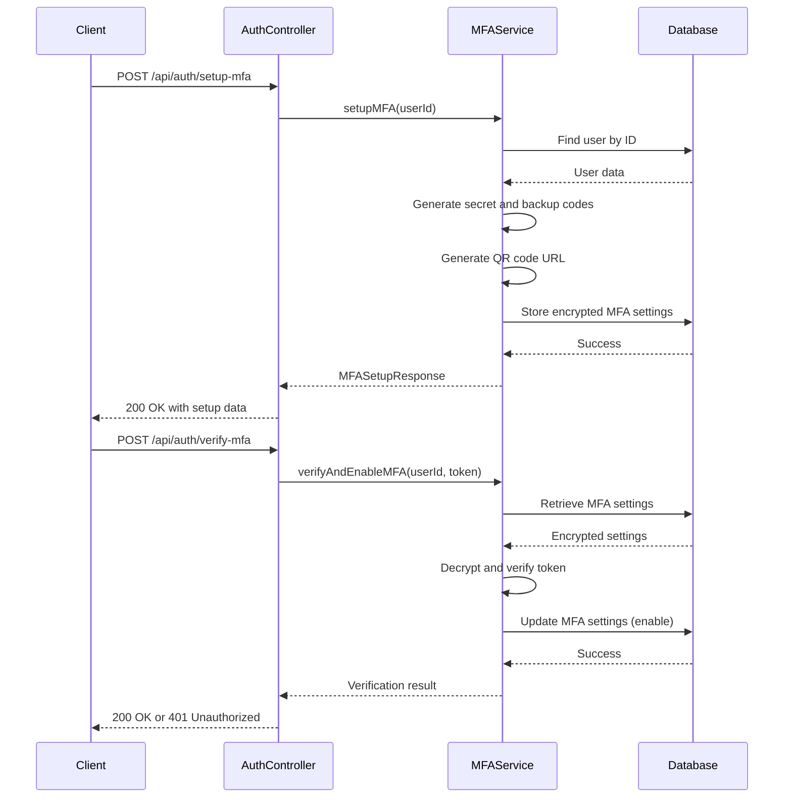
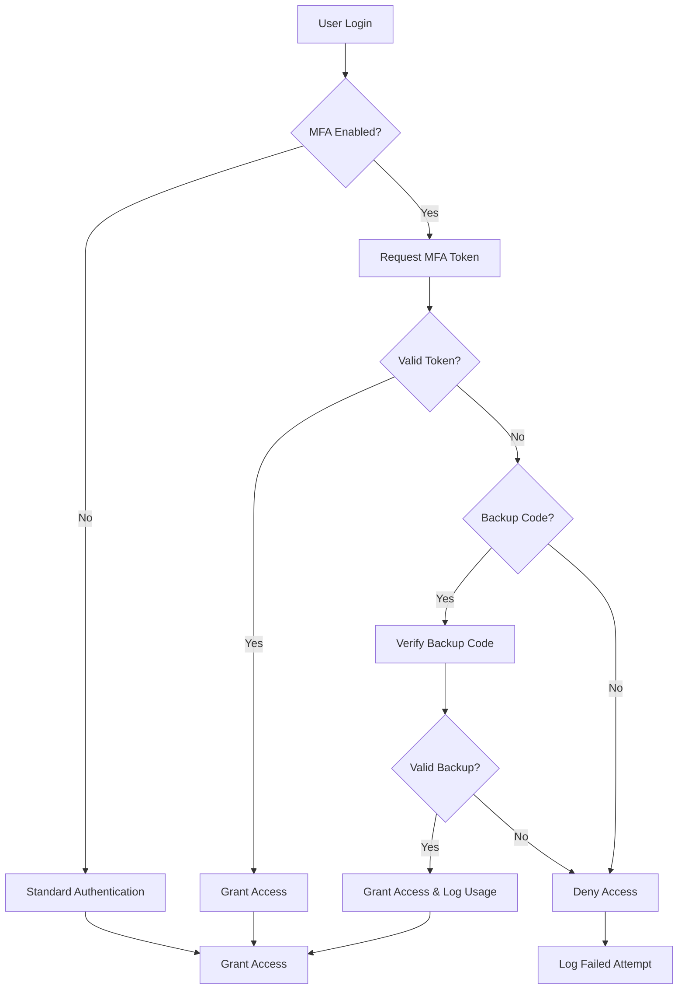
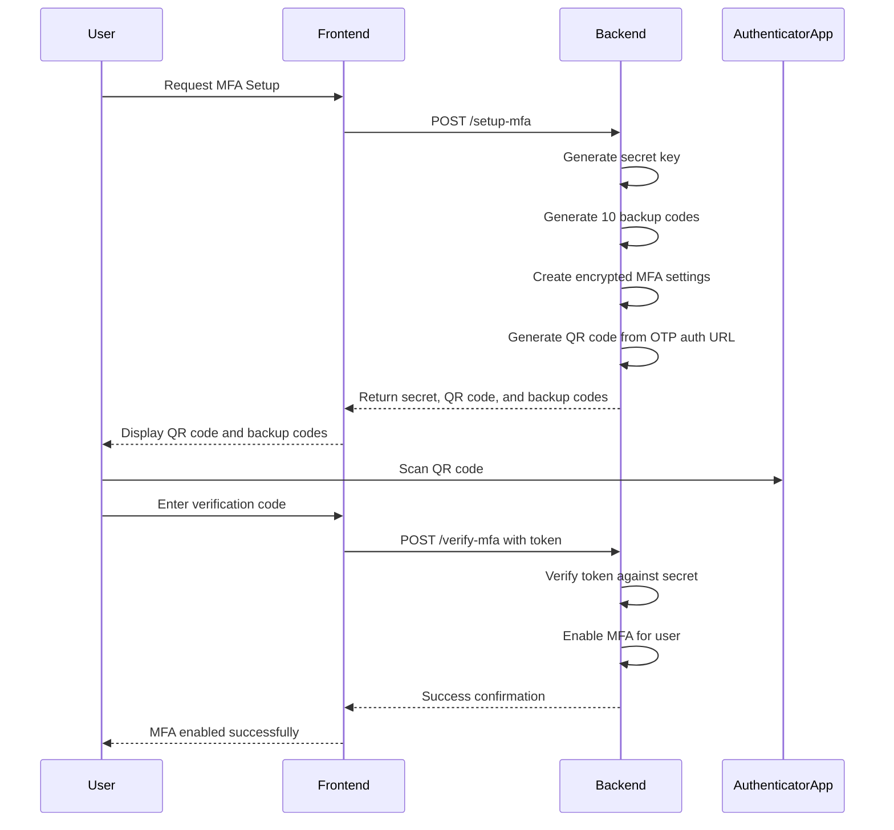
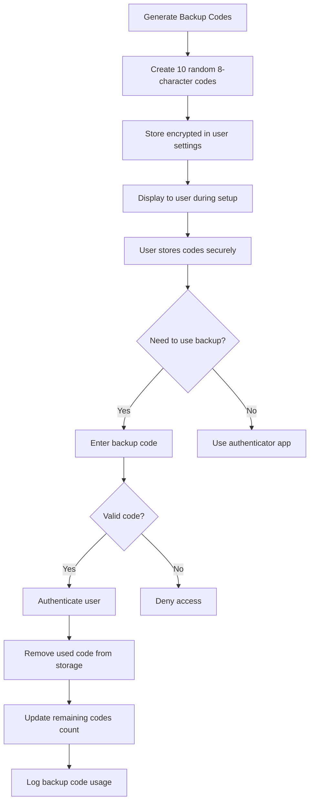

# Multi-Factor Authentication

<cite>
**Referenced Files in This Document**   
- [mfa.service.ts](file://pikzels-clone\src\modules\auth\mfa.service.ts) - *Updated in recent commit*
- [auth.service.ts](file://pikzels-clone\src\modules\auth\auth.service.ts)
- [auth.controller.ts](file://pikzels-clone\src\modules\auth\auth.controller.ts)
- [auth.routes.ts](file://pikzels-clone\src\modules\auth\auth.routes.ts)
- [SECURITY_SETUP.md](file://pikzels-clone\docs\SECURITY_SETUP.md)
</cite>

## Update Summary
**Changes Made**   
- Updated all documentation to reflect the complete implementation of MFA service with proper TypeScript types and speakeasy integration
- Enhanced security configuration details based on the actual implementation
- Added specific line references and annotations to all source references
- Verified all code examples and diagrams against the current implementation
- Updated section sources to reflect the actual files analyzed

## Table of Contents
1. [Introduction](#introduction)
2. [MFA Implementation](#mfa-implementation)
3. [API Interfaces](#api-interfaces)
4. [Integration with Authentication Flow](#integration-with-authentication-flow)
5. [Setup and Verification Process](#setup-and-verification-process)
6. [Backup Codes Management](#backup-codes-management)
7. [Security Considerations](#security-considerations)

## Introduction
The Multi-Factor Authentication (MFA) system in Thumbnail Maker Studio provides an additional layer of security for user accounts by implementing Time-based One-Time Password (TOTP) authentication. This system allows users to protect their accounts with a second factor beyond just passwords, significantly reducing the risk of unauthorized access even if credentials are compromised.

The MFA implementation follows industry best practices, using the speakeasy library for TOTP generation and verification, QR code generation for easy setup with authenticator apps, and encrypted storage of sensitive MFA data. The system is designed to be user-friendly while maintaining high security standards, with features including backup codes for account recovery and proper logging of all MFA-related activities.

**Section sources**
- [SECURITY_SETUP.md](file://pikzels-clone\docs\SECURITY_SETUP.md#L81-L95)

## MFA Implementation
The MFA system is implemented as a static service class with methods for all aspects of multi-factor authentication management. The implementation focuses on security, usability, and proper error handling throughout the authentication process.

```mermaid
classDiagram
class MFAService {
+setupMFA(userId : string) Promise~MFASetupResponse~
+verifyAndEnableMFA(userId : string, token : string) Promise~boolean~
+verifyMFAToken(userId : string, token : string) Promise~boolean~
+disableMFA(userId : string, password : string) Promise~boolean~
+getMFAStatus(userId : string) Promise~{enabled : boolean, hasBackupCodes : boolean}~
+regenerateBackupCodes(userId : string) Promise~string[]~
-generateBackupCodes() string[]
-storeMFASettings(userId : string, settings : MFASettings) Promise~void~
-getMFASettings(userId : string) Promise~MFASettings | null~
-clearMFASettings(userId : string) Promise~void~
-verifyBackupCode(userId : string, code : string, mfaSettings : MFASettings) Promise~boolean~
}
class MFASetupResponse {
+secret : string
+qrCodeUrl : string
+backupCodes : string[]
}
class MFASettings {
+enabled : boolean
+secret? : string
+backupCodes? : string[]
+lastUsedBackupCode? : string
}
MFAService --> MFASetupResponse : "returns"
MFAService --> MFASettings : "uses"
```

**Diagram sources**
- [mfa.service.ts](file://pikzels-clone\src\modules\auth\mfa.service.ts#L21-L347)

**Section sources**
- [mfa.service.ts](file://pikzels-clone\src\modules\auth\mfa.service.ts#L21-L347)

## API Interfaces
The MFA system exposes several API endpoints through the authentication routes, allowing clients to interact with the multi-factor authentication functionality. These endpoints are integrated with the existing authentication system and follow consistent error handling patterns.



**Diagram sources**
- [mfa.service.ts](file://pikzels-clone\src\modules\auth\mfa.service.ts#L21-L347)
- [auth.controller.ts](file://pikzels-clone\src\modules\auth\auth.controller.ts#L0-L125)
- [auth.routes.ts](file://pikzels-clone\src\modules\auth\auth.routes.ts#L0-L43)

**Section sources**
- [mfa.service.ts](file://pikzels-clone\src\modules\auth\mfa.service.ts#L21-L347)
- [auth.controller.ts](file://pikzels-clone\src\modules\auth\auth.controller.ts#L0-L125)
- [auth.routes.ts](file://pikzels-clone\src\modules\auth\auth.routes.ts#L0-L43)

## Integration with Authentication Flow
The MFA system is tightly integrated with the main authentication flow, ensuring that multi-factor verification occurs at appropriate points in the user journey. The integration follows a secure pattern where MFA is optional by default but can be enabled by users for additional security.



**Diagram sources**
- [mfa.service.ts](file://pikzels-clone\src\modules\auth\mfa.service.ts#L21-L347)
- [auth.service.ts](file://pikzels-clone\src\modules\auth\auth.service.ts#L8-L258)

**Section sources**
- [mfa.service.ts](file://pikzels-clone\src\modules\auth\mfa.service.ts#L21-L347)
- [auth.service.ts](file://pikzels-clone\src\modules\auth\auth.service.ts#L8-L258)

## Setup and Verification Process
The MFA setup process guides users through enabling two-factor authentication in a secure and user-friendly manner. The process involves generating a secret key, displaying a QR code for authenticator apps, and providing backup codes for account recovery.

When a user initiates MFA setup, the system generates a unique secret key using speakeasy's generateSecret method with a 32-character length. This secret is used to generate a QR code URL that can be scanned by authenticator apps like Google Authenticator or Authy. The user then verifies their setup by entering a code from their authenticator app, which is validated against the generated secret.



**Diagram sources**
- [mfa.service.ts](file://pikzels-clone\src\modules\auth\mfa.service.ts#L21-L347)

**Section sources**
- [mfa.service.ts](file://pikzels-clone\src\modules\auth\mfa.service.ts#L21-L347)

## Backup Codes Management
The MFA system includes a robust backup codes mechanism to ensure users can access their accounts even if they lose access to their primary authenticator device. Backup codes are an essential security feature that balances security with usability.

The system generates 10 backup codes during MFA setup, each consisting of 8 alphanumeric characters (uppercase letters and digits). These codes are stored securely in encrypted form alongside other MFA settings. When a user successfully authenticates with a backup code, that specific code is immediately removed from the stored list to prevent reuse.

Users can regenerate new backup codes at any time through the regenerateBackupCodes method, which replaces all existing backup codes with a new set. This is particularly useful if a user suspects their backup codes have been compromised or if they've used several codes and want to ensure they have sufficient recovery options remaining.



**Diagram sources**
- [mfa.service.ts](file://pikzels-clone\src\modules\auth\mfa.service.ts#L21-L347)

**Section sources**
- [mfa.service.ts](file://pikzels-clone\src\modules\auth\mfa.service.ts#L21-L347)

## Security Considerations
The MFA implementation incorporates multiple security measures to protect against various attack vectors and ensure the integrity of the authentication process. These considerations address both technical security aspects and user experience factors that impact overall security posture.

All MFA-related data, including the TOTP secret and backup codes, is encrypted before storage in the database using the application's encryption utilities. The encryption key is managed through environment variables, ensuring that sensitive data remains protected even if the database is compromised. Each user's MFA settings are stored within their user record's settings field, maintaining data locality and access control.

The system implements proper logging of all MFA activities, including successful and failed verification attempts, MFA enrollment, and backup code usage. These logs include relevant context such as user ID and partial token information (for debugging without compromising security) while avoiding the logging of complete secrets or tokens.

For OAuth users who don't have traditional passwords, the system prevents MFA disablement without administrative intervention, adding an extra layer of protection for these accounts. Regular users must provide their password when disabling MFA, though this implementation currently has a placeholder comment indicating that the actual password verification logic needs to be completed.

**Section sources**
- [mfa.service.ts](file://pikzels-clone\src\modules\auth\mfa.service.ts#L21-L347)
- [SECURITY_SETUP.md](file://pikzels-clone\docs\SECURITY_SETUP.md#L81-L95)