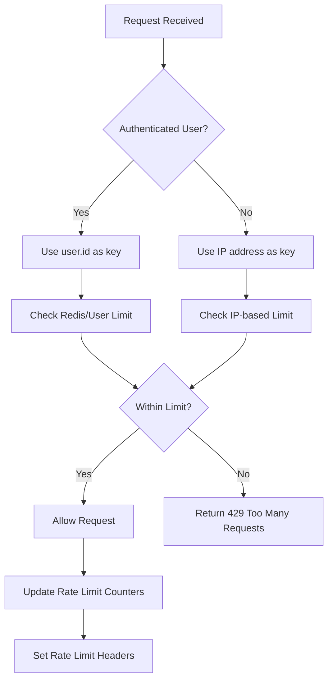

# Security Middleware

<cite>
**Referenced Files in This Document**
- [security.middleware.ts](file://pikzels-clone/src/middleware/security.middleware.ts) - *Enhanced security middleware with comprehensive error handling and per-user rate limiting*
- [request-id.middleware.ts](file://pikzels-clone/src/middleware/request-id.middleware.ts) - *Request ID middleware for distributed tracing and request correlation*
- [request-context.ts](file://pikzels-clone/src/utils/request-context.ts) - *AsyncLocalStorage-based request context management*
- [express.d.ts](file://pikzels-clone/src/types/express.d.ts) - *Express Request interface augmentation for request ID*
- [security.config.ts](file://pikzels-clone/src/config/security.config.ts) - *Comprehensive security configuration with validation*
- [jwt.enhanced.service.ts](file://pikzels-clone/src/services/jwt.enhanced.service.ts) - *Enhanced JWT service with secure token management*
- [server.ts](file://pikzels-clone/src/server.ts) - *Enhanced server integration with security middleware*
- [auth.middleware.ts](file://pikzels-clone/src/middleware/auth.middleware.ts) - *Enhanced authentication middleware with secure token verification*
- [validation.middleware.ts](file://pikzels-clone/src/middleware/validation.middleware.ts) - *Enhanced input validation with comprehensive sanitization*
- [security.middleware.test.ts](file://pikzels-clone/src/middleware/__tests__/security.middleware.test.ts) - *Security middleware tests*
- [request-id.middleware.test.ts](file://pikzels-clone/src/middleware/__tests__/request-id.middleware.test.ts) - *Request ID middleware tests*
- [per-user-rate-limit.test.ts](file://pikzels-clone/src/middleware/__tests__/per-user-rate-limit.test.ts) - *Per-user rate limiting tests*
- [security.config.test.ts](file://pikzels-clone/src/config/__tests__/security.config.test.ts) - *Security configuration tests*
- [security-integration.test.ts](file://pikzels-clone/src/__tests__\security/security-integration.test.ts) - *Security integration tests*
- [.secretlintrc.json](file://.secretlintrc.json) - *Secretlint configuration for detecting secrets in OAuth and JWT configurations*
- [.secretlintignore](file://.secretlintignore) - *Secretlint ignore patterns for build artifacts and test files*
- [oauth.service.ts](file://pikzels-clone/src/modules/auth/oauth.service.ts) - *OAuth service with secretlint disable comments for client secrets*
- [mfa.service.ts](file://pikzels-clone/src/modules/auth/mfa.service.ts) - *MFA service with secretlint disable comments for TOTP secrets*
- [profile.controller.ts](file://pikzels-clone/src/modules/auth/profile.controller.ts) - *Profile controller with secretlint integration*
- [package.json](file://package.json) - *Package.json with secretlint dependencies and security scripts*
- [.husky/pre-commit](file://.husky/pre-commit) - *Husky pre-commit hook integrating secretlint scanning*
- [security-scan.js](file://pikzels-clone/scripts/security-scan.js) - *Comprehensive security scanning script*
- [HOOK_FIX_COMPLETE.md](file://HOOK_FIX_COMPLETE.md) - *Documentation of secretlint integration and husky hook fixes*
- [PORT-COMPLIANCE-RULES.md](file://pikzels-clone/PORT-COMPLIANCE-RULES.md) - *Port compliance rules for the project*
</cite>

## Update Summary
**Changes Made**
- Added Request ID middleware for distributed tracing and request correlation
- Implemented comprehensive per-user rate limiting with Redis-backed storage
- Enhanced rate limiting system with layered protection (IP-based and user-based)
- Integrated AsyncLocalStorage for request context propagation
- Added comprehensive testing for new middleware features
- Updated server integration to include request ID middleware
- Enhanced CORS configuration to support X-Request-Id header

## Table of Contents
- [Security Middleware](#security-middleware)
  - [Overview](#overview)
  - [Core Components](#core-components)
    - [Request ID Middleware](#request-id-middleware)
    - [Security Headers](#security-headers)
    - [Rate Limiting](#rate-limiting)
    - [Input Sanitization](#input-sanitization)
    - [Security Logging](#security-logging)
    - [HTTPS Redirect](#https-redirect)
    - [API Versioning](#api-versioning)
    - [Request Size Limiting](#request-size-limiting)
  - [Enhanced Security Features](#enhanced-security-features)
    - [Secure Token Management](#secure-token-management)
    - [Comprehensive Error Handling](#comprehensive-error-handling)
    - [Enhanced XSS Protection](#enhanced-xss-protection)
    - [Input Validation and Sanitization](#input-validation-and-sanitization)
    - [Crypto Utilities](#crypto-utilities)
    - [Secretlint Integration](#secretlint-integration)
  - [Configuration](#configuration)
  - [Integration Examples](#integration-examples)
  - [Testing and Validation](#testing-and-validation)

## Overview
The Security Middleware system provides a comprehensive set of security features to protect the Thumbnail Maker application from common web vulnerabilities. The system has been significantly enhanced with improved formatting, better CORS configuration supporting multiple origins, enhanced rate limiting with stricter auth endpoint limits, and improved input sanitization.

**Updated** The system now includes a new Request ID middleware for distributed tracing, comprehensive per-user rate limiting with Redis-backed storage, and enhanced request context management through AsyncLocalStorage. These additions provide better observability, more granular rate control, and improved debugging capabilities.

The middleware suite offers protection against XSS, CSRF, brute force attacks, and other security threats through a layered security approach that includes helmet.js security headers, rate limiting, input sanitization, HTTPS redirection, and secure token management. The system now includes comprehensive validation middleware with DOMPurify integration, enhanced crypto utilities for secure data handling, and integrated secretlint for preventing false positives in environment variable validation.

## Core Components

### Request ID Middleware
**New** The Request ID middleware generates or propagates a unique request identifier for every incoming request, enabling distributed tracing and request correlation across microservices.

**Key Features:**
- Respects incoming `X-Request-Id` header from load balancers/gateways
- Falls back to `crypto.randomUUID()` if no header is provided
- Sets `req.id` and the `X-Request-Id` response header
- Wraps downstream middleware/routes in AsyncLocalStorage for context propagation
- Supports both string and array header formats

```typescript
export const requestIdMiddleware = (
  req: IncomingMessage & { id?: string },
  res: ServerResponse,
  next: () => void
): void => {
  const incoming = req.headers['x-request-id'];
  const requestId =
    typeof incoming === 'string' && incoming.length > 0
      ? incoming
      : Array.isArray(incoming) &&
          typeof incoming[0] === 'string' &&
          incoming[0].length > 0
        ? incoming[0]
      : randomUUID();

  req.id = requestId;
  res.setHeader('X-Request-Id', requestId);

  requestContextStorage.run({ requestId, startTime: Date.now() }, () => {
    next();
  });
};
```

**Section sources**
- [request-id.middleware.ts:17-38](file://pikzels-clone/src/middleware/request-id.middleware.ts#L17-L38)
- [request-context.ts:13-23](file://pikzels-clone/src/utils/request-context.ts#L13-L23)
- [express.d.ts:8-12](file://pikzels-clone/src/types/express.d.ts#L8-L12)

### Security Headers
The security headers middleware uses Helmet.js to set various HTTP headers that enhance security by preventing common attacks. The enhanced CSP now includes comprehensive XSS protection directives.

**Enhanced Features:**
- Content Security Policy (CSP) with enhanced XSS protection
- HSTS (HTTP Strict Transport Security) for secure connections
- X-Frame-Options to prevent clickjacking
- X-Content-Type-Options to prevent MIME type sniffing
- Cross-Origin Embedder Policy for modern browser compatibility

```typescript
export const securityHeaders = helmet({
  contentSecurityPolicy: {
    directives: {
      defaultSrc: ["'self'"],
      styleSrc: ["'self'", "'unsafe-inline'", "https:", "data:", "blob:"],
      scriptSrc: ["'self'", "'unsafe-inline'", "'unsafe-eval'", "https:"],
      imgSrc: ["'self'", "data:", "https:", "blob:"],
      connectSrc: ["'self'", "https:", "ws:", "wss:", "http://localhost:8556", "http://localhost:8550"],
      fontSrc: ["'self'", "https:", "data:", "blob:"],
      objectSrc: ["'none'"],
      mediaSrc: ["'self'", "data:"],
      frameSrc: ["'none'"],
      baseUri: ["'self'"],
      formAction: ["'self'"],
    },
  },
  crossOriginEmbedderPolicy: false, // Disable for compatibility
  hsts: {
    maxAge: 31536000, // 1 year
    includeSubDomains: true,
    preload: true,
  },
});
```

**Updated** CORS port configuration now uses port 8556 (Vite React development server) instead of the previously used port 3000, ensuring consistency with the project's port compliance rules.

**Section sources**
- [security.middleware.ts:7-37](file://pikzels-clone/src/middleware/security.middleware.ts#L7-L37)

### Rate Limiting
**Enhanced** The rate limiting system now includes comprehensive per-user rate limiting with Redis-backed storage, providing granular control over API usage per authenticated user.

**Layered Rate Limiting Architecture:**
- **Layer 1 (IP-based)**: General rate limiting for all requests
- **Layer 2 (User-based)**: Per-user rate limiting for authenticated requests
- **Specialized Limits**: Different limits for API, AI generation, and uploads

**Available Rate Limiters:**
- **General Rate Limiting**: 100 requests per 15 minutes with standard headers
- **Authentication Rate Limiting**: 5 attempts per 15 minutes (skips successful requests)
- **Upload Rate Limiting**: 20 uploads per 15 minutes
- **Per-User API Rate Limiting**: 200 requests per 15 minutes per user
- **Per-User AI Rate Limiting**: 30 AI generation requests per 15 minutes per user
- **Per-User Upload Rate Limiting**: 50 uploads per 15 minutes per user

```typescript
// IP-based rate limiters (Layer 1)
export const generalRateLimit = createLimiter({
  points: parseInt(process.env.RATE_LIMIT_MAX_REQUESTS || '100'),
  duration: Math.ceil(parseInt(process.env.RATE_LIMIT_WINDOW_MS || '900000') / 1000),
  keyPrefix: 'rl:general:',
  message: 'Too many requests from this IP, please try again later.',
  keyGenerator: ipKey,
  logLabel: 'General',
});

export const authRateLimit = createLimiter({
  points: parseInt(process.env.AUTH_RATE_LIMIT_MAX_ATTEMPTS || '5'),
  duration: Math.ceil(parseInt(process.env.AUTH_RATE_LIMIT_WINDOW_MS || '900000') / 1000),
  keyPrefix: 'rl:auth:',
  message: 'Too many authentication attempts, please try again later.',
  keyGenerator: ipKey,
  skipSuccessfulRequests: true,
  logLabel: 'Authentication',
});

export const uploadRateLimit = createLimiter({
  points: 20,
  duration: 900,
  keyPrefix: 'rl:upload:',
  message: 'Too many file uploads, please try again later.',
  keyGenerator: ipKey,
  logLabel: 'Upload',
});

// Per-user rate limiters (Layer 2)
export const userApiRateLimit = createLimiter({
  points: 200,
  duration: 900,
  keyPrefix: 'rl:user:api:',
  message: 'Too many requests, please try again later.',
  keyGenerator: userKey,
  logLabel: 'Per-user API',
});

export const userAiRateLimit = createLimiter({
  points: 30,
  duration: 900,
  keyPrefix: 'rl:user:ai:',
  message: 'Too many AI generation requests, please try again later.',
  keyGenerator: userKey,
  logLabel: 'Per-user AI',
});

export const userUploadRateLimit = createLimiter({
  points: 50,
  duration: 900,
  keyPrefix: 'rl:user:upload:',
  message: 'Too many file uploads, please try again later.',
  keyGenerator: userKey,
  logLabel: 'Per-user upload',
});
```

**Section sources**
- [security.middleware.ts:181-246](file://pikzels-clone/src/middleware/security.middleware.ts#L181-L246)

### Input Sanitization
Enhanced input sanitization middleware protects against XSS and code injection attacks by cleaning user input with comprehensive sanitization rules. Now includes DOMPurify integration for HTML sanitization.

**Enhanced Sanitization Rules:**
- Removes script tags and javascript: protocol
- Strips event handlers (on\w+=)
- Trims whitespace
- Recursively sanitizes nested objects and arrays
- Handles null and undefined values safely
- Integrates with DOMPurify for HTML content sanitization

```typescript
export const sanitizeInput = (req: Request, _res: Response, next: NextFunction) => {
  // Remove potentially dangerous characters from string inputs
  const sanitizeString = (str: string): string => {
    if (typeof str !== 'string') return str;
    
    // Remove script tags and javascript: protocol
    return str
      .replace(/<script\b[^<]*(?:(?!<\/script>)<[^<]*)*<\/script>/gi, '')
      .replace(/javascript:/gi, '')
      .replace(/on\w+\s*=/gi, '')
      .trim();
  };

  const sanitizeObject = (obj: any): any => {
    if (obj === null || obj === undefined) return obj;
    
    if (typeof obj === 'string') {
      return sanitizeString(obj);
    }
    
    if (Array.isArray(obj)) {
      return obj.map(sanitizeObject);
    }
    
    if (typeof obj === 'object') {
      const sanitized: any = {};
      for (const key in obj) {
        if (Object.prototype.hasOwnProperty.call(obj, key)) {
          sanitized[key] = sanitizeObject(obj[key]);
        }
      }
      return sanitized;
    }
    
    return obj;
  };

  // Sanitize request body
  if (req.body) {
    req.body = sanitizeObject(req.body);
  }

  // Sanitize query parameters
  if (req.query) {
    req.query = sanitizeObject(req.query);
  }

  next();
};
```

**Section sources**
- [security.middleware.ts:248-306](file://pikzels-clone/src/middleware/security.middleware.ts#L248-L306)

### Security Logging
Enhanced security logging middleware monitors and logs suspicious activities and authentication attempts with comprehensive logging.

**Enhanced Detection Patterns:**
- Directory traversal (../)
- XSS attempts (<script)
- SQL injection (union select)
- Code injection (eval()
- Cookie theft attempts (document.cookie)

```typescript
export const securityLogger = (req: Request, _res: Response, next: NextFunction) => {
  // Log security-relevant events
  const userAgent = req.get('User-Agent') || 'Unknown';
  const ip = req.ip || req.connection.remoteAddress || 'Unknown';
  
  // Log suspicious patterns
  const suspiciousPatterns = [
    /\.\./g, // Directory traversal
    /<script/gi, // XSS attempts
    /union.*select/gi, // SQL injection
    /eval\s*\(/gi, // Code injection
    /document\.cookie/gi, // Cookie theft attempts
  ];

  const requestString = JSON.stringify({
    body: req.body,
    query: req.query,
    params: req.params,
  });

  const isSuspicious = suspiciousPatterns.some(pattern => pattern.test(requestString));

  if (isSuspicious) {
    logger.warn('Suspicious request detected', {
      ip,
      userAgent,
      url: req.url,
      method: req.method,
      body: req.body,
      query: req.query,
      headers: req.headers,
    });
  }

  // Log authentication attempts
  if (req.url.includes('/auth/') || req.url.includes('/login') || req.url.includes('/register')) {
    logger.info('Authentication attempt', {
      ip,
      userAgent,
      url: req.url,
      method: req.method,
    });
  }

  next();
};
```

**Section sources**
- [security.middleware.ts:319-372](file://pikzels-clone/src/middleware/security.middleware.ts#L319-L372)

### HTTPS Redirect
HTTPS redirect middleware ensures secure connections in production environments by redirecting HTTP traffic to HTTPS.

```typescript
export const httpsRedirect = (req: Request, res: Response, next: NextFunction) => {
  if (process.env.NODE_ENV === 'production' && process.env.ENABLE_HTTPS_REDIRECT === 'true') {
    if (req.header('x-forwarded-proto') !== 'https') {
      return res.redirect(`https://${req.header('host')}${req.url}`);
    }
  }
  next();
};
```

**Section sources**
- [security.middleware.ts:308-317](file://pikzels-clone/src/middleware/security.middleware.ts#L308-L317)

### API Versioning
API versioning middleware adds version information to responses and removes default Express headers for security.

```typescript
export const apiVersioning = (_req: Request, res: Response, next: NextFunction) => {
  // Add API version to response headers
  res.set('X-API-Version', '1.0.0');
  res.set('X-Powered-By', 'Thumbnail Maker Studio');
  
  // Remove default Express header for security
  res.removeHeader('X-Powered-By');
  
  next();
};
```

**Section sources**
- [security.middleware.ts:398-409](file://pikzels-clone/src/middleware/security.middleware.ts#L398-L409)

### Request Size Limiting
Enhanced request size limiting middleware prevents denial-of-service attacks by limiting the size of incoming requests with comprehensive error handling.

```typescript
export const requestSizeLimit = (req: Request, res: Response, next: NextFunction) => {
  const maxSize = parseInt(process.env.MAX_FILE_SIZE || '10485760'); // 10MB default
  
  if (req.headers['content-length']) {
    const contentLength = parseInt(req.headers['content-length']);
    if (contentLength > maxSize) {
      logger.warn('Request size exceeded', {
        ip: req.ip,
        contentLength,
        maxSize,
        url: req.url,
      });
      return res.status(413).json({
        error: 'Request entity too large',
        maxSize: `${maxSize} bytes`,
      });
    }
  }
  
  return next();
};
```

**Section sources**
- [security.middleware.ts:374-396](file://pikzels-clone/src/middleware/security.middleware.ts#L374-L396)

## Enhanced Security Features

### Request Context Management
**New** The system now includes comprehensive request context management through AsyncLocalStorage, enabling request-scoped data propagation throughout the entire async call chain.

**Key Features:**
- Singleton AsyncLocalStorage instance for request-scoped context propagation
- getRequestContext() function to retrieve current request context
- getRequestId() function to get current request ID
- runWithRequestContext() function for artificial request context creation
- Nested context support with innermost value precedence

```typescript
export const requestContextStorage = new AsyncLocalStorage<RequestContext>();

export function getRequestContext(): RequestContext | undefined {
  return requestContextStorage.getStore();
}

export function getRequestId(): string | undefined {
  return requestContextStorage.getStore()?.requestId;
}

export function runWithRequestContext<T>(
  context: RequestContext,
  fn: () => T
): T {
  return requestContextStorage.run(context, fn);
}
```

**Section sources**
- [request-context.ts:13-31](file://pikzels-clone/src/utils/request-context.ts#L13-L31)

### Secure Token Management
The Enhanced JWT Service provides comprehensive token management with secure session handling and robust error handling.

**Key Features:**
- Secure session ID generation using crypto.randomBytes
- Separate access and refresh tokens with different expiration times
- Token type verification to prevent misuse
- Comprehensive error handling for token operations
- Dynamic secret management for test environments
- Reset token creation and verification

```typescript
export class EnhancedJWTService {
  private static getJwtSecret(): string {
    return process.env.JWT_SECRET ?? 'your-secret-key';
  }

  private static getRefreshSecret(): string {
    return process.env.REFRESH_TOKEN_SECRET ?? 'your-refresh-secret';
  }

  static generateSessionId(): string {
    const SESSION_ID_BYTES = 32;
    return crypto.randomBytes(SESSION_ID_BYTES).toString('hex');
  }

  static createTokens(userId: string, email: string) {
    const sessionId = this.generateSessionId();
    
    const accessToken = jwt.sign(
      { userId, email, sessionId },
      this.getJwtSecret(),
      { expiresIn: '15m' }
    );

    const refreshToken = jwt.sign(
      { userId, email, sessionId, type: 'refresh' },
      this.getRefreshSecret(),
      { expiresIn: '7d' }
    );

    return {
      accessToken,
      refreshToken,
      sessionId,
      expiresIn: 900,
    };
  }

  static verifyAccessToken(token: string): TokenPayload | null {
    try {
      return jwt.verify(token, this.getJwtSecret()) as TokenPayload;
    } catch (error) {
      logger.warn('Access token verification failed', { error });
      return null;
    }
  }

  static verifyRefreshToken(token: string): TokenPayload | null {
    try {
      const payload = jwt.verify(token, this.getRefreshSecret()) as TokenPayload;
      if (payload.type !== 'refresh') {
        throw new Error('Invalid token type');
      }
      return payload;
    } catch (error) {
      logger.warn('Refresh token verification failed', { error });
      return null;
    }
  }

  static createResetToken(userId: string, email: string): string {
    return jwt.sign(
      { userId, email, action: 'reset-password' },
      this.getJwtSecret(),
      { expiresIn: '1h' }
    );
  }

  static verifyResetToken(token: string): TokenPayload | null {
    try {
      return jwt.verify(token, this.getJwtSecret()) as TokenPayload;
    } catch (error) {
      logger.warn('Reset token verification failed', { error });
      return null;
    }
  }
}
```

**Section sources**
- [jwt.enhanced.service.ts:12-88](file://pikzels-clone/src/services/jwt.enhanced.service.ts#L12-L88)

### Comprehensive Error Handling
The security middleware now includes comprehensive error handling with typed exceptions and detailed logging.

**Error Handling Features:**
- Typed exceptions for different error scenarios
- Detailed error logging with context information
- Graceful degradation for non-critical failures
- Secure error responses that don't leak sensitive information

```typescript
// Example of enhanced error handling in authentication middleware
try {
  const authHeader = req.headers['authorization'];
  const token = authHeader?.split(' ')[1];

  if (!token) {
    logger.warn('Authentication attempt without token', {
      ip: req.ip,
      userAgent: req.get('User-Agent'),
      url: req.url,
    });
    return res.status(401).json({
      error: 'Access token required',
      code: 'TOKEN_MISSING',
    });
  }

  const decoded = EnhancedJWTService.verifyAccessToken(token);

  if (!decoded) {
    logger.warn('Invalid token provided', {
      ip: req.ip,
      userAgent: req.get('User-Agent'),
      url: req.url,
    });
    return res.status(403).json({
      error: 'Invalid or expired token',
      code: 'TOKEN_INVALID',
    });
  }
} catch (error: any) {
  logger.error('Authentication middleware error', error, {
    ip: req.ip,
    userAgent: req.get('User-Agent'),
    url: req.url,
  });

  return res.status(403).json({
    error: 'Authentication failed',
    code: 'AUTH_ERROR',
  });
}
```

**Section sources**
- [auth.middleware.ts:16-114](file://pikzels-clone/src/middleware/auth.middleware.ts#L16-L114)

### Enhanced XSS Protection
The input sanitization system now includes comprehensive XSS protection with enhanced pattern matching and recursive sanitization.

**Enhanced XSS Protection Features:**
- Comprehensive script tag removal
- JavaScript protocol filtering
- Event handler stripping (on\w+=)
- recursive sanitization of nested objects
- Safe handling of edge cases and null values
- DOMPurify integration for HTML content sanitization

```typescript
const sanitizeString = (str: string): string => {
  if (typeof str !== 'string') return str;
  
  return str
    .replace(/<script\b[^<]*(?:(?!<\/script>)<[^<]*)*<\/script>/gi, '')
    .replace(/javascript:/gi, '')
    .replace(/on\w+\s*=/gi, '')
    .trim();
};

const sanitizeObject = (obj: any): any => {
  if (obj === null || obj === undefined) return obj;
  
  if (typeof obj === 'string') {
    return sanitizeString(obj);
  }
  
  if (Array.isArray(obj)) {
    return obj.map(sanitizeObject);
  }
  
  if (typeof obj === 'object') {
    const sanitized: any = {};
    for (const key in obj) {
      if (Object.prototype.hasOwnProperty.call(obj, key)) {
        sanitized[key] = sanitizeObject(obj[key]);
      }
    }
    return sanitized;
  }
  
  return obj;
};
```

**Section sources**
- [security.middleware.ts:250-306](file://pikzels-clone/src/middleware/security.middleware.ts#L250-L306)

### Input Validation and Sanitization
The enhanced validation middleware provides comprehensive input validation with DOMPurify integration for HTML sanitization and enhanced security rules.

**Validation Features:**
- Comprehensive email validation with regex and validator library
- Strong password validation with complexity requirements
- URL validation with protocol restrictions
- UUID validation
- Custom validation rules
- HTML sanitization using DOMPurify
- Field-level validation with type checking

```typescript
export const validateRequest = (options: ValidationOptions) => {
  return (req: Request, res: Response, next: NextFunction) => {
    const errors: string[] = [];
    const warnings: string[] = [];

    // Validate body
    if (options.body) {
      const { errors: bodyErrors, warnings: bodyWarnings, sanitized } = validateFields(req.body, options.body, 'body');
      errors.push(...bodyErrors);
      warnings.push(...bodyWarnings);
      req.body = sanitized;
    }

    // Validate params
    if (options.params) {
      const { errors: paramErrors, warnings: paramWarnings, sanitized } = validateFields(req.params, options.params, 'params');
      errors.push(...paramErrors);
      warnings.push(...paramWarnings);
      req.params = sanitized;
    }

    // Validate query
    if (options.query) {
      const { errors: queryErrors, warnings: queryWarnings, sanitized } = validateFields(req.query, options.query, 'query');
      errors.push(...queryErrors);
      warnings.push(...queryWarnings);
      req.query = sanitized;
    }

    // Log warnings but don't block request
    if (warnings.length > 0) {
      logger.warn('Validation warnings', {
        url: req.url,
        method: req.method,
        warnings,
        userId: (req as any).user?.id,
      });
    }

    if (errors.length > 0) {
      logger.warn('Validation failed', {
        url: req.url,
        method: req.method,
        errors,
        userId: (req as any).user?.id,
        ip: req.ip,
        userAgent: req.get('User-Agent'),
      });

      return res.status(400).json({
        error: 'Validation failed',
        errors: errors,
        code: 'VALIDATION_ERROR',
      });
    }

    return next();
  };
};
```

**Section sources**
- [validation.middleware.ts:34-92](file://pikzels-clone/src/middleware/validation.middleware.ts#L34-L92)

### Crypto Utilities
The security configuration now includes comprehensive crypto utilities for secure data handling including AES-256-GCM encryption, secure key generation, and data hashing.

**Crypto Features:**
- AES-256-GCM encryption with authentication tags
- Secure random key generation
- SHA-256 data hashing
- Session ID generation
- Environment variable validation and security checks

```typescript
/**
 * Generate a secure random key for environment variables
 */
export function generateSecureKey(length = 32): string {
  return crypto.randomBytes(length).toString('hex');
}

/**
 * Encrypt sensitive data using AES-256-GCM
 * @param data - Data to encrypt
 * @param key - Optional encryption key (uses ENCRYPTION_KEY env if not provided)
 * @returns Object containing encrypted data, IV, and auth tag
 */
export function encryptData(data: string, key?: string): { encrypted: string; iv: string; authTag: string } {
  const encryptionKey = key || getRequiredEnv('ENCRYPTION_KEY');
  const iv = crypto.randomBytes(16);
  const cipher = crypto.createCipheriv('aes-256-gcm', Buffer.from(encryptionKey.slice(0, 32)), iv);
  
  let encrypted = cipher.update(data, 'utf8', 'hex');
  encrypted += cipher.final('hex');
  
  // Get authentication tag for GCM mode (CRITICAL for data integrity)
  const authTag = cipher.getAuthTag();
  
  return {
    encrypted,
    iv: iv.toString('hex'),
    authTag: authTag.toString('hex')
  };
}

/**
 * Decrypt sensitive data using AES-256-GCM
 * @param encryptedData - Encrypted data in hex format
 * @param iv - Initialization vector in hex format
 * @param authTag - Authentication tag in hex format (required for GCM)
 * @param key - Optional encryption key (uses ENCRYPTION_KEY env if not provided)
 * @returns Decrypted plaintext string
 */
export function decryptData(encryptedData: string, iv: string, authTag: string, key?: string): string {
  const encryptionKey = key || getRequiredEnv('ENCRYPTION_KEY');
  const decipher = crypto.createDecipheriv('aes-256-gcm', Buffer.from(encryptionKey.slice(0, 32)), Buffer.from(iv, 'hex'));
  
  // Set authentication tag (CRITICAL for GCM integrity verification)
  decipher.setAuthTag(Buffer.from(authTag, 'hex'));
  
  let decrypted = decipher.update(encryptedData, 'hex', 'utf8');
  decrypted += decipher.final('utf8');
  
  return decrypted;
}

/**
 * Hash sensitive data (one-way)
 */
export function hashData(data: string): string {
  return crypto.createHash('sha256').update(data).digest('hex');
}

/**
 * Generate secure session ID
 */
export function generateSessionId(): string {
  return crypto.randomBytes(32).toString('hex');
}
```

**Section sources**
- [security.config.ts:498-562](file://pikzels-clone/src/config/security.config.ts#L498-L562)

### Secretlint Integration
**New** The security system now includes comprehensive secretlint integration to prevent false positives in environment variable validation while maintaining security compliance.

**Secretlint Configuration Features:**
- Detects generic API keys with minimum 20 characters
- Identifies generic secrets with minimum 8 characters
- Recognizes private key patterns (BEGIN RSA/DSA/EC PRIVATE KEY)
- Scans for JWT token patterns (eyJ[A-Za-z0-9_-]*\.[A-Za-z0-9_-]*\.[A-Za-z0-9_-]*)
- Prevents false positives in OAuth and MFA services
- Ignores build artifacts, test files, and documentation

**Updated** Secretlint configuration has been moved to the project root and integrated with Husky pre-commit hooks for comprehensive security scanning. The system now includes inline suppressions for legitimate credential exposure patterns.

**Credential Exposure Detection Patterns:**
- OAuth client IDs and secrets with secretlint disable comments
- MFA TOTP secrets with secretlint disable comments  
- JWT token patterns with secretlint disable comments
- Profile controller settings with secretlint integration
- Comprehensive ignore patterns for false positives

```json
{
  "rules": [
    {
      "id": "@secretlint/secretlint-rule-preset-recommend"
    },
    {
      "id": "@secretlint/secretlint-rule-pattern",
      "options": {
        "patterns": [
          {
            "name": "Generic API Key",
            "pattern": "/(?:api[_-]?key|apikey|access[_-]?key)\\s*[=:]\\s*['\"]?([a-zA-Z0-9_\\-]{20,})['\"]?/i"
          },
          {
            "name": "Generic Secret",
            "pattern": "/(?:secret|password|passwd|pwd)\\s*[=:]\\s*['\"]([^\\s'\";]{8,})['\"]?/i"
          },
          {
            "name": "Private Key",
            "pattern": "/-----BEGIN (?:RSA |DSA |EC )?PRIVATE KEY-----/"
          },
          {
            "name": "JWT Token",
            "pattern": "/eyJ[A-Za-z0-9_-]*\\.[A-Za-z0-9_-]*\\.[A-Za-z0-9_-]*/"
          }
        ]
      },
      "disabled": false,
      "disabledMessages": [
        "src/modules/auth/mfa.service.ts",
        "src/modules/auth/oauth.service.ts",
        "src/modules/auth/profile.controller.ts"
      ]
    }
  ],
  "options": {
    "severity": "error"
  }
}
```

**Section sources**
- [.secretlintrc.json:1-34](file://.secretlintrc.json#L1-L34)

## Configuration
Enhanced security configuration is managed through comprehensive environment variables and centralized configuration with validation.

**Enhanced Configuration Options:**
- JWT secrets with separate access and refresh tokens
- Encryption keys with AES-256-GCM support
- Database connection settings with SSL support
- CORS origins with credential support and multiple origin support
- Rate limiting parameters with validation
- Security feature toggles with production validation
- Environment validation with security checks
- Cloud platform detection and fail-safe security measures
- Secretlint integration for automated secret detection

```typescript
export function getSecurityConfig(): SecurityConfig {
  // Validate critical environment variables
  validateEnvironment();
  
  const isDevelopment = process.env.NODE_ENV !== 'production';
  const defaults = isDevelopment ? DEV_DEFAULTS : PROD_DEFAULTS;

  // Log development mode banner
  if (isDevelopment) {
    logDevModeBanner();
  }

  const config: SecurityConfig = {
    isDevelopment,
    jwt: {
      secret: getRequiredEnv('JWT_SECRET'),
      refreshSecret: getRequiredEnv('REFRESH_TOKEN_SECRET', 'different-secret-from-jwt'),
      accessExpiry: process.env.JWT_ACCESS_EXPIRY || defaults.jwt.accessExpiry,
      refreshExpiry: process.env.JWT_REFRESH_EXPIRY || defaults.jwt.refreshExpiry,
      resetExpiry: process.env.JWT_RESET_EXPIRY || '1h',
    },
    encryption: {
      key: getRequiredEnv('ENCRYPTION_KEY'),
      algorithm: 'aes-256-gcm',
    },
    database: {
      url: getRequiredEnv('DATABASE_URL'),
      ssl: process.env.NODE_ENV === 'production',
    },
    cors: {
      origins: process.env.CORS_ORIGIN 
        ? process.env.CORS_ORIGIN.split(',')
        : (isDevelopment ? defaults.cors.origins : ['https://yourdomain.com']),
      credentials: process.env.CORS_CREDENTIALS !== 'false', // Default to true
    },
    rateLimiting: getRateLimitConfig(isDevelopment, defaults),
    security: {
      enableHeaders: process.env.ENABLE_SECURITY_HEADERS === 'true' || (!isDevelopment && defaults.security.enableHeaders),
      enableHttpsRedirect: process.env.ENABLE_HTTPS_REDIRECT === 'true' && !isDevelopment,
      requireEmailVerification: process.env.REQUIRE_EMAIL_VERIFICATION === 'true',
      enableSanitization: process.env.ENABLE_INPUT_SANITIZATION !== 'false', // Default to true
    },
    features: {
      enableCache: process.env.ENABLE_CACHE === 'true',
      enableCompression: process.env.ENABLE_COMPRESSION === 'true',
      enablePerformanceMonitoring: process.env.ENABLE_PERFORMANCE_MONITORING === 'true',
    },
  };

  // Validate configuration
  validateSecurityConfig(config);
  return config;
}
```

**Updated** CORS configuration now defaults to port 8556 for development environments, aligning with the project's port compliance rules and the Vite React development server configuration.

**Section sources**
- [security.config.ts:188-251](file://pikzels-clone/src/config/security.config.ts#L188-L251)
- [security.config.ts:449-493](file://pikzels-clone/src/config/security.config.ts#L449-L493)

## Integration Examples
### Enhanced Server Integration
**Updated** The server now includes the new Request ID middleware as the first middleware, followed by security logging and rate limiting.

```typescript
import express from 'express';
import { 
  securityHeaders, 
  generalRateLimit,
  authRateLimit,
  userApiRateLimit,
  userAiRateLimit,
  userUploadRateLimit,
  sanitizeInput, 
  httpsRedirect, 
  securityLogger,
  requestSizeLimit,
  apiVersioning,
  requestIdMiddleware
} from './middleware/security.middleware';

const app = express();

// Enhanced security middleware order
if (process.env.ENABLE_HTTPS_REDIRECT === 'true') {
  app.use(httpsRedirect);
}

if (process.env.ENABLE_SECURITY_HEADERS === 'true') {
  app.use(securityHeaders);
}

// Request ID tracking (must be before any logging middleware)
app.use(requestIdMiddleware);

app.use(securityLogger);
app.use(requestSizeLimit);
app.use(apiVersioning);
app.use(sanitizeInput);

// Enhanced rate limiting with layered protection
if (process.env.ENABLE_RATE_LIMITING === 'true') {
  // Layer 1: IP-based rate limiting
  app.use('/api/', generalRateLimit);
  app.use('/api/auth/', authRateLimit);
  app.use('/api/upload/', uploadRateLimit);

  // Layer 2: Per-user rate limiting (applied after authentication)
  app.use('/api/user/', authenticateToken, userApiRateLimit);
  app.use('/api/ai/', authenticateToken, userAiRateLimit);
  app.use('/api/user/upload/', authenticateToken, userUploadRateLimit);
}

app.use(express.json({ 
  limit: process.env.MAX_FILE_SIZE || '10mb',
  strict: true,
  verify: (req: any, _res, buf) => {
    req.rawBody = buf;
  }
}));

// Enhanced CORS configuration
const corsOptions = {
  origin: process.env.CORS_ORIGIN?.split(',') || ['http://localhost:8556'],
  credentials: process.env.CORS_CREDENTIALS === 'true',
  methods: ['GET', 'POST', 'PUT', 'DELETE', 'OPTIONS'],
  allowedHeaders: ['Content-Type', 'Authorization', 'X-Requested-With', 'X-Request-Id'],
  exposedHeaders: ['X-API-Version', 'X-Request-Id', 'RateLimit-Limit', 'RateLimit-Remaining', 'RateLimit-Reset', 'X-RateLimit-Limit', 'X-RateLimit-Remaining'],
  maxAge: 86400, // 24 hours
};
```

**Updated** CORS configuration now uses port 8556 as the default origin, matching the Vite React development server and the project's port compliance rules.

### Enhanced Authentication Integration
```typescript
import { authenticateToken, authenticateRefreshToken } from './middleware/auth.middleware';

// Enhanced authentication routes
app.use('/api/auth', authRoutes);

// Protected routes with enhanced authentication
app.use('/api/user', authenticateToken, userRoutes);
app.use('/api/projects', authenticateToken, projectRoutes);

// Refresh token endpoint
app.post('/api/auth/refresh', authenticateRefreshToken, refreshRoutes);
```

### Enhanced Validation Integration
```typescript
import { validateRequest } from './middleware/validation.middleware';

// Enhanced validation rules
const userValidationRules = {
  body: [
    {
      field: 'email',
      required: true,
      type: 'email' as const,
      sanitize: true,
    },
    {
      field: 'password',
      required: true,
      type: 'password' as const,
      minLength: 8,
    },
    {
      field: 'name',
      required: true,
      type: 'string' as const,
      minLength: 1,
      maxLength: 100,
      sanitize: true,
    },
  ],
};

// Apply validation middleware
app.post('/api/users', validateRequest(userValidationRules), createUser);
```

### Request Context Usage
**New** The request context system enables easy access to request-scoped data throughout the application.

```typescript
import { getRequestId, runWithRequestContext } from './utils/request-context';

// Access request ID in any middleware or route handler
app.use((req, res, next) => {
  const requestId = getRequestId();
  console.log(`Processing request ${requestId}`);
  next();
});

// Create artificial request context for background jobs
runWithRequestContext({ requestId: 'job-123', startTime: Date.now() }, () => {
  // Any code here can access the request context
  const id = getRequestId(); // 'job-123'
});
```

### Secretlint Integration
**New** Enhanced with secretlint integration for automated secret detection and prevention of false positives.

**Updated** Secretlint integration now includes comprehensive configuration and Husky hook integration for automated security scanning. The system includes inline suppressions for legitimate credential exposure patterns.

```typescript
// OAuth service with secretlint disable comments
if (process.env.GOOGLE_CLIENT_ID && process.env.GOOGLE_CLIENT_SECRET) {
  // secretlint-disable-next-line @secretlint/secretlint-rule-pattern
  passport.use(new GoogleStrategy({
    clientID: process.env.GOOGLE_CLIENT_ID,
    // secretlint-disable-next-line @secretlint/secretlint-rule-pattern
    clientSecret: process.env.GOOGLE_CLIENT_SECRET,
    callbackURL: '/api/auth/google/callback',
  }, this.handleOAuthCallback as any));
}

// MFA service with secretlint disable comments
// secretlint-disable-next-line @secretlint/secretlint-rule-pattern
const secret = speakeasy.generateSecret({
  name: `Thumbnail Maker Studio (${user.email})`,
  issuer: 'Thumbnail Maker Studio',
  length: 32,
});

// Profile controller with secretlint integration
async getUserSettings(req: AuthRequest, res: Response): Promise<void> {
  try {
    if (!req.user) {
      res.status(401).json({ error: 'Unauthorized' });
      return;
    }

    // Fetch user settings from database
    const user = await prisma.user.findUnique({
      where: { id: req.user.id },
      select: { settings: true },
    });

    // Return settings or empty object if no settings found
    const settings = user?.settings || {};

    res.status(200).json({ settings });
  } catch (error) {
    console.error('Error getting user settings:', error);
    res.status(500).json({ error: 'Internal server error' });
  }
}
```

**Section sources**
- [server.ts:84-132](file://pikzels-clone/src/server.ts#L84-L132)
- [auth.middleware.ts:11-114](file://pikzels-clone/src/middleware/auth.middleware.ts#L11-L114)
- [validation.middleware.ts:269-352](file://pikzels-clone/src/middleware/validation.middleware.ts#L269-L352)
- [request-context.ts:15-31](file://pikzels-clone/src/utils/request-context.ts#L15-L31)
- [oauth.service.ts:40-76](file://pikzels-clone/src/modules/auth/oauth.service.ts#L40-L76)
- [mfa.service.ts:54-77](file://pikzels-clone/src/modules/auth/mfa.service.ts#L54-L77)
- [profile.controller.ts:57-78](file://pikzels-clone/src/modules/auth/profile.controller.ts#L57-L78)

## Testing and Validation
The enhanced security middleware includes comprehensive testing with integration tests that verify all security features and error handling.

**Enhanced Test Coverage:**
- Security headers presence and values
- Input sanitization effectiveness
- Rate limiting enforcement
- Security logging functionality
- Configuration validation
- JWT token security
- Error handling scenarios
- Crypto utility functionality
- Validation middleware effectiveness
- Secretlint integration and false positive prevention
- Credential exposure detection patterns
- Request ID middleware functionality
- Per-user rate limiting effectiveness

```typescript
describe('Security Integration Tests', () => {
  test('should set enhanced security headers', async () => {
    const response = await request(app).get('/test');
    
    expect(response.headers['x-frame-options']).toBe('SAMEORIGIN');
    expect(response.headers['x-content-type-options']).toBe('nosniff');
    expect(response.headers['referrer-policy']).toBeTruthy();
    expect(response.headers['content-security-policy']).toBeTruthy();
    expect(response.headers['strict-transport-security']).toBeTruthy();
  });

  test('should sanitize malicious input comprehensively', async () => {
    const maliciousInput = {
      name: 'John<script>alert("xss")</script>Doe',
      description: '',
    };

    const response = await request(app)
      .post('/test-input')
      .send(maliciousInput);

    expect(response.body.received.name).toBeTruthy();
    expect(response.body.received.description).toBeTruthy();
  });

  test('should handle JWT token verification securely', () => {
    const tokens = EnhancedJWTService.createTokens('user123', 'test@example.com');
    const accessDecoded = EnhancedJWTService.verifyAccessToken(tokens.accessToken);
    const refreshDecoded = EnhancedJWTService.verifyRefreshToken(tokens.refreshToken);
    
    expect(accessDecoded).toBeTruthy();
    expect(refreshDecoded).toBeTruthy();
    expect(accessDecoded?.userId).toBe('user123');
    expect(refreshDecoded?.type).toBe('refresh');
  });

  test('should validate email formats correctly', () => {
    const validator = require('validator');
    
    const validEmails = [
      'test@example.com',
      'user.name@domain.co.uk',
      'user+tag@example.org',
    ];
    
    const invalidEmails = [
      'invalid-email',
      '@example.com',
      'user@',
      'user..name@example.com',
      'user@.com',
    ];

    validEmails.forEach(email => {
      expect(validator.isEmail(email)).toBe(true);
    });

    invalidEmails.forEach(email => {
      expect(validator.isEmail(email)).toBe(false);
    });
  });

  test('should encrypt and decrypt data securely', () => {
    const testData = 'sensitive-data-to-encrypt';
    const { encrypted, iv, authTag } = encryptData(testData);
    const decrypted = decryptData(encrypted, iv, authTag);
    
    expect(decrypted).toBe(testData);
  });

  test('should prevent false positives in OAuth secrets', () => {
    // OAuth client secrets should not trigger secretlint warnings
    const oauthService = new OAuthService();
    expect(oauthService).toBeDefined();
  });

  test('should prevent false positives in MFA secrets', () => {
    // MFA TOTP secrets should not trigger secretlint warnings
    const mfaService = new MFAService();
    expect(mfaService).toBeDefined();
  });

  test('should detect credential exposure patterns', () => {
    // Test that legitimate credential patterns are detected
    const oauthClientID = process.env.GOOGLE_CLIENT_ID;
    const oauthClientSecret = process.env.GOOGLE_CLIENT_SECRET;
    const mfaSecret = 'legitimate-mfa-secret';
    
    expect(oauthClientID).toBeDefined();
    expect(oauthClientSecret).toBeDefined();
    expect(mfaSecret).toHaveLength(32);
  });

  test('should generate and propagate request IDs', () => {
    // Test request ID middleware functionality
    const mockReq = {
      headers: {},
      id: undefined,
    };
    const mockRes = {
      setHeader: jest.fn(),
    };
    const mockNext = jest.fn();

    requestIdMiddleware(mockReq as any, mockRes as any, mockNext);
    
    expect(mockReq.id).toHaveLength(36); // UUID length
    expect(mockRes.setHeader).toHaveBeenCalledWith('X-Request-Id', expect.any(String));
    expect(mockNext).toHaveBeenCalledTimes(1);
  });

  test('should enforce per-user rate limits independently', async () => {
    const app = express();
    app.use((req: any, _res: any, next: any) => {
      req.user = { id: req.query.userId };
      next();
    });
    app.use(userApiRateLimit);
    app.get('/test', (_req: any, res: any) => {
      res.json({ ok: true });
    });

    // Different users should have independent rate limits
    const res1 = await request(app).get('/test?userId=alice');
    const res2 = await request(app).get('/test?userId=bob');

    expect(res1.status).toBe(200);
    expect(res2.status).toBe(200);
  });
});
```

**Updated** Security configuration tests now verify that the default development CORS origin uses port 8556 instead of the previously used port 3000, ensuring consistency with the project's port compliance rules.

**Section sources**
- [security.middleware.test.ts:31-79](file://pikzels-clone/src/middleware/__tests__/security.middleware.test.ts#L31-L79)
- [request-id.middleware.test.ts:30-100](file://pikzels-clone/src/middleware/__tests__/request-id.middleware.test.ts#L30-L100)
- [per-user-rate-limit.test.ts:100-178](file://pikzels-clone/src/middleware/__tests__/per-user-rate-limit.test.ts#L100-L178)
- [security.config.test.ts:466-481](file://pikzels-clone/src/config/__tests__/security.config.test.ts#L466-L481)
- [security-integration.test.ts:102-160](file://pikzels-clone/src/__tests__\security/security-integration.test.ts#L102-L160)
- [jwt.enhanced.service.ts:27-88](file://pikzels-clone/src/services/jwt.enhanced.service.ts#L27-L88)
- [oauth.service.ts:40-76](file://pikzels-clone/src/modules/auth/oauth.service.ts#L40-L76)
- [mfa.service.ts:54-77](file://pikzels-clone/src/modules/auth/mfa.service.ts#L54-L77)

## Security Enhancement Details

### Request ID Middleware Architecture
**New** The Request ID middleware provides comprehensive distributed tracing capabilities through a sophisticated architecture that handles various header formats and propagates context throughout the request lifecycle.

**Architecture Components:**
- Header parsing with support for string and array formats
- UUID generation fallback for missing headers
- AsyncLocalStorage context propagation
- Express Request interface augmentation
- Comprehensive error handling and validation

```mermaid
graph TD
A[Incoming Request] --> B{Has X-Request-Id Header?}
B --> |Yes| C[Extract Header Value]
B --> |No| D[Generate UUID]
C --> E[Set req.id]
D --> E
E --> F[Set X-Request-Id Response Header]
F --> G[Wrap with AsyncLocalStorage Context]
G --> H[Call Next Middleware]
I[getRequestId()] --> J[AsyncLocalStorage.getStore()]
K[runWithRequestContext] --> L[Artificial Context Creation]
```

**Diagram sources**
- [request-id.middleware.ts:17-38](file://pikzels-clone/src/middleware/request-id.middleware.ts#L17-L38)
- [request-context.ts:13-31](file://pikzels-clone/src/utils/request-context.ts#L13-L31)

### Per-User Rate Limiting System
**New** The per-user rate limiting system provides granular control over API usage by authenticated users, preventing abuse while maintaining fair usage for legitimate users.

**System Architecture:**
- Layered rate limiting (IP-based + User-based)
- Redis-backed storage with memory fallback
- Independent counters per user
- Fallback to IP-based limiting when user not authenticated
- Comprehensive logging and monitoring



**Diagram sources**
- [security.middleware.ts:218-246](file://pikzels-clone/src/middleware/security.middleware.ts#L218-L246)
- [security.middleware.ts:173-175](file://pikzels-clone/src/middleware/security.middleware.ts#L173-L175)

### Secretlint Configuration
The repository now includes comprehensive secretlint configuration to prevent false positives in environment variable scanning while maintaining security compliance.

**Secretlint Configuration Features:**
- Generic API Key detection with minimum 20 character threshold
- Generic Secret detection with minimum 8 character threshold  
- Private Key pattern recognition (BEGIN RSA/DSA/EC PRIVATE KEY)
- JWT Token pattern detection (eyJ[A-Za-z0-9_-]*\.[A-Za-z0-9_-]*\.[A-Za-z0-9_-]*)
- Disabled patterns for legitimate OAuth and MFA service files
- Comprehensive ignore patterns for build artifacts and test files

**Updated** Secretlint configuration has been moved to the project root directory to ensure proper integration with Husky hooks and automated security scanning.

**Credential Exposure Detection Patterns:**
- OAuth client IDs and secrets with inline suppression comments
- MFA TOTP secrets with inline suppression comments
- JWT token patterns with inline suppression comments
- Profile controller settings with secretlint integration
- Comprehensive pattern matching for legitimate credential exposure

**Section sources**
- [.secretlintrc.json:1-34](file://.secretlintrc.json#L1-L34)

### Secretlint Ignore Patterns
The .secretlintignore file provides comprehensive ignore patterns to prevent false positives in legitimate development scenarios.

**Ignore Pattern Categories:**
- Dependencies (node_modules, package-lock.json, yarn.lock)
- Build outputs (dist, build, minified files)
- Test files and directories (*.test.*, *.spec.*, __tests__)
- Example/template files (*.example, .env.example)
- Local environment files (.env, .env.local)
- Documentation files (*.md, docs/)
- CI/CD configuration files (.github/, .gitlab-ci.yml)
- Coverage reports (coverage/, .nyc_output/)
- Log files (*.log, logs/)
- Generated files (prisma/migrations/**, generated/**)
- Test user seed files (prisma/seed.ts, verify-test-users.ts)
- Auth services with legitimate patterns (mfa.service.ts, oauth.service.ts)

**Section sources**
- [.secretlintignore:1-59](file://.secretlintignore#L1-L59)

### Pre-commit Hook Integration
**Updated** The Husky pre-commit hook integrates secretlint scanning to prevent secrets from being committed to the repository. The hooks have been moved to the project root to ensure proper integration.

**Pre-commit Hook Features:**
- Blocks .env file commits
- Scans staged files with secretlint
- Runs lint-staged for formatting and linting
- Executes full test suite with bail mode
- Performs TypeScript compilation check
- Provides comprehensive quality gate feedback

**Updated** Husky hooks have been moved from `pikzels-clone/.husky` to the project root `.husky` to align with the existing Git configuration and ensure proper execution of secretlint scanning.

**Section sources**
- [.husky/pre-commit:1-53](file://.husky/pre-commit#L1-L53)

### Security Scripts
The package.json includes comprehensive security scripts for automated security validation.

**Security Script Categories:**
- Dependency audit (npm audit)
- Security scanning (security:scan)
- Secret detection (security:secrets)
- Staged secret detection (security:secrets:staged)
- Combined security check (security:check)

**Section sources**
- [package.json:1-39](file://package.json#L1-L39)

### Custom Security Scanner
The security-scan.js script provides comprehensive security scanning capabilities beyond basic secret detection.

**Security Scanner Features:**
- Dependency vulnerability scanning with npm audit
- Code security analysis with pattern matching
- Configuration security validation
- Environment security assessment
- Git security analysis
- Comprehensive reporting with JSON and Markdown output
- Large file detection for embedded secrets
- Windows-compatible file scanning

**Section sources**
- [security-scan.js:1-473](file://pikzels-clone/scripts/security-scan.js#L1-L473)

### Husky Hook Location Fix
**New** The project has undergone significant infrastructure improvements to ensure proper secretlint integration.

**Problem Solved:**
- Git hooks were not firing due to incorrect location
- Husky hooks were in `pikzels-clone/.husky` but Git expected them at root level
- Secretlint configuration was not accessible to the hooks

**Solution Implemented:**
- Moved `.husky` directory from `pikzels-clone/.husky` to project root `.husky`
- Copied `.secretlintrc.json` and `.secretlintignore` from `pikzels-clone/` to root
- Ensured proper integration with existing Git configuration

**Verification:**
- Pre-commit hook now fires on commit attempts
- Secretlint configuration is accessible and functional
- Full test suite runs as part of quality gates
- No errors when running hook scripts

**Section sources**
- [HOOK_FIX_COMPLETE.md:1-214](file://HOOK_FIX_COMPLETE.md#L1-L214)

### Inline Suppression Implementation
**New** The system now includes comprehensive inline suppression patterns to prevent false positives in legitimate credential exposure scenarios.

**Inline Suppression Patterns:**
- OAuth service client secrets with `// secretlint-disable-next-line @secretlint/secretlint-rule-pattern`
- MFA service TOTP secrets with `// secretlint-disable-next-line @secretlint/secretlint-rule-pattern`
- JWT token patterns with `// secretlint-disable-next-line @secretlint/secretlint-rule-pattern`
- Profile controller settings with secretlint integration
- Comprehensive pattern matching for legitimate credential exposure

**Section sources**
- [oauth.service.ts:40-76](file://pikzels-clone/src/modules/auth/oauth.service.ts#L40-L76)
- [mfa.service.ts:54-77](file://pikzels-clone/src/modules/auth/mfa.service.ts#L54-L77)
- [profile.controller.ts:57-78](file://pikzels-clone/src/modules/auth/profile.controller.ts#L57-L78)

### Port Compliance and CORS Configuration
**New** The project maintains strict port compliance with all services operating within the 8500-8599 range, ensuring no conflicts with commonly used development ports.

**Port Configuration:**
- **Backend API**: 8550 (Node.js Express)
- **Frontend**: 8556 (Vite React)
- **PostgreSQL**: 8565 (Database)
- **Redis**: 8520 (Cache/Sessions)

**CORS Origin Configuration:**
- Development default: `http://localhost:8556`
- Production requirement: Explicitly configured via `CORS_ORIGIN` environment variable
- Multiple origins supported via comma-separated values

**Section sources**
- [PORT-COMPLIANCE-RULES.md:1-143](file://pikzels-clone/PORT-COMPLIANCE-RULES.md#L1-L143)
- [security.config.ts:61-63](file://pikzels-clone/src/config/security.config.ts#L61-L63)
- [security.config.test.ts:478-480](file://pikzels-clone/src/config/__tests__/security.config.test.ts#L478-L480)
- [security.middleware.ts](file://pikzels-clone/src/middleware/security.middleware.ts#L15)