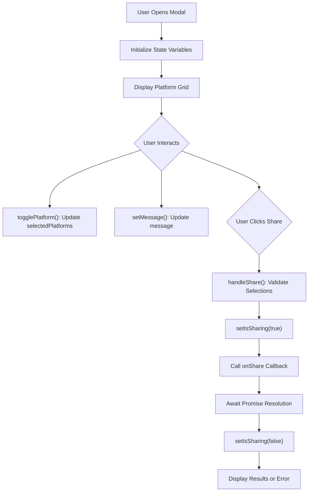
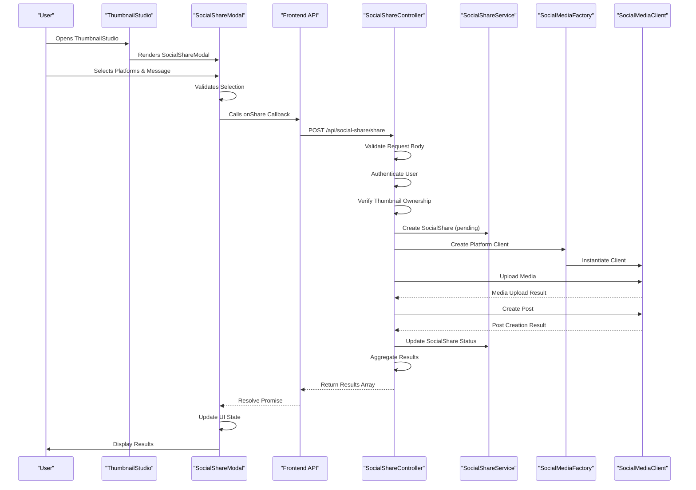
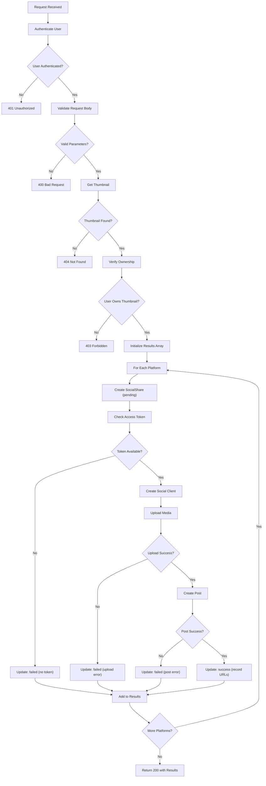
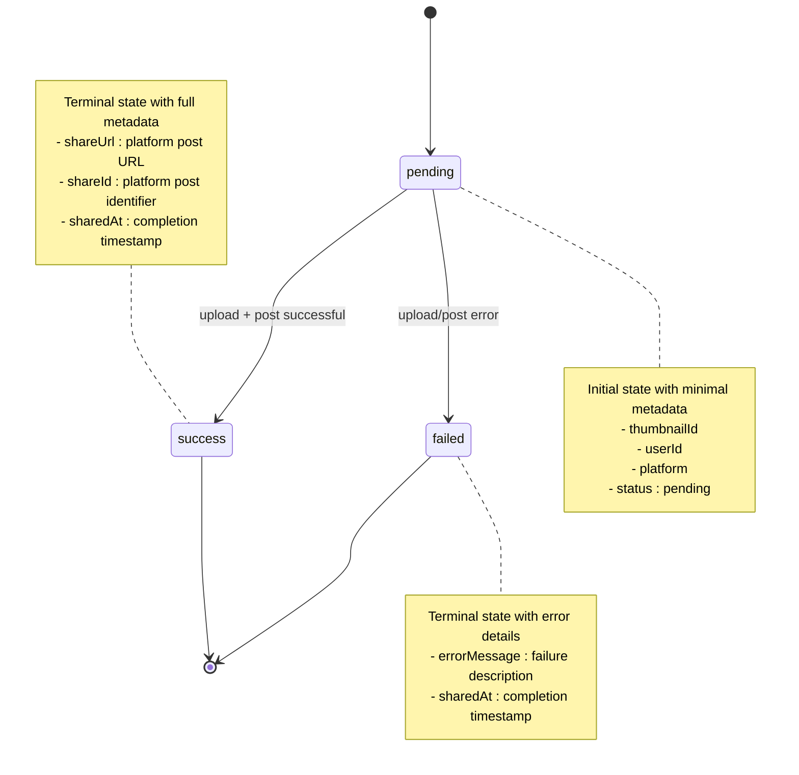
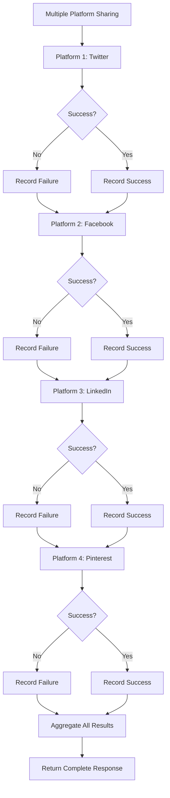
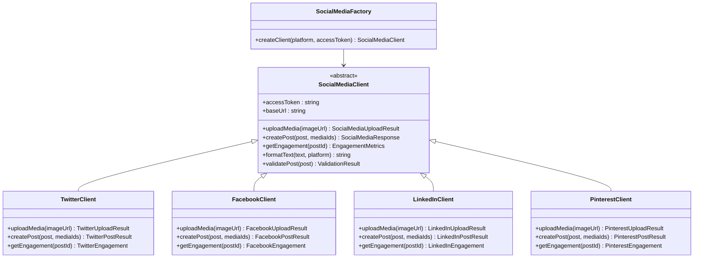
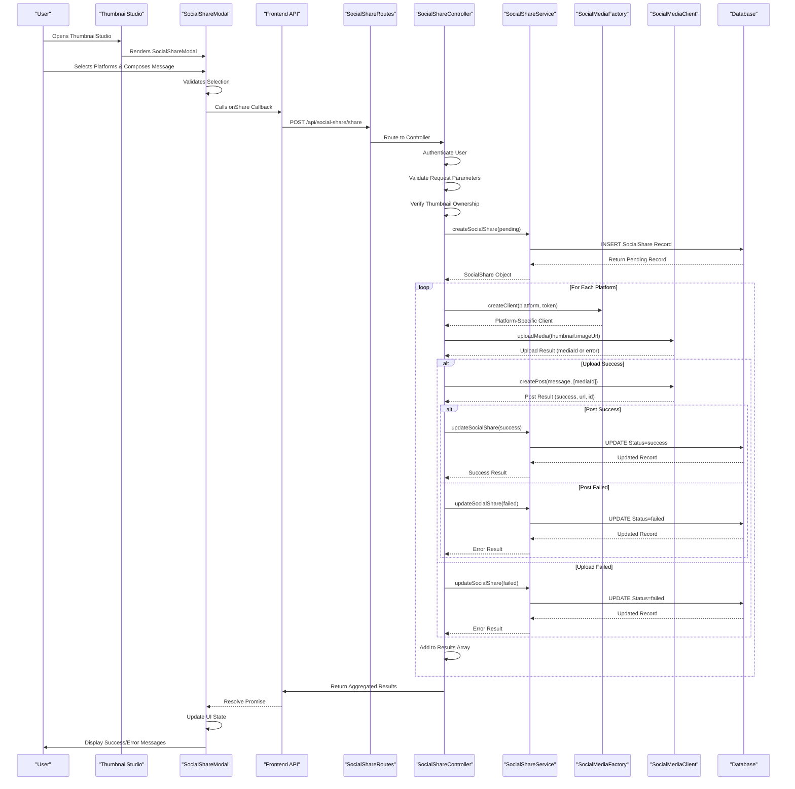

# Share Workflow and UI Integration

<cite>
**Referenced Files in This Document**
- [SocialShareModal.tsx](file://pikzels-clone/client/src/components/SocialShareModal.tsx)
- [social-share.controller.ts](file://pikzels-clone/src/modules/social-share/social-share.controller.ts)
- [social-share.service.ts](file://pikzels-clone/src/modules/social-share/social-share.service.ts)
- [social-media-factory.ts](file://pikzels-clone/src/modules/social-share/social-media-factory.ts)
- [social-media-client.ts](file://pikzels-clone/src/modules/social-share/social-media-client.ts)
- [twitter-client.ts](file://pikzels-clone/src/modules/social-share/twitter-client.ts)
- [facebook-client.ts](file://pikzels-clone/src/modules/social-share/facebook-client.ts)
- [linkedin-client.ts](file://pikzels-clone/src/modules/social-share/linkedin-client.ts)
- [pinterest-client.ts](file://pikzels-clone/src/modules/social-share/pinterest-client.ts)
- [social-share.routes.ts](file://pikzels-clone/src/modules/social-share/social-share.routes.ts)
- [ThumbnailStudio.tsx](file://pikzels-clone/client/src/components/editor/ThumbnailStudio.tsx)
- [social-sharing.md](file://pikzels-clone/docs/social-sharing.md)
</cite>

## Update Summary
**Changes Made**
- Updated UI component documentation to reflect current SocialShareModal implementation
- Added ThumbnailStudio integration details showing how social sharing is integrated into the main editor workflow
- Updated backend controller documentation to reflect current implementation with proper error handling
- Enhanced social media client architecture documentation with concrete implementations
- Added API route documentation and integration examples
- Updated database schema documentation with current field definitions

## Table of Contents
1. [Introduction](#introduction)
2. [UI Component: SocialShareModal](#ui-component-socialsharemodal)
3. [ThumbnailStudio Integration](#thumbnailstudio-integration)
4. [Data Flow from UI to Backend](#data-flow-from-ui-to-backend)
5. [Backend Controller: shareThumbnail Method](#backend-controller-sharethumbnail-method)
6. [Social Share Status Lifecycle](#social-share-status-lifecycle)
7. [Error Handling and Partial Failures](#error-handling-and-partial-failures)
8. [Social Media Client Architecture](#social-media-client-architecture)
9. [API Routes and Integration](#api-routes-and-integration)
10. [Database Schema for Social Shares](#database-schema-for-social-shares)
11. [Sequence Diagram: End-to-End Sharing Process](#sequence-diagram-end-to-end-sharing-process)

## Introduction
This document details the end-to-end workflow for sharing thumbnails across social media platforms within the Thumbnail Maker application. The social sharing functionality has been integrated into the main ThumbnailStudio editor, providing users with seamless sharing capabilities directly from the thumbnail creation workflow. The system supports multiple social media platforms including Twitter, Facebook, LinkedIn, and Pinterest, with comprehensive error handling and status tracking.

## UI Component: SocialShareModal
The `SocialShareModal` component provides a user interface for selecting social media platforms and composing a message before sharing a thumbnail. The modal is designed to be integrated seamlessly into the ThumbnailStudio editor workflow.

### Component Features:
- **Platform Selection**: Grid-based platform selection with visual icons for Twitter, Facebook, LinkedIn, and Pinterest
- **Message Composition**: Textarea for customizing the sharing message with platform-specific formatting considerations
- **State Management**: Comprehensive state handling for platform selection, message input, sharing status, and results display
- **User Feedback**: Real-time loading states, success indicators, and error messaging
- **Responsive Design**: Mobile-friendly layout with appropriate spacing and touch targets

### State Management:
The component maintains several key state variables:
- `selectedPlatforms`: Array of currently selected platform IDs
- `message`: Custom message text with default pre-populated content
- `isSharing`: Boolean flag indicating active sharing operation
- `shareResults`: Array of results for each platform sharing attempt



**Diagram sources**
- [SocialShareModal.tsx](file://pikzels-clone/client/src/components/SocialShareModal.tsx#L10-L171)

**Section sources**
- [SocialShareModal.tsx](file://pikzels-clone/client/src/components/SocialShareModal.tsx#L10-L171)

## ThumbnailStudio Integration
The social sharing functionality is deeply integrated into the ThumbnailStudio editor, providing users with convenient access to sharing capabilities during the thumbnail creation process.

### Integration Points:
- **Toolbar Integration**: Social sharing options are accessible from the editor toolbar
- **Contextual Access**: Users can share thumbnails immediately after creation or modification
- **Workflow Continuity**: Seamless transition from editing to sharing without leaving the editor
- **Status Indicators**: Visual feedback on sharing status directly within the editor interface

### ThumbnailStudio Features Supporting Sharing:
- **Canvas Integration**: Direct access to share functionality from the main canvas interface
- **Layer Management**: Integration with the layer system for complex thumbnail compositions
- **Export Capabilities**: Seamless export workflow that includes sharing options
- **Preview Functionality**: Platform-specific preview overlays for accurate sharing representation

**Section sources**
- [ThumbnailStudio.tsx](file://pikzels-clone/client/src/components/editor/ThumbnailStudio.tsx#L187-L800)

## Data Flow from UI to Backend
The data flow from the React component through the application's API layer to the backend controller follows a structured pattern with comprehensive validation and error handling.

### Request Flow:
1. **Component Interaction**: User selects platforms and message in SocialShareModal
2. **Validation**: Component validates platform selection and message content
3. **API Call**: Component calls `onShare` callback with structured data
4. **Backend Processing**: Server validates request, authenticates user, and processes sharing
5. **Response Handling**: Results aggregated and returned to the UI component

### Request Payload Structure:
```typescript
{
  thumbnailId: string,
  platforms: string[],
  message: string
}
```

### Response Structure:
```typescript
{
  message: string,
  results: Array<{
    platform: string,
    success: boolean,
    shareUrl?: string,
    shareId?: string,
    error?: string
  }>
}
```



**Diagram sources**
- [SocialShareModal.tsx](file://pikzels-clone/client/src/components/SocialShareModal.tsx#L38-L55)
- [social-share.controller.ts](file://pikzels-clone/src/modules/social-share/social-share.controller.ts#L14-L165)
- [social-share.routes.ts](file://pikzels-clone/src/modules/social-share/social-share.routes.ts#L13-L15)

**Section sources**
- [SocialShareModal.tsx](file://pikzels-clone/client/src/components/SocialShareModal.tsx#L38-L55)
- [social-share.controller.ts](file://pikzels-clone/src/modules/social-share/social-share.controller.ts#L14-L165)
- [social-share.routes.ts](file://pikzels-clone/src/modules/social-share/social-share.routes.ts#L13-L15)

## Backend Controller: shareThumbnail Method
The `shareThumbnail` method in `SocialShareController` implements the core sharing logic with comprehensive validation, authentication, and error handling.

### Step-by-Step Execution Flow:

#### Authentication and Validation Phase:
1. **User Authentication**: Verifies authenticated user via `req.user`
2. **Request Validation**: Ensures `thumbnailId`, `platforms` array, and `message` are present
3. **Thumbnail Verification**: Retrieves and validates thumbnail existence and ownership
4. **Token Preparation**: Initializes mock access tokens (placeholder for OAuth implementation)

#### Platform Processing Loop:
For each selected platform, the controller performs:
1. **Record Creation**: Creates `SocialShare` record with "pending" status
2. **Token Validation**: Checks for platform-specific access token availability
3. **Client Instantiation**: Uses `SocialMediaFactory` to create appropriate client
4. **Media Upload**: Uploads thumbnail image via client's `uploadMedia` method
5. **Post Creation**: Creates social media post with composed message
6. **Result Recording**: Updates social share record with final status and metadata

#### Error Handling Strategy:
- **Early Validation**: Immediate rejection for missing/invalid parameters
- **Platform Isolation**: Individual platform failures don't affect others
- **Comprehensive Logging**: Detailed error tracking for debugging
- **Graceful Degradation**: Continues processing remaining platforms on failure



**Diagram sources**
- [social-share.controller.ts](file://pikzels-clone/src/modules/social-share/social-share.controller.ts#L14-L165)

**Section sources**
- [social-share.controller.ts](file://pikzels-clone/src/modules/social-share/social-share.controller.ts#L14-L165)

## Social Share Status Lifecycle
Social share records progress through a defined status lifecycle that provides comprehensive tracking of sharing operations.

### Status States:
- **pending**: Initial state when sharing begins, record created but operation not yet attempted
- **success**: Terminal state indicating successful post creation with share URL and ID recorded
- **failed**: Terminal state indicating operation failure with detailed error message

### Status Transition Logic:


### Metadata Management:
Each status transition updates the record with relevant metadata:
- **Timestamps**: Automatic `sharedAt` timestamp on completion
- **Success Data**: `shareUrl` and `shareId` for successful posts
- **Failure Data**: `errorMessage` for failed attempts
- **Platform Context**: Maintains platform association throughout lifecycle

**Diagram sources**
- [social-share.service.ts](file://pikzels-clone/src/modules/social-share/social-share.service.ts#L10-L26)
- [social-share.controller.ts](file://pikzels-clone/src/modules/social-share/social-share.controller.ts#L55-L138)

**Section sources**
- [social-share.service.ts](file://pikzels-clone/src/modules/social-share/social-share.service.ts#L10-L26)
- [social-share.controller.ts](file://pikzels-clone/src/modules/social-share/social-share.controller.ts#L55-L138)

## Error Handling and Partial Failures
The sharing system implements robust error handling to manage various failure scenarios, particularly important when sharing to multiple platforms where partial failures are expected.

### Error Categories:

#### Validation Errors (HTTP 400/401/403/404):
- Missing or invalid `thumbnailId`
- Invalid `platforms` array format
- Unauthenticated requests
- Non-existent thumbnails
- Unauthorized access attempts

#### Platform-Specific Errors:
- **Token Issues**: Missing or invalid OAuth tokens
- **Upload Failures**: Network errors, unsupported formats, size limits
- **Post Creation**: Content policy violations, rate limiting, platform errors
- **API Communication**: Network timeouts, service unavailability

#### Exception Handling:
- **Try-Catch Blocks**: Comprehensive error capture around critical operations
- **Individual Platform Isolation**: Failure of one platform doesn't affect others
- **Fallback Mechanisms**: Graceful degradation when partial failures occur
- **Detailed Logging**: Structured error logging for debugging and monitoring

### Partial Failure Strategy:
The system is designed to handle partial failures gracefully:



### User Experience Considerations:
- **Loading States**: Clear indication of ongoing operations
- **Individual Feedback**: Platform-specific success/error messages
- **Retry Capability**: Option to retry failed individual platforms
- **Progress Indication**: Visual feedback on completion percentage
- **Error Communication**: User-friendly error messages with actionable guidance

**Diagram sources**
- [social-share.controller.ts](file://pikzels-clone/src/modules/social-share/social-share.controller.ts#L53-L155)
- [SocialShareModal.tsx](file://pikzels-clone/client/src/components/SocialShareModal.tsx#L38-L55)

**Section sources**
- [social-share.controller.ts](file://pikzels-clone/src/modules/social-share/social-share.controller.ts#L53-L155)
- [SocialShareModal.tsx](file://pikzels-clone/client/src/components/SocialShareModal.tsx#L38-L55)

## Social Media Client Architecture
The system uses a factory pattern to create platform-specific clients that implement a common interface, enabling consistent handling of different social media APIs while supporting platform-specific implementations.

### Core Architecture Components:

#### SocialMediaClient Abstract Class:
Defines the standardized interface for all social media platforms:
- `uploadMedia(imageUrl)`: Uploads thumbnail image to platform
- `createPost(post, mediaIds)`: Creates social media post with text and media
- `getEngagement(postId)`: Retrieves engagement metrics for posted content
- `validatePost(post)`: Validates post content against platform requirements

#### SocialMediaFactory:
Creates appropriate client instances based on platform type:
- **Twitter/X**: Special handling for platform name variations
- **Facebook**: Standard Facebook Graph API integration
- **LinkedIn**: Professional networking platform integration
- **Pinterest**: Visual discovery platform integration

#### Platform Client Implementations:
Each platform extends the base client with platform-specific logic:
- **Authentication**: OAuth 2.0 token management
- **Rate Limiting**: Platform-specific rate limit handling
- **Content Formatting**: Platform-specific character limits and formatting rules
- **API Endpoints**: Platform-specific API endpoint configurations



**Diagram sources**
- [social-media-client.ts](file://pikzels-clone/src/modules/social-share/social-media-client.ts#L15-L69)
- [social-media-factory.ts](file://pikzels-clone/src/modules/social-share/social-media-factory.ts#L7-L25)
- [twitter-client.ts](file://pikzels-clone/src/modules/social-share/twitter-client.ts)
- [facebook-client.ts](file://pikzels-clone/src/modules/social-share/facebook-client.ts)
- [linkedin-client.ts](file://pikzels-clone/src/modules/social-share/linkedin-client.ts)
- [pinterest-client.ts](file://pikzels-clone/src/modules/social-share/pinterest-client.ts)

**Section sources**
- [social-media-client.ts](file://pikzels-clone/src/modules/social-share/social-media-client.ts#L15-L69)
- [social-media-factory.ts](file://pikzels-clone/src/modules/social-share/social-media-factory.ts#L7-L25)

## API Routes and Integration
The social sharing functionality exposes RESTful API endpoints that integrate seamlessly with the frontend application.

### Available API Endpoints:

#### Core Sharing Endpoint:
- **POST /api/social-share/share**
  - Purpose: Share thumbnail to specified social media platforms
  - Authentication: Required (JWT token)
  - Request Body: `{ thumbnailId, platforms: string[], message?: string }`
  - Response: `{ message: string, results: ShareResult[] }`

#### Administrative Endpoints:
- **GET /api/social-share/**
  - Purpose: Retrieve social shares for authenticated user
  - Query Parameters: `platform`, `status`, `thumbnailId`
  - Response: `{ socialShares: SocialShare[] }`

- **GET /api/social-share/stats**
  - Purpose: Get social sharing statistics for user
  - Response: `{ stats: PlatformStats }`

- **GET /api/social-share/thumbnail/:thumbnailId**
  - Purpose: Get social shares for specific thumbnail
  - Response: `{ socialShares: SocialShare[] }`

- **DELETE /api/social-share/:id**
  - Purpose: Delete specific social share record
  - Response: HTTP 204 on success

### Integration Examples:

#### Frontend Integration Pattern:
```typescript
// SocialShareModal integration
const handleShare = async () => {
  try {
    await onShare(selectedPlatforms, message);
    // Handle success response
  } catch (error) {
    // Handle error response
  }
};

// Backend Route Registration
router.post('/share', authenticateToken, controller.shareThumbnail);
```

#### Response Processing:
The backend aggregates results from all platform operations and returns a comprehensive response:
```json
{
  "message": "Social sharing completed",
  "results": [
    {
      "platform": "twitter",
      "success": true,
      "shareUrl": "https://twitter.com/user/status/123",
      "shareId": "123"
    },
    {
      "platform": "facebook",
      "success": false,
      "error": "Invalid access token"
    }
  ]
}
```

**Section sources**
- [social-share.routes.ts](file://pikzels-clone/src/modules/social-share/social-share.routes.ts#L13-L25)
- [social-share.controller.ts](file://pikzels-clone/src/modules/social-share/social-share.controller.ts#L14-L282)

## Database Schema for Social Shares
The social sharing functionality utilizes a dedicated database table that provides comprehensive tracking and analytics capabilities for all sharing operations.

### SocialShare Table Structure:
```sql
CREATE TABLE "SocialShare" (
    "id" TEXT PRIMARY KEY,
    "thumbnailId" TEXT NOT NULL,
    "userId" TEXT NOT NULL,
    "platform" TEXT NOT NULL,
    "shareUrl" TEXT,
    "shareId" TEXT,
    "status" TEXT NOT NULL DEFAULT 'pending',
    "errorMessage" TEXT,
    "sharedAt" TIMESTAMP NOT NULL DEFAULT CURRENT_TIMESTAMP,
    "engagement" JSONB,
    FOREIGN KEY ("thumbnailId") REFERENCES "Thumbnail"("id"),
    FOREIGN KEY ("userId") REFERENCES "User"("id")
);
```

### Key Fields and Their Purposes:

#### Identifiers:
- **id**: Unique identifier for each social share operation
- **thumbnailId**: Foreign key linking to the shared thumbnail
- **userId**: Foreign key linking to the user who initiated sharing
- **shareId**: Platform-specific identifier for the created post

#### Platform Information:
- **platform**: Social media platform identifier (twitter, facebook, linkedin, pinterest)

#### Status Tracking:
- **status**: Current operation status (pending, success, failed)
- **sharedAt**: Timestamp when the sharing attempt was made

#### Result Data:
- **shareUrl**: URL to the created social media post
- **errorMessage**: Detailed error message for failed operations

#### Analytics Support:
- **engagement**: JSON field for storing platform-specific engagement metrics

### Indexes and Constraints:
- **Foreign Key Constraints**: Ensures referential integrity with Thumbnail and User tables
- **Platform Index**: Optimizes queries by platform
- **Status Index**: Optimizes status-based filtering
- **Timestamp Index**: Optimizes chronological queries

### Usage Patterns:
The schema supports key use cases:
- **User History**: Track all sharing activities per user
- **Thumbnail Analytics**: Monitor sharing performance per thumbnail
- **Platform Performance**: Analyze success rates across different platforms
- **Audit Trail**: Maintain complete record of all sharing operations

**Section sources**
- [social-share.service.ts](file://pikzels-clone/src/modules/social-share/social-share.service.ts#L10-L26)
- [social-sharing.md](file://pikzels-clone/docs/social-sharing.md#L79-L91)

## Sequence Diagram: End-to-End Sharing Process
This comprehensive sequence diagram illustrates the complete flow from user interaction in the ThumbnailStudio editor to database updates in the backend system.



**Diagram sources**
- [ThumbnailStudio.tsx](file://pikzels-clone/client/src/components/editor/ThumbnailStudio.tsx#L187-L800)
- [SocialShareModal.tsx](file://pikzels-clone/client/src/components/SocialShareModal.tsx#L38-L55)
- [social-share.controller.ts](file://pikzels-clone/src/modules/social-share/social-share.controller.ts#L14-L165)
- [social-share.routes.ts](file://pikzels-clone/src/modules/social-share/social-share.routes.ts#L13-L15)

**Section sources**
- [ThumbnailStudio.tsx](file://pikzels-clone/client/src/components/editor/ThumbnailStudio.tsx#L187-L800)
- [SocialShareModal.tsx](file://pikzels-clone/client/src/components/SocialShareModal.tsx#L38-L55)
- [social-share.controller.ts](file://pikzels-clone/src/modules/social-share/social-share.controller.ts#L14-L165)
- [social-share.routes.ts](file://pikzels-clone/src/modules/social-share/social-share.routes.ts#L13-L15)