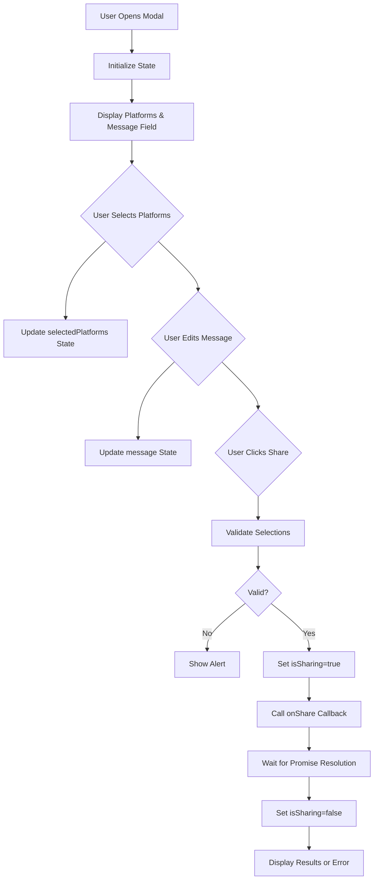
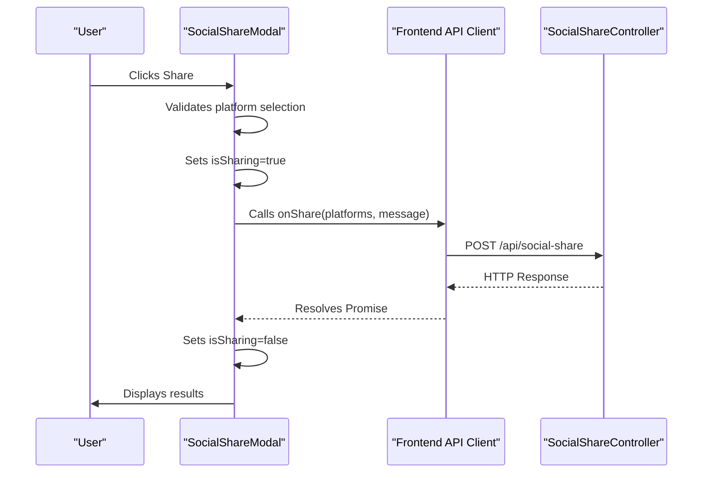
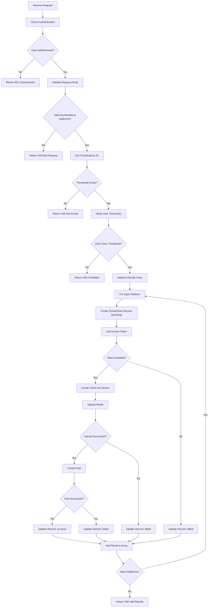
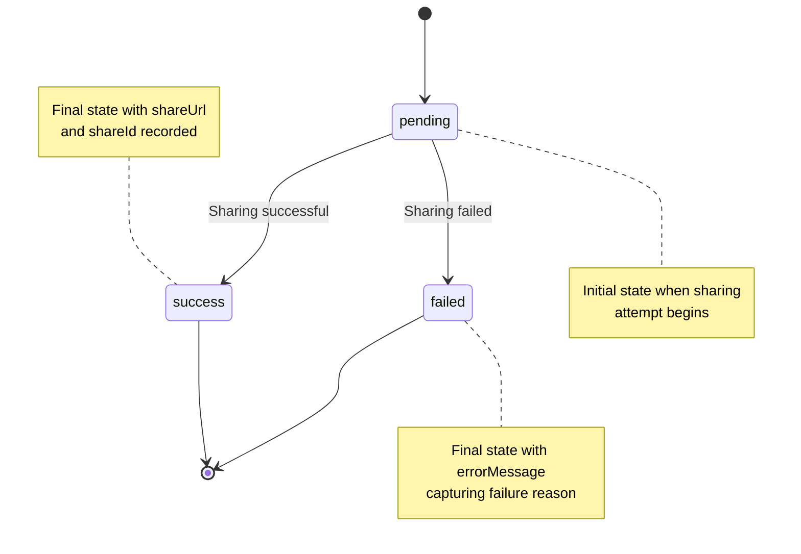
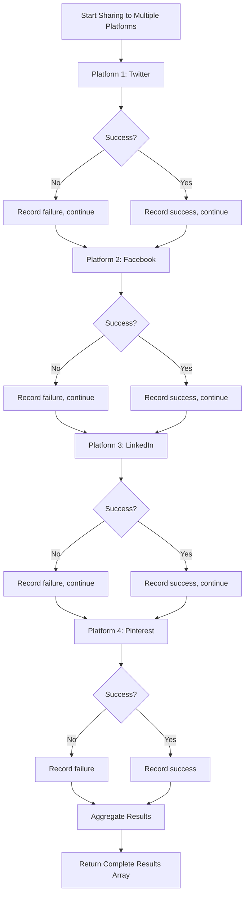
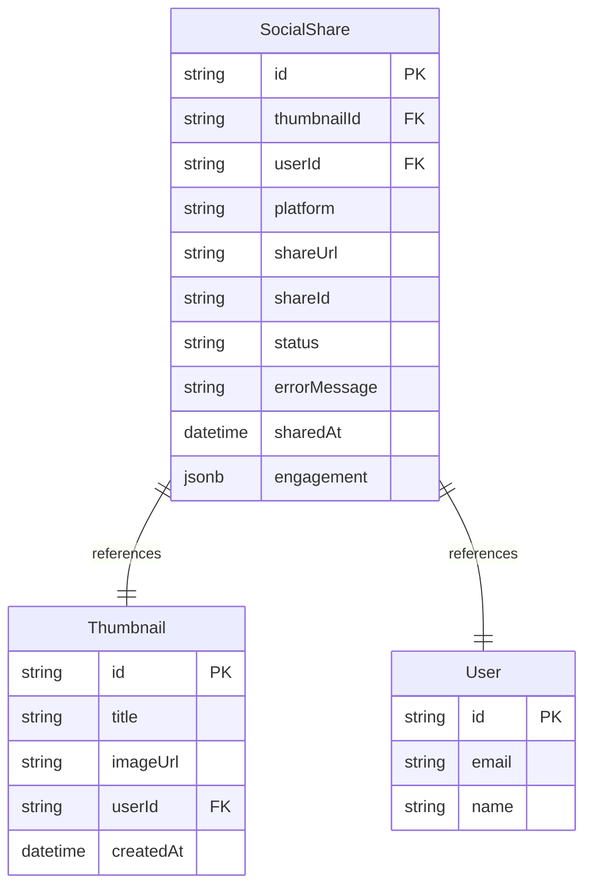
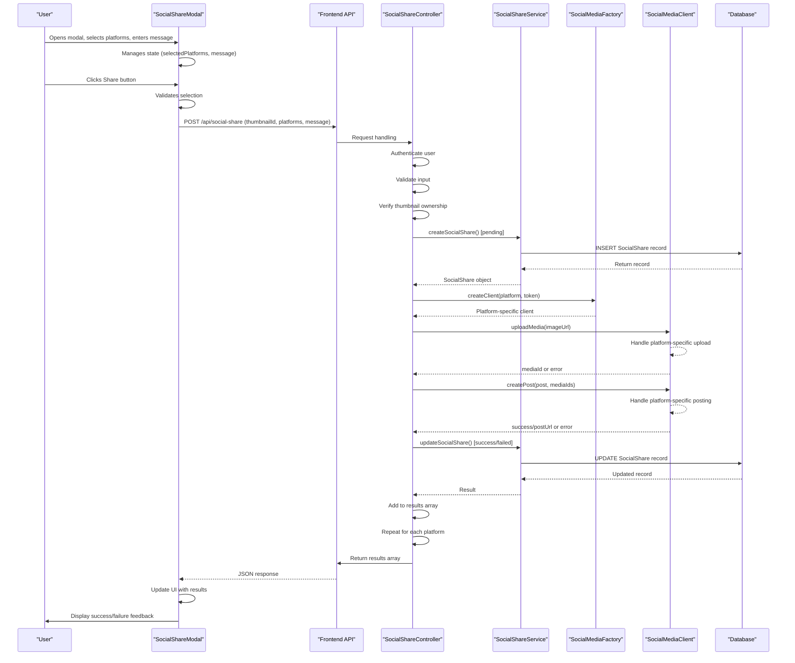

# Share Workflow and UI Integration

<cite>
**Referenced Files in This Document**   
- [SocialShareModal.tsx](file://pikzels-clone/client/src/components/SocialShareModal.tsx)
- [social-share.controller.ts](file://pikzels-clone/src/modules/social-share/social-share.controller.ts)
- [social-share.service.ts](file://pikzels-clone/src/modules/social-share/social-share.service.ts)
- [social-media-factory.ts](file://pikzels-clone/src/modules/social-share/social-media-factory.ts)
- [twitter-client.ts](file://pikzels-clone/src/modules/social-share/twitter-client.ts)
- [facebook-client.ts](file://pikzels-clone/src/modules/social-share/facebook-client.ts)
- [linkedin-client.ts](file://pikzels-clone/src/modules/social-share/linkedin-client.ts)
- [pinterest-client.ts](file://pikzels-clone/src/modules/social-share/pinterest-client.ts)
- [social-media-client.ts](file://pikzels-clone/src/modules/social-share/social-media-client.ts)
- [migration.sql](file://pikzels-clone/prisma/migrations/20250911134004_add_social_shares/migration.sql)
</cite>

## Table of Contents
1. [Introduction](#introduction)
2. [UI Component: SocialShareModal](#ui-component-socialsharemodal)
3. [Data Flow from UI to Backend](#data-flow-from-ui-to-backend)
4. [Backend Controller: shareThumbnail Method](#backend-controller-sharethumbnail-method)
5. [Social Share Status Lifecycle](#social-share-status-lifecycle)
6. [Error Handling and Partial Failures](#error-handling-and-partial-failures)
7. [Social Media Client Architecture](#social-media-client-architecture)
8. [Database Schema for Social Shares](#database-schema-for-social-shares)
9. [Sequence Diagram: End-to-End Sharing Process](#sequence-diagram-end-to-end-sharing-process)

## Introduction
This document details the end-to-end workflow for sharing thumbnails across social media platforms within the Thumbnail Maker application. It covers the integration between the frontend UI component (SocialShareModal) and the backend controller and service layers, explaining how user selections are transmitted, validated, and processed. The document also describes the status lifecycle of social share records, error handling strategies, and mechanisms for providing user feedback during the sharing process.

## UI Component: SocialShareModal
The `SocialShareModal` component provides a user interface for selecting social media platforms and composing a message before sharing a thumbnail. It manages its own state for platform selection, message input, and sharing status.

The modal displays a list of available platforms (Twitter, Facebook, LinkedIn, Pinterest) with visual icons. Users can select one or more platforms through toggle buttons. The message field is pre-populated with a default message including the thumbnail title but can be customized by the user.

During the sharing process, the modal displays a loading state and disables interaction to prevent duplicate submissions. After sharing completes, it shows results for each platform, indicating success or failure with appropriate messaging.



**Diagram sources**
- [SocialShareModal.tsx](file://pikzels-clone/client/src/components/SocialShareModal.tsx#L9-L168)

**Section sources**
- [SocialShareModal.tsx](file://pikzels-clone/client/src/components/SocialShareModal.tsx#L9-L168)

## Data Flow from UI to Backend
When the user initiates a share operation, data flows from the React component through the application's API layer to the backend controller. The `SocialShareModal` component receives an `onShare` callback prop that is triggered with the selected platforms and message.

This callback typically makes an HTTP POST request to the `/api/social-share` endpoint with a JSON payload containing:
- `thumbnailId`: The ID of the thumbnail being shared
- `platforms`: Array of platform identifiers (e.g., "twitter", "facebook")
- `message`: Custom message entered by the user

The backend receives this request and processes each selected platform sequentially, attempting to share the thumbnail to each platform while maintaining individual result tracking.



**Diagram sources**
- [SocialShareModal.tsx](file://pikzels-clone/client/src/components/SocialShareModal.tsx#L9-L168)
- [social-share.controller.ts](file://pikzels-clone/src/modules/social-share/social-share.controller.ts#L20-L171)

**Section sources**
- [SocialShareModal.tsx](file://pikzels-clone/client/src/components/SocialShareModal.tsx#L9-L168)

## Backend Controller: shareThumbnail Method
The `shareThumbnail` method in `SocialShareController` handles the core sharing logic. It follows a structured process to validate, authenticate, and execute sharing operations across multiple platforms.

### Step-by-Step Execution Flow:
1. **Authentication Check**: Verifies the user is authenticated via the `req.user` object
2. **Input Validation**: Ensures `thumbnailId`, `platforms` array are present in the request body
3. **Thumbnail Retrieval**: Fetches the thumbnail record using `thumbnailService.getThumbnailById`
4. **Ownership Verification**: Confirms the requesting user owns the thumbnail by comparing `thumbnail.userId` with `req.user.id`
5. **Token Retrieval**: Obtains social media access tokens for the user (currently mocked)
6. **Platform Processing**: Iterates through each selected platform and attempts sharing

For each platform, the controller:
- Creates a `socialShare` record with "pending" status
- Instantiates the appropriate social media client using the `SocialMediaFactory`
- Uploads the thumbnail image via `uploadMedia` method
- Creates the social post via `createPost` method
- Updates the `socialShare` record with final status ("success" or "failed")
- Records share URL and ID on success, or error message on failure

The method collects results for all platforms and returns a comprehensive response indicating the outcome of each sharing attempt.



**Diagram sources**
- [social-share.controller.ts](file://pikzels-clone/src/modules/social-share/social-share.controller.ts#L20-L171)

**Section sources**
- [social-share.controller.ts](file://pikzels-clone/src/modules/social-share/social-share.controller.ts#L20-L171)

## Social Share Status Lifecycle
Social share records progress through a defined status lifecycle that reflects their processing state. The three primary statuses are:

- **pending**: Initial state when a sharing attempt begins. The system has created a record but not yet attempted to share.
- **success**: Final state indicating successful sharing. The post was created on the target platform.
- **failed**: Final state indicating unsuccessful sharing. The system attempted but failed to create the post.

When a sharing attempt starts, the system immediately creates a `SocialShare` record with "pending" status. This ensures even if the process fails early, there's an audit trail. As the sharing operation progresses, the record is updated to reflect the final outcome.

The status lifecycle is irreversible—once a record reaches "success" or "failed", it cannot transition back to "pending" or to the opposite terminal state. This design ensures data integrity and clear audit trails.

Each status transition is accompanied by relevant metadata:
- On success: `shareUrl` and `shareId` are recorded
- On failure: `errorMessage` captures the reason for failure
- All records include timestamp via `sharedAt` field (default: current timestamp)



**Diagram sources**
- [social-share.service.ts](file://pikzels-clone/src/modules/social-share/social-share.service.ts#L4-L130)
- [social-share.controller.ts](file://pikzels-clone/src/modules/social-share/social-share.controller.ts#L20-L171)

**Section sources**
- [social-share.service.ts](file://pikzels-clone/src/modules/social-share/social-share.service.ts#L4-L130)

## Error Handling and Partial Failures
The sharing system implements robust error handling to manage various failure scenarios, particularly important when sharing to multiple platforms where partial failures are expected.

### Error Handling Strategies:
1. **Validation Errors**: Handled at the beginning of the process with appropriate HTTP status codes (400, 401, 403, 404)
2. **Platform-Specific Failures**: Each platform's sharing attempt is isolated, allowing one failure to not affect others
3. **Token Missing**: Detected before API calls, resulting in immediate "failed" status with descriptive message
4. **API Communication Errors**: Caught and recorded in the social share record
5. **Unexpected Exceptions**: Wrapped in try-catch blocks to prevent complete process failure

The system is designed to handle partial failures gracefully. When sharing to multiple platforms, a failure on one platform does not prevent attempts on others. The final response includes results for all platforms, clearly indicating which succeeded and which failed.

User feedback mechanisms include:
- Loading states to indicate processing
- Success indicators with platform-specific feedback
- Error messages that explain what went wrong
- Ability to retry failed sharing attempts



**Diagram sources**
- [social-share.controller.ts](file://pikzels-clone/src/modules/social-share/social-share.controller.ts#L20-L171)
- [SocialShareModal.tsx](file://pikzels-clone/client/src/components/SocialShareModal.tsx#L9-L168)

**Section sources**
- [social-share.controller.ts](file://pikzels-clone/src/modules/social-share/social-share.controller.ts#L20-L171)

## Social Media Client Architecture
The system uses a factory pattern to create platform-specific clients that implement a common interface. This architecture enables consistent handling of different social media APIs while allowing platform-specific implementations.

### Key Components:
- **SocialMediaClient**: Abstract base class defining the interface for all social media clients
- **SocialMediaFactory**: Creates appropriate client instances based on platform type
- **Platform Clients**: Concrete implementations for Twitter, Facebook, LinkedIn, and Pinterest

The `SocialMediaClient` abstract class defines three core methods:
- `uploadMedia`: Uploads the thumbnail image to the platform
- `createPost`: Creates a social post with text and media
- `getEngagement`: Retrieves engagement metrics for a post

Each platform client extends this base class and implements platform-specific logic for character limits, formatting rules, and API endpoints. The factory pattern allows the controller to work with clients through the common interface without knowing the specific implementation details.

```mermaid
classDiagram
class SocialMediaClient {
<<abstract>>
+accessToken : string
+uploadMedia(imageUrl) : Promise~{mediaId} | {error}~
+createPost(post, mediaIds) : Promise~SocialMediaResponse~
+getEngagement(postId) : Promise~any~
+validatePost(post) : {valid, errors}
}
class SocialMediaFactory {
+createClient(platform, accessToken) : SocialMediaClient
}
class TwitterClient {
+uploadMedia(imageUrl) : Promise~{mediaId} | {error}~
+createPost(post, mediaIds) : Promise~SocialMediaResponse~
+getEngagement(postId) : Promise~any~
}
class FacebookClient {
+uploadMedia(imageUrl) : Promise~{mediaId} | {error}~
+createPost(post, mediaIds) : Promise~SocialMediaResponse~
+getEngagement(postId) : Promise~any~
}
class LinkedInClient {
+uploadMedia(imageUrl) : Promise~{mediaId} | {error}~
+createPost(post, mediaIds) : Promise~SocialMediaResponse~
+getEngagement(postId) : Promise~any~
}
class PinterestClient {
+uploadMedia(imageUrl) : Promise~{mediaId} | {error}~
+createPost(post, mediaIds) : Promise~SocialMediaResponse~
+getEngagement(postId) : Promise~any~
}
SocialMediaFactory --> SocialMediaClient : "creates"
SocialMediaClient <|-- TwitterClient : "extends"
SocialMediaClient <|-- FacebookClient : "extends"
SocialMediaClient <|-- LinkedInClient : "extends"
SocialMediaClient <|-- PinterestClient : "extends"
```

**Diagram sources**
- [social-media-client.ts](file://pikzels-clone/src/modules/social-share/social-media-client.ts#L1-L69)
- [social-media-factory.ts](file://pikzels-clone/src/modules/social-share/social-media-factory.ts#L1-L26)
- [twitter-client.ts](file://pikzels-clone/src/modules/social-share/twitter-client.ts#L1-L129)
- [facebook-client.ts](file://pikzels-clone/src/modules/social-share/facebook-client.ts#L1-L131)
- [linkedin-client.ts](file://pikzels-clone/src/modules/social-share/linkedin-client.ts#L1-L131)
- [pinterest-client.ts](file://pikzels-clone/src/modules/social-share/pinterest-client.ts#L1-L137)

**Section sources**
- [social-media-client.ts](file://pikzels-clone/src/modules/social-share/social-media-client.ts#L1-L69)
- [social-media-factory.ts](file://pikzels-clone/src/modules/social-share/social-media-factory.ts#L1-L26)

## Database Schema for Social Shares
The social sharing functionality is supported by a dedicated database table that tracks all sharing activities. The schema is designed to provide comprehensive audit trails and analytics capabilities.

### SocialShare Table Structure:
- `id`: Primary key (TEXT)
- `thumbnailId`: Foreign key to Thumbnail table
- `userId`: Foreign key to User table
- `platform`: Platform identifier (twitter, facebook, etc.)
- `shareUrl`: URL of the created post
- `shareId`: Platform-specific post identifier
- `status`: Current status (pending, success, failed)
- `errorMessage`: Description of failure reason
- `sharedAt`: Timestamp of sharing attempt (default: current timestamp)
- `engagement`: JSON field for storing engagement metrics

The table includes foreign key constraints to ensure referential integrity with the Thumbnail and User tables. The `engagement` field uses JSONB type to store flexible engagement data that varies by platform.

This schema supports key use cases:
- Tracking sharing history by user or thumbnail
- Generating analytics about sharing success rates
- Displaying share results in the UI
- Providing audit trails for troubleshooting



**Diagram sources**
- [migration.sql](file://pikzels-clone/prisma/migrations/20250911134004_add_social_shares/migration.sql#L1-L15)
- [social-share.service.ts](file://pikzels-clone/src/modules/social-share/social-share.service.ts#L4-L130)

**Section sources**
- [migration.sql](file://pikzels-clone/prisma/migrations/20250911134004_add_social_shares/migration.sql#L1-L15)

## Sequence Diagram: End-to-End Sharing Process
This sequence diagram illustrates the complete flow from user interaction in the UI to database updates in the backend.



**Diagram sources**
- [SocialShareModal.tsx](file://pikzels-clone/client/src/components/SocialShareModal.tsx#L9-L168)
- [social-share.controller.ts](file://pikzels-clone/src/modules/social-share/social-share.controller.ts#L20-L171)
- [social-share.service.ts](file://pikzels-clone/src/modules/social-share/social-share.service.ts#L4-L130)
- [social-media-factory.ts](file://pikzels-clone/src/modules/social-share/social-media-factory.ts#L1-L26)

**Section sources**
- [SocialShareModal.tsx](file://pikzels-clone/client/src/components/SocialShareModal.tsx#L9-L168)
- [social-share.controller.ts](file://pikzels-clone/src/modules/social-share/social-share.controller.ts#L20-L171)