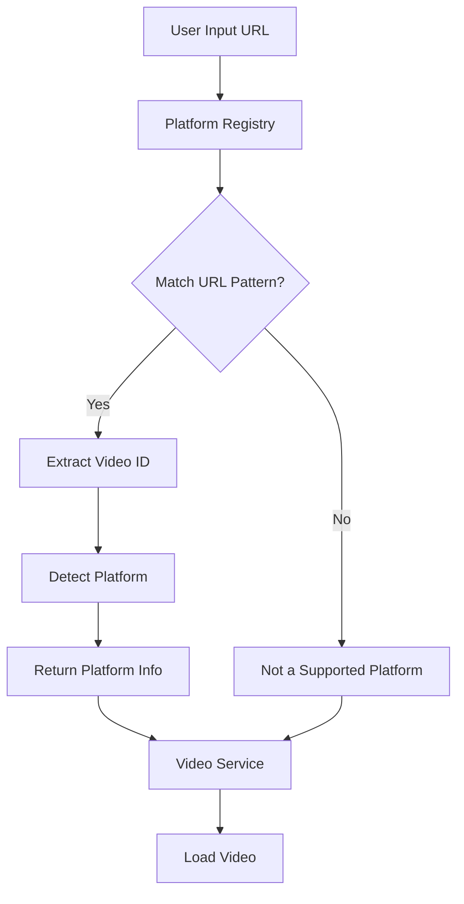
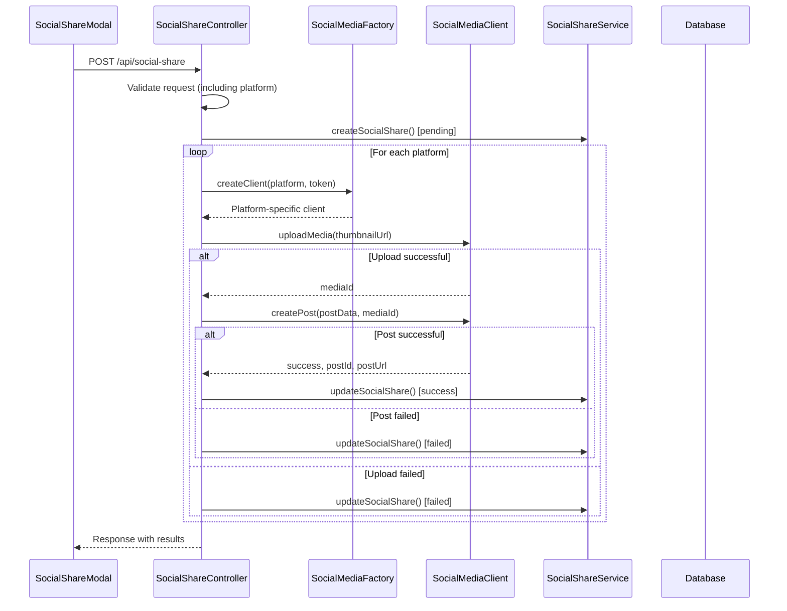
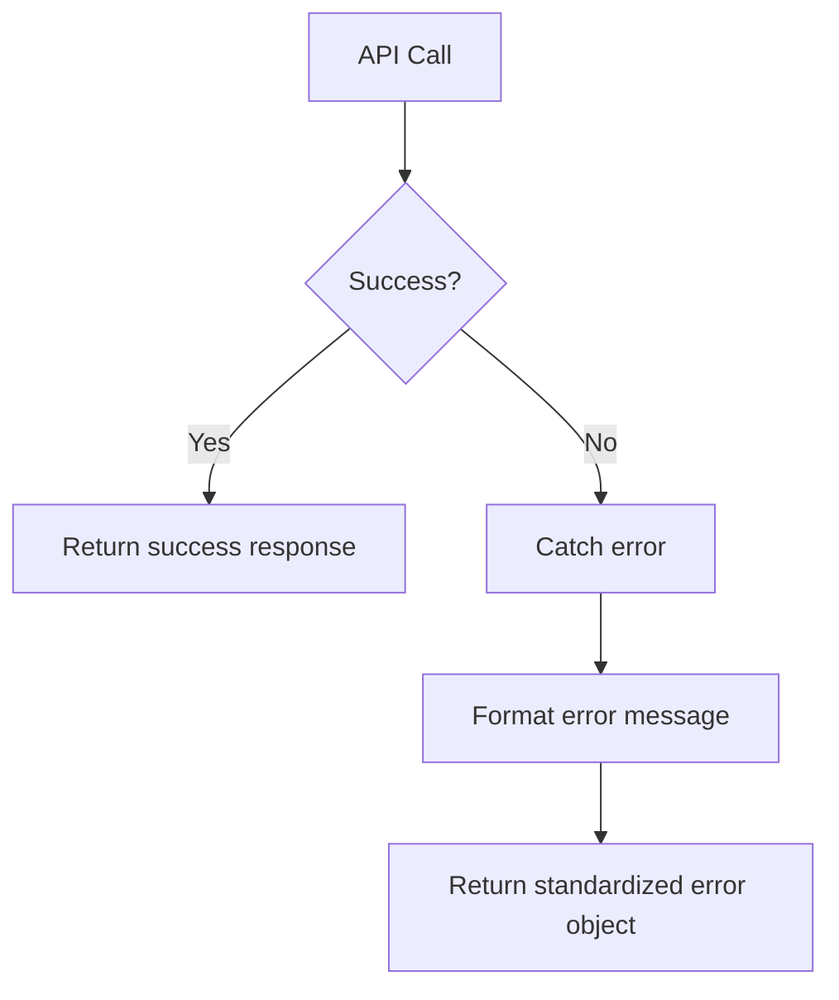
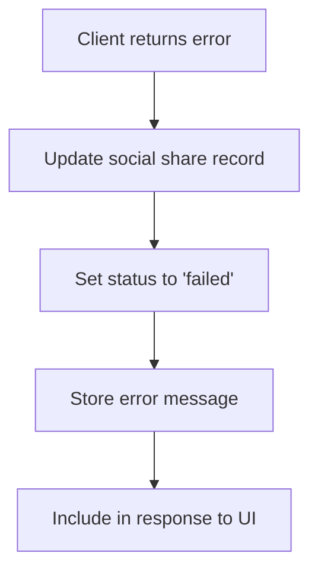
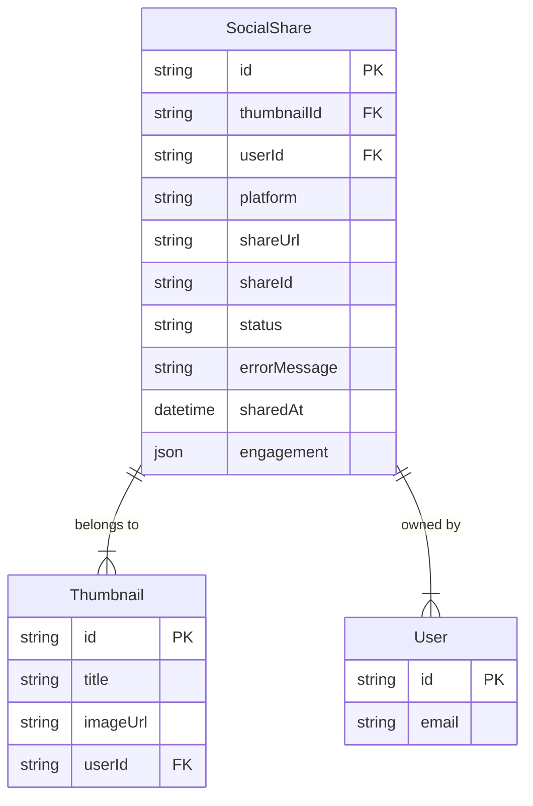

# Social Media Integration

<cite>
**Referenced Files in This Document**
- [SocialShareModal.tsx](file://pikzels-clone\client\src\components\SocialShareModal.tsx)
- [social-media-factory.ts](file://pikzels-clone\src\modules\social-share\social-media-factory.ts)
- [social-media-client.ts](file://pikzels-clone\src\modules\social-share\social-media-client.ts)
- [facebook-client.ts](file://pikzels-clone\src\modules\social-share\facebook-client.ts)
- [twitter-client.ts](file://pikzels-clone\src\modules\social-share\twitter-client.ts)
- [linkedin-client.ts](file://pikzels-clone\src\modules\social-share\linkedin-client.ts)
- [pinterest-client.ts](file://pikzels-clone\src\modules\social-share\pinterest-client.ts)
- [social-share.controller.ts](file://pikzels-clone\src\modules\social-share\social-share.controller.ts)
- [social-share.service.ts](file://pikzels-clone\src\modules\social-share\social-share.service.ts)
- [validation.middleware.ts](file://pikzels-clone\src\middleware\validation.middleware.ts)
- [platforms.ts](file://pikzels-clone\client\src\services\video\platforms.ts)
- [video-service.ts](file://pikzels-clone\client\src\services\video\video-service.ts)
- [VideoFrameExtractor.tsx](file://pikzels-clone\client\src\components\editor\panels\VideoFrameExtractor.tsx)
- [migration.sql](file://pikzels-clone\prisma\migrations\20250911134004_add_social_shares\migration.sql)
- [social-media-platforms.md](file://pikzels-clone\docs\research\social-media-platforms.md)
- [social-sharing.md](file://pikzels-clone\docs\social-sharing.md)
</cite>

## Update Summary
**Changes Made**
- Enhanced social media URL validation now supports multiple platforms (YouTube, TikTok, Instagram, Twitter) instead of YouTube-only validation
- Added platform-specific placeholder animations and example thumbnail previews in the VideoFrameExtractor component
- Updated validation middleware to include Instagram as a supported platform
- Expanded platform configuration system with comprehensive URL pattern matching

## Table of Contents
1. [Introduction](#introduction)
2. [Social Media Client Factory Pattern](#social-media-client-factory-pattern)
3. [Enhanced URL Validation and Platform Detection](#enhanced-url-validation-and-platform-detection)
4. [Share Workflow from UI to API](#share-workflow-from-ui-to-api)
5. [Authentication and Token Management](#authentication-and-token-management)
6. [Social Media Client Implementations](#social-media-client-implementations)
7. [Error Handling](#error-handling)
8. [Share Tracking System](#share-tracking-system)
9. [Platform-Specific Requirements](#platform-specific-requirements)
10. [Troubleshooting Common Issues](#troubleshooting-common-issues)

## Introduction
The Social Media Integration system enables users to share generated thumbnails across multiple platforms including Facebook, Twitter (X), LinkedIn, and Pinterest. The architecture follows a factory pattern for client creation, with standardized interfaces for consistent interaction across platforms. The system handles authentication, content formatting, media uploads, post creation, and engagement tracking. Recent enhancements include expanded URL validation supporting YouTube, TikTok, Instagram, and Twitter platforms, along with platform-specific placeholder animations and example thumbnail previews.

## Social Media Client Factory Pattern
The Social Media Factory pattern provides a centralized mechanism for creating platform-specific social media clients. This design enables extensibility while maintaining a consistent interface across all platforms.

```mermaid
classDiagram
class SocialMediaFactory {
+createClient(platform : string, accessToken : string) : SocialMediaClient
}
class SocialMediaClient {
+accessToken : string
+baseUrl : string
+uploadMedia(imageUrl : string) : Promise
+createPost(post : SocialMediaPost, mediaIds? : string[]) : Promise
+getEngagement(postId : string) : Promise
+validatePost(post : SocialMediaPost) : {valid : boolean, errors : string[]}
}
class FacebookClient {
+API_BASE_URL : string
+MAX_POST_LENGTH : number
}
class TwitterClient {
+API_BASE_URL : string
+MAX_TWEET_LENGTH : number
}
class LinkedInClient {
+API_BASE_URL : string
+MAX_POST_LENGTH : number
}
class PinterestClient {
+API_BASE_URL : string
+MAX_DESCRIPTION_LENGTH : number
}
SocialMediaFactory --> SocialMediaClient : "creates"
SocialMediaClient <|-- FacebookClient
SocialMediaClient <|-- TwitterClient
SocialMediaClient <|-- LinkedInClient
SocialMediaClient <|-- PinterestClient
```

**Diagram sources**
- [social-media-factory.ts](file://pikzels-clone\src\modules\social-share\social-media-factory.ts#L6-L25)
- [social-media-client.ts](file://pikzels-clone\src\modules\social-share\social-media-client.ts#L14-L68)

**Section sources**
- [social-media-factory.ts](file://pikzels-clone\src\modules\social-share\social-media-factory.ts#L6-L25)

## Enhanced URL Validation and Platform Detection
The system now supports comprehensive URL validation across multiple social media platforms beyond YouTube. The platform detection system identifies supported platforms and extracts video IDs for seamless integration.

### Supported Platforms and URL Patterns
| Platform | URL Patterns | Icon | Proxy Endpoint |
|----------|--------------|------|----------------|
| YouTube | youtube.com/watch?v=..., youtu.be/, youtube.com/embed/... | 📺 | /api/video/proxy/youtube |
| TikTok | tiktok.com/@.../video/, vm.tiktok.com/, tiktok.com/t/... | 🎵 | /api/video/proxy/tiktok |
| Instagram | instagram.com/p/, instagram.com/reel/, instagr.am/... | 📷 | /api/video/proxy/instagram |
| Twitter (X) | twitter.com/.../status/, x.com/.../status/ | 🐦 | /api/video/proxy/twitter |
| Vimeo | vimeo.com/, player.vimeo.com/video/ | 🎬 | /api/video/proxy/vimeo |

### Platform Detection Architecture


**Diagram sources**
- [platforms.ts](file://pikzels-clone\client\src\services\video\platforms.ts#L156-L167)
- [video-service.ts](file://pikzels-clone\client\src\services\video\video-service.ts#L550-L552)

**Section sources**
- [platforms.ts](file://pikzels-clone\client\src\services\video\platforms.ts#L12-L212)
- [video-service.ts](file://pikzels-clone\client\src\services\video\video-service.ts#L133-L184)
- [validation.middleware.ts](file://pikzels-clone\src\middleware\validation.middleware.ts#L333-L338)

## Share Workflow from UI to API
The sharing process begins with a user interface modal and progresses through backend services to platform APIs. The workflow ensures proper validation, authentication, and error handling at each step.



**Diagram sources**
- [SocialShareModal.tsx](file://pikzels-clone\client\src\components\SocialShareModal.tsx#L1-L172)
- [social-share.controller.ts](file://pikzels-clone\src\modules\social-share\social-share.controller.ts#L16-L281)
- [social-media-factory.ts](file://pikzels-clone\src\modules\social-share\social-media-factory.ts#L6-L25)

**Section sources**
- [SocialShareModal.tsx](file://pikzels-clone\client\src\components\SocialShareModal.tsx#L1-L172)
- [social-share.controller.ts](file://pikzels-clone\src\modules\social-share\social-share.controller.ts#L16-L281)

## Authentication and Token Management
All social media platforms use OAuth 2.0 for authentication. The system is designed to securely manage access tokens for each platform, though the current implementation uses mock tokens as placeholders for the actual token storage mechanism.

The authentication flow follows these steps:
1. User connects their social media accounts through OAuth
2. Access tokens are securely stored in user settings
3. Tokens are retrieved when sharing to specific platforms
4. Tokens are passed to the appropriate client via the factory pattern

Each platform-specific client uses the provided access token to authenticate API requests. The system validates token presence before attempting to share content, returning appropriate error messages when tokens are missing.

**Section sources**
- [social-media-platforms.md](file://pikzels-clone\docs\research\social-media-platforms.md#L1-L140)
- [social-share.controller.ts](file://pikzels-clone\src\modules\social-share\social-share.controller.ts#L16-L281)

## Social Media Client Implementations
Each social media platform has a dedicated client implementation that extends the base `SocialMediaClient` class. These implementations handle platform-specific requirements for media uploads, post creation, and engagement retrieval.

The client implementations share a common structure:
- Platform-specific API base URLs
- Character limit constants
- Content validation rules
- Text formatting methods
- Error handling patterns

All clients implement the same interface methods (`uploadMedia`, `createPost`, `getEngagement`) but with platform-specific logic and error responses.

**Section sources**
- [facebook-client.ts](file://pikzels-clone\src\modules\social-share\facebook-client.ts#L6-L130)
- [twitter-client.ts](file://pikzels-clone\src\modules\social-share\twitter-client.ts#L6-L128)
- [linkedin-client.ts](file://pikzels-clone\src\modules\social-share\linkedin-client.ts#L6-L130)
- [pinterest-client.ts](file://pikzels-clone\src\modules\social-share\pinterest-client.ts#L6-L136)

## Error Handling
The system implements comprehensive error handling at multiple levels to provide meaningful feedback to users and maintain data integrity.

### Client-Level Error Handling
Each platform client wraps API calls in try-catch blocks and returns standardized error responses:



### Controller-Level Error Handling
The controller handles errors from clients and updates the social share record accordingly:



Error responses follow a consistent format with `success: false` and an `error` field containing descriptive messages. The system distinguishes between different error types including authentication failures, validation errors, and API connectivity issues.

**Section sources**
- [facebook-client.ts](file://pikzels-clone\src\modules\social-share\facebook-client.ts#L6-L130)
- [twitter-client.ts](file://pikzels-clone\src\modules\social-share\twitter-client.ts#L6-L128)
- [social-share.controller.ts](file://pikzels-clone\src\modules\social-share\social-share.controller.ts#L16-L281)

## Share Tracking System
The system maintains a comprehensive record of all sharing activities through the SocialShare database model. This enables users to track their sharing history and view engagement metrics.

### Database Schema


### Tracking Workflow
1. Create a social share record with "pending" status
2. Attempt to share to the platform
3. Update the record with "success" or "failed" status
4. Store platform response data (post ID, URL, engagement)

The system also provides statistics aggregation through the `getSocialShareStats` method, which groups shares by platform and status for reporting purposes.

**Diagram sources**
- [migration.sql](file://pikzels-clone\prisma\migrations\20250911134004_add_social_shares\migration.sql#L1-L15)
- [social-share.service.ts](file://pikzels-clone\src\modules\social-share\social-share.service.ts#L4-L130)

**Section sources**
- [social-share.service.ts](file://pikzels-clone\src\modules\social-share\social-share.service.ts#L4-L130)
- [social-share.controller.ts](file://pikzels-clone\src\modules\social-share\social-share.controller.ts#L16-L281)

## Platform-Specific Requirements
Each social media platform has unique requirements for content formatting, image specifications, and API limitations.

### Content Formatting Differences
| Platform | Character Limit | Required Fields | Notes |
|---------|----------------|----------------|-------|
| Facebook | 63,206 | Text or image | Very high limit allows long-form content |
| Twitter | 280 | Text or image | Strict limit requires concise messaging |
| LinkedIn | 3,000 | Text or image | Professional content focus |
| Pinterest | 500 | Image required, description optional | Visual-first platform |

### Image Requirements
- **Facebook**: Supports various sizes, optimal 1200×630 pixels
- **Twitter**: Best at 1200×675 pixels with 16:9 aspect ratio
- **LinkedIn**: 1200×627 pixels recommended for articles
- **Pinterest**: Vertical images perform best (2:3 or 1000×1500)

### Rate Limiting
Each platform implements rate limiting to prevent abuse:
- **Twitter**: Tiered limits based on subscription level
- **Facebook**: Based on app quality score and usage patterns
- **LinkedIn**: Strict limits with approval processes
- **Pinterest**: Requires application approval for API access

The system should implement queuing mechanisms and user feedback for rate limit handling in future implementations.

**Section sources**
- [social-media-platforms.md](file://pikzels-clone\docs\research\social-media-platforms.md#L1-L140)
- [facebook-client.ts](file://pikzels-clone\src\modules\social-share\facebook-client.ts#L6-L130)
- [twitter-client.ts](file://pikzels-clone\src\modules\social-share\twitter-client.ts#L6-L128)
- [linkedin-client.ts](file://pikzels-clone\src\modules\social-share\linkedin-client.ts#L6-L130)
- [pinterest-client.ts](file://pikzels-clone\src\modules\social-share\pinterest-client.ts#L6-L136)

## Troubleshooting Common Issues
This section addresses common integration issues and provides guidance for resolution.

### Authentication Problems
**Issue**: "No access token for [platform]"
**Solution**: Ensure the user has connected their account through the settings page. The current implementation uses mock tokens; the production system must retrieve actual tokens from user settings.

### Validation Errors
**Issue**: "Post must contain either text or an image"
**Solution**: Ensure either a message is entered in the modal or that the thumbnail exists and is accessible.

### Platform-Specific Validation
- **Pinterest**: Always requires an image URL
- **Twitter**: Text must not exceed 280 characters
- **Facebook**: Text should be formatted appropriately for long-form content
- **LinkedIn**: Content should be professional in nature

### Enhanced URL Validation Issues
**Issue**: "Unsupported video platform"
**Solution**: Verify the URL matches one of the supported patterns. Currently supports YouTube, TikTok, Instagram, and Twitter URLs with comprehensive regex pattern matching.

### API Changes
When social media platforms update their APIs:
1. Update the `API_BASE_URL` constant in the client
2. Review and update request/response formats
3. Adjust validation rules if character limits change
4. Test thoroughly with the new API version

### Error Response Handling
The system should distinguish between different error types:
- **Authentication errors**: Token invalid or missing
- **Validation errors**: Content doesn't meet platform requirements
- **API errors**: Platform API is unreachable or returns unexpected responses
- **Rate limiting**: Too many requests in a given timeframe

Each error type should trigger appropriate user feedback and logging for debugging purposes.

**Section sources**
- [social-media-platforms.md](file://pikzels-clone\docs\research\social-media-platforms.md#L1-L140)
- [social-share.controller.ts](file://pikzels-clone\src\modules\social-share\social-share.controller.ts#L16-L281)
- [facebook-client.ts](file://pikzels-clone\src\modules\social-share\facebook-client.ts#L6-L130)
- [twitter-client.ts](file://pikzels-clone\src\modules\social-share\twitter-client.ts#L6-L128)
- [platforms.ts](file://pikzels-clone\client\src\services\video\platforms.ts#L12-L212)
- [validation.middleware.ts](file://pikzels-clone\src\middleware\validation.middleware.ts#L333-L338)