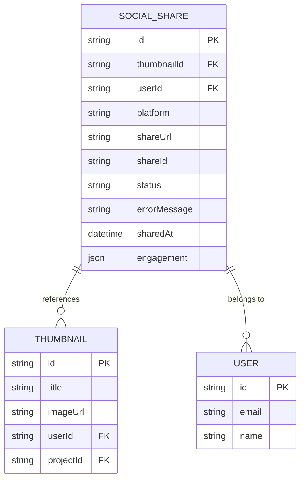
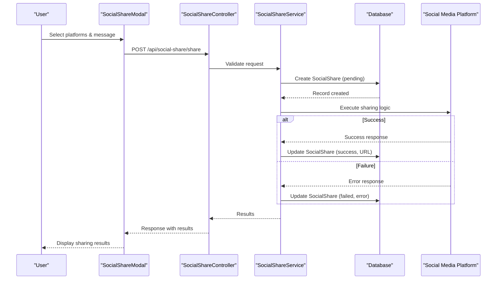
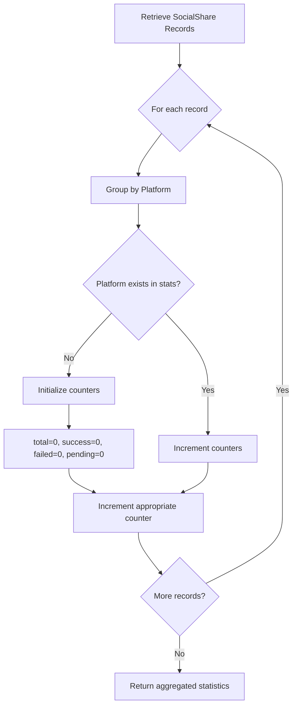
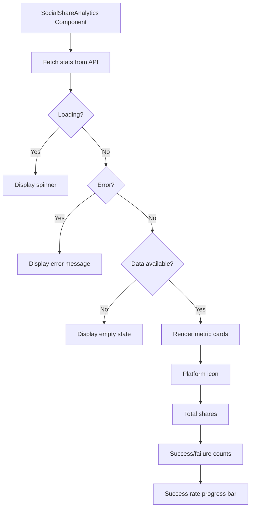
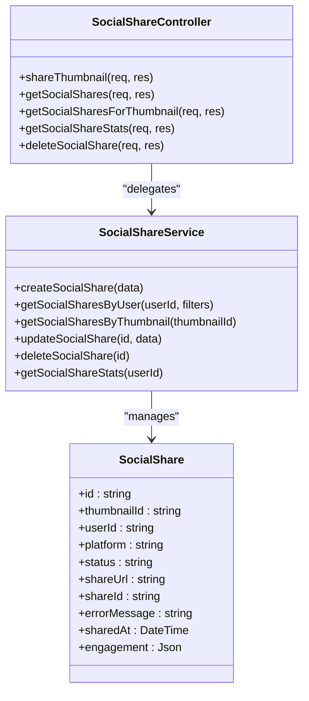

# Social Share Analytics and Tracking

<cite>
**Referenced Files in This Document**  
- [SocialShareAnalytics.tsx](file://pikzels-clone\client\src\components\SocialShareAnalytics.tsx)
- [SocialShareModal.tsx](file://pikzels-clone\client\src\components\SocialShareModal.tsx)
- [social-share.service.ts](file://pikzels-clone\src\modules\social-share\social-share.service.ts)
- [social-share.controller.ts](file://pikzels-clone\src\modules\social-share\social-share.controller.ts)
- [schema.prisma](file://pikzels-clone\prisma\schema.prisma)
- [social-sharing.md](file://pikzels-clone\docs\social-sharing.md)
</cite>

## Table of Contents
1. [Introduction](#introduction)
2. [Social Share Data Model](#social-share-data-model)
3. [Analytics Collection Process](#analytics-collection-process)
4. [Statistical Aggregation](#statistical-aggregation)
5. [Frontend Analytics Display](#frontend-analytics-display)
6. [Data Querying and Retrieval](#data-querying-and-retrieval)
7. [Data Retention and Privacy](#data-retention-and-privacy)
8. [Extending Analytics with Engagement Metrics](#extending-analytics-with-engagement-metrics)
9. [Conclusion](#conclusion)

## Introduction

The Social Share Analytics and Tracking system in the Thumbnail Maker application provides comprehensive insights into user sharing behavior across multiple social media platforms. This system captures detailed information about each sharing attempt, aggregates performance metrics, and presents actionable analytics to users through an intuitive dashboard interface. The architecture spans frontend components, backend services, and database models to create a complete tracking solution that helps users understand which platforms perform best and optimize their content distribution strategy.

**Section sources**
- [social-sharing.md](file://pikzels-clone\docs\social-sharing.md)

## Social Share Data Model

The foundation of the social sharing analytics system is the SocialShare model defined in the Prisma schema. This model captures comprehensive information about each sharing activity, enabling detailed analysis of user behavior and platform performance. The model includes essential fields that track the context, outcome, and metadata of each sharing operation.

Key fields in the SocialShare model include:
- **platform**: Specifies the social media platform (twitter, facebook, linkedin, pinterest) where the thumbnail was shared
- **status**: Records the sharing status (pending, success, failed) to track the outcome of each sharing attempt
- **shareUrl**: Stores the URL of the shared post when successful, enabling direct linking to published content
- **shareId**: Contains the platform-specific identifier for the shared post, useful for API interactions
- **errorMessage**: Captures error details when sharing fails, aiding in troubleshooting and user support
- **sharedAt**: Timestamp of when the share was attempted, critical for time-based analytics and trend analysis
- **engagement**: JSON field for storing platform-specific engagement metrics (likes, shares, comments) when available
- **thumbnailId** and **userId**: Foreign keys that establish relationships with the Thumbnail and User models for ownership and context

The model is properly indexed and related to other core entities, ensuring efficient querying and maintaining referential integrity across the application's data ecosystem.

**Diagram sources**
- [schema.prisma](file://pikzels-clone\prisma\schema.prisma#L120-L142)

**Section sources**
- [schema.prisma](file://pikzels-clone\prisma\schema.prisma#L120-L142)

## Analytics Collection Process

The analytics collection process begins when a user initiates a sharing action through the SocialShareModal component. This frontend component provides a user-friendly interface for selecting platforms and customizing share messages before transmitting the request to the backend. When the user confirms the sharing action, the frontend calls the backend API endpoint, triggering a comprehensive tracking workflow.

On the server side, the SocialShareController handles the shareThumbnail request by first validating the user's authorization and the requested thumbnail's existence and ownership. For each selected platform, the system creates an initial SocialShare record with a "pending" status, establishing a tracking entry before the actual sharing attempt. This approach ensures that all sharing attempts are recorded regardless of their ultimate success or failure.

The sharing process involves platform-specific clients that handle authentication, media upload, and post creation. After each platform operation completes, the system updates the corresponding SocialShare record with the final status ("success" or "failed"), the share URL if successful, and any error messages if the operation failed. This transactional approach to updating share records ensures data consistency and provides a complete audit trail of sharing activities.

**Diagram sources**
- [social-share.controller.ts](file://pikzels-clone\src\modules\social-share\social-share.controller.ts#L16-L100)
- [social-share.service.ts](file://pikzels-clone\src\modules\social-share\social-share.service.ts#L4-L25)
- [SocialShareModal.tsx](file://pikzels-clone\client\src\components\SocialShareModal.tsx#L9-L168)

**Section sources**
- [social-share.controller.ts](file://pikzels-clone\src\modules\social-share\social-share.controller.ts#L16-L100)
- [social-share.service.ts](file://pikzels-clone\src\modules\social-share\social-share.service.ts#L4-L25)
- [SocialShareModal.tsx](file://pikzels-clone\client\src\components\SocialShareModal.tsx#L9-L168)

## Statistical Aggregation

The system provides aggregated analytics through the getSocialShareStats method in the SocialShareService, which compiles sharing performance data into meaningful metrics. This method queries all SocialShare records for a specific user and groups them by platform and status to calculate key performance indicators. The aggregation process transforms raw sharing data into actionable insights that users can leverage to optimize their content distribution strategy.

The statistical aggregation includes metrics such as total shares per platform, successful shares, failed shares, and pending operations. These metrics are calculated by iterating through the query results and maintaining counters for each platform-status combination. The resulting data structure provides a comprehensive overview of sharing performance across different platforms, enabling users to identify which channels are most effective for their content.

The aggregation process is designed for efficiency, retrieving only the necessary fields (platform and status) from the database to minimize query overhead. This optimization ensures that analytics generation remains performant even as the volume of sharing records grows over time. The aggregated statistics are then exposed through the SocialShareController's getSocialShareStats endpoint, making them available to the frontend for display in the analytics dashboard.

**Diagram sources**
- [social-share.service.ts](file://pikzels-clone\src\modules\social-share\social-share.service.ts#L102-L129)
- [social-share.controller.ts](file://pikzels-clone\src\modules\social-share\social-share.controller.ts#L235-L248)

**Section sources**
- [social-share.service.ts](file://pikzels-clone\src\modules\social-share\social-share.service.ts#L102-L129)
- [social-share.controller.ts](file://pikzels-clone\src\modules\social-share\social-share.controller.ts#L235-L248)

## Frontend Analytics Display

The SocialShareAnalytics component renders the aggregated sharing statistics in a visually intuitive dashboard format. This React component fetches data from the /api/social-share/stats endpoint and presents it as a series of metric cards, one for each social media platform. The design emphasizes key performance indicators while providing context through visual elements like progress bars and platform-specific icons.

Each metric card displays the total number of shares, the count of successful shares, and the number of failed attempts for a specific platform. A horizontal progress bar visualizes the success rate by showing the proportion of successful shares relative to the total. This immediate visual feedback helps users quickly assess the performance of each platform without needing to interpret raw numbers.

The component handles various states including loading (displayed as a spinner), error conditions (shown with appropriate messaging), and the empty state when no sharing data is available. The responsive grid layout adapts to different screen sizes, displaying cards in a single column on mobile devices and multiple columns on larger screens. Platform-specific emojis (🐦 for Twitter, 📘 for Facebook, etc.) provide instant visual recognition, enhancing the user experience and making the analytics more engaging.

**Diagram sources**
- [SocialShareAnalytics.tsx](file://pikzels-clone\client\src\components\SocialShareAnalytics.tsx#L13-L148)

**Section sources**
- [SocialShareAnalytics.tsx](file://pikzels-clone\client\src\components\SocialShareAnalytics.tsx#L13-L148)

## Data Querying and Retrieval

The system provides flexible querying capabilities through multiple endpoints that allow retrieval of share history by different criteria. The SocialShareService implements methods for retrieving shares by user, by thumbnail, and by various filter combinations, enabling comprehensive analysis of sharing patterns from multiple perspectives.

The getSocialSharesByUser method supports filtering by platform, status, and thumbnailId, allowing users to drill down into specific aspects of their sharing history. This flexibility enables use cases such as viewing all failed sharing attempts, examining shares for a particular thumbnail, or analyzing performance on a specific platform. The query results include the associated thumbnail data through the include parameter, providing rich context for each sharing record.

Additional retrieval methods include getSocialSharesByThumbnail, which returns all sharing activities for a specific thumbnail, and the controller-level endpoints that expose these capabilities through the API. The ordering of results by sharedAt in descending order ensures that the most recent sharing activities appear first, aligning with user expectations for chronological presentation.

These querying capabilities support both detailed historical analysis and real-time monitoring of sharing performance. The combination of flexible filtering, comprehensive data retrieval, and proper indexing ensures that users can efficiently access the specific sharing data they need for analysis and decision-making.

**Diagram sources**
- [social-share.service.ts](file://pikzels-clone\src\modules\social-share\social-share.service.ts#L4-L130)
- [social-share.controller.ts](file://pikzels-clone\src\modules\social-share\social-share.controller.ts#L16-L281)

**Section sources**
- [social-share.service.ts](file://pikzels-clone\src\modules\social-share\social-share.service.ts#L4-L130)
- [social-share.controller.ts](file://pikzels-clone\src\modules\social-share\social-share.controller.ts#L16-L281)

## Data Retention and Privacy

The social sharing system incorporates privacy considerations through its data model design and access controls. All sharing records are associated with a specific user and thumbnail, and access to this data is protected by authentication and authorization mechanisms. The system ensures that users can only access their own sharing records, maintaining data privacy and preventing unauthorized access to sharing analytics.

Data retention is managed through the application's overall data lifecycle policies, with sharing records preserved to maintain historical analytics. The inclusion of timestamps (sharedAt) enables time-based analysis and supports data retention policies that may require archiving or purging of older records. Error messages are stored to assist with troubleshooting but are handled with care to avoid capturing sensitive information.

The system follows security best practices by storing OAuth tokens securely and never exposing them to the frontend. All API requests require authentication headers, and input validation is performed on all user-provided data to prevent injection attacks. These measures ensure that the analytics system maintains user privacy while providing valuable insights into sharing performance.

**Section sources**
- [social-sharing.md](file://pikzels-clone\docs\social-sharing.md)
- [social-share.controller.ts](file://pikzels-clone\src\modules\social-share\social-share.controller.ts)

## Extending Analytics with Engagement Metrics

The SocialShare model includes an engagement field designed to support extended analytics when platform APIs provide engagement data. This JSON field can store platform-specific metrics such as likes, shares, comments, and other interaction data, enabling more comprehensive performance analysis beyond basic sharing success rates.

To implement engagement tracking, the system would need to periodically query social media platform APIs for updated engagement metrics on previously shared content. These updates could be triggered by scheduled jobs or real-time webhooks when available. The retrieved engagement data would then be stored in the engagement field of the corresponding SocialShare record, preserving a historical record of how content performance evolves over time.

This extensibility allows the analytics system to provide deeper insights into content resonance and audience engagement patterns. By tracking how shares perform over time, users can identify which types of thumbnails generate the most engagement and optimize their content creation strategy accordingly. The flexible JSON structure accommodates different metrics across platforms while maintaining a consistent data model.

**Section sources**
- [schema.prisma](file://pikzels-clone\prisma\schema.prisma#L138)
- [social-sharing.md](file://pikzels-clone\docs\social-sharing.md)

## Conclusion

The Social Share Analytics and Tracking system provides a comprehensive solution for monitoring and analyzing user sharing behavior across multiple social media platforms. By capturing detailed information about each sharing attempt and aggregating it into meaningful metrics, the system empowers users to make data-driven decisions about their content distribution strategy. The architecture effectively combines frontend components, backend services, and database models to create a cohesive analytics experience that highlights successful platforms, identifies issues with failed shares, and reveals patterns in sharing frequency. With its extensible design and privacy-conscious implementation, the system provides valuable insights while maintaining data security and user privacy.