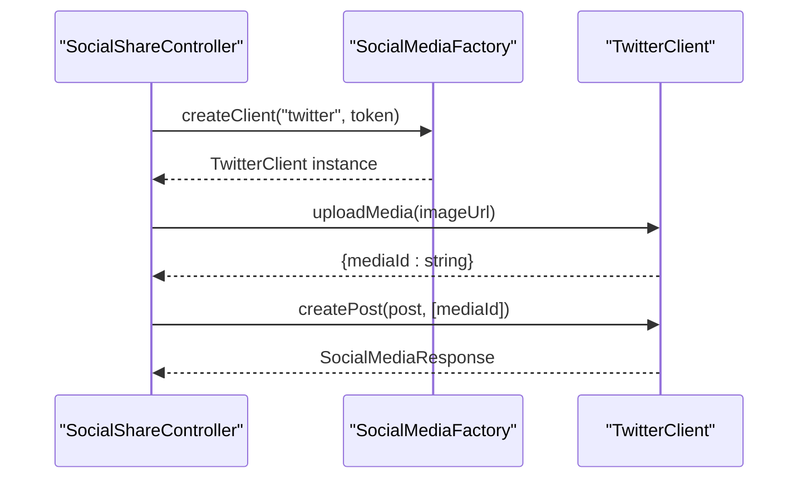
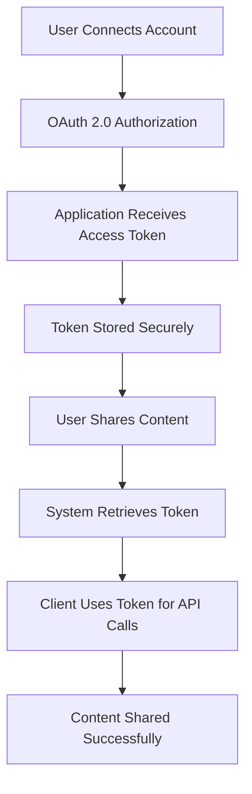
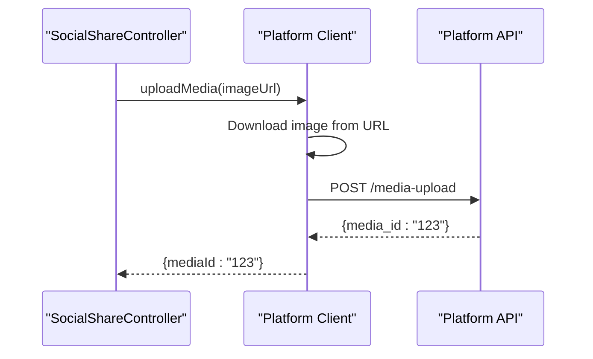
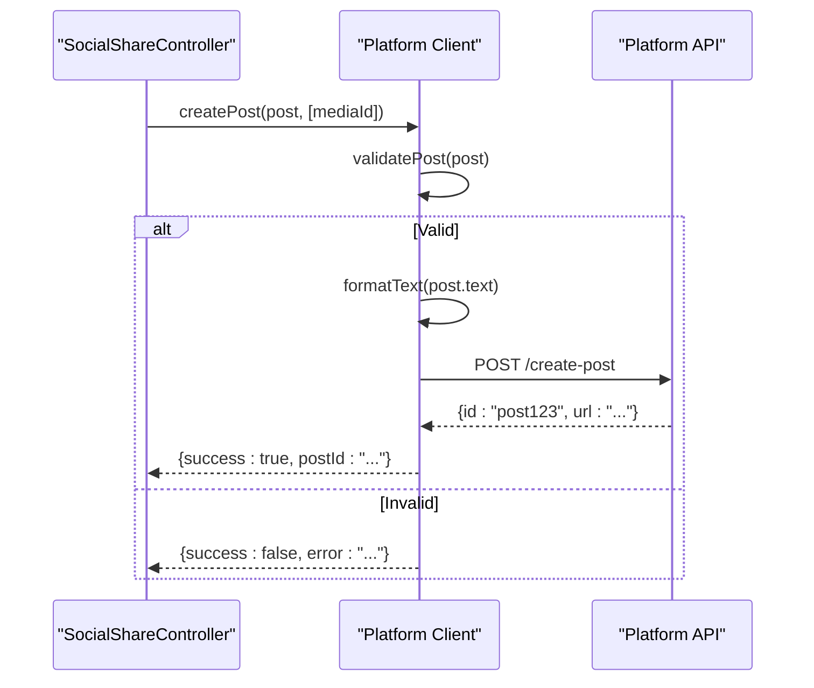
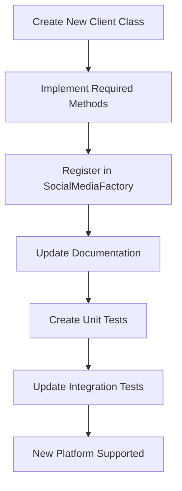
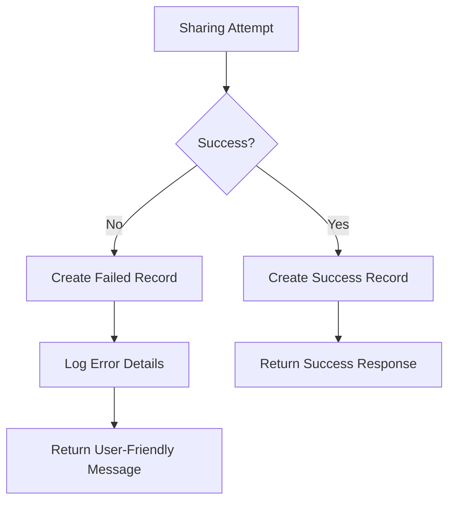

# Supported Social Media Platforms

<cite>
**Referenced Files in This Document**   
- [social-media-client.ts](file://pikzels-clone\src\modules\social-share\social-media-client.ts)
- [social-media-factory.ts](file://pikzels-clone\src\modules\social-share\social-media-factory.ts)
- [twitter-client.ts](file://pikzels-clone\src\modules\social-share\twitter-client.ts)
- [facebook-client.ts](file://pikzels-clone\src\modules\social-share\facebook-client.ts)
- [linkedin-client.ts](file://pikzels-clone\src\modules\social-share\linkedin-client.ts)
- [pinterest-client.ts](file://pikzels-clone\src\modules\social-share\pinterest-client.ts)
- [social-share.controller.ts](file://pikzels-clone\src\modules\social-share\social-share.controller.ts)
- [social-share.service.ts](file://pikzels-clone\src\modules\social-share\social-share.service.ts)
- [social-media-platforms.md](file://pikzels-clone\docs\research\social-media-platforms.md)
</cite>

## Table of Contents
1. [Introduction](#introduction)
2. [Core Architecture](#core-architecture)
3. [Platform-Specific Client Implementations](#platform-specific-client-implementations)
4. [Authentication and Token Handling](#authentication-and-token-handling)
5. [Media Upload and Post Creation](#media-upload-and-post-creation)
6. [Platform Comparison](#platform-comparison)
7. [Extending to Additional Platforms](#extending-to-additional-platforms)
8. [Error Handling and Debugging](#error-handling-and-debugging)
9. [Conclusion](#conclusion)

## Introduction

The Pikzels Thumbnail Maker Studio supports integration with four major social media platforms: Twitter (X), Facebook, LinkedIn, and Pinterest. This document details the implementation of platform-specific clients that adhere to a common interface, enabling consistent social sharing functionality across different platforms. The system is designed with extensibility in mind, allowing for the addition of new platforms through standardized implementation patterns.

**Section sources**
- [social-media-platforms.md](file://pikzels-clone\docs\research\social-media-platforms.md#L1-L20)

## Core Architecture

The social media sharing system follows a clean architectural pattern based on the Strategy and Factory design patterns. At the core of this architecture is the `SocialMediaClient` interface, which defines the contract that all platform-specific clients must implement. The `SocialMediaFactory` class provides a centralized mechanism for creating client instances based on the requested platform.

```mermaid
classDiagram
class SocialMediaClient {
<<abstract>>
+accessToken : string
+constructor(accessToken : string)
+uploadMedia(imageUrl : string) : Promise<{mediaId : string} | {error : string}>
+createPost(post : SocialMediaPost, mediaIds? : string[]) : Promise<SocialMediaResponse>
+getEngagement(postId : string) : Promise<any>
+validatePost(post : SocialMediaPost) : {valid : boolean, errors : string[]}
}
class SocialMediaFactory {
+createClient(platform : string, accessToken : string) : SocialMediaClient
}
class TwitterClient {
+API_BASE_URL : string
+MAX_TWEET_LENGTH : number
+uploadMedia(imageUrl : string) : Promise<{mediaId : string} | {error : string}>
+createPost(post : SocialMediaPost, mediaIds? : string[]) : Promise<SocialMediaResponse>
+getEngagement(postId : string) : Promise<any>
+validatePost(post : SocialMediaPost) : {valid : boolean, errors : string[]}
}
class FacebookClient {
+API_BASE_URL : string
+MAX_POST_LENGTH : number
+uploadMedia(imageUrl : string) : Promise<{mediaId : string} | {error : string}>
+createPost(post : SocialMediaPost, mediaIds? : string[]) : Promise<SocialMediaResponse>
+getEngagement(postId : string) : Promise<any>
+validatePost(post : SocialMediaPost) : {valid : boolean, errors : string[]}
}
class LinkedInClient {
+API_BASE_URL : string
+MAX_POST_LENGTH : number
+uploadMedia(imageUrl : string) : Promise<{mediaId : string} | {error : string}>
+createPost(post : SocialMediaPost, mediaIds? : string[]) : Promise<SocialMediaResponse>
+getEngagement(postId : string) : Promise<any>
+validatePost(post : SocialMediaPost) : {valid : boolean, errors : string[]}
}
class PinterestClient {
+API_BASE_URL : string
+MAX_DESCRIPTION_LENGTH : number
+uploadMedia(imageUrl : string) : Promise<{mediaId : string} | {error : string}>
+createPost(post : SocialMediaPost, mediaIds? : string[]) : Promise<SocialMediaResponse>
+getEngagement(postId : string) : Promise<any>
+validatePost(post : SocialMediaPost) : {valid : boolean, errors : string[]}
}
SocialMediaClient <|-- TwitterClient
SocialMediaClient <|-- FacebookClient
SocialMediaClient <|-- LinkedInClient
SocialMediaClient <|-- PinterestClient
SocialMediaFactory --> TwitterClient : "creates"
SocialMediaFactory --> FacebookClient : "creates"
SocialMediaFactory --> LinkedInClient : "creates"
SocialMediaFactory --> PinterestClient : "creates"
```

**Diagram sources**
- [social-media-client.ts](file://pikzels-clone\src\modules\social-share\social-media-client.ts#L14-L68)
- [social-media-factory.ts](file://pikzels-clone\src\modules\social-share\social-media-factory.ts#L6-L25)

**Section sources**
- [social-media-client.ts](file://pikzels-clone\src\modules\social-share\social-media-client.ts#L1-L68)
- [social-media-factory.ts](file://pikzels-clone\src\modules\social-share\social-media-factory.ts#L1-L25)

## Platform-Specific Client Implementations

### Twitter Client Implementation

The `TwitterClient` class implements the `SocialMediaClient` interface for Twitter (X) platform integration. It adheres to Twitter's API v2 requirements and limitations, particularly the 280-character limit for tweets. The client handles media uploads and post creation through Twitter's API endpoints.

Key features of the Twitter client:
- Enforces Twitter's 280-character limit for tweet text
- Validates that tweets contain either text or an image
- Formats text specifically for Twitter's display requirements
- Returns engagement metrics including likes, retweets, replies, and views



**Diagram sources**
- [twitter-client.ts](file://pikzels-clone\src\modules\social-share\twitter-client.ts#L6-L128)
- [social-share.controller.ts](file://pikzels-clone\src\modules\social-share\social-share.controller.ts#L86-L89)

**Section sources**
- [twitter-client.ts](file://pikzels-clone\src\modules\social-share\twitter-client.ts#L6-L128)

### Facebook Client Implementation

The `FacebookClient` class provides integration with Facebook through the Graph API v18.0. Facebook has one of the most generous text limits among social platforms, allowing posts up to 63,206 characters. The client is designed to handle Facebook's extensive feature set while maintaining simplicity for the core sharing functionality.

Key features of the Facebook client:
- Supports Facebook's high character limit (63,206 characters)
- Validates that posts contain either text or an image
- Formats text for Facebook's display requirements
- Returns engagement metrics including likes, shares, comments, and views

**Section sources**
- [facebook-client.ts](file://pikzels-clone\src\modules\social-share\facebook-client.ts#L6-L130)

### LinkedIn Client Implementation

The `LinkedInClient` class enables integration with LinkedIn's professional networking platform. LinkedIn is particularly relevant for content creators and professionals sharing thumbnails of their work. The client adheres to LinkedIn's API v2 requirements and content guidelines.

Key features of the LinkedIn client:
- Enforces LinkedIn's 3,000-character limit for posts
- Validates that posts contain either text or an image
- Formats text specifically for LinkedIn's professional context
- Returns engagement metrics including likes, comments, shares, and impressions

**Section sources**
- [linkedin-client.ts](file://pikzels-clone\src\modules\social-share\linkedin-client.ts#L6-L130)

### Pinterest Client Implementation

The `PinterestClient` class provides integration with Pinterest, a platform focused on visual content discovery and saving. Pinterest is particularly relevant for thumbnail sharing due to its image-centric nature. The client implements Pinterest's API v5 requirements and limitations.

Key features of the Pinterest client:
- Enforces Pinterest's 500-character limit for pin descriptions
- Requires images for all pins (mandatory image requirement)
- Validates that pins contain either a description or an image
- Returns engagement metrics including saves, clicks, impressions, and closeups

**Section sources**
- [pinterest-client.ts](file://pikzels-clone\src\modules\social-share\pinterest-client.ts#L6-L136)

## Authentication and Token Handling

All social media platforms supported by the Pikzels Thumbnail Maker Studio use OAuth 2.0 for authentication, providing a secure and standardized approach to user authorization. The system is designed to handle authentication tokens securely and efficiently.

The authentication flow follows these steps:
1. Users connect their social media accounts through the application's settings
2. The application obtains access tokens through OAuth 2.0 authorization
3. Tokens are securely stored in the user's account settings
4. When sharing content, the system retrieves the appropriate token for each platform
5. Tokens are passed to the respective client instances for API authentication

The current implementation uses a simple token storage approach in the `userTokens` object within the `SocialShareController`. In a production environment, tokens should be encrypted and stored securely in the database, with appropriate refresh mechanisms for expired tokens.



**Diagram sources**
- [social-media-platforms.md](file://pikzels-clone\docs\research\social-media-platforms.md#L80-L95)
- [social-share.controller.ts](file://pikzels-clone\src\modules\social-share\social-share.controller.ts#L100-L120)

**Section sources**
- [social-media-platforms.md](file://pikzels-clone\docs\research\social-media-platforms.md#L70-L100)
- [social-share.controller.ts](file://pikzels-clone\src\modules\social-share\social-share.controller.ts#L100-L120)

## Media Upload and Post Creation

### Media Upload Process

The media upload process is standardized across all platform clients through the `uploadMedia` method defined in the `SocialMediaClient` interface. Each platform-specific client implements this method according to its API requirements.

The general media upload workflow:
1. The client receives an image URL from the thumbnail service
2. The image is downloaded from the URL
3. The image is uploaded to the platform's media endpoint
4. The platform returns a media ID
5. The media ID is returned to the calling service



**Diagram sources**
- [twitter-client.ts](file://pikzels-clone\src\modules\social-share\twitter-client.ts#L20-L35)
- [facebook-client.ts](file://pikzels-clone\src\modules\social-share\facebook-client.ts#L20-L35)

**Section sources**
- [twitter-client.ts](file://pikzels-clone\src\modules\social-share\twitter-client.ts#L20-L35)
- [facebook-client.ts](file://pikzels-clone\src\modules\social-share\facebook-client.ts#L20-L35)
- [linkedin-client.ts](file://pikzels-clone\src\modules\social-share\linkedin-client.ts#L20-L35)
- [pinterest-client.ts](file://pikzels-clone\src\modules\social-share\pinterest-client.ts#L20-L35)

### Post Creation Process

The post creation process follows a consistent pattern across all platforms, implemented through the `createPost` method. This method handles both text content and media attachments, creating a complete social media post.

The post creation workflow:
1. The post content is validated according to platform-specific rules
2. Text is formatted to meet platform requirements (character limits, etc.)
3. The post is created using the platform's API with the media ID
4. The response is returned with success status and post details



**Diagram sources**
- [twitter-client.ts](file://pikzels-clone\src\modules\social-share\twitter-client.ts#L40-L75)
- [social-share.controller.ts](file://pikzels-clone\src\modules\social-share\social-share.controller.ts#L150-L200)

**Section sources**
- [twitter-client.ts](file://pikzels-clone\src\modules\social-share\twitter-client.ts#L40-L75)
- [facebook-client.ts](file://pikzels-clone\src\modules\social-share\facebook-client.ts#L40-L75)
- [linkedin-client.ts](file://pikzels-clone\src\modules\social-share\linkedin-client.ts#L40-L75)
- [pinterest-client.ts](file://pikzels-clone\src\modules\social-share\pinterest-client.ts#L40-L75)

## Platform Comparison

The following table compares key characteristics of the supported social media platforms:

| Platform | API Endpoint | Character Limit | Image Requirement | Rate Limits | Engagement Metrics |
|----------|--------------|-----------------|-------------------|-------------|-------------------|
| Twitter | https://api.twitter.com/2 | 280 characters | Optional | Tier-based (100-500 posts/month) | Likes, Retweets, Replies, Views |
| Facebook | https://graph.facebook.com/v18.0 | 63,206 characters | Optional | App quality-based | Likes, Shares, Comments, Views |
| LinkedIn | https://api.linkedin.com/v2 | 3,000 characters | Optional | Strict approval process | Likes, Comments, Shares, Impressions |
| Pinterest | https://api.pinterest.com/v5 | 500 characters | Required | Approval required | Saves, Clicks, Impressions, Closeups |

**Section sources**
- [social-media-platforms.md](file://pikzels-clone\docs\research\social-media-platforms.md#L25-L75)
- [twitter-client.ts](file://pikzels-clone\src\modules\social-share\twitter-client.ts#L10-L15)
- [facebook-client.ts](file://pikzels-clone\src\modules\social-share\facebook-client.ts#L10-L15)
- [linkedin-client.ts](file://pikzels-clone\src\modules\social-share\linkedin-client.ts#L10-L15)
- [pinterest-client.ts](file://pikzels-clone\src\modules\social-share\pinterest-client.ts#L10-L15)

## Extending to Additional Platforms

The architecture is designed to be extensible, allowing for the addition of new social media platforms by implementing the `SocialMediaClient` interface and registering the new client in the `SocialMediaFactory`.

### Steps to Add a New Platform

1. **Create a new client class** that extends `SocialMediaClient`:
   - Implement the `uploadMedia` method according to the platform's API
   - Implement the `createPost` method with platform-specific formatting
   - Implement the `getEngagement` method to retrieve platform metrics
   - Override the `validatePost` method with platform-specific rules

2. **Register the client in SocialMediaFactory**:
   - Add a new case statement in the `createClient` method
   - Map the platform name to the new client class
   - Ensure the platform name is handled in lowercase for consistency

3. **Update documentation and tests**:
   - Add documentation for the new platform in the research directory
   - Create unit tests for the new client implementation
   - Update integration tests to include the new platform



**Diagram sources**
- [social-media-client.ts](file://pikzels-clone\src\modules\social-share\social-media-client.ts#L14-L68)
- [social-media-factory.ts](file://pikzels-clone\src\modules\social-share\social-media-factory.ts#L7-L24)

**Section sources**
- [social-media-client.ts](file://pikzels-clone\src\modules\social-share\social-media-client.ts#L14-L68)
- [social-media-factory.ts](file://pikzels-clone\src\modules\social-share\social-media-factory.ts#L7-L24)

## Error Handling and Debugging

The system implements comprehensive error handling at multiple levels to ensure robust operation and provide meaningful feedback to users.

### Platform-Specific Error Handling

Each platform client includes error handling in its asynchronous methods:

- **Media upload errors**: Catch network issues, authentication failures, and file format problems
- **Post creation errors**: Handle validation failures, rate limiting, and content policy violations
- **Engagement retrieval errors**: Manage API timeouts and data access issues

The error handling follows a consistent pattern:
1. Wrap API calls in try-catch blocks
2. Return structured error objects with descriptive messages
3. Log errors for debugging purposes
4. Provide user-friendly error messages

### Debugging Strategies

When troubleshooting issues with social media integration, consider the following approaches:

1. **Check authentication tokens**: Verify that access tokens are valid and have not expired
2. **Review API rate limits**: Monitor usage against platform-specific rate limits
3. **Validate media requirements**: Ensure images meet size, format, and aspect ratio requirements
4. **Examine error logs**: Review server logs for detailed error information
5. **Test with mock responses**: Use the existing mock implementations to isolate issues

The `SocialShareController` implements a comprehensive error handling workflow that creates records in the database for both successful and failed sharing attempts, enabling detailed tracking and analysis.



**Diagram sources**
- [social-share.controller.ts](file://pikzels-clone\src\modules\social-share\social-share.controller.ts#L130-L250)
- [social-share.service.ts](file://pikzels-clone\src\modules\social-share\social-share.service.ts#L10-L30)

**Section sources**
- [twitter-client.ts](file://pikzels-clone\src\modules\social-share\twitter-client.ts#L25-L35)
- [facebook-client.ts](file://pikzels-clone\src\modules\social-share\facebook-client.ts#L25-L35)
- [linkedin-client.ts](file://pikzels-clone\src\modules\social-share\linkedin-client.ts#L25-L35)
- [pinterest-client.ts](file://pikzels-clone\src\modules\social-share\pinterest-client.ts#L25-L35)
- [social-share.controller.ts](file://pikzels-clone\src\modules\social-share\social-share.controller.ts#L130-L250)

## Conclusion

The social media integration system in the Pikzels Thumbnail Maker Studio provides a robust, extensible framework for sharing thumbnails across multiple platforms. By implementing a consistent interface and factory pattern, the system ensures maintainable code while accommodating platform-specific requirements. The current implementation supports Twitter, Facebook, LinkedIn, and Pinterest, with clear pathways for adding additional platforms in the future. Comprehensive error handling and debugging strategies ensure reliable operation, while the modular architecture allows for easy maintenance and enhancement of the sharing functionality.