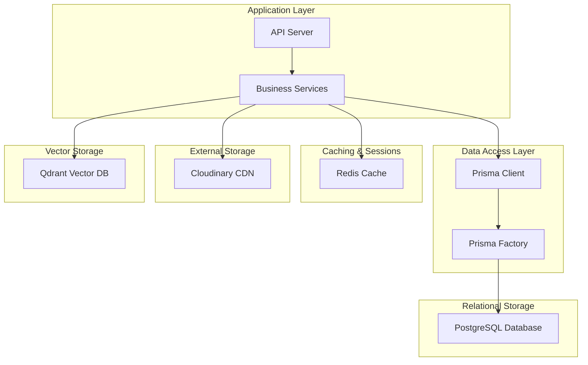
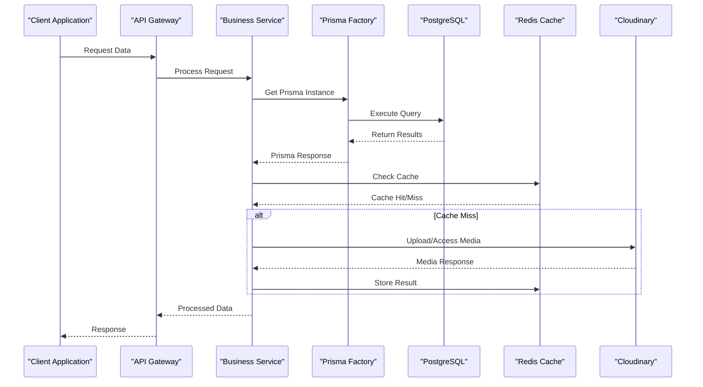
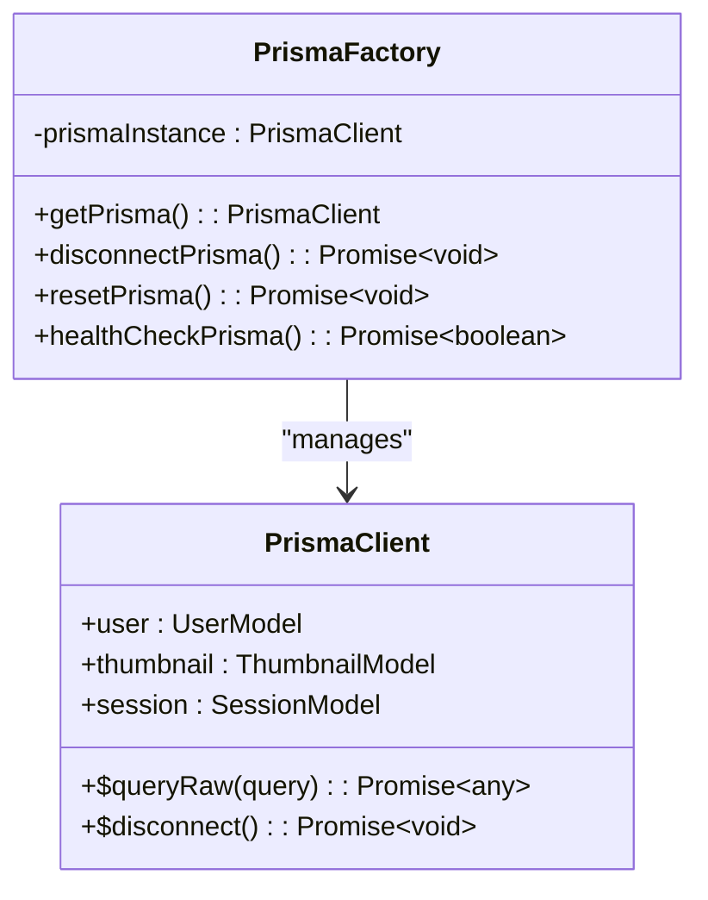
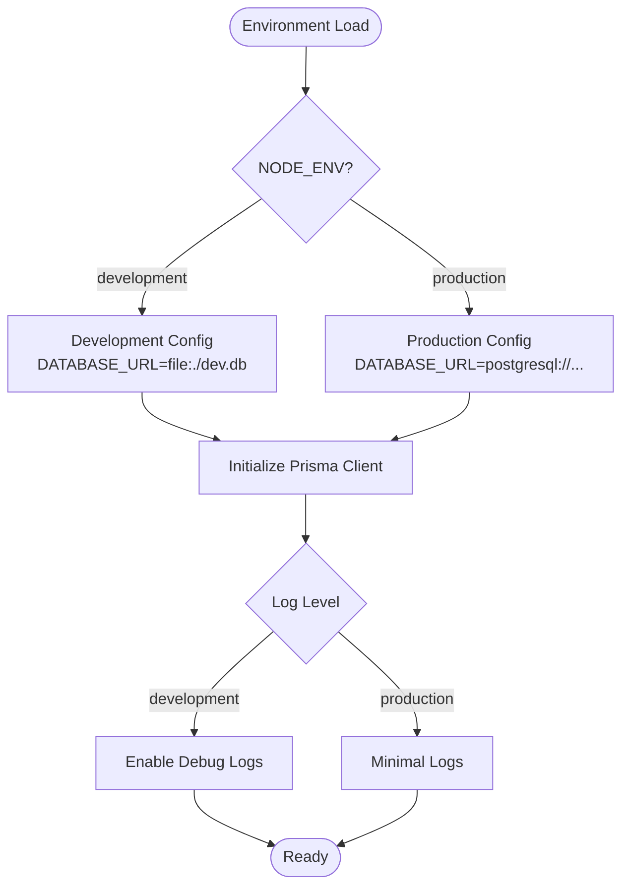
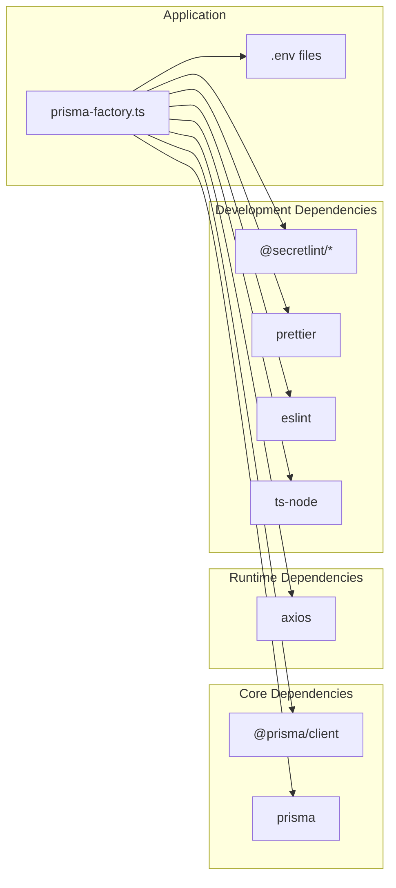

# Storage System

<cite>
**Referenced Files in This Document**
- [package.json](file://package.json)
- [.env](file://pikzels-clone/.env)
- [.env.example](file://pikzels-clone/.env.example)
- [prisma-factory.ts](file://pikzels-clone/src/utils/prisma-factory.ts)
</cite>

## Table of Contents
1. [Introduction](#introduction)
2. [Project Structure](#project-structure)
3. [Core Components](#core-components)
4. [Architecture Overview](#architecture-overview)
5. [Detailed Component Analysis](#detailed-component-analysis)
6. [Dependency Analysis](#dependency-analysis)
7. [Performance Considerations](#performance-considerations)
8. [Troubleshooting Guide](#troubleshooting-guide)
9. [Conclusion](#conclusion)

## Introduction
This document provides a comprehensive overview of the storage system used in the Thumbnail Maker project. The system combines PostgreSQL for relational data persistence with Redis for caching and session management, while leveraging Prisma as the ORM/ODM abstraction layer. Additionally, the project integrates external cloud storage services (Cloudinary) for media asset management and includes vector database capabilities (Qdrant) for visual search functionality.

## Project Structure
The storage system spans multiple technologies and environments:
- Relational database: PostgreSQL with Prisma ORM
- Caching and sessions: Redis
- Media storage: Cloudinary (external cloud storage)
- Vector database: Qdrant (local or cloud)
- Environment configuration: .env files for development and production

**Diagram sources**
- [prisma-factory.ts](file://pikzels-clone/src/utils/prisma-factory.ts#L1-L109)
- [.env](file://pikzels-clone/.env#L5-L24)
- [.env.example](file://pikzels-clone/.env.example#L101-L128)

**Section sources**
- [package.json](file://package.json#L11-L25)
- [.env](file://pikzels-clone/.env#L5-L24)
- [.env.example](file://pikzels-clone/.env.example#L101-L128)

## Core Components
The storage system consists of several interconnected components that work together to provide robust data persistence and retrieval capabilities.

### Database Configuration
The project uses PostgreSQL as the primary relational database, configured through Prisma. The database connection is managed through environment variables and a centralized factory pattern.

### Caching and Sessions
Redis serves dual purposes: caching frequently accessed data and managing user sessions. The configuration supports both local development and production deployment scenarios.

### Media Storage
Cloudinary integration enables scalable image storage and delivery with built-in transformations and CDN capabilities. The system supports both single URL configuration and individual credential setup.

### Vector Database
Qdrant provides vector similarity search capabilities for visual content discovery and recommendation systems.

**Section sources**
- [.env](file://pikzels-clone/.env#L5-L24)
- [.env.example](file://pikzels-clone/.env.example#L101-L128)
- [prisma-factory.ts](file://pikzels-clone/src/utils/prisma-factory.ts#L1-L109)

## Architecture Overview
The storage architecture follows a layered approach with clear separation of concerns between data access, caching, and external services.

**Diagram sources**
- [prisma-factory.ts](file://pikzels-clone/src/utils/prisma-factory.ts#L41-L55)
- [.env](file://pikzels-clone/.env#L5-L24)

## Detailed Component Analysis

### Prisma Client Management
The Prisma factory implements a singleton pattern to manage database connections efficiently across the application.

**Diagram sources**
- [prisma-factory.ts](file://pikzels-clone/src/utils/prisma-factory.ts#L26-L55)

Key features of the Prisma factory include:
- Singleton pattern implementation for connection pooling
- Automatic cleanup on process exit
- Health check capabilities for monitoring
- Support for testing environments with reset functionality

**Section sources**
- [prisma-factory.ts](file://pikzels-clone/src/utils/prisma-factory.ts#L1-L109)

### Database Configuration Management
The system uses environment-based configuration for database connectivity with support for both development and production environments.

**Diagram sources**
- [.env](file://pikzels-clone/.env#L62-L6)
- [prisma-factory.ts](file://pikzels-clone/src/utils/prisma-factory.ts#L44-L46)

**Section sources**
- [.env](file://pikzels-clone/.env#L5-L8)
- [.env.example](file://pikzels-clone/.env.example#L5-L7)
- [prisma-factory.ts](file://pikzels-clone/src/utils/prisma-factory.ts#L41-L55)

### Redis Integration
Redis configuration supports flexible deployment scenarios with customizable ports and security settings.

**Section sources**
- [.env](file://pikzels-clone/.env#L19-L24)
- [.env.example](file://pikzels-clone/.env.example#L34-L39)

### Cloudinary Configuration
Cloudinary provides comprehensive media management capabilities with support for both single URL and individual credential configurations.

**Section sources**
- [.env](file://pikzels-clone/.env#L84-L106)
- [.env.example](file://pikzels-clone/.env.example#L101-L118)

### Qdrant Vector Database
Qdrant integration supports both local development and cloud deployment scenarios with flexible configuration options.

**Section sources**
- [.env](file://pikzels-clone/.env#L102-L103)
- [.env.example](file://pikzels-clone/.env.example#L202-L214)

## Dependency Analysis
The storage system has clear dependency relationships that support maintainability and scalability.

**Diagram sources**
- [package.json](file://package.json#L11-L37)
- [prisma-factory.ts](file://pikzels-clone/src/utils/prisma-factory.ts#L24-L24)

**Section sources**
- [package.json](file://package.json#L11-L37)

## Performance Considerations
The storage system incorporates several performance optimization strategies:

### Connection Pool Management
- Singleton Prisma client prevents connection pool exhaustion
- Automatic cleanup on process termination
- Graceful shutdown handling

### Caching Strategy
- Redis caching for frequently accessed data
- Configurable cache invalidation policies
- Support for both in-memory and distributed caching

### Media Optimization
- Cloudinary CDN for global content delivery
- Built-in image transformations and optimizations
- Ephemeral upload support for temporary content

## Troubleshooting Guide

### Database Connectivity Issues
Common database connection problems and solutions:
- Verify DATABASE_URL format and credentials
- Check PostgreSQL server availability
- Review Prisma client initialization logs
- Validate environment variable configuration

### Redis Connection Problems
- Confirm Redis server is running on specified port
- Verify connection credentials and authentication
- Check firewall settings and network connectivity
- Monitor Redis memory usage and eviction policies

### Cloudinary Integration Issues
- Validate Cloudinary credentials and account configuration
- Check API rate limits and quotas
- Verify image upload permissions and folder access
- Monitor CDN delivery status and caching behavior

### Performance Monitoring
- Enable Prisma query logging in development
- Monitor database query performance and optimization
- Track Redis hit rates and cache effectiveness
- Observe Cloudinary delivery metrics and response times

**Section sources**
- [prisma-factory.ts](file://pikzels-clone/src/utils/prisma-factory.ts#L96-L105)
- [.env](file://pikzels-clone/.env#L71-L75)

## Conclusion
The Thumbnail Maker storage system provides a robust, scalable foundation for modern web applications. The combination of PostgreSQL with Prisma ORM, Redis caching, Cloudinary media management, and Qdrant vector database creates a comprehensive data persistence solution. The centralized Prisma factory pattern ensures efficient resource management and clean separation of concerns. With proper configuration and monitoring, this system can support both development and production environments effectively.