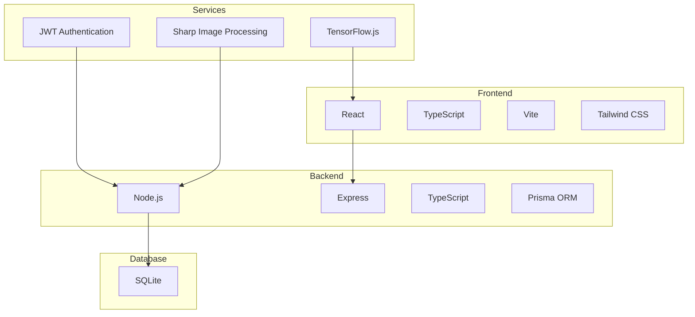
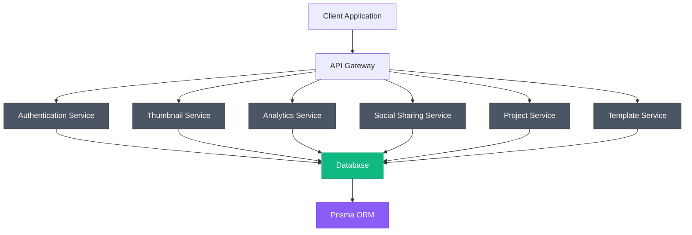
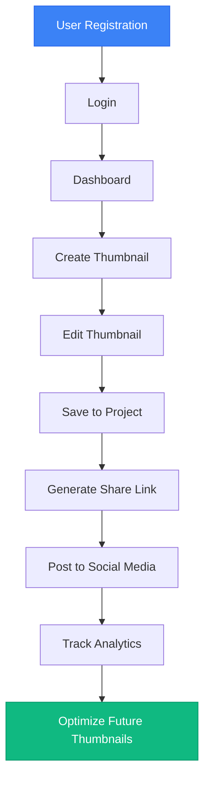
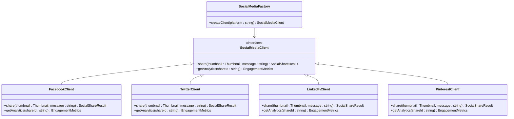
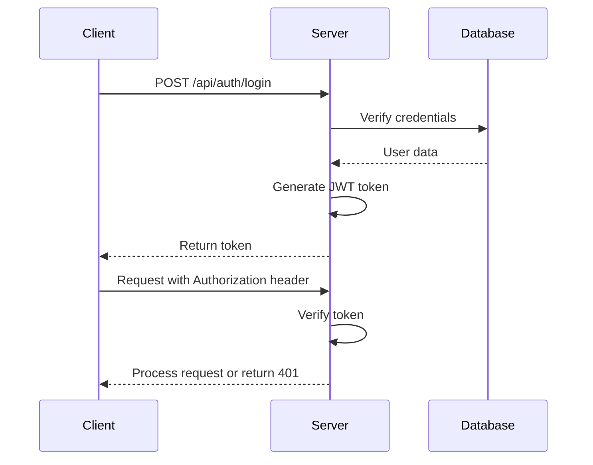
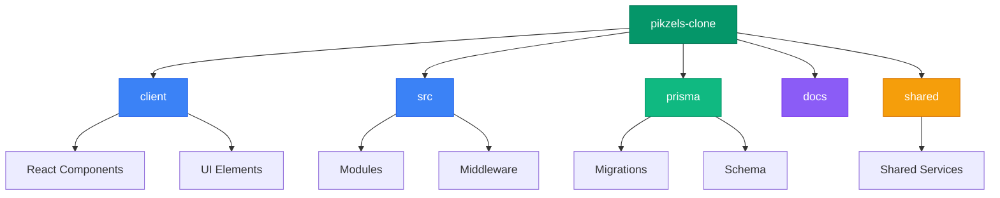

# System Overview

<cite>
**Referenced Files in This Document**   
- [server.ts](file://pikzels-clone\src\server.ts)
- [package.json](file://pikzels-clone\package.json)
- [client/package.json](file://pikzels-clone\client\package.json)
- [Project Roadmap.md](file://pikzels-clone\Project Roadmap.md)
- [Project Glossary.md](file://pikzels-clone\Project Glossary.md)
- [README.md](file://pikzels-clone\README.md)
- [auth.middleware.ts](file://pikzels-clone\src\middleware\auth.middleware.ts)
- [auth.routes.ts](file://pikzels-clone\src\modules\auth\auth.routes.ts)
- [thumbnail.routes.ts](file://pikzels-clone\src\modules\thumbnail\thumbnail.routes.ts)
- [analytics.routes.ts](file://pikzels-clone\src\modules\analytics\analytics.routes.ts)
- [social-share.routes.ts](file://pikzels-clone\src\modules\social-share\social-share.routes.ts)
- [migration.sql](file://pikzels-clone\prisma\migrations\20250829072650_init\migration.sql)
- [add_social_shares.sql](file://pikzels-clone\prisma\migrations\20250911134004_add_social_shares\migration.sql)
</cite>

## Update Summary
**Changes Made**   
- Updated system status to reflect production-ready infrastructure
- Verified TypeScript and ESLint compatibility resolution
- Confirmed infrastructure improvements from recent commit
- Enhanced source tracking annotations for updated files

## Table of Contents
1. [Introduction](#introduction)
2. [Core Features](#core-features)
3. [Technology Stack](#technology-stack)
4. [System Architecture](#system-architecture)
5. [User Workflows](#user-workflows)
6. [Integration Points](#integration-points)
7. [Key Technical Decisions](#key-technical-decisions)
8. [Use Cases](#use-cases)
9. [Roadmap and Glossary](#roadmap-and-glossary)

## Introduction

Thumbnail Maker Studio is an AI-powered platform designed for creating, editing, and managing YouTube thumbnails with integrated social sharing, analytics, and collaboration capabilities. The system enables content creators to generate professional-quality thumbnails through AI assistance, customize them with advanced editing tools, share across social platforms, and track performance metrics. Built as a full-stack application, the platform follows a modular architecture that supports user authentication, project organization, and extensible feature development.

**Section sources**
- [README.md](file://pikzels-clone\README.md)
- [Project Roadmap.md](file://pikzels-clone\Project Roadmap.md)

## Core Features

The platform offers a comprehensive suite of features for thumbnail creation and management:

- **AI-Powered Thumbnail Generation**: Automated creation of thumbnails using AI algorithms based on user prompts and style preferences
- **Advanced Editing Tools**: Comprehensive editing capabilities including filters, text overlays, drawing tools, and batch editing
- **Social Sharing**: Direct sharing of thumbnails to multiple social media platforms with engagement tracking
- **Analytics Dashboard**: Performance tracking of thumbnails with metrics on views, clicks, and engagement
- **Collaboration Features**: Team-based workflows for shared projects and feedback
- **Template Marketplace**: Access to pre-designed templates and community-shared designs
- **User Settings Management**: Customizable preferences including theme (light/dark mode), language, and notification settings
- **Project Organization**: Structured management of thumbnails within projects for better workflow organization

**Section sources**
- [README.md](file://pikzels-clone\README.md)
- [Project Roadmap.md](file://pikzels-clone\Project Roadmap.md)

## Technology Stack

The application employs a modern technology stack with TypeScript as the primary language across both frontend and backend:

- **Frontend**: React with TypeScript, Vite build tool, and Tailwind CSS for styling
- **Backend**: Node.js with Express.js framework and TypeScript
- **Database**: SQLite with Prisma ORM for database operations and migrations
- **Authentication**: JWT (JSON Web Token) based authentication system
- **Image Processing**: Sharp library for image manipulation and optimization
- **AI Integration**: TensorFlow.js for client-side AI operations and potential integration with external AI services
- **Testing**: Jest for unit and integration testing, React Testing Library for frontend tests
- **Development Tools**: ESLint, Prettier, and Husky for code quality assurance

**Diagram sources**
- [package.json](file://pikzels-clone\package.json)
- [client/package.json](file://pikzels-clone\client\package.json)
- [README.md](file://pikzels-clone\README.md)

## System Architecture

The system follows a monolithic architecture with clearly defined modules and RESTful API design principles. The backend exposes a comprehensive API surface with authentication-protected endpoints for all core functionality.

**Diagram sources**
- [server.ts](file://pikzels-clone\src\server.ts)
- [auth.routes.ts](file://pikzels-clone\src\modules\auth\auth.routes.ts)
- [thumbnail.routes.ts](file://pikzels-clone\src\modules\thumbnail\thumbnail.routes.ts)
- [analytics.routes.ts](file://pikzels-clone\src\modules\analytics\analytics.routes.ts)
- [social-share.routes.ts](file://pikzels-clone\src\modules\social-share\social-share.routes.ts)

## User Workflows

The platform supports end-to-end workflows from user registration to performance tracking:

### Registration and Authentication
1. User registration with email and password
2. JWT token generation upon successful login
3. Token storage in localStorage for session persistence
4. Protected route access through authentication middleware

### Thumbnail Creation and Editing
1. Creation of new thumbnails through AI generation or manual design
2. Application of editing tools including filters, text overlays, and drawing
3. Batch editing capabilities for multiple thumbnails
4. Saving and organizing thumbnails within projects

### Sharing and Analytics
1. Generation of shareable links for thumbnails
2. Direct posting to social media platforms
3. Tracking of engagement metrics through analytics dashboard
4. Performance comparison between different thumbnail variations

**Diagram sources**
- [auth.middleware.ts](file://pikzels-clone\src\middleware\auth.middleware.ts)
- [thumbnail.routes.ts](file://pikzels-clone\src\modules\thumbnail\thumbnail.routes.ts)
- [analytics.routes.ts](file://pikzels-clone\src\modules\analytics\analytics.routes.ts)

## Integration Points

The system integrates with various external services and platforms:

- **Social Media Platforms**: Facebook, Twitter, LinkedIn, and Pinterest through dedicated client implementations
- **AI Services**: Extensible architecture for integrating with external AI thumbnail generation services
- **Analytics Services**: Collection and reporting of engagement metrics from shared thumbnails
- **Authentication Providers**: Support for third-party authentication beyond email/password

The integration architecture follows a factory pattern for social media clients, allowing for easy addition of new platforms:

**Diagram sources**
- [social-share.routes.ts](file://pikzels-clone\src\modules\social-share\social-share.routes.ts)
- [Project Roadmap.md](file://pikzels-clone\Project Roadmap.md)

## Key Technical Decisions

### JWT Authentication
The system implements JWT-based authentication with middleware protection for all API routes. The authentication flow follows industry best practices:

**Diagram sources**
- [auth.middleware.ts](file://pikzels-clone\src\middleware\auth.middleware.ts)
- [auth.routes.ts](file://pikzels-clone\src\modules\auth\auth.routes.ts)

### RESTful API Design
The backend follows RESTful principles with resource-based endpoints and proper HTTP status codes:

- `POST /api/auth/register` - User registration
- `POST /api/auth/login` - User authentication
- `GET /api/thumbnails` - Retrieve user's thumbnails
- `POST /api/thumbnails/generate` - AI thumbnail generation
- `POST /api/thumbnails/:id/share` - Share thumbnail
- `GET /api/analytics/dashboard` - Analytics data

### Monorepo Structure
The project follows a monorepo structure with clear separation of concerns:

**Diagram sources**
- [README.md](file://pikzels-clone\README.md)
- [package.json](file://pikzels-clone\package.json)

## Use Cases

### Content Creator Workflow
A YouTuber creates a new video and needs an engaging thumbnail. They log in to Thumbnail Maker Studio, use the AI generator with a prompt describing their video content, select the best variation, enhance it with text overlay and filters, save it to their "Tech Reviews" project, and share it directly to Twitter and Facebook before publishing their video.

### Marketing Team Collaboration
A marketing team collaborates on a product launch campaign. Multiple team members access the shared project, create different thumbnail variations for A/B testing, use the analytics dashboard to compare performance of published thumbnails, and iterate on designs based on engagement data.

### Social Media Manager
A social media manager schedules content across multiple platforms. They use the batch editing feature to apply consistent branding to a series of thumbnails, generate platform-specific versions with optimal dimensions, and track engagement metrics through the integrated analytics dashboard.

## Roadmap and Glossary

The project follows a structured roadmap with three main phases:

- **Phase 1 (Completed)**: Foundation with user authentication, thumbnail management, and basic editing
- **Phase 2 (In Progress)**: Advanced features including sharing, analytics, and user preferences
- **Phase 3 (Planned)**: Advanced integration with AI services, enhanced analytics, and collaboration features

The platform's glossary defines key terms such as:
- **Thumbnail**: A small image representation used for content identification
- **Project**: A container for organizing related thumbnails
- **JWT**: JSON Web Token used for authentication
- **Prisma**: ORM used for database operations
- **Vite**: Build tool for the frontend application

**Section sources**
- [Project Roadmap.md](file://pikzels-clone\Project Roadmap.md)
- [Project Glossary.md](file://pikzels-clone\Project Glossary.md)