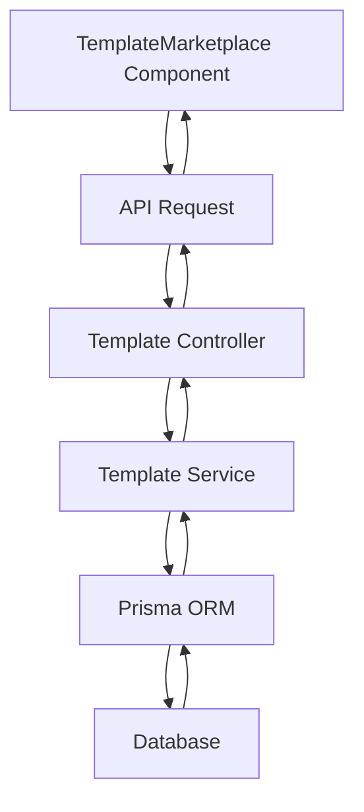
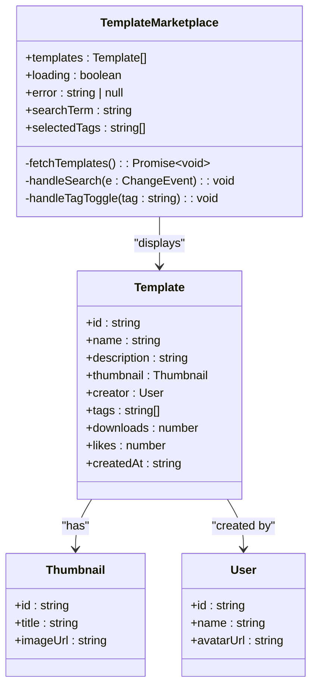
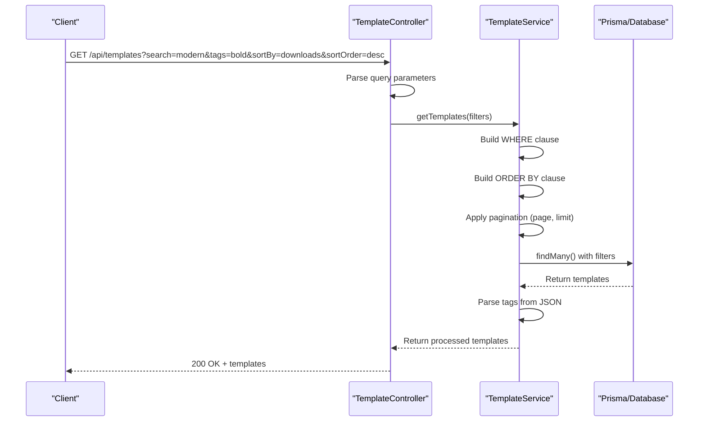
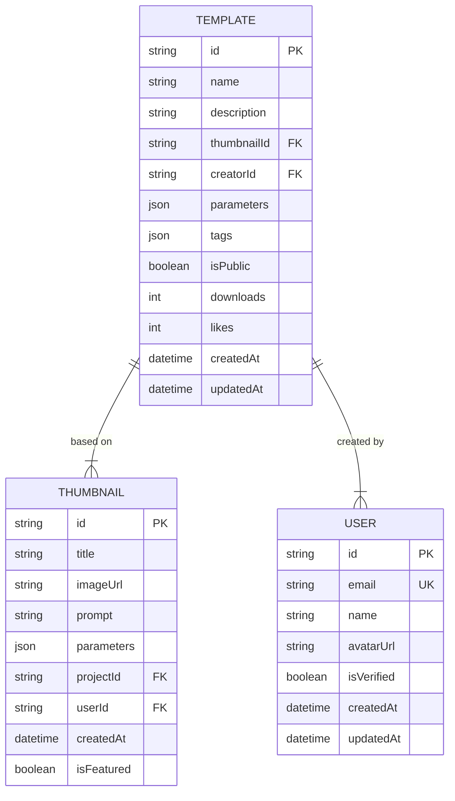

# Marketplace Browsing

<cite>
**Referenced Files in This Document**   
- [TemplateMarketplace.tsx](file://pikzels-clone/client/src/components/templates/TemplateMarketplace.tsx)
- [template.service.ts](file://pikzels-clone/src/modules/templates/template.service.ts)
- [template.controller.ts](file://pikzels-clone/src/modules/templates/template.controller.ts)
- [schema.prisma](file://pikzels-clone/prisma/schema.prisma)
- [template-marketplace.md](file://pikzels-clone/docs/template-marketplace.md)
</cite>

## Table of Contents
1. [Introduction](#introduction)
2. [Core Components](#core-components)
3. [Architecture Overview](#architecture-overview)
4. [Detailed Component Analysis](#detailed-component-analysis)
5. [Performance Considerations](#performance-considerations)
6. [UI/UX Recommendations](#uiux-recommendations)
7. [Conclusion](#conclusion)

## Introduction
The Template Marketplace enables users to discover, search, and utilize community-shared templates for thumbnail creation. This document details the browsing interface, search and filtering capabilities, sorting mechanisms, API integration, and performance considerations for the marketplace feature. The system allows users to find templates by keywords, filter by tags, and sort by popularity metrics such as downloads and likes, providing an intuitive way to discover design inspiration.

## Core Components
The marketplace browsing functionality consists of the TemplateMarketplace React component for the user interface, the getTemplates service method for data retrieval, and supporting backend infrastructure. The frontend component handles user interactions for search and filtering, while the backend service processes requests with dynamic filtering, sorting, and pagination. Public templates are displayed with creator information and usage statistics to help users evaluate template quality and popularity.

**Section sources**
- [TemplateMarketplace.tsx](file://pikzels-clone/client/src/components/templates/TemplateMarketplace.tsx#L23-L250)
- [template.service.ts](file://pikzels-clone/src/modules/templates/template.service.ts#L33-L109)
- [template.controller.ts](file://pikzels-clone/src/modules/templates/template.controller.ts#L45-L78)

## Architecture Overview
The marketplace browsing system follows a client-server architecture with React frontend components communicating with Express API endpoints. The TemplateMarketplace component renders the user interface and handles search and filtering interactions. When users interact with the interface, the component makes API requests to the backend, which processes the request through the template controller and service layers before querying the database via Prisma ORM.

**Diagram sources **
- [TemplateMarketplace.tsx](file://pikzels-clone/client/src/components/templates/TemplateMarketplace.tsx#L23-L250)
- [template.controller.ts](file://pikzels-clone/src/modules/templates/template.controller.ts#L45-L78)
- [template.service.ts](file://pikzels-clone/src/modules/templates/template.service.ts#L33-L109)

## Detailed Component Analysis

### Template Marketplace Component
The TemplateMarketplace component provides the user interface for browsing templates with search, filtering, and sorting capabilities. It manages component state for templates, loading status, errors, search terms, and selected tags. The component fetches public templates on initial load and applies client-side filtering based on user input.

**Diagram sources **
- [TemplateMarketplace.tsx](file://pikzels-clone/client/src/components/templates/TemplateMarketplace.tsx#L23-L250)

**Section sources**
- [TemplateMarketplace.tsx](file://pikzels-clone/client/src/components/templates/TemplateMarketplace.tsx#L23-L250)

### Template Service and Controller
The getTemplates service method and controller handle API requests for template retrieval with dynamic filtering, sorting, and pagination. The service constructs database queries based on request parameters, applying filters for search terms, tags, and visibility while supporting sorting by creation date, downloads, or likes.

**Diagram sources **
- [template.controller.ts](file://pikzels-clone/src/modules/templates/template.controller.ts#L45-L78)
- [template.service.ts](file://pikzels-clone/src/modules/templates/template.service.ts#L33-L109)

**Section sources**
- [template.controller.ts](file://pikzels-clone/src/modules/templates/template.controller.ts#L45-L78)
- [template.service.ts](file://pikzels-clone/src/modules/templates/template.service.ts#L33-L109)

### Data Model Structure
The Template data model defines the structure of template entities in the database, including relationships to thumbnails and creators. The model supports the marketplace's filtering and sorting requirements through indexed fields and appropriate data types.

**Diagram sources **
- [schema.prisma](file://pikzels-clone/prisma/schema.prisma#L138-L156)

**Section sources**
- [schema.prisma](file://pikzels-clone/prisma/schema.prisma#L138-L156)

## Performance Considerations
The marketplace browsing system implements several performance optimizations to ensure responsive user experiences. The getTemplates service enforces a maximum pagination limit of 100 items per page to prevent excessive database load. Database queries are optimized through Prisma with appropriate filtering and sorting parameters that translate to efficient SQL queries. The Template model includes database indexes on frequently queried fields such as creatorId, thumbnailId, and isPublic to accelerate search operations.

The frontend implements client-side filtering for search terms and tags after the initial data load, reducing the need for additional API calls during user interactions. However, for large template collections, implementing server-side filtering would provide better performance by reducing payload size. The service layer parses tags from JSON storage format after retrieval, which could be optimized by considering alternative data modeling approaches if performance becomes a bottleneck.

**Section sources**
- [template.service.ts](file://pikzels-clone/src/modules/templates/template.service.ts#L33-L109)
- [schema.prisma](file://pikzels-clone/prisma/schema.prisma#L138-L156)

## UI/UX Recommendations
To enhance template discoverability and user experience, several UI/UX improvements can be implemented. The current interface could benefit from adding explicit sorting controls that allow users to select between sorting options like "Most Downloads," "Most Liked," and "Newest." Visual previews of templates should be optimized for quick scanning, potentially implementing hover effects that reveal additional details.

Tag filtering could be enhanced with a "tag cloud" visualization where frequently used tags appear larger, providing visual cues about popular design trends. For template preview, implementing a modal dialog that shows a larger preview with additional details would improve decision-making without leaving the browsing context. Usage statistics such as download counts and likes should be prominently displayed to help users identify popular and trusted templates.

The interface should also provide feedback during loading states and implement infinite scrolling or "Load More" functionality to enhance the browsing experience beyond the initial page of results. Accessibility improvements could include keyboard navigation support for filtering controls and proper ARIA labels for interactive elements.

## Conclusion
The Template Marketplace provides a comprehensive browsing experience for discovering community-shared templates through search, filtering, and sorting capabilities. The system effectively combines frontend interactivity with backend processing to deliver a responsive user experience. The architecture supports the core requirements of template discovery while implementing performance considerations like pagination limits and database indexing. Future enhancements could focus on improving discoverability through advanced filtering, better visual previews, and personalized recommendations based on user preferences and behavior.