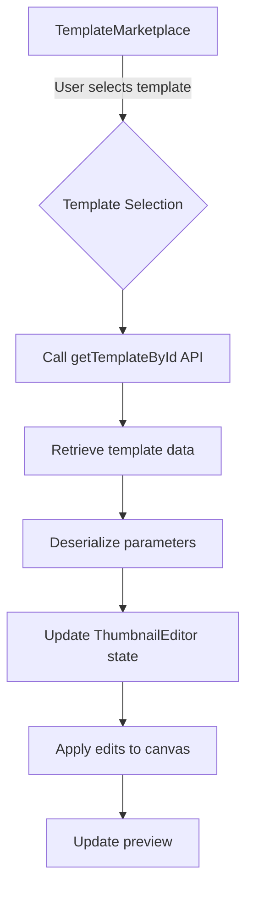
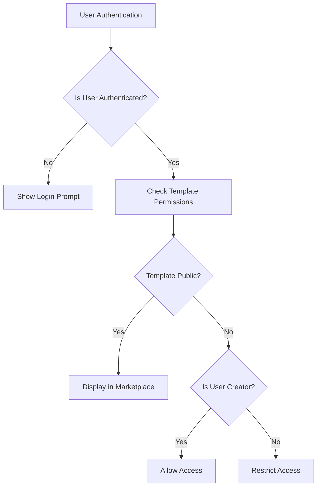
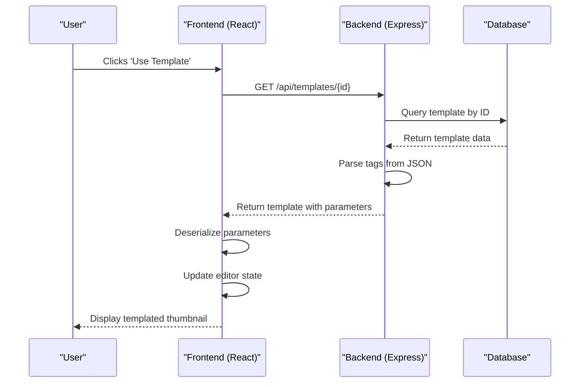
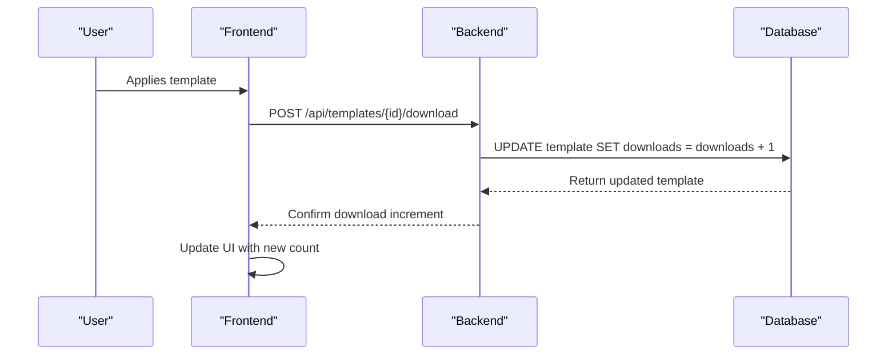
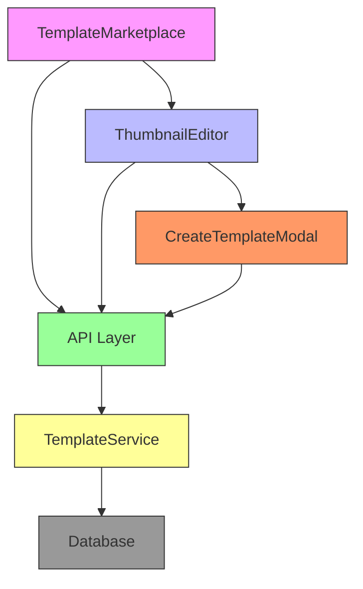

# Template Application

<cite>
**Referenced Files in This Document**   
- [TemplateMarketplace.tsx](file://pikzels-clone\client\src\components\templates\TemplateMarketplace.tsx)
- [ThumbnailEditor.tsx](file://pikzels-clone\client\src\components\ThumbnailEditor.tsx)
- [template.controller.ts](file://pikzels-clone\src\modules\templates\template.controller.ts)
- [template.service.ts](file://pikzels-clone\src\modules\templates\template.service.ts)
- [CreateTemplateModal.tsx](file://pikzels-clone\client\src\components\templates\CreateTemplateModal.tsx)
- [template.routes.ts](file://pikzels-clone\src\modules\templates\template.routes.ts)
</cite>

## Table of Contents
1. [Introduction](#introduction)
2. [Template Application Process](#template-application-process)
3. [State Management and React Integration](#state-management-and-react-integration)
4. [Private Templates and User Permissions](#private-templates-and-user-permissions)
5. [Template Retrieval and Parameter Deserialization](#template-retrieval-and-parameter-deserialization)
6. [Download Tracking with incrementDownloads](#download-tracking-with-incrementdownloads)
7. [Architecture Overview](#architecture-overview)
8. [Conclusion](#conclusion)

## Introduction

The Template Application system enables users to apply pre-designed templates to thumbnails within the application. This functionality allows users to quickly create visually consistent thumbnails by leveraging professionally designed templates from the marketplace. The system integrates React-based frontend components with a Node.js/Express backend, providing a seamless experience for template selection, application, and customization. The process involves retrieving template data via API, applying its parameters to the thumbnail editor state, and tracking template usage metrics.

## Template Application Process

The template application process begins in the TemplateMarketplace component, where authenticated users can browse available templates. When a user selects a template to use, the system initiates the application workflow. The TemplateMarketplace component manages template display, filtering, and search functionality, presenting templates with their metadata including name, description, creator information, tags, and download counts.

When a user clicks the "Use Template" button on a template card, the application should retrieve the template data and apply it to the active thumbnail editor. The current implementation shows a placeholder alert, but the intended functionality involves calling the `getTemplateById` API endpoint to fetch the complete template data, including its design parameters. Once retrieved, these parameters are deserialized and applied to the canvas state in the ThumbnailEditor component, effectively instantiating the template's design on the user's thumbnail.

**Section sources**
- [TemplateMarketplace.tsx](file://pikzels-clone\client\src\components\templates\TemplateMarketplace.tsx#L23-L250)

## State Management and React Integration

The system employs React's useState and useEffect hooks for state management, facilitating seamless integration between the TemplateMarketplace and ThumbnailEditor components. The ThumbnailEditor maintains its state through the `edits` object, which contains all editable parameters such as brightness, contrast, saturation, text overlays, and drawing paths. This state is initialized with default values but can be updated when applying a template.

The state synchronization occurs through the component's props and callback functions. When a template is applied, the retrieved parameters are used to update the `edits` state in the ThumbnailEditor, triggering a re-render and visual update of the thumbnail preview. The history mechanism tracks changes to the edit parameters, allowing users to undo and redo modifications, including those made by template application.

The integration between components follows React's unidirectional data flow pattern, where state changes in parent components propagate to child components through props. Event callbacks allow child components to communicate state changes back to their parents, maintaining a predictable state management pattern throughout the application.

**Diagram sources**
- [ThumbnailEditor.tsx](file://pikzels-clone\client\src\components\ThumbnailEditor.tsx#L80-L747)
- [TemplateMarketplace.tsx](file://pikzels-clone\client\src\components\templates\TemplateMarketplace.tsx#L23-L250)

**Section sources**
- [ThumbnailEditor.tsx](file://pikzels-clone\client\src\components\ThumbnailEditor.tsx#L80-L747)

## Private Templates and User Permissions

The system implements user authentication and permission controls for template access and creation. The TemplateMarketplace component checks user authentication status before rendering template content, displaying an authentication prompt for unauthenticated users. This ensures that only authenticated users can access and apply templates.

Templates can be designated as public or private through the `isPublic` boolean field. Public templates are accessible to all users, while private templates are restricted to their creators. The permission system is enforced through the backend API routes, which use the `authenticateToken` middleware to protect template creation, update, and deletion endpoints.

When creating a template through the CreateTemplateModal, users can specify whether their template should be public or private. The backend validates that users can only modify or delete templates they own, preventing unauthorized access to other users' private templates. This permission model ensures that users maintain control over their creative work while enabling sharing through the public template marketplace.

**Diagram sources**
- [TemplateMarketplace.tsx](file://pikzels-clone\client\src\components\templates\TemplateMarketplace.tsx#L23-L250)
- [CreateTemplateModal.tsx](file://pikzels-clone\client\src\components\templates\CreateTemplateModal.tsx#L1-L187)

**Section sources**
- [CreateTemplateModal.tsx](file://pikzels-clone\client\src\components\templates\CreateTemplateModal.tsx#L1-L187)

## Template Retrieval and Parameter Deserialization

Template retrieval is handled through the `getTemplateById` API endpoint, which returns complete template data including its design parameters. The backend implementation in template.service.ts uses Prisma to query the database and retrieve template information, including associated thumbnail data and creator details. The tags field is stored as JSON in the database and parsed during retrieval to provide an array of tag strings.

When a template is retrieved, its parameters are deserialized from the database format and applied to the thumbnail editor's state. The parameters include various design elements such as color schemes, text styles, layout configurations, and image effects. These parameters are structured as a nested object that maps directly to the editor's state structure, allowing for straightforward application to the canvas.

The deserialization process handles the conversion of database-stored values into usable frontend state, including parsing JSON strings back into JavaScript objects and converting numeric values to appropriate units. This ensures that template parameters are accurately reconstructed when applied to a new thumbnail, preserving the original design intent.

**Diagram sources**
- [template.controller.ts](file://pikzels-clone\src\modules\templates\template.controller.ts#L83-L100)
- [template.service.ts](file://pikzels-clone\src\modules\templates\template.service.ts#L114-L137)

**Section sources**
- [template.service.ts](file://pikzels-clone\src\modules\templates\template.service.ts#L114-L137)

## Download Tracking with incrementDownloads

The system tracks template usage through the `incrementDownloads` method, which increments the download counter each time a template is applied. This metric provides valuable insights into template popularity and user preferences. The implementation uses Prisma's atomic increment operation to ensure data consistency, even under high concurrency.

The download tracking is triggered when a user applies a template, typically through a dedicated API call to the `/api/templates/{id}/download` endpoint. This endpoint is specifically designed to handle download counting without requiring full template retrieval, optimizing performance. The atomic increment operation prevents race conditions that could occur if multiple users applied the same template simultaneously.

The download count is displayed in the TemplateMarketplace interface, providing social proof and helping users identify popular templates. This metric also serves as a quality signal, as frequently downloaded templates are likely to be well-designed and useful. Template creators can monitor their templates' download counts to understand which designs are most popular with the community.

**Diagram sources**
- [template.service.ts](file://pikzels-clone\src\modules\templates\template.service.ts#L185-L194)
- [template.routes.ts](file://pikzels-clone\src\modules\templates\template.routes.ts#L1-L27)

**Section sources**
- [template.service.ts](file://pikzels-clone\src\modules\templates\template.service.ts#L185-L194)

## Architecture Overview

The Template Application system follows a clean separation of concerns between frontend and backend components. The React frontend handles user interface rendering and state management, while the Express backend provides API endpoints for data retrieval and manipulation. The architecture employs a service layer pattern, with the TemplateService class encapsulating all business logic related to template operations.

Data flows from the database through the service layer to the controller, which formats the response for the API. The frontend consumes these API endpoints to display templates and apply their parameters to the thumbnail editor. The system uses Prisma as an ORM to interact with the database, providing type safety and query optimization.

The component hierarchy begins with the TemplateMarketplace, which serves as the entry point for template discovery. When a user selects a template, the system coordinates with the ThumbnailEditor to apply the template's parameters. The CreateTemplateModal allows users to convert their edited thumbnails into reusable templates, completing the ecosystem.

**Diagram sources**
- [TemplateMarketplace.tsx](file://pikzels-clone\client\src\components\templates\TemplateMarketplace.tsx#L23-L250)
- [ThumbnailEditor.tsx](file://pikzels-clone\client\src\components\ThumbnailEditor.tsx#L80-L747)
- [template.service.ts](file://pikzels-clone\src\modules\templates\template.service.ts#L1-L220)

**Section sources**
- [template.routes.ts](file://pikzels-clone\src\modules\templates\template.routes.ts#L1-L27)

## Conclusion

The Template Application system provides a comprehensive solution for template-based thumbnail creation, combining intuitive user interface design with robust backend functionality. By leveraging React's state management capabilities and a well-structured API, the system enables seamless template application while preserving editable layers and design parameters. The implementation includes important features such as user authentication, permission controls, and usage tracking, creating a complete ecosystem for template sharing and reuse. This architecture supports both individual creativity and community collaboration, allowing users to benefit from professionally designed templates while maintaining full control over their customizations.