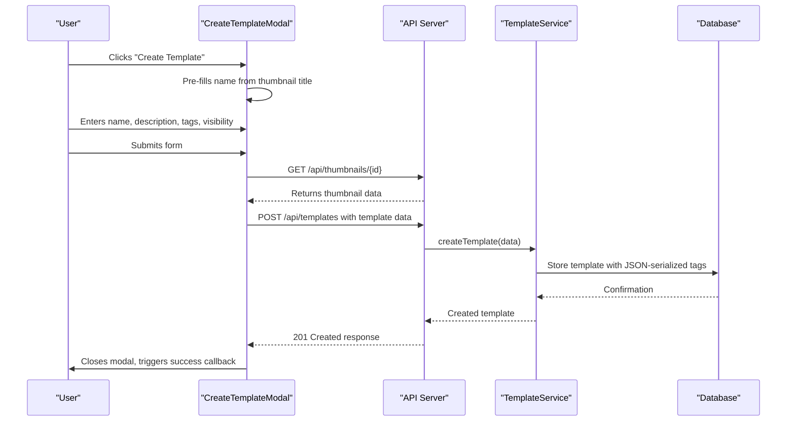
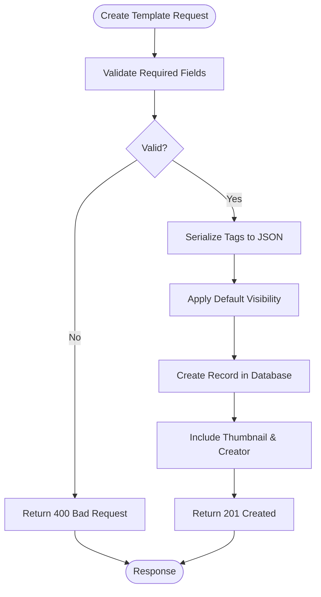
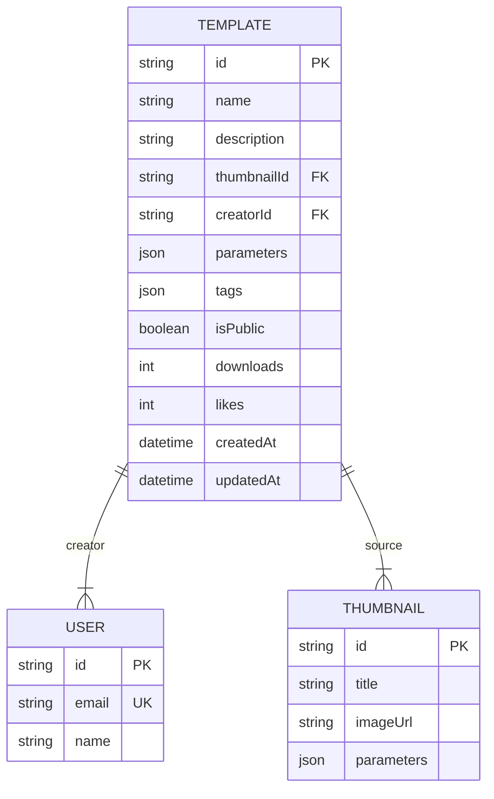

# Template Creation

<cite>
**Referenced Files in This Document**  
- [CreateTemplateModal.tsx](file://client/src/components/templates/CreateTemplateModal.tsx)
- [template.service.ts](file://src/modules/templates/template.service.ts)
- [template.controller.ts](file://src/modules/templates/template.controller.ts)
- [template.routes.ts](file://src/modules/templates/template.routes.ts)
- [schema.prisma](file://prisma/schema.prisma)
</cite>

## Table of Contents
1. [Introduction](#introduction)
2. [Template Creation Workflow](#template-creation-workflow)
3. [Frontend Implementation](#frontend-implementation)
4. [Backend Service Logic](#backend-service-logic)
5. [API Endpoint and Routing](#api-endpoint-and-routing)
6. [Database Schema and Storage](#database-schema-and-storage)
7. [Validation and Error Handling](#validation-and-error-handling)
8. [Security and Ownership Enforcement](#security-and-ownership-enforcement)
9. [Best Practices for Template Design](#best-practices-for-template-design)
10. [Conclusion](#conclusion)

## Introduction

The Template Creation feature enables users to convert existing thumbnails into reusable templates that can be shared and applied to new projects. This functionality enhances workflow efficiency by allowing users to preserve successful design configurations, including visual parameters and styling choices. Templates can be set as public for community sharing or kept private for personal use, with comprehensive metadata support for discoverability.

**Section sources**
- [CreateTemplateModal.tsx](file://client/src/components/templates/CreateTemplateModal.tsx#L9-L184)
- [template.service.ts](file://src/modules/templates/template.service.ts#L8-L28)

## Template Creation Workflow

The template creation process begins when a user selects a thumbnail and chooses to convert it into a template. The system extracts the thumbnail's parameters and presents a modal interface for the user to define metadata. The workflow follows a structured sequence: thumbnail parameter extraction, metadata input, API submission, database persistence, and success confirmation.

**Diagram sources**
- [CreateTemplateModal.tsx](file://client/src/components/templates/CreateTemplateModal.tsx#L9-L184)
- [template.service.ts](file://src/modules/templates/template.service.ts#L8-L28)
- [template.controller.ts](file://src/modules/templates/template.controller.ts#L15-L45)

## Frontend Implementation

The `CreateTemplateModal` component provides a user-friendly interface for template creation. It accepts the source thumbnail ID and title as props, pre-populating the template name field. The modal collects essential metadata including name, description, comma-separated tags, and public/private visibility setting. Upon submission, it first retrieves the source thumbnail's parameters before sending the complete template data to the backend API.

The implementation includes client-side validation, loading states, and error handling to ensure a smooth user experience. The form prevents submission until required fields are completed and provides immediate feedback for any API errors encountered during template creation.

**Section sources**
- [CreateTemplateModal.tsx](file://client/src/components/templates/CreateTemplateModal.tsx#L9-L184)

## Backend Service Logic

The `TemplateService.createTemplate` method handles the core business logic for template persistence. It accepts structured input containing template metadata, the source thumbnail ID, extracted parameters, and user ownership information. The service method processes the tags array by converting it to a JSON string for database storage, while applying a default `isPublic: false` if no visibility setting is provided.

The service returns the created template with associated thumbnail and creator data eagerly loaded, providing a complete response object to the frontend. This approach minimizes subsequent API calls by including all necessary information in the initial response.

**Diagram sources**
- [template.service.ts](file://src/modules/templates/template.service.ts#L8-L28)

**Section sources**
- [template.service.ts](file://src/modules/templates/template.service.ts#L8-L28)

## API Endpoint and Routing

The template creation functionality is exposed through a RESTful API endpoint at `/api/templates` using the POST method. This endpoint is protected by the `authenticateToken` middleware, ensuring only authenticated users can create templates. The routing configuration in `template.routes.ts` clearly separates public and protected routes, with template creation requiring authentication.

The API controller validates incoming requests, extracts user identity from the authentication token, and orchestrates the service method call. It handles both success and error scenarios, returning appropriate HTTP status codes and error messages in JSON format for consistent frontend consumption.

**Section sources**
- [template.controller.ts](file://src/modules/templates/template.controller.ts#L15-L45)
- [template.routes.ts](file://src/modules/templates/template.routes.ts#L13-L15)

## Database Schema and Storage

Templates are persisted in the database using the `Template` model defined in the Prisma schema. The schema includes fields for name, description, creator and thumbnail relationships, parameters, tags, visibility status, download/like counters, and timestamps. The `tags` field is stored as JSON to maintain array structure while benefiting from Prisma's type safety.

When creating a template, the service serializes the tags array to a JSON string before database insertion. Conversely, when retrieving templates, the service deserializes the JSON string back to a native array, abstracting the storage complexity from the application logic. This approach balances database efficiency with application convenience.

**Diagram sources**
- [schema.prisma](file://prisma/schema.prisma#L118-L138)

**Section sources**
- [schema.prisma](file://prisma/schema.prisma#L118-L138)
- [template.service.ts](file://src/modules/templates/template.service.ts#L8-L28)

## Validation and Error Handling

The template creation process implements comprehensive validation at both frontend and backend levels. Client-side validation ensures required fields are completed before submission, while server-side validation confirms the presence of essential data including name, thumbnail ID, and parameters.

Error handling is implemented through try-catch blocks in the controller, with detailed error messages returned to the frontend for user feedback. Common error scenarios include authentication failures, missing required fields, database errors, and permission violations. The system distinguishes between client errors (4xx) and server errors (5xx), enabling appropriate handling strategies on the frontend.

**Section sources**
- [template.controller.ts](file://src/modules/templates/template.controller.ts#L15-L45)
- [CreateTemplateModal.tsx](file://client/src/components/templates/CreateTemplateModal.tsx#L9-L184)

## Security and Ownership Enforcement

Security is enforced through multiple mechanisms. Authentication is required for template creation via the `authenticateToken` middleware. The system automatically associates the template with the authenticated user's ID, preventing impersonation. While the current implementation does not include explicit ownership checks during creation (since the user is creating their own template), the pattern establishes the foundation for future access control.

The separation of public and private templates allows users to control the visibility of their creations. Public templates can be discovered and used by the broader community, while private templates remain accessible only to their creator, supporting both collaborative and individual workflows.

**Section sources**
- [template.controller.ts](file://src/modules/templates/template.controller.ts#L15-L45)
- [template.routes.ts](file://src/modules/templates/template.routes.ts#L13-L15)

## Best Practices for Template Design

To maximize template reusability and discoverability, users should follow several best practices. Template names should be descriptive and specific, clearly indicating the design style or purpose. Descriptions should provide context about intended use cases and any special considerations.

Tags play a crucial role in template discoverability and should be selected thoughtfully. Users should include both general categories (e.g., "minimalist", "bold") and specific elements (e.g., "red-background", "text-overlay") to enhance searchability. The parameter extraction process automatically captures all configurable aspects of the source thumbnail, ensuring templates are fully functional when applied to new projects.

Organizations using team features can establish naming conventions and tagging standards to maintain consistency across shared templates, facilitating easier collaboration and onboarding of new team members.

## Conclusion

The Template Creation feature provides a powerful mechanism for preserving and sharing successful thumbnail designs. By combining an intuitive frontend interface with robust backend services and thoughtful data modeling, the system enables users to efficiently convert their creations into reusable assets. The implementation demonstrates proper separation of concerns, with clear responsibilities across UI, API, service, and data layers, while maintaining attention to security, validation, and user experience.