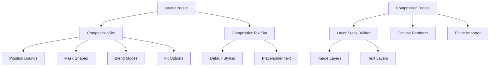
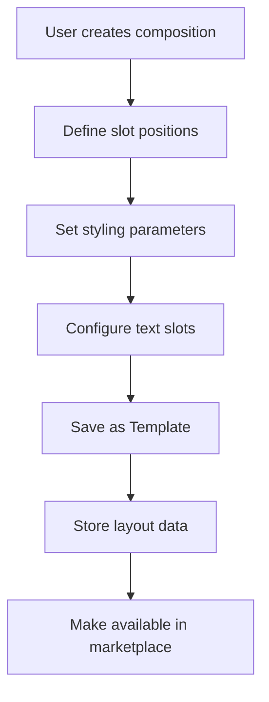
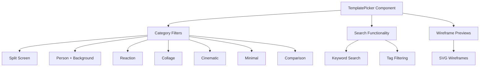
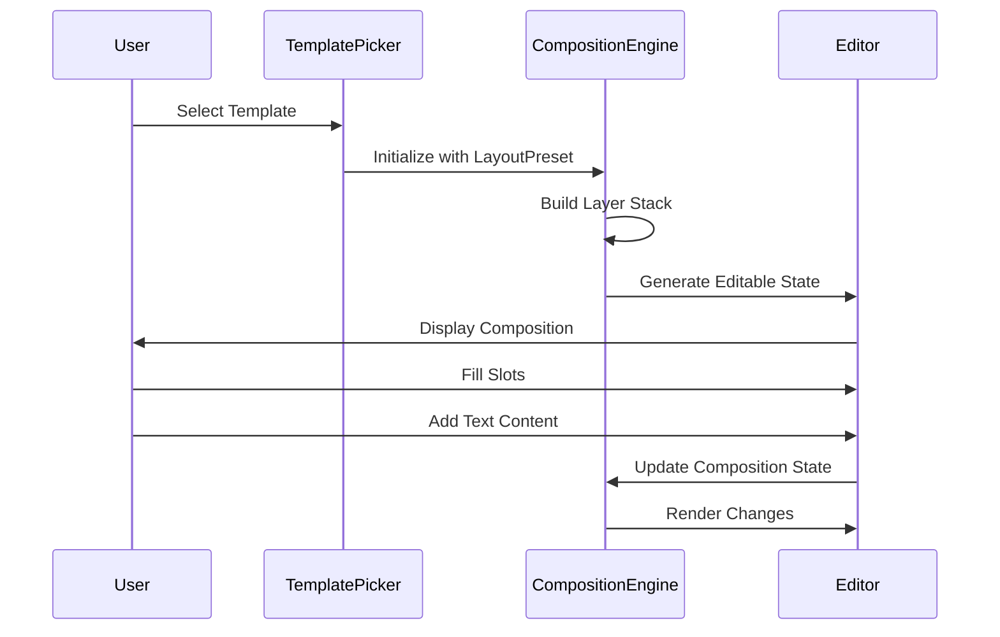
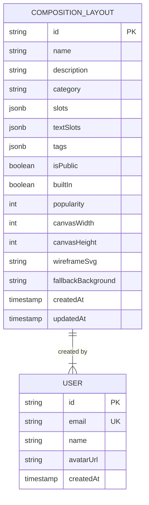

# Template Marketplace

<cite>
**Referenced Files in This Document**
- [useCompositionTemplates.ts](file://pikzels-clone/client/src/features/composition-templates/useCompositionTemplates.ts)
- [composition-engine.ts](file://pikzels-clone/client/src/features/composition-templates/composition-engine.ts)
- [types.ts](file://pikzels-clone/client/src/features/composition-templates/types.ts)
- [TemplatePicker.tsx](file://pikzels-clone/client/src/features/composition-templates/components/TemplatePicker.tsx)
- [presets.ts](file://pikzels-clone/client/src/features/composition-templates/presets.ts)
- [composition-layout.service.ts](file://pikzels-clone/src/modules/composition-layout/composition-layout.service.ts)
- [template.controller.ts](file://pikzels-clone/src/modules/templates/template.controller.ts)
- [template.routes.ts](file://pikzels-clone/src/modules/templates/template.routes.ts)
- [seed.ts](file://pikzels-clone/prisma/seed.ts)
</cite>

## Update Summary
**Changes Made**
- Completely redesigned the Template Marketplace to support comprehensive composition layout system
- Replaced simple template system with sophisticated slot-based composition engine
- Added advanced filtering, categorization, and user-generated content support
- Implemented dynamic content placement with mask shapes, blend modes, and text slots
- Enhanced template discovery with wireframe previews and category-based browsing

## Table of Contents
1. [Introduction](#introduction)
2. [Composition Layout System](#composition-layout-system)
3. [Template Creation Workflow](#template-creation-workflow)
4. [Advanced Marketplace Browsing Interface](#advanced-marketplace-browsing-interface)
5. [Dynamic Template Application System](#dynamic-template-application-system)
6. [Template Storage and Retrieval](#template-storage-and-retrieval)
7. [Versioning and Update Propagation](#versioning-and-update-propagation)
8. [Performance Considerations](#performance-considerations)
9. [Best Practices for Template Design](#best-practices-for-template-design)
10. [Conclusion](#conclusion)

## Introduction
The Template Marketplace has evolved into a comprehensive composition layout system that enables users to create, discover, and apply sophisticated thumbnail designs with dynamic content placement. The system now features slot-based composition engines with mask shapes, blend modes, and pre-positioned text areas, supporting both professional designers and content creators. Templates preserve editable layers and parameters while enabling seamless integration with the advanced editor.

## Composition Layout System
The new composition layout system introduces a sophisticated slot-based architecture that allows precise control over image placement, styling, and content composition. Each template consists of multiple slots with defined positions, sizing constraints, and styling properties, plus optional text slots for dynamic text content.

**Diagram sources**
- [types.ts](file://pikzels-clone/client/src/features/composition-templates/types.ts#L43-L90)
- [types.ts](file://pikzels-clone/client/src/features/composition-templates/types.ts#L97-L126)
- [composition-engine.ts](file://pikzels-clone/client/src/features/composition-templates/composition-engine.ts#L68-L125)

**Section sources**
- [types.ts](file://pikzels-clone/client/src/features/composition-templates/types.ts#L1-L210)
- [composition-engine.ts](file://pikzels-clone/client/src/features/composition-templates/composition-engine.ts#L62-L369)

## Template Creation Workflow
Users can create templates from existing compositions using the enhanced composition template system. The process captures slot configurations, positioning data, and styling parameters to generate reusable layout templates. Users can define categories, tags, and visibility settings while preserving the dynamic composition structure.

**Diagram sources**
- [useCompositionTemplates.ts](file://pikzels-clone/client/src/features/composition-templates/useCompositionTemplates.ts#L145-L158)

**Section sources**
- [useCompositionTemplates.ts](file://pikzels-clone/client/src/features/composition-templates/useCompositionTemplates.ts#L1-L251)
- [composition-layout.service.ts](file://pikzels-clone/src/modules/composition-layout/composition-layout.service.ts#L202-L253)

## Advanced Marketplace Browsing Interface
The enhanced marketplace provides sophisticated filtering and discovery capabilities with category-based browsing, tag-based search, and wireframe preview visualization. Templates are organized into specialized categories including split-screen layouts, person-background compositions, reaction thumbnails, and cinematic formats.

**Diagram sources**
- [TemplatePicker.tsx](file://pikzels-clone/client/src/features/composition-templates/components/TemplatePicker.tsx#L22-L31)
- [useCompositionTemplates.ts](file://pikzels-clone/client/src/features/composition-templates/useCompositionTemplates.ts#L124-L142)

**Section sources**
- [TemplatePicker.tsx](file://pikzels-clone/client/src/features/composition-templates/components/TemplatePicker.tsx#L1-L82)
- [useCompositionTemplates.ts](file://pikzels-clone/client/src/features/composition-templates/useCompositionTemplates.ts#L88-L142)

## Dynamic Template Application System
When users select a template, the system applies the composition layout to create a fully editable design state. The composition engine generates layer descriptors that preserve slot positioning, styling, and text content while enabling real-time modifications. Users can fill slots with images, customize text content, and adjust styling parameters without losing the underlying template structure.

**Diagram sources**
- [composition-engine.ts](file://pikzels-clone/client/src/features/composition-templates/composition-engine.ts#L68-L125)
- [useCompositionTemplates.ts](file://pikzels-clone/client/src/features/composition-templates/useCompositionTemplates.ts#L210-L218)

**Section sources**
- [composition-engine.ts](file://pikzels-clone/client/src/features/composition-templates/composition-engine.ts#L62-L369)
- [useCompositionTemplates.ts](file://pikzels-clone/client/src/features/composition-templates/useCompositionTemplates.ts#L144-L251)

## Template Storage and Retrieval
Templates are stored as composition layouts with comprehensive metadata including slot configurations, positioning data, styling parameters, and categorization information. The system supports both built-in presets and user-generated templates with full CRUD operations and advanced filtering capabilities.

**Diagram sources**
- [composition-layout.service.ts](file://pikzels-clone/src/modules/composition-layout/composition-layout.service.ts#L202-L253)
- [seed.ts](file://pikzels-clone/prisma/seed.ts#L449-L509)

**Section sources**
- [composition-layout.service.ts](file://pikzels-clone/src/modules/composition-layout/composition-layout.service.ts#L202-L253)
- [template.controller.ts](file://pikzels-clone/src/modules/templates/template.controller.ts#L34-L91)
- [template.routes.ts](file://pikzels-clone/src/modules/templates/template.routes.ts#L1-L23)

## Versioning and Update Propagation
The system implements a sophisticated versioning approach through composition layout updates rather than traditional template versioning. When template creators update their layouts, the system maintains backward compatibility by preserving slot configurations and providing migration paths for structural changes. Users receive notifications about template updates with optional update synchronization.

**Section sources**
- [composition-layout.service.ts](file://pikzels-clone/src/modules/composition-layout/composition-layout.service.ts#L202-L253)
- [template.controller.ts](file://pikzels-clone/src/modules/templates/template.controller.ts#L96-L117)

## Performance Considerations
The composition layout system optimizes performance through several mechanisms: lazy loading of template data, efficient canvas rendering with layer stacking, optimized image loading with CORS handling, and intelligent caching of wireframe previews. The system uses requestAnimationFrame for smooth animations and implements debounced search functionality for responsive filtering.

**Section sources**
- [composition-engine.ts](file://pikzels-clone/client/src/features/composition-templates/composition-engine.ts#L131-L181)
- [useCompositionTemplates.ts](file://pikzels-clone/client/src/features/composition-templates/useCompositionTemplates.ts#L96-L115)

## Best Practices for Template Design
Effective template design requires careful consideration of slot positioning, aspect ratios, and user interaction patterns. Templates should define clear slot roles, provide appropriate fallback backgrounds, and include sufficient spacing for text content. Designers should consider accessibility factors, maintain visual hierarchy, and ensure templates work across different screen sizes and aspect ratios.

**Section sources**
- [presets.ts](file://pikzels-clone/client/src/features/composition-templates/presets.ts#L36-L98)
- [types.ts](file://pikzels-clone/client/src/features/composition-templates/types.ts#L132-L183)

## Conclusion
The enhanced Template Marketplace represents a significant advancement in thumbnail design systems, providing professional-grade composition tools with sophisticated slot-based architecture. The system supports complex layouts, dynamic content placement, and seamless integration with both quick edit and advanced editor workflows. With comprehensive filtering, user-generated content support, and performance optimizations, the marketplace enables creators to build, discover, and apply high-quality compositions efficiently.