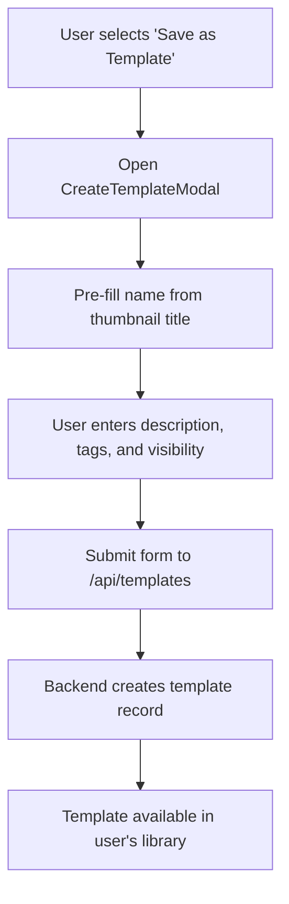
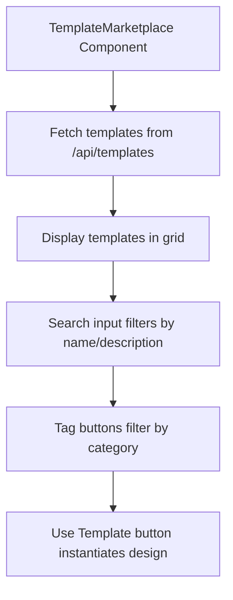
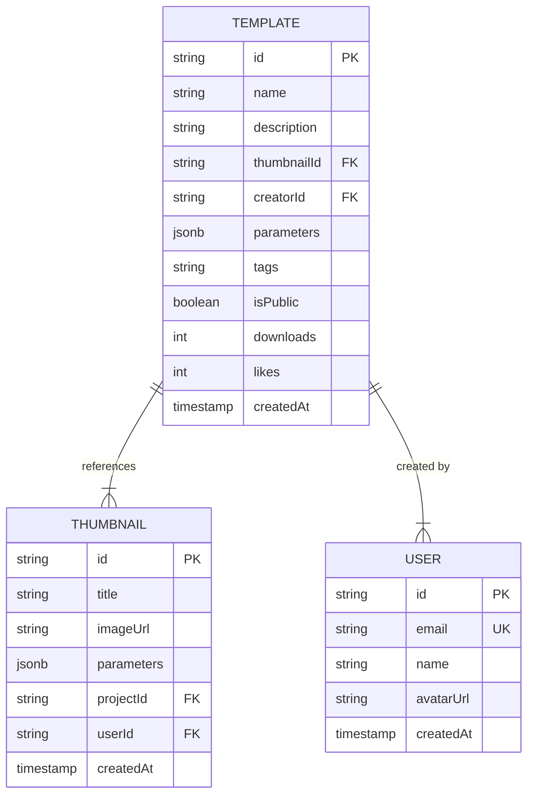

# Template Marketplace

<cite>
**Referenced Files in This Document**   
- [template.service.ts](file://pikzels-clone\src\modules\templates\template.service.ts)
- [template.controller.ts](file://pikzels-clone\src\modules\templates\template.controller.ts)
- [TemplateMarketplace.tsx](file://pikzels-clone\client\src\components\templates\TemplateMarketplace.tsx)
- [CreateTemplateModal.tsx](file://pikzels-clone\client\src\components\templates\CreateTemplateModal.tsx)
- [thumbnail.service.ts](file://pikzels-clone\src\modules\thumbnail\thumbnail.service.ts)
- [migration.sql](file://pikzels-clone\prisma\migrations\20250829072650_init\migration.sql)
</cite>

## Table of Contents
1. [Introduction](#introduction)
2. [Template Creation Workflow](#template-creation-workflow)
3. [Marketplace Browsing Interface](#marketplace-browsing-interface)
4. [Template Application System](#template-application-system)
5. [Template Storage and Retrieval](#template-storage-and-retrieval)
6. [Versioning and Update Propagation](#versioning-and-update-propagation)
7. [Performance Considerations](#performance-considerations)
8. [Best Practices for Template Design](#best-practices-for-template-design)
9. [Conclusion](#conclusion)

## Introduction
The Template Marketplace is a feature that enables users to save, share, and reuse custom thumbnail designs. It supports both private and public templates, with full metadata, tagging, and social engagement features such as likes and download tracking. Templates preserve editable layers and parameters, allowing users to customize them upon application. This document details the full lifecycle of templates, from creation to application, including backend storage, frontend interfaces, and performance optimization strategies.

## Template Creation Workflow
Users can create templates directly from existing thumbnails using the Create Template modal. The system captures the thumbnail’s visual state, parameters, and metadata to generate a reusable template. Users can define a name, description, tags, and visibility (public or private). Upon submission, the template is stored in the database with a reference to the original thumbnail.

**Diagram sources**
- [CreateTemplateModal.tsx](file://pikzels-clone\client\src\components\templates\CreateTemplateModal.tsx)
- [template.controller.ts](file://pikzels-clone\src\modules\templates\template.controller.ts)

**Section sources**
- [CreateTemplateModal.tsx](file://pikzels-clone\client\src\components\templates\CreateTemplateModal.tsx#L9-L184)
- [template.controller.ts](file://pikzels-clone\src\modules\templates\template.controller.ts#L4-L45)

## Marketplace Browsing Interface
The Template Marketplace provides a searchable, filterable interface for discovering public templates. Users must be authenticated to access the marketplace. The interface displays templates in a responsive grid, showing the thumbnail preview, creator information, download count, and tags. Users can search by keyword and filter by tags. The UI is built using React with state management for search and filter controls.

**Diagram sources**
- [TemplateMarketplace.tsx](file://pikzels-clone\client\src\components\templates\TemplateMarketplace.tsx)

**Section sources**
- [TemplateMarketplace.tsx](file://pikzels-clone\client\src\components\templates\TemplateMarketplace.tsx#L23-L250)

## Template Application System
When a user selects a template, the system retrieves the associated thumbnail data and parameters. The editor initializes with the template’s design state, preserving all layers, text elements, and styling. This ensures full editability, allowing users to customize colors, fonts, and layout while maintaining the original structure. The parameters stored in the template are applied to the editor’s state, enabling dynamic updates without loss of fidelity.

**Section sources**
- [TemplateMarketplace.tsx](file://pikzels-clone\client\src\components\templates\TemplateMarketplace.tsx#L23-L250)
- [thumbnail.service.ts](file://pikzels-clone\src\modules\thumbnail\thumbnail.service.ts#L5-L136)

## Template Storage and Retrieval
Templates are stored in a relational database with fields for name, description, tags, visibility, and references to the creator and source thumbnail. Tags are stored as JSON strings and parsed on retrieval. The backend service provides CRUD operations and filtering capabilities, including search, tag-based filtering, and sorting by creation date, downloads, or likes.

**Diagram sources**
- [migration.sql](file://pikzels-clone\prisma\migrations\20250829072650_init\migration.sql)
- [template.service.ts](file://pikzels-clone\src\modules\templates\template.service.ts#L4-L218)

**Section sources**
- [template.service.ts](file://pikzels-clone\src\modules\templates\template.service.ts#L4-L218)
- [template.controller.ts](file://pikzels-clone\src\modules\templates\template.controller.ts#L46-L100)

## Versioning and Update Propagation
Currently, the system does not support versioning of templates. Each template is treated as an immutable snapshot of a thumbnail at the time of creation. Updates to the original thumbnail do not propagate to derived templates. Future enhancements could include version tracking and optional update synchronization, allowing template creators to push updates to users who have applied previous versions.

## Performance Considerations
Template loading performance is optimized through pagination, filtering, and efficient database queries. The backend limits results to 100 items per page and supports indexed searches on name, description, and tags. The frontend implements lazy loading and client-side filtering to reduce server requests. Image previews are served from a CDN to minimize latency. For large template libraries, caching strategies and database indexing on frequently queried fields (e.g., tags, downloads) ensure responsive performance.

**Section sources**
- [template.service.ts](file://pikzels-clone\src\modules\templates\template.service.ts#L50-L100)
- [TemplateMarketplace.tsx](file://pikzels-clone\client\src\components\templates\TemplateMarketplace.tsx#L23-L250)

## Best Practices for Template Design
To maximize usability and discoverability, templates should include descriptive names, detailed descriptions, and relevant tags. Designers should ensure that all elements remain editable by avoiding flattened layers and preserving text fields. Public templates benefit from consistent styling and clear visual hierarchy. Organizing templates into thematic collections and using standardized tag vocabularies improves searchability and user experience.

## Conclusion
The Template Marketplace enhances user productivity by enabling the creation, sharing, and reuse of custom thumbnail designs. The system integrates seamlessly with the editor, preserving full editability and layer structure. With robust backend storage, intuitive browsing, and performance optimizations, the marketplace supports efficient template discovery and application. Future improvements could include versioning, collaborative editing, and AI-powered template recommendations.