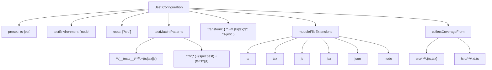
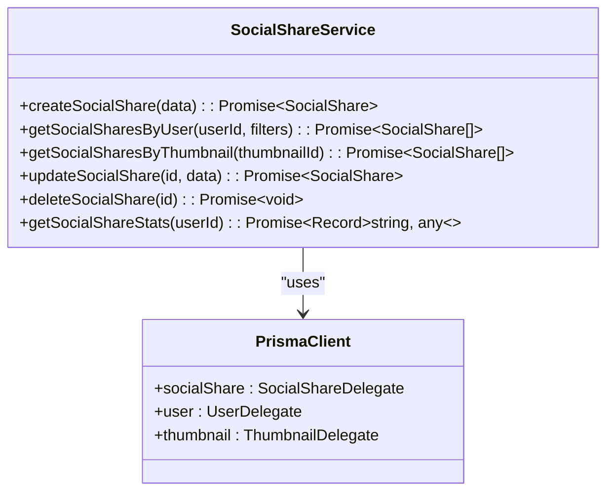
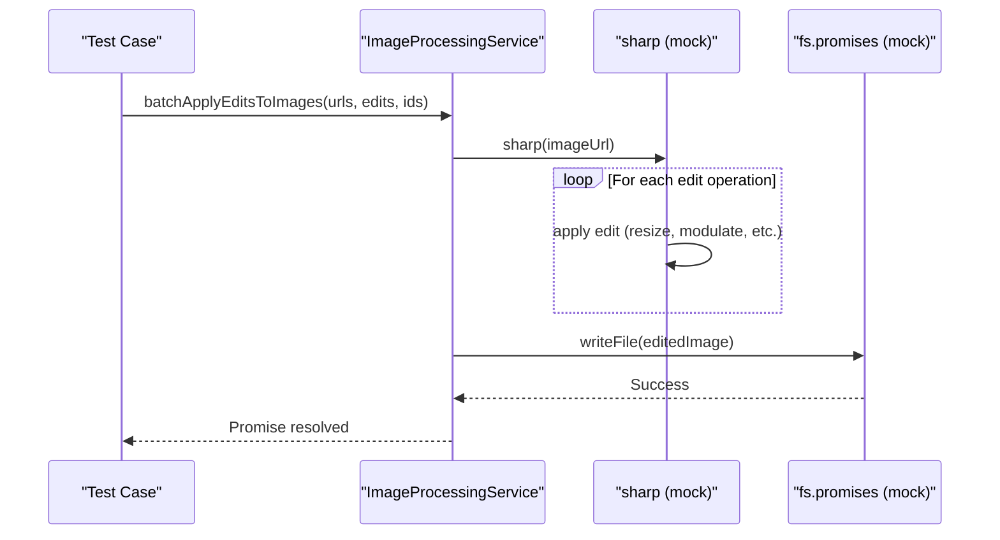
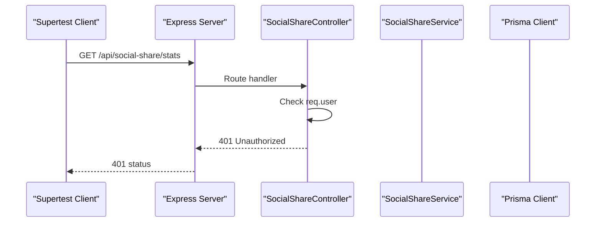
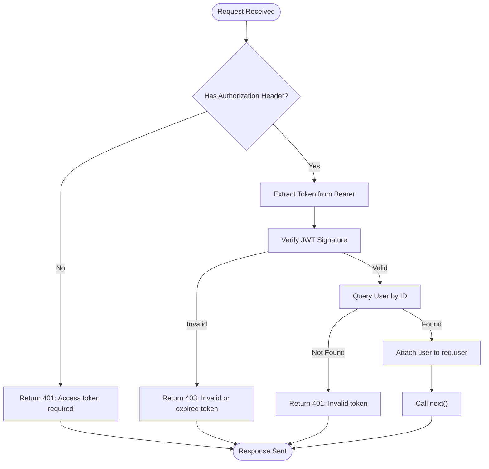

# Backend Testing

<cite>
**Referenced Files in This Document**   
- [jest.config.js](file://pikzels-clone\jest.config.js)
- [auth.middleware.ts](file://pikzels-clone\src\middleware\auth.middleware.ts)
- [social-share.service.ts](file://pikzels-clone\src\modules\social-share\social-share.service.ts)
- [thumbnail.service.ts](file://pikzels-clone\src\modules\thumbnail\thumbnail.service.ts)
- [social-share.test.ts](file://pikzels-clone\src\__tests__\social-share.test.ts)
- [batch-editing.test.ts](file://pikzels-clone\src\modules\thumbnail\__tests__\batch-editing.test.ts)
- [server.ts](file://pikzels-clone\src\server.ts)
</cite>

## Table of Contents
1. [Introduction](#introduction)
2. [Jest Configuration](#jest-configuration)
3. [Unit and Integration Testing Strategy](#unit-and-integration-testing-strategy)
4. [Testing Social Sharing Module](#testing-social-sharing-module)
5. [Testing Batch Editing Functionality](#testing-batch-editing-functionality)
6. [Controller and Route Testing with Supertest](#controller-and-route-testing-with-supertest)
7. [Middleware Testing](#middleware-testing)
8. [Database Interaction and Transaction Testing](#database-interaction-and-transaction-testing)
9. [Best Practices for Test Organization and Coverage](#best-practices-for-test-organization-and-coverage)
10. [Conclusion](#conclusion)

## Introduction
This document provides a comprehensive overview of the backend testing strategy for the Express.js server in the Thumbnail Maker application. It details the configuration of Jest with ts-jest and the Node test environment, explains the implementation of unit and integration tests for critical modules such as social sharing and batch editing, and outlines best practices for ensuring high test coverage across the codebase.

## Jest Configuration
The Jest testing framework is configured to support TypeScript through the `ts-jest` preset and runs in a Node.js environment. The configuration ensures proper transformation of TypeScript files and defines patterns for locating test files.

**Diagram sources**
- [jest.config.js](file://pikzels-clone\jest.config.js)

**Section sources**
- [jest.config.js](file://pikzels-clone\jest.config.js)

## Unit and Integration Testing Strategy
The project employs both unit and integration testing to validate individual components and their interactions. Unit tests focus on isolated logic within services, while integration tests verify the correct behavior of controllers, routes, and middleware in combination with external dependencies.

Key aspects include:
- Mocking external services and database clients
- Testing service-level logic independently
- Validating error handling and edge cases
- Ensuring type safety and correct data flow

**Section sources**
- [social-share.service.ts](file://pikzels-clone\src\modules\social-share\social-share.service.ts)
- [thumbnail.service.ts](file://pikzels-clone\src\modules\thumbnail\thumbnail.service.ts)

## Testing Social Sharing Module
The social sharing module is tested using service-level unit tests that mock the Prisma client and external API dependencies. The `SocialShareService` class provides methods for creating, retrieving, updating, and deleting social share records, all of which are validated through comprehensive test cases.

Tests verify:
- Creation and retrieval of social shares by user or thumbnail
- Proper filtering and sorting of results
- Accurate aggregation of sharing statistics
- Correct handling of invalid inputs and edge cases

**Diagram sources**
- [social-share.service.ts](file://pikzels-clone\src\modules\social-share\social-share.service.ts)

**Section sources**
- [social-share.service.ts](file://pikzels-clone\src\modules\social-share\social-share.service.ts)
- [social-share.test.ts](file://pikzels-clone\src\__tests__\social-share.test.ts)

## Testing Batch Editing Functionality
Batch editing functionality is tested through integration tests that validate the `ImageProcessingService`'s ability to apply edits to multiple images simultaneously. The tests use mocks for the `sharp` image processing library and the `fs` module to simulate file operations without side effects.

Test scenarios include:
- Applying brightness, contrast, and saturation adjustments
- Performing rotations, flips, and cropping
- Adding text overlays to multiple thumbnails
- Handling complex edit configurations with resize and filters

**Diagram sources**
- [batch-editing.test.ts](file://pikzels-clone\src\modules\thumbnail\__tests__\batch-editing.test.ts)

**Section sources**
- [batch-editing.test.ts](file://pikzels-clone\src\modules\thumbnail\__tests__\batch-editing.test.ts)

## Controller and Route Testing with Supertest
Controllers and routes are tested using Supertest to simulate HTTP requests and validate responses. This approach enables full integration testing of the Express.js server, including route handlers, request parsing, and response formatting.

The `social-share.test.ts` file demonstrates this by testing endpoints such as:
- `GET /api/social-share/stats`
- `POST /api/social-share/share`
- `GET /api/social-share/thumbnail/:thumbnailId`
- `DELETE /api/social-share/:id`

All tests verify that proper authentication is enforced and that unauthorized requests receive 401 responses.

**Diagram sources**
- [social-share.test.ts](file://pikzels-clone\src\__tests__\social-share.test.ts)
- [server.ts](file://pikzels-clone\src\server.ts)

**Section sources**
- [social-share.test.ts](file://pikzels-clone\src\__tests__\social-share.test.ts)

## Middleware Testing
Authentication middleware is tested to ensure it properly validates JWT tokens and attaches user information to the request object. The `authenticateToken` middleware checks for the presence of an authorization header, verifies the token, and retrieves the corresponding user from the database.

Tests confirm:
- Requests without tokens are rejected with 401
- Invalid or expired tokens return 403
- Valid tokens result in authenticated requests
- User context is correctly attached to the request

**Diagram sources**
- [auth.middleware.ts](file://pikzels-clone\src\middleware\auth.middleware.ts)

**Section sources**
- [auth.middleware.ts](file://pikzels-clone\src\middleware\auth.middleware.ts)

## Database Interaction and Transaction Testing
Database interactions are tested using mocked Prisma clients to isolate service logic from actual database operations. This allows for reliable testing of CRUD operations, transaction rollbacks, and data consistency rules without requiring a live database.

Strategies include:
- Mocking Prisma client methods to return controlled data
- Simulating database errors to test error handling
- Validating transactional behavior through mock sequences
- Seeding test data programmatically within test suites

**Section sources**
- [social-share.service.ts](file://pikzels-clone\src\modules\social-share\social-share.service.ts)
- [thumbnail.service.ts](file://pikzels-clone\src\modules\thumbnail\thumbnail.service.ts)

## Best Practices for Test Organization and Coverage
The project follows several best practices to ensure maintainable and effective tests:

- **Test File Organization**: Tests are colocated with source files in `__tests__` directories or use `.test.ts` suffixes
- **Consistent Naming**: Test files follow clear naming conventions that reflect the module being tested
- **Mock Management**: External dependencies are consistently mocked using Jest's mocking utilities
- **Coverage Reporting**: Jest collects coverage from all TypeScript files except type definitions
- **Environment Isolation**: Tests run in a dedicated test environment with mocked filesystem and network operations

These practices ensure high test coverage and reliability across the backend modules.

**Section sources**
- [jest.config.js](file://pikzels-clone\jest.config.js)
- [social-share.test.ts](file://pikzels-clone\src\__tests__\social-share.test.ts)
- [batch-editing.test.ts](file://pikzels-clone\src\modules\thumbnail\__tests__\batch-editing.test.ts)

## Conclusion
The backend testing strategy for the Express.js server effectively combines unit and integration tests to validate critical functionality across social sharing, thumbnail processing, and batch editing modules. By leveraging Jest with ts-jest and Node test environment, along with Supertest for HTTP interaction testing, the project ensures robust validation of controllers, routes, middleware, and service logic. The use of mocked dependencies and comprehensive test coverage contributes to a reliable and maintainable codebase.