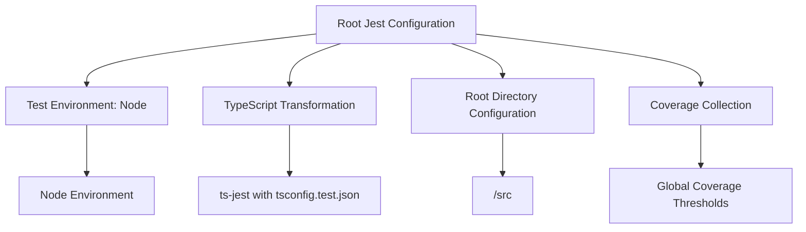
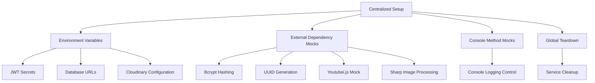
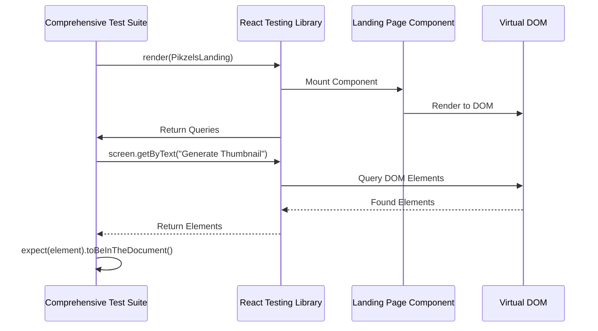
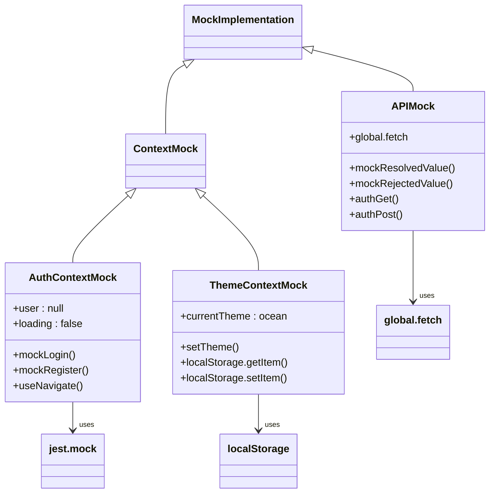

# Frontend Testing

<cite>
**Referenced Files in This Document**
- [jest.config.js](file://pikzels-clone/jest.config.js)
- [setup.ts](file://pikzels-clone/src/__tests__/setup.ts)
- [PikzelsLanding.test.tsx](file://pikzels-clone/client/src/components/__tests__/PikzelsLanding.test.tsx)
- [UserSettings.test.tsx](file://pikzels-clone/client/src/components/UserSettings.test.tsx)
- [LandingPage.test.tsx](file://pikzels-clone/client/src/components/LandingPage.test.tsx)
- [PikzelsLanding.tsx](file://pikzels-clone/client/src/components/PikzelsLanding.tsx)
- [UserSettings.tsx](file://pikzels-clone/client/src/components/UserSettings.tsx)
- [AuthContext.tsx](file://pikzels-clone/client/src/contexts/AuthContext.tsx)
- [ThemeContext.tsx](file://pikzels-clone/client/src/contexts/ThemeContext.tsx)
</cite>

## Update Summary
**Changes Made**
- Updated Jest configuration to reflect migration from client/jest.config.js to root jest.config.js
- Added comprehensive documentation for new PikzelsLanding.test.tsx testing strategy
- Updated testing infrastructure documentation to reflect consolidated testing setup
- Enhanced component testing examples with new landing page comprehensive tests
- Revised context and API mocking strategies with improved examples

## Table of Contents
1. [Introduction](#introduction)
2. [Jest Configuration and Test Environment](#jest-configuration-and-test-environment)
3. [Test Initialization and Setup](#test-initialization-and-setup)
4. [Component Testing with React Testing Library](#component-testing-with-react-testing-library)
5. [Testing UI Components](#testing-ui-components)
6. [Context and API Mocking](#context-and-api-mocking)
7. [Maintainable Testing Practices](#maintainable-testing-practices)
8. [Test Coverage and Development Integration](#test-coverage-and-development-integration)

## Introduction
This document provides comprehensive guidance on frontend testing practices within the React application for ThumbnailMaker. It covers the complete testing configuration, component testing strategies, mocking techniques, and best practices for maintaining a robust test suite. The focus is on practical implementation using Jest and React Testing Library to ensure high-quality, reliable frontend code.

**Updated** The testing infrastructure has been consolidated with the migration from client/jest.config.js to the root jest.config.js, providing a unified configuration for both frontend and backend testing.

## Jest Configuration and Test Environment

The Jest testing framework is configured at the root level with comprehensive settings for both frontend and backend testing. The configuration ensures smooth execution of tests while handling various file types and transformations across the entire codebase.

**Diagram sources**
- [jest.config.js](file://pikzels-clone/jest.config.js)

**Section sources**
- [jest.config.js](file://pikzels-clone/jest.config.js)

### Root-Level Configuration
The Jest configuration has been consolidated at the root level with the main configuration file located at the project root. This provides centralized control over test execution, TypeScript compilation, and coverage reporting for the entire codebase.

### Test Environment Configuration
The test environment is set to Node, which provides a server-side JavaScript runtime environment for testing. This allows for comprehensive testing of both frontend components and backend services within the same configuration framework.

### TypeScript Transformation
TypeScript files are transformed using ts-jest with a dedicated tsconfig.test.json file. This ensures proper type checking and compilation of TypeScript code during the testing process, maintaining type safety across the entire test suite.

### Coverage Reporting
The configuration includes comprehensive coverage collection with specific thresholds for branches, functions, lines, and statements. The coverage thresholds are dynamically adjusted based on code changes and dead code removal.

## Test Initialization and Setup

The test suite is initialized through a centralized setup file that configures environment variables, mocks external dependencies, and establishes testing utilities. This ensures consistent test environment configuration across all test files.

**Diagram sources**
- [setup.ts](file://pikzels-clone/src/__tests__/setup.ts)

**Section sources**
- [setup.ts](file://pikzels-clone/src/__tests__/setup.ts)

### Environment Configuration
The setup file defines essential environment variables for testing, including JWT secrets, database URLs, encryption keys, and Cloudinary configuration. This ensures that tests run with consistent and predictable environment settings.

### External Dependency Mocks
Multiple external dependencies are mocked to prevent actual external service calls during testing. These include bcrypt hashing functions, UUID generation utilities, YouTube video processing, and image manipulation libraries.

### Console Method Control
Console methods are mocked globally to provide cleaner test output and prevent verbose logging during test execution. This helps maintain focused test results and reduces noise in test reports.

### Global Cleanup
The setup includes comprehensive cleanup procedures for service singletons, event handlers, and monitoring systems to ensure proper resource management between test runs.

## Component Testing with React Testing Library

React Testing Library is used extensively for testing components with a focus on user-centric testing patterns. The approach emphasizes testing component behavior rather than implementation details, ensuring tests remain resilient to refactoring.

**Diagram sources**
- [PikzelsLanding.test.tsx](file://pikzels-clone/client/src/components/__tests__/PikzelsLanding.test.tsx)
- [UserSettings.test.tsx](file://pikzels-clone/client/src/components/UserSettings.test.tsx)

**Section sources**
- [PikzelsLanding.test.tsx](file://pikzels-clone/client/src/components/__tests__/PikzelsLanding.test.tsx)
- [UserSettings.test.tsx](file://pikzels-clone/client/src/components/UserSettings.test.tsx)

### Comprehensive Landing Page Testing
The new PikzelsLanding.test.tsx provides extensive testing coverage for the landing page component, including functional tests, authentication modal tests, and security validation tests. This comprehensive approach ensures all user-facing features are thoroughly tested.

### UserSettings Component Testing
The UserSettings.test.tsx demonstrates testing for asynchronous operations with proper error handling and loading states. Tests cover successful data fetching, error scenarios, and state management during API interactions.

### Authentication Flow Testing
Authentication flows are tested comprehensively, including signup validation, login processes, and navigation behaviors. The tests ensure proper user experience and security enforcement throughout the authentication process.

## Testing UI Components

UI components are tested for proper rendering, user interaction, and state management using React Testing Library's semantic queries and user event simulation.

### Button Component Testing
Buttons are tested using semantic queries like `getByRole` to ensure they are properly labeled and accessible. Tests verify button text content, click handlers, and visual states using appropriate accessibility attributes.

### Form Component Testing
Form elements are tested for proper rendering, user input handling, and validation states. Tests verify that input fields accept user input, display appropriate placeholder text, and respond correctly to user interactions with proper validation feedback.

### Modal Component Testing
Modal components are tested for proper opening and closing behavior, backdrop interaction, and keyboard navigation. Tests verify that modals can be dismissed by clicking outside, pressing escape, or using close buttons with proper accessibility support.

## Context and API Mocking

Context providers and API calls are mocked to isolate component testing and simulate various application states. The testing approach uses comprehensive mocking strategies for both authentication and theme contexts.

**Diagram sources**
- [AuthContext.tsx](file://pikzels-clone/client/src/contexts/AuthContext.tsx)
- [ThemeContext.tsx](file://pikzels-clone/client/src/contexts/ThemeContext.tsx)
- [PikzelsLanding.test.tsx](file://pikzels-clone/client/src/components/__tests__/PikzelsLanding.test.tsx)

**Section sources**
- [AuthContext.tsx](file://pikzels-clone/client/src/contexts/AuthContext.tsx)
- [ThemeContext.tsx](file://pikzels-clone/client/src/contexts/ThemeContext.tsx)
- [PikzelsLanding.test.tsx](file://pikzels-clone/client/src/components/__tests__/PikzelsLanding.test.tsx)

### Authentication Context Mocking
The AuthContext is mocked to simulate user authentication states without requiring actual backend calls. This allows testing of authentication-dependent features like navigation, protected routes, and user-specific content.

### Theme Context Mocking
The ThemeContext is mocked to test theme switching functionality and persistence. The mock implementation simulates theme changes and localStorage interactions for theme preferences.

### API Call Mocking
API calls are mocked using Jest's mock functions, with global.fetch being replaced by a mock implementation. This allows comprehensive testing of component behavior under various API response scenarios including success, error, and timeout conditions.

## Maintainable Testing Practices

The test suite follows best practices for writing maintainable and effective component tests with comprehensive coverage and clear organization.

### Test Structure and Organization
Tests are organized using descriptive `describe` blocks that group related functionality by feature area. Each test file focuses on a specific component or feature, making it easy to locate and maintain tests.

### Asynchronous Testing
Asynchronous operations are handled using async/await syntax and waitFor utilities. This ensures that tests wait for component state changes and API responses before making assertions, preventing timing-related test failures.

### Accessibility Testing
Accessibility features are tested using appropriate queries and assertions. Elements are verified to have proper ARIA attributes, keyboard navigation support, and screen reader compatibility with comprehensive accessibility testing.

### Mock Strategy Consistency
Mock implementations are consistently applied across similar components and features. This ensures that testing patterns remain uniform and that developers can easily understand and extend existing tests.

## Test Coverage and Development Integration

Test coverage reporting is integrated into the development workflow with comprehensive coverage metrics and continuous integration support.

### Coverage Reporting
Jest provides built-in coverage reporting that measures the percentage of code executed during tests. The coverage report highlights untested code paths, helping developers identify areas that need additional test coverage with specific thresholds for different code categories.

### Development Workflow Integration
The testing setup is integrated into the development workflow through npm scripts and CI/CD pipelines. Tests are executed automatically during development and before code deployment with comprehensive pre-commit hooks and automated testing in CI environments.

### Continuous Integration
The test suite is executed as part of the CI/CD pipeline, ensuring that all tests pass before code is merged. This prevents regressions and maintains code quality across the entire codebase with comprehensive test automation and reporting.

### Performance Optimization
The testing configuration includes performance optimizations such as test timeout adjustments, mock cleanup procedures, and efficient test execution patterns to ensure fast feedback during development and testing.