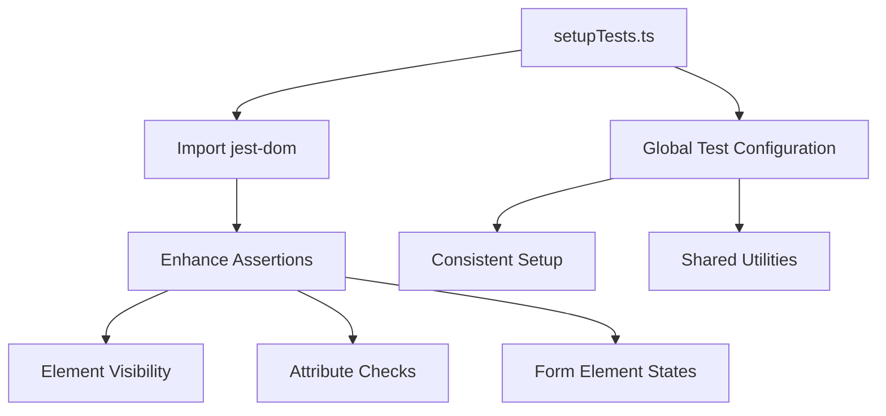
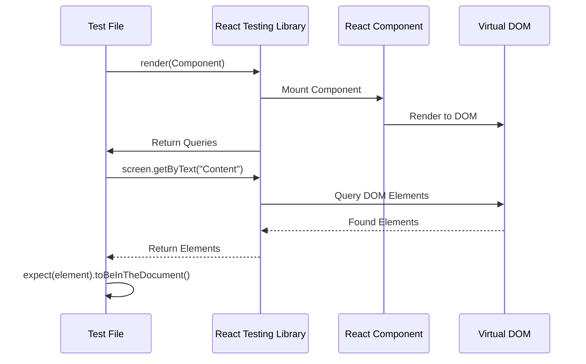
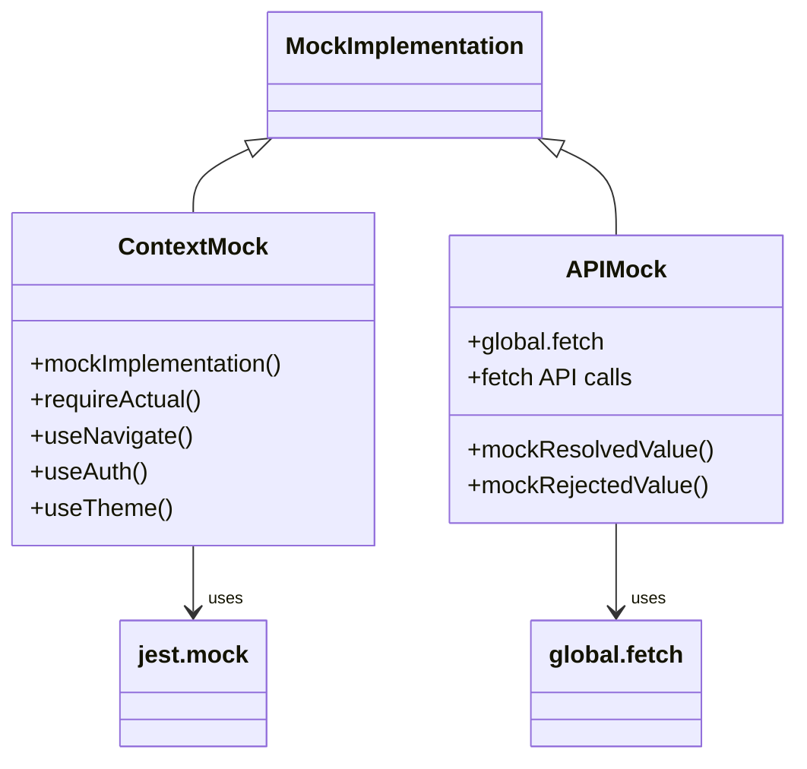

# Frontend Testing

<cite>
**Referenced Files in This Document**   
- [jest.config.js](file://pikzels-clone/client/jest.config.js)
- [setupTests.ts](file://pikzels-clone/client/src/setupTests.ts)
- [LandingPage.test.tsx](file://pikzels-clone/client/src/components/LandingPage.test.tsx)
- [UserSettings.test.tsx](file://pikzels-clone/client/src/components/UserSettings.test.tsx)
- [LandingPage.tsx](file://pikzels-clone/client/src/components/LandingPage.tsx)
- [UserSettings.tsx](file://pikzels-clone/client/src/components/UserSettings.tsx)
- [AuthContext.tsx](file://pikzels-clone/client/src/contexts/AuthContext.tsx)
- [ThemeContext.tsx](file://pikzels-clone/client/src/contexts/ThemeContext.tsx)
</cite>

## Table of Contents
1. [Introduction](#introduction)
2. [Jest Configuration and Test Environment](#jest-configuration-and-test-environment)
3. [Test Initialization and Setup](#test-initialization-and-setup)
4. [Component Testing with React Testing Library](#component-testing-with-react-testing-library)
5. [Testing UI Components](#testing-ui-components)
6. [Context and API Mocking](#context-and-api-mocking)
7. [Maintainable Testing Practices](#maintainable-testing-practices)
8. [Test Coverage and Development Integration](#test-coverage-and-development-integration)

## Introduction
This document provides comprehensive guidance on frontend testing practices within the React application for ThumbnailMaker. It covers the complete testing configuration, component testing strategies, mocking techniques, and best practices for maintaining a robust test suite. The focus is on practical implementation using Jest and React Testing Library to ensure high-quality, reliable frontend code.

## Jest Configuration and Test Environment

The Jest testing framework is configured specifically for the React application with appropriate environment settings and module mappings. The configuration ensures smooth execution of tests while handling various file types and transformations.

```mermaid
flowchart TD
A[Jest Configuration] --> B[Test Environment: jsdom]
A --> C[Module Mapping for CSS]
A --> D[TypeScript Transformation]
A --> E[Test File Pattern Matching]
B --> F[Simulates Browser Environment]
C --> G[identity-obj-proxy for CSS]
D --> H[ts-jest for TypeScript]
E --> I[Matches *.test.(ts|tsx)]
```

**Diagram sources**
- [jest.config.js](file://pikzels-clone/client/jest.config.js)

**Section sources**
- [jest.config.js](file://pikzels-clone/client/jest.config.js)

### Test Environment Configuration
The test environment is set to jsdom, which provides a simulated browser environment for running tests. This allows components to render and interact with a virtual DOM, enabling comprehensive testing of React components as they would behave in a real browser.

### CSS Module Mapping
CSS files are mapped to identity-obj-proxy through the moduleNameMapper configuration. This approach prevents actual CSS loading during tests while preserving class names for testing purposes. The mapping transforms CSS imports into JavaScript objects, allowing tests to verify class usage without requiring actual style processing.

### TypeScript Transformation
TypeScript files are transformed using ts-jest, which enables Jest to understand and execute TypeScript code. This transformation is essential for type checking and proper compilation of TypeScript files during the testing process, ensuring that type-related issues are caught early in development.

## Test Initialization and Setup

The test suite is initialized through the setupFilesAfterEnv configuration, which specifies setup files to run after the test framework is initialized. This ensures consistent test environment configuration across all test files.



**Diagram sources**
- [setupTests.ts](file://pikzels-clone/client/src/setupTests.ts)

**Section sources**
- [setupTests.ts](file://pikzels-clone/client/src/setupTests.ts)

### setupFilesAfterEnv Implementation
The setupFilesAfterEnv configuration in jest.config.js points to setupTests.ts, which imports @testing-library/jest-dom. This import extends Jest's expect functionality with additional matchers specifically designed for testing DOM elements, making assertions more intuitive and readable.

### Enhanced Assertion Capabilities
The imported jest-dom library provides custom matchers that simplify common DOM assertions. These include methods for checking element visibility, attribute values, form element states, and accessibility features. The enhanced assertion capabilities improve test readability and reduce the need for complex query logic in test assertions.

## Component Testing with React Testing Library

React Testing Library is used to test components in a way that simulates real user interactions. The approach focuses on testing component behavior rather than implementation details, ensuring that tests remain resilient to refactoring.



**Diagram sources**
- [LandingPage.test.tsx](file://pikzels-clone/client/src/components/LandingPage.test.tsx)
- [UserSettings.test.tsx](file://pikzels-clone/client/src/components/UserSettings.test.tsx)

**Section sources**
- [LandingPage.test.tsx](file://pikzels-clone/client/src/components/LandingPage.test.tsx)
- [UserSettings.test.tsx](file://pikzels-clone/client/src/components/UserSettings.test.tsx)

### LandingPage Component Testing
The LandingPage.test.tsx file demonstrates comprehensive testing of the landing page component. Tests verify the rendering of key elements such as the main heading, description text, navigation buttons, feature highlights, testimonials, and footer content. The tests use getByText and getByRole queries to locate elements based on their content and semantic roles.

### UserSettings Component Testing
The UserSettings.test.tsx file implements testing for the user settings component with a focus on asynchronous operations. Tests cover loading states, successful data fetching, error handling, and state transitions. The component's dependency on API calls is mocked using Jest's mock functions, allowing isolated testing of component behavior.

## Testing UI Components

UI components such as buttons, forms, and modals are tested for proper rendering, user interaction, and state management. The testing approach emphasizes user-centric testing patterns that simulate real user behavior.

### Button Component Testing
Buttons are tested using semantic queries like getByRole to ensure they are properly labeled and accessible. Tests verify button text content, click handlers, and visual states. The getByRole method with 'button' role ensures that buttons are properly implemented in the accessibility tree.

### Form Component Testing
Form elements are tested for proper rendering, user input handling, and validation states. Tests verify that input fields accept user input, display appropriate placeholder text, and respond correctly to user interactions. Form submission behavior and error states are also validated through comprehensive test cases.

### Modal Component Testing
Modal components are tested for proper opening and closing behavior, backdrop interaction, and keyboard navigation. Tests verify that modals can be dismissed by clicking outside, pressing escape, or using close buttons. Accessibility features such as focus trapping are also validated in modal tests.

## Context and API Mocking

Context providers and API calls are mocked to isolate component testing and simulate various application states. This approach allows comprehensive testing of component behavior under different conditions without relying on external services.



**Diagram sources**
- [AuthContext.tsx](file://pikzels-clone/client/src/contexts/AuthContext.tsx)
- [ThemeContext.tsx](file://pikzels-clone/client/src/contexts/ThemeContext.tsx)
- [UserSettings.test.tsx](file://pikzels-clone/client/src/components/UserSettings.test.tsx)

**Section sources**
- [AuthContext.tsx](file://pikzels-clone/client/src/contexts/AuthContext.tsx)
- [ThemeContext.tsx](file://pikzels-clone/client/src/contexts/ThemeContext.tsx)
- [UserSettings.test.tsx](file://pikzels-clone/client/src/components/UserSettings.test.tsx)

### Context Mocking Strategy
Context providers such as AuthContext and ThemeContext are mocked using Jest's module mocking capabilities. The mock implementation preserves actual functionality while allowing specific hooks to be overridden. This approach enables testing of components that depend on context values without requiring the actual context provider hierarchy.

### API Call Mocking
API calls are mocked using Jest's mock functions, with global.fetch being replaced by a mock implementation. This allows tests to simulate successful responses, error conditions, and network failures. The mock implementation can be configured to return specific response objects, enabling comprehensive testing of component behavior under various API response scenarios.

## Maintainable Testing Practices

The test suite follows best practices for writing maintainable and effective component tests. These practices ensure that tests remain reliable, readable, and resilient to implementation changes.

### Test Structure and Organization
Tests are organized using describe and test blocks to group related functionality. beforeEach hooks are used to set up common test conditions, reducing code duplication. Test names are written in a way that clearly describes the expected behavior, making it easy to understand what each test verifies.

### Asynchronous Testing
Asynchronous operations are handled using async/await syntax and waitFor utilities. This ensures that tests wait for component state changes and API responses before making assertions. The waitFor function is used to wait for elements to appear or disappear, preventing timing-related test failures.

### Accessibility Testing
Accessibility features are tested using appropriate queries and assertions. Elements are verified to have proper ARIA attributes, keyboard navigation support, and screen reader compatibility. The jest-dom library provides specific matchers for testing accessibility features, ensuring that components meet accessibility standards.

## Test Coverage and Development Integration

Test coverage reporting is integrated into the development workflow to ensure comprehensive test coverage. The testing setup is designed to provide fast feedback and encourage regular test execution.

### Coverage Reporting
Jest provides built-in coverage reporting that measures the percentage of code executed during tests. The coverage report highlights untested code paths, helping developers identify areas that need additional test coverage. This information is used to improve test completeness and ensure critical functionality is properly tested.

### Development Workflow Integration
The testing setup is integrated into the development workflow through npm scripts and CI/CD pipelines. Tests are executed automatically during development and before code deployment. The fast feedback loop encourages developers to write and run tests regularly, maintaining code quality throughout the development process.

### Continuous Integration
The test suite is executed as part of the CI/CD pipeline, ensuring that all tests pass before code is merged. This prevents regressions and maintains code quality across the codebase. Test results are reported in the CI system, providing visibility into test status and coverage metrics.