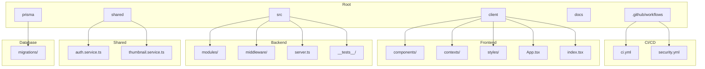
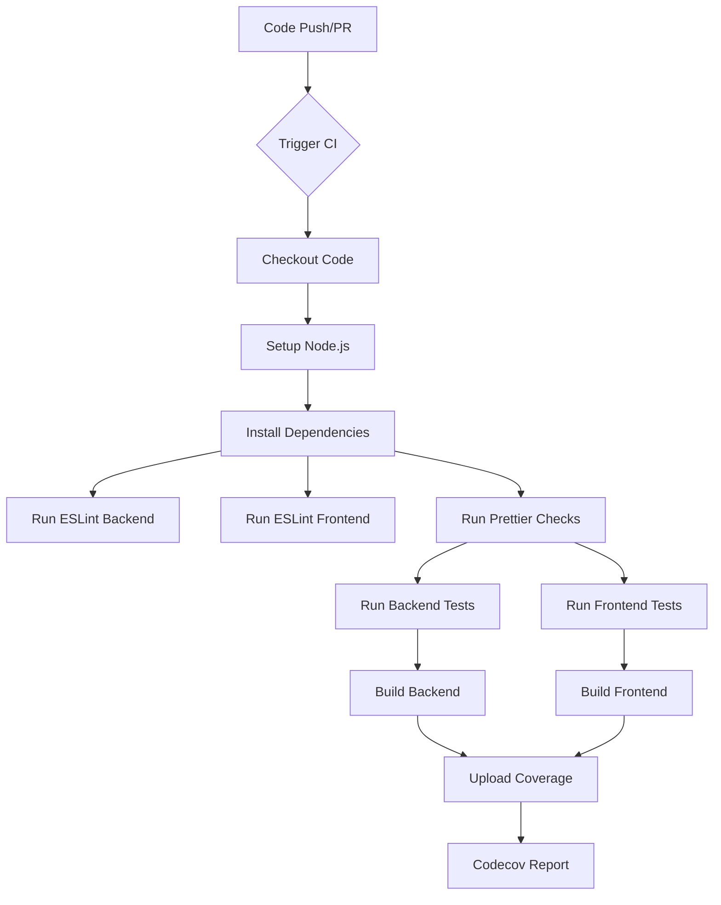
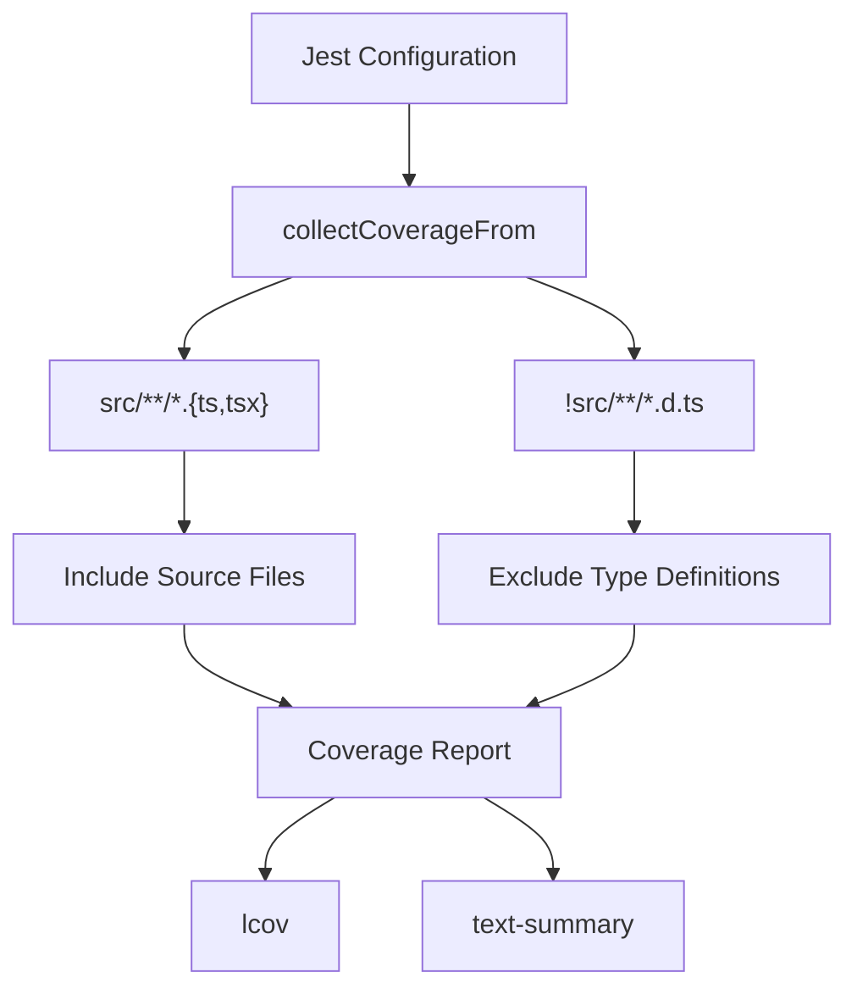
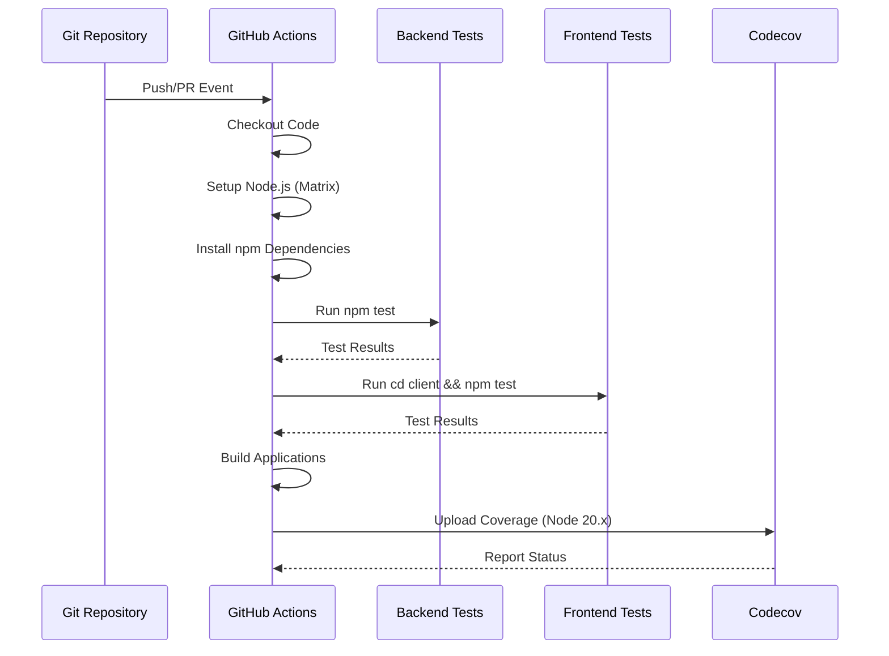
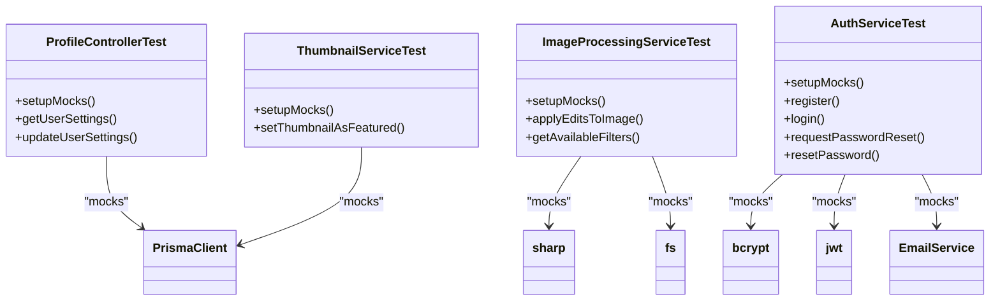
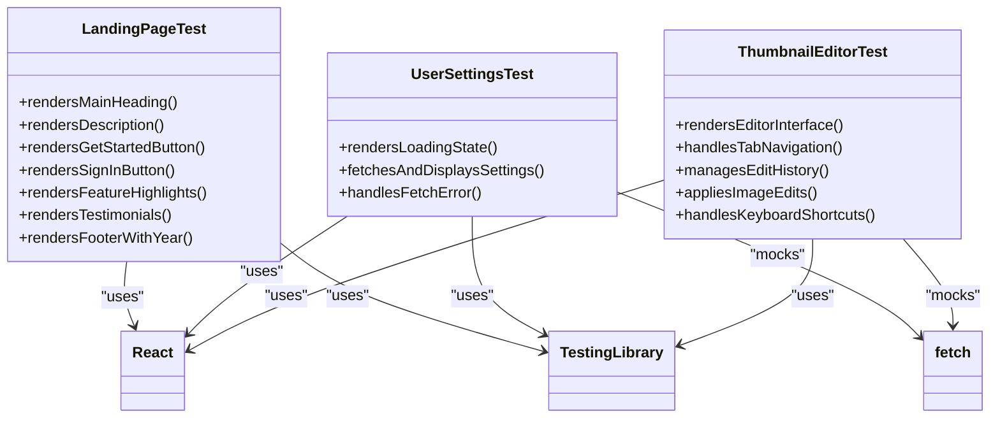
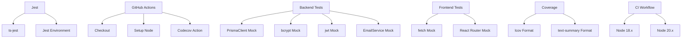

# Test Coverage and Continuous Integration

<cite>
**Referenced Files in This Document**   
- [jest.config.js](file://pikzels-clone/jest.config.js)
- [ci.yml](file://pikzels-clone/.github/workflows/ci.yml)
- [profile.controller.test.ts](file://pikzels-clone/src/modules/auth/profile.controller.test.ts)
- [thumbnail.service.test.ts](file://pikzels-clone/src/modules/thumbnail/thumbnail.service.test.ts)
- [image-processing.service.test.ts](file://pikzels-clone/src/modules/thumbnail/__tests__/image-processing.service.test.ts)
- [LandingPage.test.tsx](file://pikzels-clone/client/src/components/LandingPage.test.tsx)
- [UserSettings.test.tsx](file://pikzels-clone/client/src/components/UserSettings.test.tsx)
- [analytics.service.ts](file://pikzels-clone/src/modules/analytics/analytics.service.ts)
- [ThumbnailEditor.tsx](file://pikzels-clone/client/src/components/ThumbnailEditor.tsx)
- [auth.service.ts](file://pikzels-clone/src/modules/auth/auth.service.ts)
</cite>

## Table of Contents
1. [Introduction](#introduction)
2. [Project Structure](#project-structure)
3. [Core Components](#core-components)
4. [Architecture Overview](#architecture-overview)
5. [Detailed Component Analysis](#detailed-component-analysis)
6. [Dependency Analysis](#dependency-analysis)
7. [Performance Considerations](#performance-considerations)
8. [Troubleshooting Guide](#troubleshooting-guide)
9. [Conclusion](#conclusion)

## Introduction
This document provides a comprehensive overview of test coverage measurement and integration with CI/CD pipelines in the Thumbnail Maker application. It details how Jest is configured to collect coverage from source files while excluding type definitions, how coverage thresholds are enforced, and how reports are generated in multiple formats. The document also covers the execution of frontend and backend test suites within the GitHub Actions CI workflow, including parallel test runs and failure conditions. Additional topics include displaying test results in pull requests, monitoring coverage trends over time, performance considerations for large test suites, and integration with external code quality tools.

## Project Structure

The project follows a modular structure with clear separation between frontend and backend components. The backend is organized into feature-based modules under `src/modules`, each containing controllers, routes, services, and tests. The frontend is structured under `client/src/components` with a component-based architecture. Test files are colocated with their corresponding source files using standard naming conventions (`*.test.ts`, `*.test.tsx`).

**Diagram sources**
- [pikzels-clone/.github/workflows/ci.yml](file://pikzels-clone/.github/workflows/ci.yml)
- [pikzels-clone/client/src/components](file://pikzels-clone/client/src/components)
- [pikzels-clone/src/modules](file://pikzels-clone/src/modules)
- [pikzels-clone/prisma/migrations](file://pikzels-clone/prisma/migrations)

**Section sources**
- [pikzels-clone/.github/workflows/ci.yml](file://pikzels-clone/.github/workflows/ci.yml)
- [pikzels-clone/client](file://pikzels-clone/client)
- [pikzels-clone/src](file://pikzels-clone/src)

## Core Components

The core components of the testing and CI/CD system include Jest configuration for coverage collection, GitHub Actions workflows for CI execution, and various test suites for both frontend and backend functionality. The Jest configuration specifies source file inclusion and type definition exclusion through the `collectCoverageFrom` setting. The CI workflow in `ci.yml` orchestrates the execution of tests across multiple Node.js versions with parallel execution capabilities.

**Section sources**
- [pikzels-clone/jest.config.js](file://pikzels-clone/jest.config.js)
- [pikzels-clone/.github/workflows/ci.yml](file://pikzels-clone/.github/workflows/ci.yml)

## Architecture Overview

The CI/CD architecture integrates test execution with code quality checks and coverage reporting. When code is pushed to main or develop branches, or when pull requests are created against these branches, the CI workflow triggers. It runs on Ubuntu runners with matrix strategy for multiple Node.js versions. The workflow includes steps for code checkout, dependency installation, linting, testing, building, and coverage reporting. Test results and coverage data are collected and can be displayed in pull requests.

**Diagram sources**
- [pikzels-clone/.github/workflows/ci.yml](file://pikzels-clone/.github/workflows/ci.yml)

## Detailed Component Analysis

### Test Coverage Configuration

The Jest configuration in `jest.config.js` is set up to collect coverage from TypeScript source files while excluding type definition files. The `collectCoverageFrom` setting includes all `.ts` and `.tsx` files under the `src` directory but excludes files ending with `.d.ts`. This ensures that implementation code is covered while type declarations are ignored.

**Diagram sources**
- [pikzels-clone/jest.config.js](file://pikzels-clone/jest.config.js)

**Section sources**
- [pikzels-clone/jest.config.js](file://pikzels-clone/jest.config.js)

### CI/CD Workflow Execution

The GitHub Actions workflow in `ci.yml` executes frontend and backend test suites in sequence after installing dependencies. The workflow uses a matrix strategy to run tests on Node.js 18.x and 20.x, ensuring compatibility across versions. Test results are generated in multiple formats, and coverage reports are uploaded to Codecov when running on Node.js 20.x.

**Diagram sources**
- [pikzels-clone/.github/workflows/ci.yml](file://pikzels-clone/.github/workflows/ci.yml)

**Section sources**
- [pikzels-clone/.github/workflows/ci.yml](file://pikzels-clone/.github/workflows/ci.yml)

### Backend Test Suite Analysis

The backend test suite includes unit tests for various modules such as authentication, analytics, and thumbnail processing. The tests use Jest for mocking dependencies like PrismaClient, allowing for isolated testing of business logic. Test files follow the pattern `*.test.ts` and are colocated with their corresponding implementation files.

**Diagram sources**
- [pikzels-clone/src/modules/auth/profile.controller.test.ts](file://pikzels-clone/src/modules/auth/profile.controller.test.ts)
- [pikzels-clone/src/modules/thumbnail/thumbnail.service.test.ts](file://pikzels-clone/src/modules/thumbnail/thumbnail.service.test.ts)
- [pikzels-clone/src/modules/thumbnail/__tests__/image-processing.service.test.ts](file://pikzels-clone/src/modules/thumbnail/__tests__/image-processing.service.test.ts)
- [pikzels-clone/src/modules/auth/auth.service.ts](file://pikzels-clone/src/modules/auth/auth.service.ts)

**Section sources**
- [pikzels-clone/src/modules/auth/profile.controller.test.ts](file://pikzels-clone/src/modules/auth/profile.controller.test.ts)
- [pikzels-clone/src/modules/thumbnail/thumbnail.service.test.ts](file://pikzels-clone/src/modules/thumbnail/thumbnail.service.test.ts)
- [pikzels-clone/src/modules/thumbnail/__tests__/image-processing.service.test.ts](file://pikzels-clone/src/modules/thumbnail/__tests__/image-processing.service.test.ts)

### Frontend Test Suite Analysis

The frontend test suite includes component tests for key UI elements such as the LandingPage and UserSettings components. These tests use React Testing Library to render components and verify their behavior. The tests check for proper rendering of elements, correct handling of user interactions, and appropriate state management.

**Diagram sources**
- [pikzels-clone/client/src/components/LandingPage.test.tsx](file://pikzels-clone/client/src/components/LandingPage.test.tsx)
- [pikzels-clone/client/src/components/UserSettings.test.tsx](file://pikzels-clone/client/src/components/UserSettings.test.tsx)
- [pikzels-clone/client/src/components/ThumbnailEditor.tsx](file://pikzels-clone/client/src/components/ThumbnailEditor.tsx)

**Section sources**
- [pikzels-clone/client/src/components/LandingPage.test.tsx](file://pikzels-clone/client/src/components/LandingPage.test.tsx)
- [pikzels-clone/client/src/components/UserSettings.test.tsx](file://pikzels-clone/client/src/components/UserSettings.test.tsx)

## Dependency Analysis

The testing infrastructure has dependencies on various tools and services. Jest is the primary testing framework, with ts-jest for TypeScript support. The CI/CD pipeline depends on GitHub Actions runners and the Codecov action for coverage reporting. Backend tests mock dependencies like PrismaClient, bcrypt, jwt, and EmailService, while frontend tests mock the fetch API and router functionality.

**Diagram sources**
- [pikzels-clone/jest.config.js](file://pikzels-clone/jest.config.js)
- [pikzels-clone/.github/workflows/ci.yml](file://pikzels-clone/.github/workflows/ci.yml)
- [pikzels-clone/src/modules/auth/profile.controller.test.ts](file://pikzels-clone/src/modules/auth/profile.controller.test.ts)
- [pikzels-clone/client/src/components/UserSettings.test.tsx](file://pikzels-clone/client/src/components/UserSettings.test.tsx)

**Section sources**
- [pikzels-clone/jest.config.js](file://pikzels-clone/jest.config.js)
- [pikzels-clone/.github/workflows/ci.yml](file://pikzels-clone/.github/workflows/ci.yml)

## Performance Considerations

Running large test suites can be time-consuming, especially when testing across multiple Node.js versions. The current CI configuration runs tests sequentially on different Node versions, which could be optimized by running them in parallel. Test execution speed can be improved by optimizing test setup and teardown, reducing the number of mocks, and using test concurrency features in Jest. For large applications, consider splitting tests into smaller groups that can be run independently.

Strategies for optimizing test execution speed include:
- Using Jest's `--maxWorkers` flag to control parallelization
- Implementing test sharding to distribute tests across multiple runners
- Caching dependencies between runs
- Running only changed tests in development
- Using lightweight mocks instead of full implementations

**Section sources**
- [pikzels-clone/.github/workflows/ci.yml](file://pikzels-clone/.github/workflows/ci.yml)
- [pikzels-clone/jest.config.js](file://pikzels-clone/jest.config.js)

## Troubleshooting Guide

Common issues in the test and CI/CD pipeline include:
- Test failures due to missing environment variables
- Coverage reporting issues when Codecov action fails
- Type errors in test files
- Mock configuration problems
- Timeout errors in asynchronous tests

To troubleshoot coverage reporting issues:
1. Verify that Jest is configured to generate coverage reports
2. Check that the `collectCoverageFrom` pattern matches the intended source files
3. Ensure that coverage files are being generated in the expected location
4. Verify that the Codecov upload step has the correct permissions
5. Check for any errors in the CI logs during the coverage upload step

For test failures, examine the specific error messages and stack traces. Use Jest's verbose output mode to get more detailed information about failing tests. When tests fail due to timing issues, consider increasing the timeout values or using Jest's fake timers for better control over asynchronous operations.

**Section sources**
- [pikzels-clone/jest.config.js](file://pikzels-clone/jest.config.js)
- [pikzels-clone/.github/workflows/ci.yml](file://pikzels-clone/.github/workflows/ci.yml)
- [pikzels-clone/src/modules/auth/profile.controller.test.ts](file://pikzels-clone/src/modules/auth/profile.controller.test.ts)

## Conclusion

The test coverage and CI/CD system in the Thumbnail Maker application provides a robust foundation for maintaining code quality. The Jest configuration effectively collects coverage from source files while excluding type definitions, and the GitHub Actions workflow ensures that tests are run consistently across different environments. By integrating with Codecov, the project can monitor coverage trends over time and identify untested code paths. The test suites cover both frontend and backend functionality, with comprehensive tests for critical features like authentication, analytics, and thumbnail processing. To further improve the system, consider implementing coverage thresholds, optimizing test execution speed, and expanding integration with additional code quality tools.