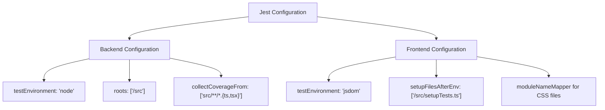
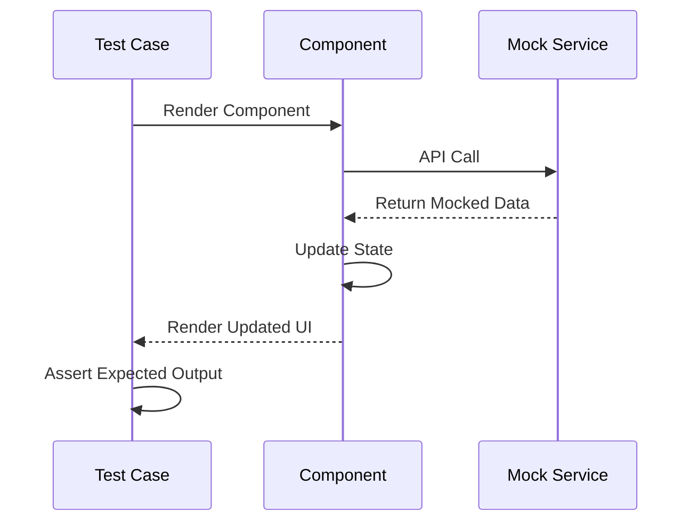

# Testing Strategy

<cite>
**Referenced Files in This Document**   
- [jest.config.js](file://pikzels-clone/jest.config.js)
- [client/jest.config.js](file://pikzels-clone/client/jest.config.js)
- [client/src/setupTests.ts](file://pikzels-clone/client/src/setupTests.ts)
- [src/__tests__/social-share.test.ts](file://pikzels-clone/src/__tests__/social-share.test.ts)
- [client/src/components/LandingPage.test.tsx](file://pikzels-clone/client/src/components/LandingPage.test.tsx)
- [client/src/components/UserSettings.test.tsx](file://pikzels-clone/client/src/components/UserSettings.test.tsx)
- [DEVELOPMENT_WORKFLOW.md](file://pikzels-clone/DEVELOPMENT_WORKFLOW.md)
- [Project Task Overview.md](file://pikzels-clone/Project Task Overview.md)
</cite>

## Table of Contents
1. [Testing Pyramid Implementation](#testing-pyramid-implementation)
2. [Jest Configuration](#jest-configuration)
3. [Test Coverage and Reporting](#test-coverage-and-reporting)
4. [Critical Component Test Examples](#critical-component-test-examples)
5. [Testing Utilities and Mocks](#testing-utilities-and-mocks)
6. [End-to-End and UI Component Testing](#end-to-end-and-ui-component-testing)
7. [Test Organization and CI Practices](#test-organization-and-ci-practices)

## Testing Pyramid Implementation

The project implements a comprehensive testing pyramid with three distinct layers: unit, integration, and component tests. Unit tests focus on isolated functions and utilities, ensuring individual code units behave as expected. Integration tests verify the interaction between components, particularly API endpoints and database operations, as demonstrated in the social sharing module tests. Component tests validate React UI components in isolation, ensuring proper rendering and user interaction. The testing strategy prioritizes a higher volume of unit tests at the base, fewer integration tests in the middle layer, and targeted component tests at the top, creating a balanced quality assurance approach that maximizes test effectiveness while minimizing maintenance overhead.

**Section sources**
- [src/__tests__/social-share.test.ts](file://pikzels-clone/src/__tests__/social-share.test.ts)
- [client/src/components/LandingPage.test.tsx](file://pikzels-clone/client/src/components/LandingPage.test.tsx)
- [client/src/components/UserSettings.test.tsx](file://pikzels-clone/client/src/components/UserSettings.test.tsx)

## Jest Configuration

The project employs separate Jest configurations for frontend and backend testing environments to accommodate their distinct requirements. The backend configuration (`jest.config.js`) uses `ts-jest` preset with `node` test environment, targeting TypeScript files in the `src` directory and collecting coverage from all TypeScript files except type definitions. The frontend configuration (`client/jest.config.js`) sets the test environment to `jsdom` to simulate browser behavior, includes `setupFilesAfterEnv` to configure testing utilities, and uses `identity-obj-proxy` to handle CSS imports during testing. Both configurations leverage `ts-jest` for TypeScript transformation, ensuring consistent type checking across test suites.

**Diagram sources**
- [jest.config.js](file://pikzels-clone/jest.config.js)
- [client/jest.config.js](file://pikzels-clone/client/jest.config.js)

**Section sources**
- [jest.config.js](file://pikzels-clone/jest.config.js)
- [client/jest.config.js](file://pikzels-clone/client/jest.config.js)

## Test Coverage and Reporting

The testing framework includes comprehensive coverage reporting through Jest's built-in coverage collection mechanism. The configuration specifies `collectCoverageFrom` to include all TypeScript files in the `src` directory while excluding type definition files. Coverage reports track statement, branch, function, and line coverage, providing detailed insights into code quality. The development workflow integrates coverage checks as part of the quality assurance process, ensuring that new code maintains adequate test coverage. Reports are generated during test execution and can be viewed in multiple formats, including console output, HTML reports, and lcov for integration with code quality tools.

**Section sources**
- [jest.config.js](file://pikzels-clone/jest.config.js)
- [DEVELOPMENT_WORKFLOW.md](file://pikzels-clone/DEVELOPMENT_WORKFLOW.md)

## Critical Component Test Examples

The codebase includes test implementations for critical components such as social sharing, user settings, and landing page functionality. The social sharing tests validate API endpoint behavior, particularly authentication requirements, by verifying that endpoints return 401 status codes when no token is provided. The UserSettings component tests verify proper rendering, loading states, and error handling by mocking the fetch API and localStorage. The LandingPage tests ensure correct rendering of key elements like headings, buttons, and testimonials using React Testing Library. These tests demonstrate the use of mocks, assertions, and asynchronous testing patterns to validate component behavior under various conditions.

**Diagram sources**
- [src/__tests__/social-share.test.ts](file://pikzels-clone/src/__tests__/social-share.test.ts)
- [client/src/components/UserSettings.test.tsx](file://pikzels-clone/client/src/components/UserSettings.test.tsx)
- [client/src/components/LandingPage.test.tsx](file://pikzels-clone/client/src/components/LandingPage.test.tsx)

**Section sources**
- [src/__tests__/social-share.test.ts](file://pikzels-clone/src/__tests__/social-share.test.ts)
- [client/src/components/UserSettings.test.tsx](file://pikzels-clone/client/src/components/UserSettings.test.tsx)
- [client/src/components/LandingPage.test.tsx](file://pikzels-clone/client/src/components/LandingPage.test.tsx)

## Testing Utilities and Mocks

The testing strategy employs various utilities and mocks to simulate database and external service interactions. The frontend tests use Jest's mocking capabilities to intercept API calls and simulate different response scenarios, including success and error conditions. The setupTests.ts file imports `@testing-library/jest-dom` to extend Jest with additional DOM-based assertions. Component tests mock external dependencies like `react-router-dom` to isolate component behavior. The UserSettings tests demonstrate API mocking by replacing the global fetch function with a Jest mock, while the LandingPage test shows router mocking by replacing `useNavigate`. These mocking strategies enable comprehensive testing without relying on actual external services.

**Section sources**
- [client/src/setupTests.ts](file://pikzels-clone/client/src/setupTests.ts)
- [client/src/components/UserSettings.test.tsx](file://pikzels-clone/client/src/components/UserSettings.test.tsx)
- [client/src/components/LandingPage.test.tsx](file://pikzels-clone/client/src/components/LandingPage.test.tsx)

## End-to-End and UI Component Testing

The project implements UI component testing using React Testing Library, following best practices for testing React components. Tests focus on user-facing behavior rather than implementation details, using queries like `getByRole`, `getByText`, and `getByTestId` to locate elements. The LandingPage tests verify the presence of key content elements and interactive components, ensuring the page renders correctly. The UserSettings tests validate both successful data loading and error handling scenarios, demonstrating comprehensive coverage of component states. The testing approach emphasizes testing components in isolation with mocked dependencies, ensuring fast and reliable test execution while maintaining high confidence in component behavior.

**Section sources**
- [client/src/components/LandingPage.test.tsx](file://pikzels-clone/client/src/components/LandingPage.test.tsx)
- [client/src/components/UserSettings.test.tsx](file://pikzels-clone/client/src/components/UserSettings.test.tsx)
- [client/src/setupTests.ts](file://pikzels-clone/client/src/setupTests.ts)

## Test Organization and CI Practices

The testing strategy follows a well-organized structure with tests colocated with their corresponding source files or placed in dedicated `__tests__` directories. The development workflow integrates automated testing into the CI/CD pipeline, running tests on every push and pull request. Pre-commit hooks execute linting and testing to catch issues early in the development process. The project uses conventional commits to maintain consistency in commit messages, facilitating automated changelog generation and release management. The CI pipeline runs on multiple Node.js versions to ensure compatibility, and includes security audits to identify potential vulnerabilities. This comprehensive approach ensures code quality is maintained throughout the development lifecycle.

**Section sources**
- [DEVELOPMENT_WORKFLOW.md](file://pikzels-clone/DEVELOPMENT_WORKFLOW.md)
- [Project Task Overview.md](file://pikzels-clone/Project Task Overview.md)
- [jest.config.js](file://pikzels-clone/jest.config.js)