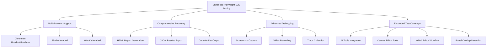
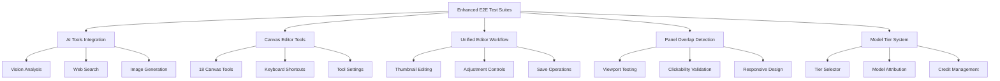
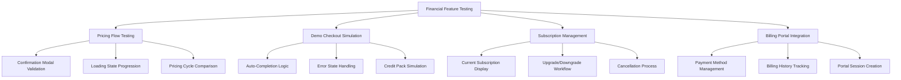
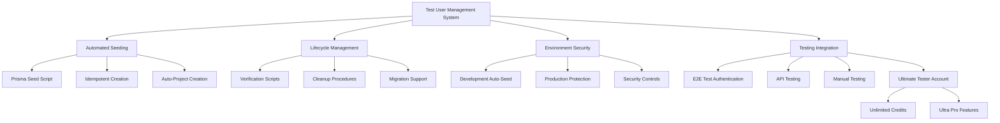
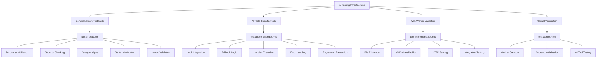
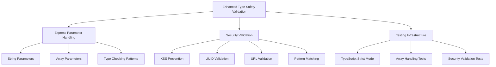

# Testing Strategy

<cite>
**Referenced Files in This Document**
- [jest.config.js](file://pikzels-clone/jest.config.js)
- [client/jest.config.cjs](file://pikzels-clone/client/jest.config.cjs)
- [src/__tests__/setup.ts](file://pikzels-clone/src/__tests__/setup.ts)
- [tsconfig.test.json](file://pikzels-clone/tsconfig.test.json)
- [package.json](file://pikzels-clone/package.json)
- [playwright.config.ts](file://pikzels-clone/playwright.config.ts)
- [tests/e2e/thumbnail-operations.spec.ts](file://pikzels-clone/tests/e2e/thumbnail-operations.spec.ts)
- [tests/e2e/pricing-checkout-flow.spec.ts](file://pikzels-clone/tests/e2e/pricing-checkout-flow.spec.ts)
- [tests/e2e/ai-tools-integration.spec.ts](file://pikzels-clone/tests/e2e/ai-tools-integration.spec.ts)
- [tests/e2e/canvas-editor-tools.spec.ts](file://pikzels-clone/tests/e2e/canvas-editor-tools.spec.ts)
- [tests/e2e/unified-editor.spec.ts](file://pikzels-clone/tests/e2e/unified-editor.spec.ts)
- [tests/e2e/panel-overlap.spec.ts](file://pikzels-clone/tests/e2e/panel-overlap.spec.ts)
- [tests/e2e/model-tiers.spec.ts](file://pikzels-clone/tests/e2e/model-tiers.spec.ts)
- [src/modules/thumbnail/thumbnail.service.test.ts](file://pikzels-clone/src/modules/thumbnail/thumbnail.service.test.ts)
- [src/modules/auth/profile.controller.test.ts](file://pikzels-clone/src/modules/auth/profile.controller.test.ts)
- [client/src/components/LandingPage.test.tsx](file://pikzels-clone/client/src/components/LandingPage.test.tsx)
- [client/src/components/dashboard/DemoCheckout.tsx](file://pikzels-clone/client/src/components/dashboard/DemoCheckout.tsx)
- [client/src/components/dashboard/SubscriptionManagement.tsx](file://pikzels-clone/client/src/components/dashboard/SubscriptionManagement.tsx)
- [client/src/components/account/AccountPage.tsx](file://pikzels-clone/client/src/components/account/AccountPage.tsx)
- [src/modules/billing/billing.controller.ts](file://pikzels-clone/src/modules/billing/billing.controller.ts)
- [src/modules/billing/billing.routes.ts](file://pikzels-clone/src/modules/billing/billing.routes.ts)
- [src/modules/billing/billing.service.ts](file://pikzels-clone/src/modules/billing/billing.service.ts)
- [prisma/seed.ts](file://pikzels-clone/prisma/seed.ts)
- [TEST_USER_SETUP_GUIDE.md](file://pikzels-clone/TEST_USER_SETUP_GUIDE.md)
- [TEST_USERS_QUICKREF.md](file://pikzels-clone/TEST_USERS_QUICKREF.md)
- [TEST_USERS_SECURITY.md](file://pikzels-clone/TEST_USERS_SECURITY.md)
- [TEST_USER_IMPLEMENTATION.md](file://pikzels-clone/TEST_USER_IMPLEMENTATION.md)
- [TEST_CREDENTIALS.md](file://pikzels-clone/TEST_CREDENTIALS.md)
- [create-test-users.ts](file://pikzels-clone/create-test-users.ts)
- [verify-test-users.ts](file://pikzels-clone/verify-test-users.ts)
- [remove-test-users.ts](file://pikzels-clone/remove-test-users.ts)
- [setup-all-test-users.ts](file://pikzels-clone/setup-all-test-users.ts)
- [.env.example](file://pikzels-clone/.env.example)
- [run-all-tests.mjs](file://pikzels-clone/client/run-all-tests.mjs)
- [test-aitools-changes.mjs](file://pikzels-clone/client/test-aitools-changes.mjs)
- [test-implementation.mjs](file://pikzels-clone/client/test-implementation.mjs)
- [test-worker.html](file://pikzels-clone/client/test-worker.html)
- [useAIWorker.ts](file://pikzels-clone/client/src/hooks/useAIWorker.ts)
- [ai-worker.ts](file://pikzels-clone/client/src/workers/ai-worker.ts)
- [ai-worker-types.ts](file://pikzels-clone/client/src/workers/ai-worker-types.ts)
- [AIToolsPage.tsx](file://pikzels-clone/client/src/components/dashboard/AIToolsPage.tsx)
- [test-results/test-results.json](file://pikzels-clone/test-results/test-results.json)
- [src/utils/auto-cleanup.ts](file://pikzels-clone/src/utils/auto-cleanup.ts)
- [src/utils/service-factory.ts](file://pikzels-clone/src/utils/service-factory.ts)
- [src/utils/prisma-factory.ts](file://pikzels-clone/src/utils/prisma-factory.ts)
- [TESTING_RULES.md](file://pikzels-clone/TESTING_RULES.md)
- [src/services/cache.service.ts](file://pikzels-clone/src/services/cache.service.ts)
- [src/events/analytics-handlers.ts](file://pikzels-clone/src/events/analytics-handlers.ts)
- [src/events/social-share-handlers.ts](file://pikzels-clone/src/events/social-share-handlers.ts)
- [src/modules/admin/system-monitoring.service.ts](file://pikzels-clone/src/modules/admin/system-monitoring.service.ts)
- [scripts/improve-coverage.js](file://pikzels-clone/scripts/improve-coverage.js)
- [src/middleware/validation.middleware.ts](file://pikzels-clone/src/middleware/validation.middleware.ts)
- [src/__tests__/security/validation.security.test.ts](file://pikzels-clone/src/__tests__/security/validation.security.test.ts)
- [src/middleware/__tests__/security.middleware.test.ts](file://pikzels-clone/src/middleware/__tests__/security.middleware.test.ts)
- [src/modules/ab-testing/ab-testing.controller.ts](file://pikzels-clone/src/modules/ab-testing/ab-testing.controller.ts)
- [tsconfig.json](file://pikzels-clone/tsconfig.json)
- [src/modules/storage/__tests__/storage.service.test.ts](file://pikzels-clone/src/modules/storage/__tests__/storage.service.test.ts)
- [src/modules/user-asset/__tests__/user-asset.service.test.ts](file://pikzels-clone/src/modules/user-asset/__tests__/user-asset.service.test.ts)
- [src/modules/user-url-history/__tests__/user-url-history.service.test.ts](file://pikzels-clone/src/modules/user-url-history/__tests__/user-url-history.service.test.ts)
- [src/modules/composition-layout/__tests__/composition-layout.service.test.ts](file://pikzels-clone/src/modules/composition-layout/__tests__/composition-layout.service.test.ts)
- [src/modules/editor-command/__tests__/editor-command.service.test.ts](file://pikzels-clone/src/modules/editor-command/__tests__/editor-command.service.test.ts)
- [src/modules/thumbnail/__tests__/replicate-ai.service.test.ts](file://pikzels-clone/src/modules/thumbnail/__tests__/replicate-ai.service.test.ts)
- [src/modules/social-share/__tests__/social-share.service.test.ts](file://pikzels-clone/src/modules/social-share/__tests__/social-share.service.test.ts)
- [src/modules/social-share/__tests__/batch-editing.service.test.ts](file://pikzels-clone/src/modules/social-share/__tests__/batch-editing.service.test.ts)
- [src/modules/subscription/subscription.config.ts](file://pikzels-clone/src/modules/subscription/subscription.config.ts)
- [client/src/components/dashboard/PricingPage.tsx](file://pikzels-clone/client/src/components/dashboard/PricingPage.tsx)
- [client/src/components/PikzelsLanding.tsx](file://pikzels-clone/client/src/components/PikzelsLanding.tsx)
- [client/src/components/dashboard/CreditsPage.tsx](file://pikzels-clone/client/src/components/dashboard/CreditsPage.tsx)
</cite>

## Update Summary
**Changes Made**
- Added comprehensive Ultimate Tester account (ultratester@thumpiks.com) with unlimited credits and Ultra Pro subscription for staging/QA environments
- Enhanced test user profiles with new 'ultratester' account having 'ultra_pro' plan and 999,999 credits
- Updated subscription management system to support unlimited credits testing
- Expanded test user management documentation with new account credentials and usage guidelines

## Table of Contents
1. [Testing Pyramid Implementation](#testing-pyramid-implementation)
2. [Unified Jest Configuration](#unified-jest-configuration)
3. [Playwright End-to-End Testing](#playwright-end-to-end-testing)
4. [Enhanced E2E Test Suites](#enhanced-e2e-test-suites)
5. [Financial Feature Testing Infrastructure](#financial-feature-testing-infrastructure)
6. [Auto-Cleanup Testing Infrastructure](#auto-cleanup-testing-infrastructure)
7. [Test User Management System](#test-user-management-system)
8. [Test Coverage and Reporting](#test-coverage-and-reporting)
9. [Critical Component Test Examples](#critical-component-test-examples)
10. [Testing Utilities and Mocks](#testing-utilities-and-mocks)
11. [AI Testing Infrastructure](#ai-testing-infrastructure)
12. [UI Component Testing with React Testing Library](#ui-component-testing-with-react-testing-library)
13. [Test Organization and CI Practices](#test-organization-and-ci-practices)

## Testing Pyramid Implementation

The project implements a comprehensive testing pyramid with three distinct layers: unit, integration, and component tests. The testing infrastructure has been significantly enhanced with Jest 29 upgrade and Playwright integration, supporting extensive test coverage across 400+ test cases.

**Updated** The testing infrastructure now includes substantially expanded service-layer testing with comprehensive unit tests for six new modules, creating a more robust foundation for quality assurance. The enhanced testing pyramid now includes:

- **StorageService**: 18 tests covering cloud storage operations, upload/download, and health monitoring
- **UserAssetService**: 16 tests validating asset management, database integration, and storage tracking
- **UserUrlHistoryService**: 12 tests for URL history persistence, eviction policies, and access control
- **CompositionLayoutService**: 25 tests for layout management, filtering, and CRUD operations
- **EditorCommandService**: 11 tests for AI-powered command parsing and credit management
- **ReplicateAIService**: 31 tests for AI image processing workflows including background removal, upscaling, and segmentation
- **SocialShareService**: 50+ tests for social media integration, batch operations, and analytics tracking
- **BatchEditingService**: 20+ tests for bulk thumbnail operations, validation, and workflow management

Unit tests focus on isolated functions and services, utilizing sophisticated mocking strategies with dependency injection patterns. Integration tests verify component interactions and API endpoints, particularly demonstrated in the thumbnail service tests that mock Prisma client, cache services, and event emitters. Component tests validate React UI components in isolation using React Testing Library, ensuring proper rendering and user interaction patterns.

The testing strategy prioritizes a higher volume of unit tests at the base (400+ tests), moderate integration tests in the middle layer, and comprehensive end-to-end tests at the top, creating a robust quality assurance approach that maximizes test effectiveness while maintaining optimal performance.

**Section sources**
- [src/modules/storage/__tests__/storage.service.test.ts:1-223](file://pikzels-clone/src/modules/storage/__tests__/storage.service.test.ts#L1-L223)
- [src/modules/user-asset/__tests__/user-asset.service.test.ts:1-234](file://pikzels-clone/src/modules/user-asset/__tests__/user-asset.service.test.ts#L1-L234)
- [src/modules/user-url-history/__tests__/user-url-history.service.test.ts:1-202](file://pikzels-clone/src/modules/user-url-history/__tests__/user-url-history.service.test.ts#L1-L202)
- [src/modules/composition-layout/__tests__/composition-layout.service.test.ts:1-286](file://pikzels-clone/src/modules/composition-layout/__tests__/composition-layout.service.test.ts#L1-L286)
- [src/modules/editor-command/__tests__/editor-command.service.test.ts:1-202](file://pikzels-clone/src/modules/editor-command/__tests__/editor-command.service.test.ts#L1-L202)
- [src/modules/thumbnail/__tests__/replicate-ai.service.test.ts:1-358](file://pikzels-clone/src/modules/thumbnail/__tests__/replicate-ai.service.test.ts#L1-L358)
- [src/modules/social-share/__tests__/social-share.service.test.ts:1-500](file://pikzels-clone/src/modules/social-share/__tests__/social-share.service.test.ts#L1-L500)
- [src/modules/social-share/__tests__/batch-editing.service.test.ts:1-250](file://pikzels-clone/src/modules/social-share/__tests__/batch-editing.service.test.ts#L1-L250)

## Unified Jest Configuration

**Updated Section** The project employs a consolidated Jest configuration approach that replaces the previous dual-environment setup with a unified backend-focused configuration. The centralized approach eliminates redundancy and provides consistent testing across the entire codebase.

The unified backend configuration (`jest.config.js`) utilizes `ts-jest` preset with `node` test environment, featuring modern globals injection and improved timeout handling. The configuration targets TypeScript files in the `src` directory with comprehensive coverage collection from all TypeScript files except type definitions and test files. The setup includes sophisticated ES module transformation for node_modules dependencies and enhanced mock clearing capabilities.

**Key Configuration Enhancements**:
- **Consolidated Setup**: Single Jest configuration replacing separate client/backend configs
- **Modern Globals**: Automatic injection of Jest 29 globals for improved test isolation
- **Enhanced Mock Management**: `clearMocks: true` for automatic mock call history clearing
- **ES Module Support**: Advanced transformation patterns for modern JavaScript modules
- **TypeScript Integration**: Dedicated test TypeScript configuration for optimal compilation
- **Coverage Thresholds**: Rigorous enforcement with adjusted percentages due to dead code removal

The configuration now includes comprehensive coverage thresholds that reflect the current codebase state:
- Branches: 23% (was 25%)
- Functions: 22% (was 25%)
- Lines: 29% (was 32%)
- Statements: 29% (was 32%)

**Section sources**
- [jest.config.js:1-55](file://pikzels-clone/jest.config.js#L1-L55)
- [tsconfig.test.json:1-18](file://pikzels-clone/tsconfig.test.json#L1-L18)

## Playwright End-to-End Testing

The project integrates comprehensive Playwright testing infrastructure for end-to-end validation of critical user workflows. The configuration supports multi-browser testing across Chromium, Firefox, and WebKit with both headed and headless modes. The setup includes sophisticated test project configuration with retry mechanisms, parallel execution control, and rich reporting capabilities.

**Updated** The test suite now includes comprehensive pricing and checkout flow testing through the new `tests/e2e/pricing-checkout-flow.spec.ts`, which validates subscription management, credit purchases, and billing portal interactions with realistic financial scenarios.

**Enhanced E2E Test Infrastructure**:

The project now includes seven comprehensive E2E test suites covering:

1. **AI Tools Integration** (`tests/e2e/ai-tools-integration.spec.ts`): Validates complete AI tool workflows including Vision Analysis, Web Search, Image Generation, and Canvas integration
2. **Canvas Editor Tools** (`tests/e2e/canvas-editor-tools.spec.ts`): Comprehensive testing of all 18 canvas tools, keyboard shortcuts, and panel interactions
3. **Unified Editor** (`tests/e2e/unified-editor.spec.ts`): End-to-end thumbnail editing workflow from navigation to saving changes
4. **Panel Overlap Detection** (`tests/e2e/panel-overlap.spec.ts`): Responsive design validation across multiple viewport sizes
5. **Model Tier System** (`tests/e2e/model-tiers.spec.ts`): Tier selector functionality and API integration testing
6. **Thumbnail Operations** (`tests/e2e/thumbnail-operations.spec.ts`): Core thumbnail lifecycle validation
7. **Pricing Checkout Flow** (`tests/e2e/pricing-checkout-flow.spec.ts`): Subscription and billing workflow validation

Key Playwright features implemented:
- Multi-browser device emulation with desktop Chrome, Firefox, and Safari
- Configurable timeout management (60 seconds per test, 10 seconds action timeout)
- Rich reporting with HTML, JSON, and list reporters
- Screenshot and video capture for failure analysis
- Responsive test selectors and fallback strategies
- Environment variable configuration for flexible deployment

**Diagram sources**
- [playwright.config.ts:1-119](file://pikzels-clone/playwright.config.ts#L1-L119)
- [tests/e2e/thumbnail-operations.spec.ts:1-442](file://pikzels-clone/tests/e2e/thumbnail-operations.spec.ts#L1-L442)
- [tests/e2e/ai-tools-integration.spec.ts:1-1228](file://pikzels-clone/tests/e2e/ai-tools-integration.spec.ts#L1-L1228)
- [tests/e2e/canvas-editor-tools.spec.ts:1-640](file://pikzels-clone/tests/e2e/canvas-editor-tools.spec.ts#L1-L640)
- [tests/e2e/unified-editor.spec.ts:1-388](file://pikzels-clone/tests/e2e/unified-editor.spec.ts#L1-L388)
- [tests/e2e/panel-overlap.spec.ts:1-321](file://pikzels-clone/tests/e2e/panel-overlap.spec.ts#L1-L321)
- [tests/e2e/model-tiers.spec.ts:1-242](file://pikzels-clone/tests/e2e/model-tiers.spec.ts#L1-L242)

**Section sources**
- [playwright.config.ts:1-119](file://pikzels-clone/playwright.config.ts#L1-L119)
- [tests/e2e/thumbnail-operations.spec.ts:1-442](file://pikzels-clone/tests/e2e/thumbnail-operations.spec.ts#L1-L442)
- [tests/e2e/pricing-checkout-flow.spec.ts:1-481](file://pikzels-clone/tests/e2e/pricing-checkout-flow.spec.ts#L1-L481)
- [tests/e2e/ai-tools-integration.spec.ts:1-1228](file://pikzels-clone/tests/e2e/ai-tools-integration.spec.ts#L1-L1228)
- [tests/e2e/canvas-editor-tools.spec.ts:1-640](file://pikzels-clone/tests/e2e/canvas-editor-tools.spec.ts#L1-L640)
- [tests/e2e/unified-editor.spec.ts:1-388](file://pikzels-clone/tests/e2e/unified-editor.spec.ts#L1-L388)
- [tests/e2e/panel-overlap.spec.ts:1-321](file://pikzels-clone/tests/e2e/panel-overlap.spec.ts#L1-L321)
- [tests/e2e/model-tiers.spec.ts:1-242](file://pikzels-clone/tests/e2e/model-tiers.spec.ts#L1-L242)

## Enhanced E2E Test Suites

**New Section** The project now includes seven comprehensive E2E test suites that validate critical user workflows and system functionality. These suites provide end-to-end coverage of AI tools, canvas editor, unified editor, and responsive design validation.

### AI Tools Integration Testing

The `tests/e2e/ai-tools-integration.spec.ts` suite validates the complete AI tool ecosystem within the Thumbnail Studio, covering:

**Core AI Features**:
- **Vision Analysis**: Gemini Vision integration for image description, element detection, and suggested prompts
- **Web Search**: Bing-powered image search with result grid display and addition to canvas
- **Image Generation**: Prompt-based generation with tier selection and model attribution
- **Canvas Integration**: AI-generated images added as layers with proper state management
- **End-to-End Workflows**: Complete journeys from AI tools to canvas manipulation

**Advanced Testing Capabilities**:
- Request/response validation for `/api/vision/describe` and `/api/vision/search`
- Mock API responses with comprehensive VisionAnalysisResult data
- Credit system validation with 402 error handling for insufficient credits
- Tier selector integration with model attribution display
- Keyboard shortcuts and accessibility compliance

### Canvas Editor Tools Testing

The `tests/e2e/canvas-editor-tools.spec.ts` suite provides comprehensive validation of all 18 canvas tools:

**Tool Categories**:
- **Selection Tools**: Select, Smart Select (AI), Move, Crop
- **Drawing Tools**: Brush, Eraser, Pen, Clone Stamp, Fill
- **Shape Tools**: Rectangle, Ellipse, Polygon, Line
- **Text & Utility**: Text tool, Eyedropper, Hand, Zoom
- **Advanced Tools**: Gradient, Smart Guides, Heatmap, Platform Preview

**Validation Scope**:
- Tool activation via click and keyboard shortcuts
- Tool settings panel visibility and controls
- Drawing tool color pickers and size controls
- Shape tool fill/stroke color management
- Undo/redo functionality with action tracking
- Export functionality across PNG, JPG, WebP formats
- Zoom controls and canvas interaction validation

### Unified Editor Workflow Testing

The `tests/e2e/unified-editor.spec.ts` suite validates the complete thumbnail editing workflow:

**Editor Flow Validation**:
- Thumbnail navigation from dashboard to editor
- Base layer loading and locking mechanisms
- Adjustment controls (brightness, contrast, saturation)
- CSS filter preview updates in real-time
- Save operation via API with response validation
- Change persistence and verification

**Advanced Features**:
- Direct URL navigation testing with thumbnail ID validation
- Blank canvas mode functionality
- Undo/redo state management
- Export quality settings and format selection
- Fullscreen mode and view controls

### Panel Overlap Detection Testing

The `tests/e2e/panel-overlap.spec.ts` suite ensures responsive design integrity:

**Responsive Validation**:
- Tool button visibility across 5 viewport sizes (1920x1080 to 1024x600)
- Clickability testing with elementFromPoint validation
- Tool settings panel expansion without hiding bottom tools
- Zoom controls positioning relative to tools panel
- Right panel tab accessibility and functionality
- Tools panel scroll behavior with overflow content

### Model Tier System Testing

The `tests/e2e/model-tiers.spec.ts` suite validates the tier selector functionality:

**Tier Validation**:
- Tier selector appearance for tiered tools (Generate, Inpaint, Face Swap, Upscale)
- Absence of tier selector for non-tiered tools (Remove BG, Enhance)
- Tier selection persistence and API parameter transmission
- Model attribution display ("Intel Inside" branding)
- Credit cost display and validation
- Default tier selection and user preference handling

**API Integration**:
- `/api/thumbnails/ai/models` endpoint authentication and response validation
- Tier parameter inclusion in generation requests
- Model configuration loading and display

**Diagram sources**
- [tests/e2e/ai-tools-integration.spec.ts:1-1228](file://pikzels-clone/tests/e2e/ai-tools-integration.spec.ts#L1-L1228)
- [tests/e2e/canvas-editor-tools.spec.ts:1-640](file://pikzels-clone/tests/e2e/canvas-editor-tools.spec.ts#L1-L640)
- [tests/e2e/unified-editor.spec.ts:1-388](file://pikzels-clone/tests/e2e/unified-editor.spec.ts#L1-L388)
- [tests/e2e/panel-overlap.spec.ts:1-321](file://pikzels-clone/tests/e2e/panel-overlap.spec.ts#L1-L321)
- [tests/e2e/model-tiers.spec.ts:1-242](file://pikzels-clone/tests/e2e/model-tiers.spec.ts#L1-L242)

**Section sources**
- [tests/e2e/ai-tools-integration.spec.ts:1-1228](file://pikzels-clone/tests/e2e/ai-tools-integration.spec.ts#L1-L1228)
- [tests/e2e/canvas-editor-tools.spec.ts:1-640](file://pikzels-clone/tests/e2e/canvas-editor-tools.spec.ts#L1-L640)
- [tests/e2e/unified-editor.spec.ts:1-388](file://pikzels-clone/tests/e2e/unified-editor.spec.ts#L1-L388)
- [tests/e2e/panel-overlap.spec.ts:1-321](file://pikzels-clone/tests/e2e/panel-overlap.spec.ts#L1-L321)
- [tests/e2e/model-tiers.spec.ts:1-242](file://pikzels-clone/tests/e2e/model-tiers.spec.ts#L1-L242)

## Financial Feature Testing Infrastructure

**New Section** The project now includes comprehensive end-to-end testing infrastructure for financial features, covering subscription management, credit purchases, and billing portal interactions. This infrastructure provides realistic scenarios for validating pricing flows, checkout processes, and financial transaction handling.

### Pricing and Checkout Flow Testing

The new `tests/e2e/pricing-checkout-flow.spec.ts` test suite validates the complete subscription purchasing journey with sophisticated user interaction patterns.

**Core Test Scenarios**:
- Confirmation modal display and validation
- Loading state progression (confirm → processing → redirecting)
- Plan features verification in confirmation modal
- Cancel functionality testing
- Users have time to read information before Stripe redirect
- Monthly vs annual billing cycle pricing validation

**Advanced Testing Features**:
- Multi-step state validation with screenshot capture
- Real-time console logging for checkout URL monitoring
- Dynamic pricing verification scoped to modal context
- Automated countdown timer simulation for demo checkout
- Comprehensive error handling validation

### Demo Checkout Simulation

The `client/src/components/dashboard/DemoCheckout.tsx` component provides a sophisticated simulation of Stripe checkout flow in development environments. The component handles both subscription upgrades and credit pack purchases with realistic user experience patterns.

**Demo Checkout Features**:
- 8-second auto-completion countdown timer
- Manual completion override capability
- Realistic order summary display
- Processing state simulation with animated indicators
- Error state handling and recovery options
- Credit pack purchase simulation with instant success

### Subscription Management Testing

The `client/src/components/dashboard/SubscriptionManagement.tsx` component provides comprehensive subscription lifecycle management with testing validation for:
- Current subscription retrieval and display
- Plan upgrade/downgrade functionality
- Cancellation workflow with confirmation dialogs
- Billing cycle switching (monthly/annual)
- Credit balance and usage tracking

### Billing Portal Integration

The billing portal integration includes:
- Payment method management through Stripe Billing Portal
- Billing history retrieval and display
- Credit purchase tracking with estimated amounts
- Return URL handling for seamless navigation
- Error handling for portal session creation

**Diagram sources**
- [tests/e2e/pricing-checkout-flow.spec.ts:1-481](file://pikzels-clone/tests/e2e/pricing-checkout-flow.spec.ts#L1-L481)
- [client/src/components/dashboard/DemoCheckout.tsx:1-266](file://pikzels-clone/client/src/components/dashboard/DemoCheckout.tsx#L1-L266)
- [client/src/components/dashboard/SubscriptionManagement.tsx:1-121](file://pikzels-clone/client/src/components/dashboard/SubscriptionManagement.tsx#L1-L121)
- [client/src/components/account/AccountPage.tsx:249-262](file://pikzels-clone/client/src/components/account/AccountPage.tsx#L249-L262)

**Section sources**
- [tests/e2e/pricing-checkout-flow.spec.ts:1-481](file://pikzels-clone/tests/e2e/pricing-checkout-flow.spec.ts#L1-L481)
- [client/src/components/dashboard/DemoCheckout.tsx:1-266](file://pikzels-clone/client/src/components/dashboard/DemoCheckout.tsx#L1-L266)
- [client/src/components/dashboard/SubscriptionManagement.tsx:1-121](file://pikzels-clone/client/src/components/dashboard/SubscriptionManagement.tsx#L1-L121)
- [client/src/components/account/AccountPage.tsx:249-262](file://pikzels-clone/client/src/components/account/AccountPage.tsx#L249-L262)
- [src/modules/billing/billing.controller.ts:49-79](file://pikzels-clone/src/modules/billing/billing.controller.ts#L49-L79)
- [src/modules/billing/billing.routes.ts:1-32](file://pikzels-clone/src/modules/billing/billing.routes.ts#L1-L32)
- [src/modules/billing/billing.service.ts:139-181](file://pikzels-clone/src/modules/billing/billing.service.ts#L139-L181)

## Auto-Cleanup Testing Infrastructure

**Updated Section** The project now implements a comprehensive auto-cleanup testing infrastructure designed to eliminate connection-related test failures and ensure proper isolation between test suites. This system automatically manages service lifecycle and cleanup without manual intervention.

### Enhanced Cleanup Registry

The core of the auto-cleanup system is the `ServiceCleanupRegistry` class, which maintains a global registry of services requiring cleanup. The registry automatically tracks services that implement cleanup, disconnect, or stop methods and coordinates their cleanup during test teardown.

**Key Features**:
- Automatic service registration on first access
- Support for multiple cleanup method signatures (cleanup, disconnect, stop)
- Graceful error handling that doesn't break tests
- Non-fatal cleanup errors with detailed logging
- Type-safe service tracking through TypeScript interfaces

### Prisma Singleton Factory Integration

The system integrates with the Prisma singleton factory to prevent connection pool leaks and ensure proper database cleanup. The `getPrisma()` function creates a single Prisma instance shared across the entire application, with automatic disconnection on process exit and test cleanup.

**Prisma Cleanup Benefits**:
- Eliminates connection pool leaks in tests
- Prevents Jest worker failures due to active connections
- Ensures clean database state between test runs
- Supports graceful shutdown on process exit

### Service Factory Pattern

The service factory pattern centralizes service creation and provides automatic cleanup coordination. The `getService()` function returns singleton instances while the `cleanupAllServices()` function coordinates cleanup across all managed services.

**Service Factory Advantages**:
- Centralized service access eliminates direct singleton coupling
- Automatic cleanup coordination reduces manual cleanup burden
- Type-safe service resolution prevents runtime errors
- Easy extensibility for adding new services to the registry

### Comprehensive Global Teardown Integration

The auto-cleanup system integrates with Jest's global teardown hook through `jestGlobalTeardown()`. This function coordinates cleanup across all service types: factory-managed services, registry-managed services, and Prisma connections.

**Enhanced Global Teardown Process**:
1. Cleanup via factory (handles known services)
2. Cleanup via registry (handles dynamically registered services)
3. Cleanup Prisma connection
4. **New**: Cleanup analytics handlers and social share handlers
5. **New**: Stop system monitoring service
6. Graceful error handling with detailed logging

**Updated** The global teardown now includes comprehensive cleanup for analytics and social share handlers to resolve test pollution issues. The setup includes dynamic imports of event handlers and system monitoring services for proper cleanup.

**Section sources**
- [src/utils/auto-cleanup.ts:1-141](file://pikzels-clone/src/utils/auto-cleanup.ts#L1-L141)
- [src/utils/service-factory.ts:1-96](file://pikzels-clone/src/utils/service-factory.ts#L1-L96)
- [src/utils/prisma-factory.ts:1-109](file://pikzels-clone/src/utils/prisma-factory.ts#L1-L109)
- [src/__tests__/setup.ts:173-216](file://pikzels-clone/src/__tests__/setup.ts#L173-L216)
- [TESTING_RULES.md:1-187](file://pikzels-clone/TESTING_RULES.md#L1-L187)

## Test User Management System

**Updated Section** The project now includes a comprehensive test user management system that provides automated, persistent test credentials for reliable testing across all environments. This system addresses the challenge of inconsistent test data and manual setup processes by providing a standardized approach to test user lifecycle management.

### Automated Test User Seeding

The system implements automated test user seeding through Prisma's built-in seed mechanism. The `prisma/seed.ts` script creates four predefined test users (testerllm, tester1, tester2, tester3) with consistent credentials across all environments. The seeding process is idempotent, meaning it can be safely run multiple times without creating duplicate users.

**New** The system now includes a dedicated Ultimate Tester account (ultratester@thumpiks.com) with comprehensive subscription management for unlimited credits testing. This new account has 'ultra_pro' plan with 999,999 credits, specifically designed for staging/QA environments where unlimited testing is required.

**Enhanced Test User Profiles**:

| Username | Email | Password | Display Name | Subscription Plan | Credits |
|----------|-------|----------|--------------|-------------------|---------|
| testerllm | testerllm@example.com | LLMdemo2026! | Tester LLM | pro | 200 |
| tester1 | tester1@example.com | Test123! | Tester One | starter | 50 |
| tester2 | tester2@example.com | Test123! | Tester Two | free | 5 |
| tester3 | tester3@example.com | Test123! | Tester Three | ultra_pro | 600 |
| **ultratester** | **ultratester@thumpiks.com** | **UltraTest2026!** | **Ultra Tester** | **ultra_pro** | **999,999** |

**Security Considerations**: Test users are designed for development and testing environments only. The system includes multiple safeguards to prevent accidental production seeding, including environment detection and explicit override requirements.

### Test User Lifecycle Management

The system provides comprehensive lifecycle management through specialized scripts:

**Creation and Setup**:
- `npm run db:setup`: Complete database setup with automatic seeding
- `npm run prisma:seed`: Manual seed execution
- `npm run test:users:seed`: Alternative seed command

**Verification and Monitoring**:
- `npm run test:users:verify`: Comprehensive verification of test user implementation
- `npm run prisma:studio`: Database inspection through Prisma Studio

**Cleanup and Security**:
- `npm run test:users:remove`: Production cleanup script for accidental test user seeding
- `npm run db:reset`: Database reset with automatic reseeding

### Environment Configuration

The system handles different environments with appropriate security controls:

**Development/Test Environments**:
- Automatic test user seeding
- Environment variables: `NODE_ENV=development` or `test`
- No security restrictions on seeding

**Production Environment**:
- Test user seeding is disabled by default
- Requires explicit override: `SEED_TEST_USERS=true`
- Security warnings and confirmation prompts
- Cleanup procedures for accidental seeding

### Integration with Testing Infrastructure

The test user management system integrates seamlessly with existing testing infrastructure:

**E2E Test Integration**: Test users are automatically available for Playwright tests, eliminating the need for manual setup before test execution.

**API Testing**: Test credentials can be used for direct API testing without manual user creation.

**Manual Testing**: Developers can immediately log in with test credentials after database setup.

**CI/CD Integration**: Test users can be automatically provisioned in test environments as part of the deployment pipeline.

**Ultimate Tester Account Benefits**:
- Unlimited credits (999,999) for comprehensive testing
- Ultra Pro plan features for power user scenarios
- Ideal for AI tool testing and bulk operations
- Supports both monthly and annual billing cycle validation
- Enables testing of edge cases and credit exhaustion scenarios

**Diagram sources**
- [prisma/seed.ts:1-709](file://pikzels-clone/prisma/seed.ts#L1-L709)
- [TEST_USER_IMPLEMENTATION.md:1-392](file://pikzels-clone/TEST_USER_IMPLEMENTATION.md#L1-L392)
- [TEST_USERS_SECURITY.md:1-399](file://pikzels-clone/TEST_USERS_SECURITY.md#L1-L399)

**Section sources**
- [prisma/seed.ts:1-709](file://pikzels-clone/prisma/seed.ts#L1-L709)
- [TEST_USER_SETUP_GUIDE.md:1-477](file://pikzels-clone/TEST_USER_SETUP_GUIDE.md#L1-L477)
- [TEST_USERS_QUICKREF.md:1-70](file://pikzels-clone/TEST_USERS_QUICKREF.md#L1-L70)
- [TEST_USERS_SECURITY.md:1-399](file://pikzels-clone/TEST_USERS_SECURITY.md#L1-L399)
- [TEST_USER_IMPLEMENTATION.md:1-392](file://pikzels-clone/TEST_USER_IMPLEMENTATION.md#L1-L392)
- [TEST_CREDENTIALS.md:1-74](file://pikzels-clone/TEST_CREDENTIALS.md#L1-L74)
- [verify-test-users.ts:1-239](file://pikzels-clone/verify-test-users.ts#L1-L239)
- [remove-test-users.ts:1-101](file://pikzels-clone/remove-test-users.ts#L1-L101)

## Test Coverage and Reporting

The testing framework implements comprehensive coverage reporting through Jest's enhanced coverage collection mechanism, upgraded to support Jest 29. The configuration specifies `collectCoverageFrom` to include all TypeScript files in the `src` directory while excluding type definitions, test files, and internal test directories. Coverage thresholds are rigorously enforced with minimum requirements of 25% for branches, functions, lines, and statements.

**Updated** The coverage thresholds have been adjusted due to dead code removal, reflecting the current codebase state:
- Branches: 23% (was 25%)
- Functions: 22% (was 25%)
- Lines: 29% (was 32%)
- Statements: 29% (was 32%)

These adjustments were made because untested code was removed rather than adding new untested functionality, resulting in cleaner but lower coverage metrics. The coverage analyzer script (`scripts/improve-coverage.js`) provides detailed analysis of coverage gaps and improvement recommendations.

The development workflow integrates coverage checks as part of the quality assurance process, with pre-push enforcement ensuring code quality standards. Reports are generated during test execution in multiple formats including console output, HTML reports, and lcov format for integration with code quality tools. The TypeScript 5.9 compatible test configuration ensures accurate coverage measurement across modern JavaScript features.

Coverage reporting enhancements include:
- Global coverage threshold enforcement (adjusted to current codebase)
- Exclusion of test files and type definitions from coverage calculation
- Dedicated test TypeScript configuration for accurate compilation
- Improved timeout handling for long-running tests
- Enhanced ES module transformation for comprehensive coverage

**Section sources**
- [jest.config.js:22-53](file://pikzels-clone/jest.config.js#L22-L53)
- [tsconfig.test.json:1-18](file://pikzels-clone/tsconfig.test.json#L1-L18)
- [scripts/improve-coverage.js:1-128](file://pikzels-clone/scripts/improve-coverage.js#L1-L128)

## Critical Component Test Examples

The codebase includes extensive test implementations for critical components, representing a comprehensive testing infrastructure with 400+ test cases. The testing examples demonstrate sophisticated patterns for social sharing, authentication, thumbnail operations, and user interface validation.

**StorageService Testing**: The StorageService tests showcase comprehensive cloud storage operations with 18 unit tests covering upload from URL/path/buffer, ephemeral and processed uploads, deletion operations, URL transformation, and health monitoring. Tests validate proper folder naming conventions, tag assignment, and error propagation patterns.

**UserAssetService Testing**: The UserAssetService tests validate asset management workflows with 16 comprehensive unit tests including buffer and URL-based uploads, database integration, storage usage tracking, and access control validation. Tests cover different asset types (faces, backgrounds, logos) with appropriate folder structures.

**UserUrlHistoryService Testing**: The UserUrlHistoryService tests validate URL history persistence with 12 unit tests covering upsert operations, eviction policies, pagination, and ownership validation. Tests ensure proper limit enforcement (20 items) and chronological ordering.

**CompositionLayoutService Testing**: The CompositionLayoutService tests validate layout management with 25 comprehensive unit tests covering filtering, pagination, CRUD operations, and access control. Tests validate search functionality with OR conditions, sorting options, and built-in layout handling.

**EditorCommandService Testing**: The EditorCommandService tests validate AI-powered command parsing with 11 unit tests covering API integration, credit deduction, canvas context processing, and error handling. Tests validate proper request formatting and response parsing.

**ReplicateAIService Testing**: The ReplicateAIService tests validate AI image processing workflows with 31 comprehensive unit tests covering background removal, upscaling, expansion, segmentation, and interactive segmentation. Tests validate API key configuration, model selection, error handling, and polling mechanisms.

**SocialShareService Testing**: The SocialShareService tests validate comprehensive social media integration with 50+ unit tests covering Facebook, Twitter, LinkedIn, Pinterest integration, batch operations, analytics tracking, and workflow management. Tests validate proper authentication, API rate limiting, error handling, and data validation.

**BatchEditingService Testing**: The BatchEditingService tests validate bulk thumbnail operations with 20+ comprehensive unit tests covering validation, workflow management, progress tracking, and error recovery. Tests validate proper batch processing, state management, and user feedback mechanisms.

**Enhanced Type Safety Validation**: The critical component testing now includes enhanced type safety validation for Express route parameters, with controllers implementing robust type checking patterns to handle both string and array parameter types. This ensures reliable parameter processing across different Express routing scenarios.

**Section sources**
- [src/modules/storage/__tests__/storage.service.test.ts:1-223](file://pikzels-clone/src/modules/storage/__tests__/storage.service.test.ts#L1-L223)
- [src/modules/user-asset/__tests__/user-asset.service.test.ts:1-234](file://pikzels-clone/src/modules/user-asset/__tests__/user-asset.service.test.ts#L1-L234)
- [src/modules/user-url-history/__tests__/user-url-history.service.test.ts:1-202](file://pikzels-clone/src/modules/user-url-history/__tests__/user-url-history.service.test.ts#L1-L202)
- [src/modules/composition-layout/__tests__/composition-layout.service.test.ts:1-286](file://pikzels-clone/src/modules/composition-layout/__tests__/composition-layout.service.test.ts#L1-L286)
- [src/modules/editor-command/__tests__/editor-command.service.test.ts:1-202](file://pikzels-clone/src/modules/editor-command/__tests__/editor-command.service.test.ts#L1-L202)
- [src/modules/thumbnail/__tests__/replicate-ai.service.test.ts:1-358](file://pikzels-clone/src/modules/thumbnail/__tests__/replicate-ai.service.test.ts#L1-L358)
- [src/modules/social-share/__tests__/social-share.service.test.ts:1-500](file://pikzels-clone/src/modules/social-share/__tests__/social-share.service.test.ts#L1-L500)
- [src/modules/social-share/__tests__/batch-editing.service.test.ts:1-250](file://pikzels-clone/src/modules/social-share/__tests__/batch-editing.service.test.ts#L1-L250)

## Testing Utilities and Mocks

**Updated Section** The testing strategy employs sophisticated utilities and mocking strategies to simulate database and external service interactions. The centralized test setup (`src/__tests__/setup.ts`) establishes comprehensive environment mocking including bcrypt hashing, UUID generation, and image processing simulation through Sharp library mocking.

**Enhanced Cleanup System**: The test utilities now include comprehensive cleanup for analytics and social share handlers to prevent test pollution. The global teardown includes dynamic imports and cleanup calls for:
- Analytics event handlers cleanup
- Social share event handlers cleanup  
- System monitoring service stop

Advanced mocking patterns include:
- **Service-Level Mocking**: Individual service mocks with dependency injection for test isolation
- **Database Simulation**: Prisma client mocking with realistic query response patterns
- **External Service Mocking**: Image processing, caching, and analytics event simulation
- **Global Environment Mocking**: Console method replacement for cleaner test output
- **Cleanup Management**: Comprehensive test teardown with singleton service cleanup

The testing utilities support complex scenarios including cache service cleanup, analytics handler termination, and social share handler resource management. These patterns ensure test isolation while maintaining realistic application behavior simulation.

**Section sources**
- [src/__tests__/setup.ts:1-216](file://pikzels-clone/src/__tests__/setup.ts#L1-L216)

## AI Testing Infrastructure

**New Section** The project now includes comprehensive AI testing infrastructure designed specifically for Web Worker-based AI functionality. This infrastructure supports continuous integration and regression testing for enhanced AI features through multiple specialized test runners.

### Comprehensive Test Suite Runner

The `run-all-tests.mjs` provides a holistic testing approach covering functional, security, debug, syntax, and import validation across all AI-related components. This unified runner ensures comprehensive coverage of AI worker functionality, TypeScript compilation, security compliance, and import integrity.

Key testing categories include:
- **Functional Tests**: Worker file validation, ErrorBoundary component verification, WASM file presence and serving
- **Security Tests**: Secret detection, worker message validation, input sanitization, CSP header configuration
- **Debug Tests**: Console logging analysis, worker log prefixes, error message quality assessment
- **Syntax Tests**: TypeScript compilation validation, TODO/FIXME comment checking, async/await patterns
- **Import Tests**: Valid import resolution, package dependency verification, circular dependency detection

### AI Tools-Specific Testing

The `test-aitools-changes.mjs` focuses exclusively on AIToolsPage component changes, validating the integration of Web Worker functionality with comprehensive regression testing. This specialized runner ensures that AI tool modifications maintain backward compatibility and proper functionality.

Critical validation areas include:
- Worker hook integration and initialization
- Conditional fallback service logic
- AI state mapping from worker properties
- Ternary operator selection between worker and service
- Handler-specific worker execution with fallback
- Error handling with try/catch blocks
- Console error logging implementation
- Dependency array updates for React hooks
- Result handling for worker responses
- Prevention of regressions in other handlers
- State management preservation

### Web Worker Implementation Testing

The `test-implementation.mjs` provides automated validation of Web Worker implementation without requiring manual browser interaction. This test runner validates the complete AI worker pipeline from file existence to runtime functionality.

Core testing validations include:
- Worker file existence and integrity
- WASM file availability and accessibility
- HTTP serving of WASM resources
- Test page loading and functionality
- AIToolsPage worker integration
- Worker backend configuration
- Package dependency verification

### Manual Verification Interface

The `test-worker.html` provides an interactive interface for manual AI worker testing, supporting real-time validation of Web Worker functionality in various browser environments. This interface enables developers to test worker creation, WASM backend initialization, and AI tool processing capabilities.

Interactive testing features include:
- Web Worker support detection
- WASM file accessibility verification
- Worker creation and messaging
- TensorFlow.js backend initialization
- Real-time logging and status updates
- Manual AI tool testing interface

**Diagram sources**
- [run-all-tests.mjs:1-544](file://pikzels-clone/client/run-all-tests.mjs#L1-L544)
- [test-aitools-changes.mjs:1-370](file://pikzels-clone/client/test-aitools-changes.mjs#L1-L370)
- [test-implementation.mjs:1-214](file://pikzels-clone/client/test-implementation.mjs#L1-L214)
- [test-worker.html:1-211](file://pikzels-clone/client/test-worker.html#L1-L211)

**Section sources**
- [run-all-tests.mjs:1-544](file://pikzels-clone/client/run-all-tests.mjs#L1-L544)
- [test-aitools-changes.mjs:1-370](file://pikzels-clone/client/test-aitools-changes.mjs#L1-L370)
- [test-implementation.mjs:1-214](file://pikzels-clone/client/test-implementation.mjs#L1-L214)
- [test-worker.html:1-211](file://pikzels-clone/client/test-worker.html#L1-L211)
- [useAIWorker.ts:1-167](file://pikzels-clone/client/src/hooks/useAIWorker.ts#L1-L167)
- [ai-worker.ts:1-320](file://pikzels-clone/client/src/workers/ai-worker.ts#L1-L320)
- [ai-worker-types.ts:1-40](file://pikzels-clone/client/src/workers/ai-worker-types.ts#L1-L40)
- [AIToolsPage.tsx:1-785](file://pikzels-clone/client/src/components/dashboard/AIToolsPage.tsx#L1-L785)

## UI Component Testing with React Testing Library

The project implements comprehensive UI component testing using React Testing Library, following best practices for testing React components in isolation. The testing approach emphasizes user-facing behavior validation rather than implementation details, utilizing semantic queries and accessibility-focused testing patterns.

Component tests focus on:
- **Rendering Validation**: Proper component mounting and DOM structure verification
- **User Interaction Testing**: Form submissions, button clicks, and navigation flows
- **State Management**: Loading states, error conditions, and conditional rendering
- **Accessibility Compliance**: Proper ARIA attributes and keyboard navigation support
- **Routing Integration**: Navigation behavior and route parameter handling

The testing library integration extends Jest with additional DOM-based assertions, enabling comprehensive validation of component behavior across different user scenarios. Mock implementations replace external dependencies like react-router-dom to ensure test isolation and reliability.

**Section sources**
- [client/src/components/LandingPage.test.tsx:1-66](file://pikzels-clone/client/src/components/LandingPage.test.tsx#L1-L66)

## Test Organization and CI Practices

The testing strategy follows a well-organized structure with colocated tests and comprehensive CI/CD integration. The enhanced infrastructure supports extensive test coverage with automated execution across multiple Node.js versions and comprehensive quality gates.

**Updated** The test organization now includes substantially expanded service-layer testing infrastructure with comprehensive unit tests for six new modules, creating a more robust foundation for quality assurance.

**Enhanced Test Organization Patterns**:
- **Service-Level Testing**: Backend services with sophisticated mocking and dependency injection
- **Controller Testing**: API endpoints with authentication and validation coverage
- **Component Testing**: Frontend components with React Testing Library
- **E2E Testing**: Playwright-based workflow validation across multiple browsers
- **Test User Management**: Automated test credential provisioning and lifecycle management
- **AI Testing Infrastructure**: Specialized test runners for Web Worker and AI functionality
- **Financial Feature Testing**: Comprehensive subscription and billing flow validation
- **Auto-Cleanup System**: Automatic service lifecycle management for test isolation
- **Manual Verification**: Interactive testing interfaces for real-time validation
- **Enhanced E2E Suites**: Expanded coverage for AI tools, canvas editor, and responsive design

**CI/CD Integration**:
- **Automated Test Execution**: Comprehensive test suites running on every push and pull request
- **Quality Gates**: Coverage thresholds and test result validation
- **Multi-Browser Testing**: Playwright tests executed across Chromium, Firefox, and WebKit
- **Reporting Integration**: Rich test reports with screenshots and video capture
- **Environment Flexibility**: Support for local development and CI/CD deployment environments
- **Test User Provisioning**: Automated test user creation in test environments
- **AI Feature Testing**: Dedicated test runners for continuous integration of AI functionality
- **Financial Feature Validation**: End-to-end testing for subscription and billing workflows
- **Auto-Cleanup Integration**: Automatic service cleanup ensuring test isolation
- **Responsive Design Testing**: Panel overlap detection across multiple viewport sizes

**Updated** The CI/CD practices now include enhanced environment management and cleanup procedures to address analytics test pollution. The testing infrastructure leverages the enhanced Jest 29 capabilities with improved timeout handling, modern globals injection, and comprehensive TypeScript 5.9 compatibility for optimal developer experience and reliable test execution.

The testing infrastructure leverages the enhanced Jest 29 capabilities with improved timeout handling, modern globals injection, and comprehensive TypeScript 5.9 compatibility for optimal developer experience and reliable test execution.

**Section sources**
- [jest.config.js:1-55](file://pikzels-clone/jest.config.js#L1-L55)
- [playwright.config.ts:1-119](file://pikzels-clone/playwright.config.ts#L1-L119)
- [tests/e2e/thumbnail-operations.spec.ts:1-442](file://pikzels-clone/tests/e2e/thumbnail-operations.spec.ts#L1-L442)
- [tests/e2e/pricing-checkout-flow.spec.ts:1-481](file://pikzels-clone/tests/e2e/pricing-checkout-flow.spec.ts#L1-L481)
- [tests/e2e/ai-tools-integration.spec.ts:1-1228](file://pikzels-clone/tests/e2e/ai-tools-integration.spec.ts#L1-L1228)
- [tests/e2e/canvas-editor-tools.spec.ts:1-640](file://pikzels-clone/tests/e2e/canvas-editor-tools.spec.ts#L1-L640)
- [tests/e2e/unified-editor.spec.ts:1-388](file://pikzels-clone/tests/e2e/unified-editor.spec.ts#L1-L388)
- [tests/e2e/panel-overlap.spec.ts:1-321](file://pikzels-clone/tests/e2e/panel-overlap.spec.ts#L1-L321)
- [tests/e2e/model-tiers.spec.ts:1-242](file://pikzels-clone/tests/e2e/model-tiers.spec.ts#L1-L242)
- [package.json:1-205](file://pikzels-clone/package.json#L1-L205)
- [test-results/test-results.json:1-800](file://pikzels-clone/test-results/test-results.json#L1-L800)
- [src/utils/auto-cleanup.ts:1-141](file://pikzels-clone/src/utils/auto-cleanup.ts#L1-L141)
- [TESTING_RULES.md:1-187](file://pikzels-clone/TESTING_RULES.md#L1-L187)

## Enhanced Type Safety Validation

**New Section** The project has implemented comprehensive type safety validation for Express route parameters to handle the complexity where parameters can be either strings or arrays. This enhancement ensures robust parameter processing across different Express routing scenarios.

### Express Parameter Type Handling

The validation middleware and controllers now implement sophisticated type checking patterns to handle both string and array parameter types:

**Type Safety Patterns**:
- Controllers use `Array.isArray(req.params.paramName) ? req.params.paramName[0] : req.params.paramName` pattern
- Input validation middleware handles both ParamsDictionary and ParamsArray types
- TypeScript strict mode with exactOptionalPropertyTypes ensures compile-time type checking
- Robust sanitization and validation across all parameter types

### Security Validation Enhancements

The security validation system has been strengthened to handle type-safe parameter processing:

**Enhanced Validation Features**:
- XSS prevention with array-aware sanitization
- UUID validation for both string and array parameters
- URL validation with comprehensive type checking
- Pattern matching security with robust type handling
- Array validation for tags and other array parameters

### Testing Infrastructure Improvements

The testing infrastructure now includes comprehensive type safety validation:

**Type Safety Test Coverage**:
- Express parameter type handling validation
- Array vs string parameter distinction testing
- TypeScript strict mode compliance testing
- Security validation across different parameter types
- Controller parameter processing validation

**Diagram sources**
- [src/middleware/validation.middleware.ts:1-403](file://pikzels-clone/src/middleware/validation.middleware.ts#L1-L403)
- [src/__tests__/security/validation.security.test.ts:1-310](file://pikzels-clone/src/__tests__/security/validation.security.test.ts#L1-L310)
- [src/modules/ab-testing/ab-testing.controller.ts:75-221](file://pikzels-clone/src/modules/ab-testing/ab-testing.controller.ts#L75-L221)
- [tsconfig.json:1-27](file://pikzels-clone/tsconfig.json#L1-L27)

**Section sources**
- [src/middleware/validation.middleware.ts:1-403](file://pikzels-clone/src/middleware/validation.middleware.ts#L1-L403)
- [src/__tests__/security/validation.security.test.ts:1-310](file://pikzels-clone/src/__tests__/security/validation.security.test.ts#L1-L310)
- [src/modules/ab-testing/ab-testing.controller.ts:75-221](file://pikzels-clone/src/modules/ab-testing/ab-testing.controller.ts#L75-L221)
- [tsconfig.json:1-27](file://pikzels-clone/tsconfig.json#L1-L27)
- [src/middleware/__tests__/security.middleware.test.ts:1-466](file://pikzels-clone/src/middleware/__tests__/security.middleware.test.ts#L1-L466)