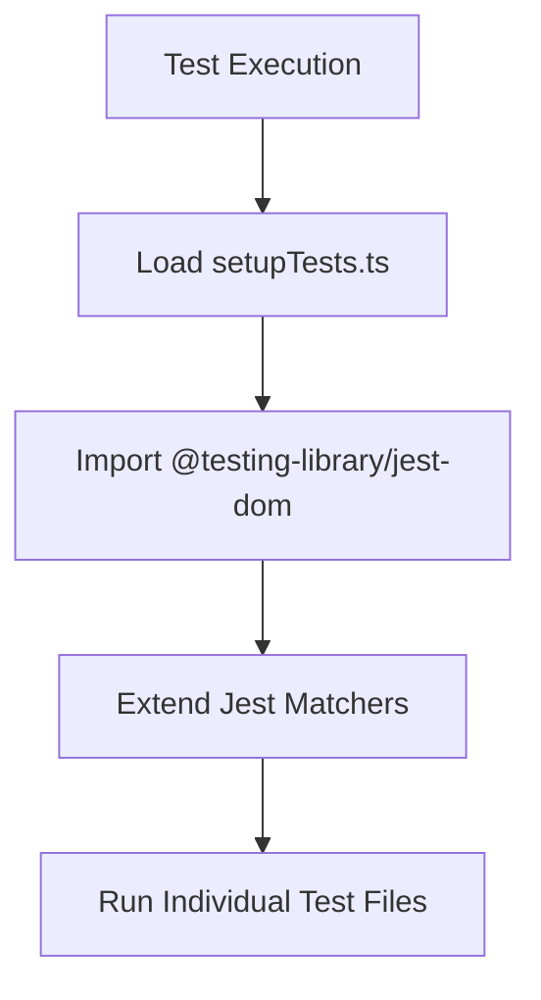
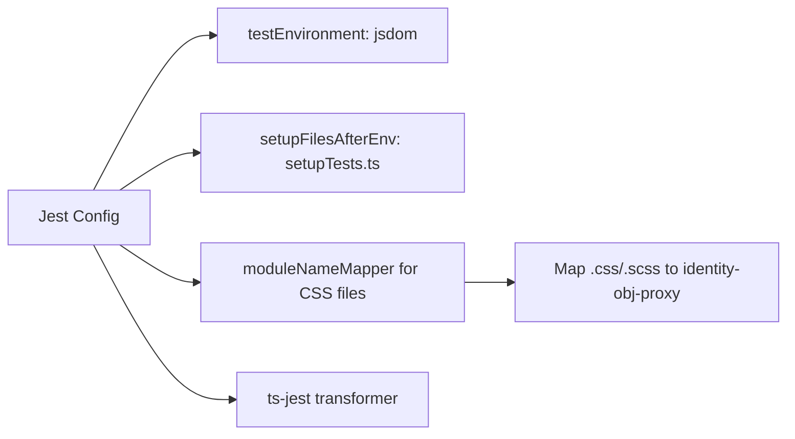
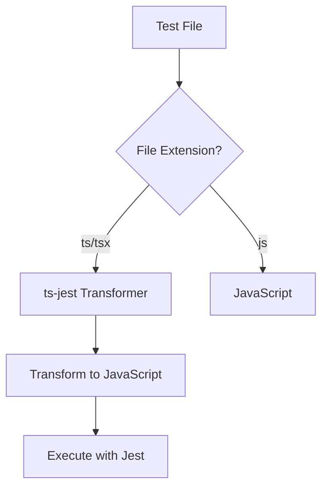
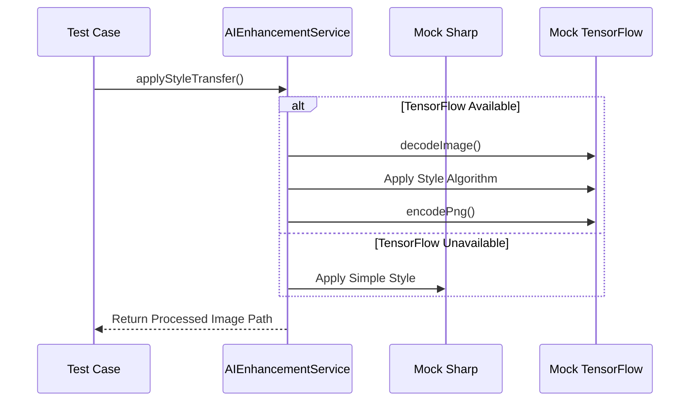
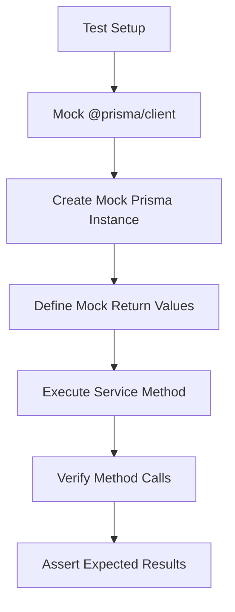

# Testing Utilities and Mocks

<cite>
**Referenced Files in This Document**   
- [setupTests.ts](file://pikzels-clone/client/src/setupTests.ts)
- [jest.config.js](file://pikzels-clone/client/jest.config.js)
- [jest.config.js](file://pikzels-clone/jest.config.js)
- [social-share.test.ts](file://pikzels-clone/src/__tests__/social-share.test.ts)
- [ai-enhancement.service.test.ts](file://pikzels-clone/src/modules/ai/ai-enhancement.service.test.ts)
- [image-processing.service.test.ts](file://pikzels-clone/src/modules/thumbnail/__tests__/image-processing.service.test.ts)
- [ai-enhancement.service.ts](file://pikzels-clone/src/modules/ai/ai-enhancement.service.ts)
- [image-processing.service.ts](file://pikzels-clone/src/modules/thumbnail/image-processing.service.ts)
- [facebook-client.ts](file://pikzels-clone/src/modules/social-share/facebook-client.ts)
- [twitter-client.ts](file://pikzels-clone/src/modules/social-share/twitter-client.ts)
- [social-media-client.ts](file://pikzels-clone/src/modules/social-share/social-media-client.ts)
- [thumbnail.service.test.ts](file://pikzels-clone/src/modules/thumbnail/thumbnail.service.test.ts)
- [project.service.test.ts](file://pikzels-clone/src/modules/project/project.service.test.ts)
</cite>

## Table of Contents
1. [Introduction](#introduction)
2. [Frontend Test Setup Configuration](#frontend-test-setup-configuration)
3. [Jest Configuration and Module Mapping](#jest-configuration-and-module-mapping)
4. [TypeScript Transformation with ts-jest](#typescript-transformation-with-ts-jest)
5. [Mocking External Dependencies](#mocking-external-dependencies)
6. [Testing AI and Image Processing](#testing-ai-and-image-processing)
7. [Prisma Repository Mocking](#prisma-repository-mocking)
8. [Reusable Test Utilities and Factories](#reusable-test-utilities-and-factories)
9. [Conclusion](#conclusion)

## Introduction
This document provides a comprehensive overview of the testing utilities and mocking strategies used throughout the Thumbnail Maker application. It covers both frontend and backend testing configurations, focusing on Jest setup, module mocking, external dependency simulation, and reusable test patterns. The goal is to ensure consistent, reliable, and maintainable tests across the codebase while isolating test environments from production systems.

## Frontend Test Setup Configuration
The frontend testing environment is initialized through the `setupTests.ts` file, which serves as the entry point for all frontend test configurations. This file imports `@testing-library/jest-dom` to extend Jest's expect functionality with additional DOM-based matchers that simplify assertions on rendered React components.

The setup ensures that all DOM-related tests have access to enhanced assertion methods such as `toBeInTheDocument()`, `toBeVisible()`, and `toHaveClass()`, which improve test readability and reliability when validating UI component behavior.



**Diagram sources**
- [setupTests.ts](file://pikzels-clone/client/src/setupTests.ts)

**Section sources**
- [setupTests.ts](file://pikzels-clone/client/src/setupTests.ts)

## Jest Configuration and Module Mapping
The project employs separate Jest configurations for frontend and backend environments, each tailored to their specific runtime requirements. The frontend configuration, located in `client/jest.config.js`, sets up a JSDOM test environment suitable for React component testing.

A key feature of the frontend Jest configuration is the use of `moduleNameMapper` to handle static assets. CSS and styling files (`.css`, `.scss`, `.sass`, `.less`) are mapped to the `identity-obj-proxy` module, which returns the imported object as-is. This allows tests to import stylesheets without attempting to parse or apply actual CSS, preventing errors during test execution.

The `setupFilesAfterEnv` configuration points to `setupTests.ts`, ensuring the test environment is properly initialized before any tests run.



**Diagram sources**
- [jest.config.js](file://pikzels-clone/client/jest.config.js)

**Section sources**
- [jest.config.js](file://pikzels-clone/client/jest.config.js)

## TypeScript Transformation with ts-jest
Both frontend and backend test environments utilize `ts-jest` to transform TypeScript files into executable JavaScript during testing. The frontend configuration explicitly defines the transform rule for `.ts` and `.tsx` files, while the backend configuration in the root `jest.config.js` uses the `ts-jest` preset for comprehensive TypeScript support.

The backend configuration includes additional settings such as:
- `roots`: Specifies the base directory for test discovery
- `testMatch`: Defines glob patterns for locating test files
- `moduleFileExtensions`: Lists supported file extensions for module resolution
- `collectCoverageFrom`: Configures which files should be included in coverage reports

This setup ensures that TypeScript code is properly compiled and type-checked during testing, maintaining type safety while enabling Jest to execute the transformed JavaScript.



**Diagram sources**
- [jest.config.js](file://pikzels-clone/client/jest.config.js)
- [jest.config.js](file://pikzels-clone/jest.config.js)

**Section sources**
- [jest.config.js](file://pikzels-clone/client/jest.config.js)
- [jest.config.js](file://pikzels-clone/jest.config.js)

## Mocking External Dependencies
The testing strategy includes comprehensive mocking of external API clients to simulate social media platform interactions without making actual network requests. Social media clients for Facebook and Twitter are mocked using Jest's manual mock system, allowing tests to verify integration logic while maintaining test isolation.

The `social-media-client.ts` file defines an abstract base class `SocialMediaClient` that establishes a common interface for all social media integrations. Concrete implementations like `FacebookClient` and `TwitterClient` inherit from this base class and implement platform-specific logic.

In tests, these clients are automatically mocked when imported, returning predictable responses that allow validation of business logic without external dependencies.

```mermaid
classDiagram
class SocialMediaClient {
<<abstract>>
+accessToken : string
+baseUrl : string
+uploadMedia(imageUrl) : Promise
+createPost(post, mediaIds) : Promise
+getEngagement(postId) : Promise
+formatText(text, platform) : string
+validatePost(post) : {valid, errors}
}
class FacebookClient {
+API_BASE_URL : string
+MAX_POST_LENGTH : number
+uploadMedia(imageUrl) : Promise
+createPost(post, mediaIds) : Promise
+getEngagement(postId) : Promise
+formatTextForFacebook(text) : string
+validatePost(post) : {valid, errors}
}
class TwitterClient {
+API_BASE_URL : string
+MAX_TWEET_LENGTH : number
+uploadMedia(imageUrl) : Promise
+createPost(post, mediaIds) : Promise
+getEngagement(postId) : Promise
+formatTextForTwitter(text) : string
+validatePost(post) : {valid, errors}
}
SocialMediaClient <|-- FacebookClient
SocialMediaClient <|-- TwitterClient
```

**Diagram sources**
- [social-media-client.ts](file://pikzels-clone/src/modules/social-share/social-media-client.ts)
- [facebook-client.ts](file://pikzels-clone/src/modules/social-share/facebook-client.ts)
- [twitter-client.ts](file://pikzels-clone/src/modules/social-share/twitter-client.ts)

**Section sources**
- [social-media-client.ts](file://pikzels-clone/src/modules/social-share/social-media-client.ts)
- [facebook-client.ts](file://pikzels-clone/src/modules/social-share/facebook-client.ts)
- [twitter-client.ts](file://pikzels-clone/src/modules/social-share/twitter-client.ts)

## Testing AI and Image Processing
The application's AI and image processing capabilities are tested using strategic mocking to avoid dependencies on heavy machine learning libraries during test execution. The `ai-enhancement.service.test.ts` file demonstrates how TensorFlow.js integration is tested by verifying service initialization and available enhancement options.

For image processing, the `image-processing.service.test.ts` file employs Jest's `jest.mock()` function to create comprehensive mocks of the `sharp` module. This allows tests to verify that the correct image processing operations are called without performing actual image manipulation.

The AI enhancement service includes a fallback mechanism that uses Sharp for style transfer when TensorFlow.js is unavailable, which is particularly useful in test environments where the full AI stack may not be present.



**Diagram sources**
- [ai-enhancement.service.test.ts](file://pikzels-clone/src/modules/ai/ai-enhancement.service.test.ts)
- [image-processing.service.test.ts](file://pikzels-clone/src/modules/thumbnail/__tests__/image-processing.service.test.ts)
- [ai-enhancement.service.ts](file://pikzels-clone/src/modules/ai/ai-enhancement.service.ts)
- [image-processing.service.ts](file://pikzels-clone/src/modules/thumbnail/image-processing.service.ts)

**Section sources**
- [ai-enhancement.service.test.ts](file://pikzels-clone/src/modules/ai/ai-enhancement.service.test.ts)
- [image-processing.service.test.ts](file://pikzels-clone/src/modules/thumbnail/__tests__/image-processing.service.test.ts)

## Prisma Repository Mocking
Database interactions are isolated in tests through comprehensive mocking of the Prisma client. The `thumbnail.service.test.ts` and `project.service.test.ts` files demonstrate a consistent pattern for mocking Prisma repository methods using Jest's module mocking capabilities.

The mocking strategy involves:
1. Creating a mock Prisma client with jest.fn() for all database operations
2. Setting up expected return values for find and update operations
3. Verifying that the correct methods are called with proper parameters
4. Testing error conditions by mocking null or invalid responses

This approach allows thorough testing of business logic that depends on database operations without requiring a real database connection, significantly improving test speed and reliability.



**Diagram sources**
- [thumbnail.service.test.ts](file://pikzels-clone/src/modules/thumbnail/thumbnail.service.test.ts)
- [project.service.test.ts](file://pikzels-clone/src/modules/project/project.service.test.ts)

**Section sources**
- [thumbnail.service.test.ts](file://pikzels-clone/src/modules/thumbnail/thumbnail.service.test.ts)
- [project.service.test.ts](file://pikzels-clone/src/modules/project/project.service.test.ts)

## Reusable Test Utilities and Factories
The testing framework promotes consistency and reduces duplication through reusable test utilities and setup patterns. While specific factory implementations are not visible in the provided code, the consistent mocking patterns across service tests suggest a shared approach to test initialization.

Key reusable patterns include:
- Standardized Prisma client mocking structure
- Consistent beforeEach() setup for service instantiation
- Shared mock data structures for common entities
- Uniform assertion patterns for database interactions

These patterns ensure that new tests follow established conventions, making them easier to understand and maintain. The use of `jest.clearAllMocks()` in beforeEach() hooks guarantees test isolation and prevents state leakage between test cases.

## Conclusion
The Thumbnail Maker application employs a robust and comprehensive testing strategy that effectively isolates test environments from production systems while maintaining high test coverage and reliability. By leveraging Jest's powerful mocking capabilities, the codebase achieves thorough testing of complex features including AI processing, image manipulation, and external API integrations without incurring the overhead of actual resource-intensive operations.

The separation of frontend and backend test configurations, combined with consistent mocking patterns and reusable utilities, creates a maintainable testing ecosystem that supports the application's growth and evolution. This approach ensures that both UI components and backend services can be tested reliably and efficiently, contributing to overall code quality and stability.