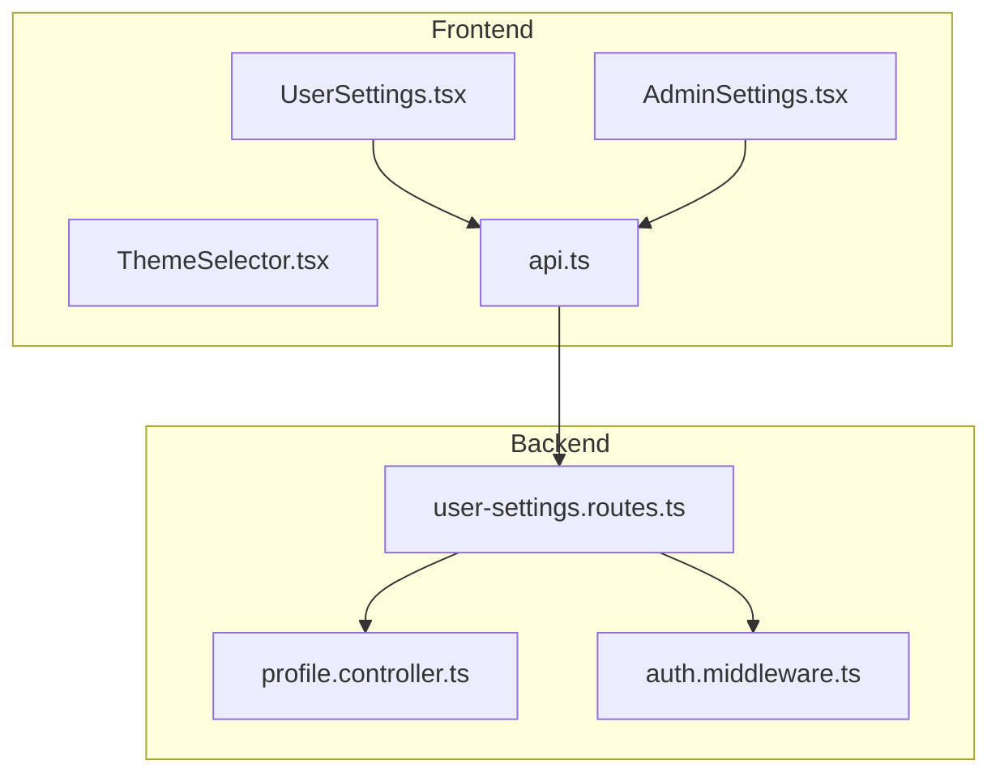
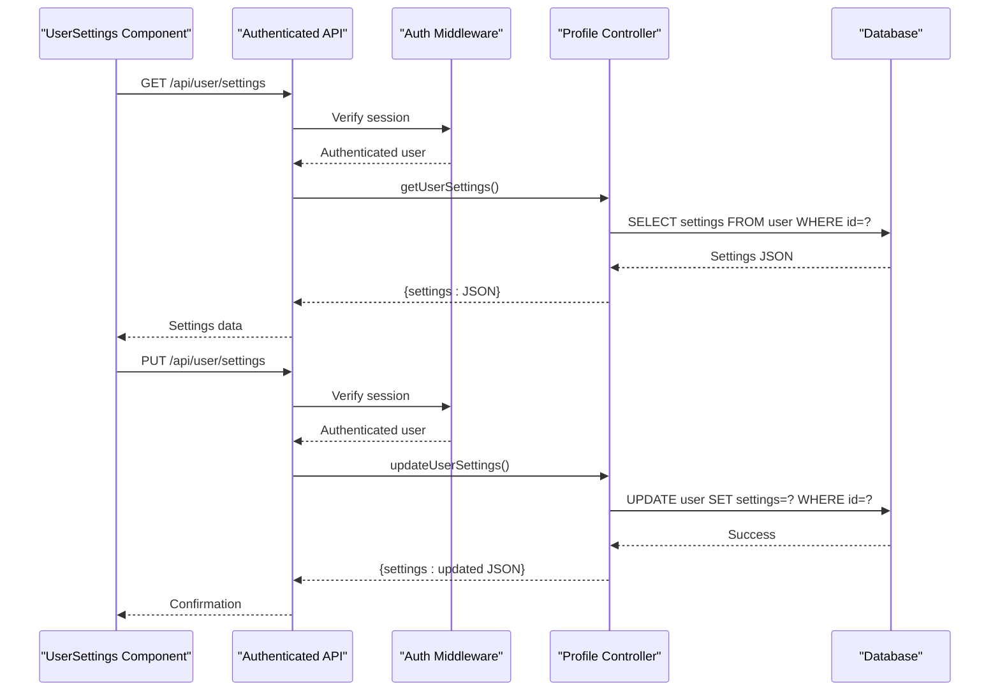
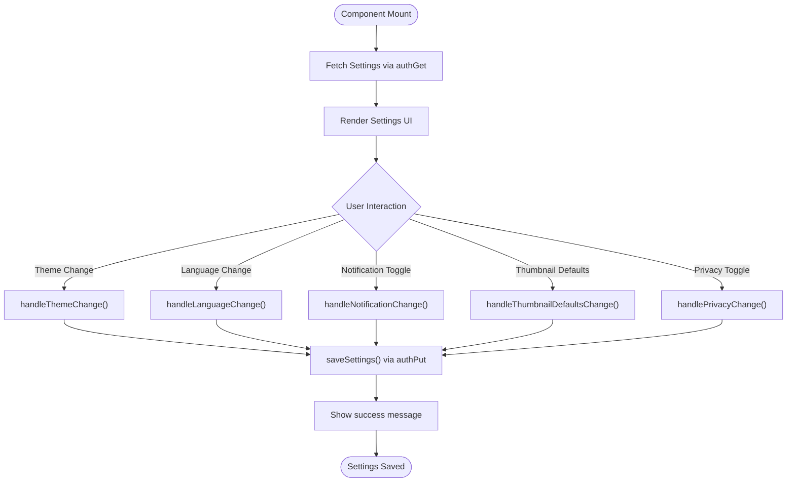
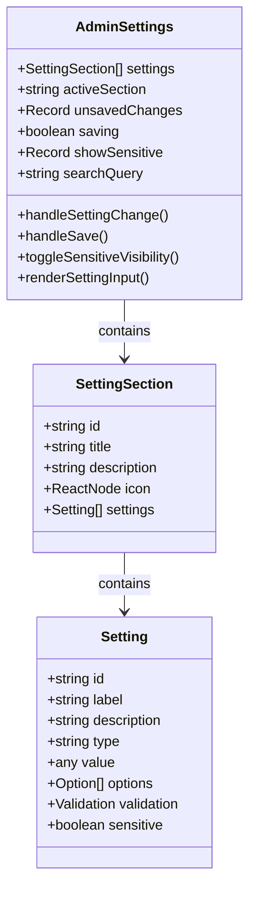
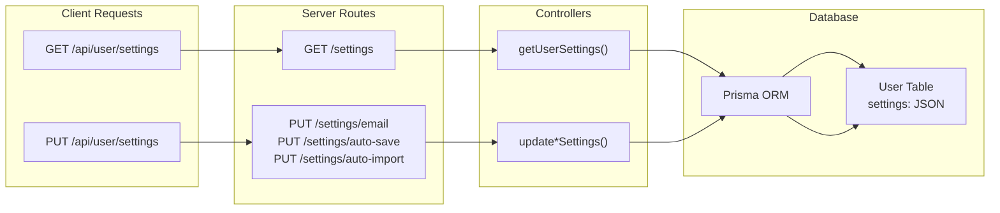
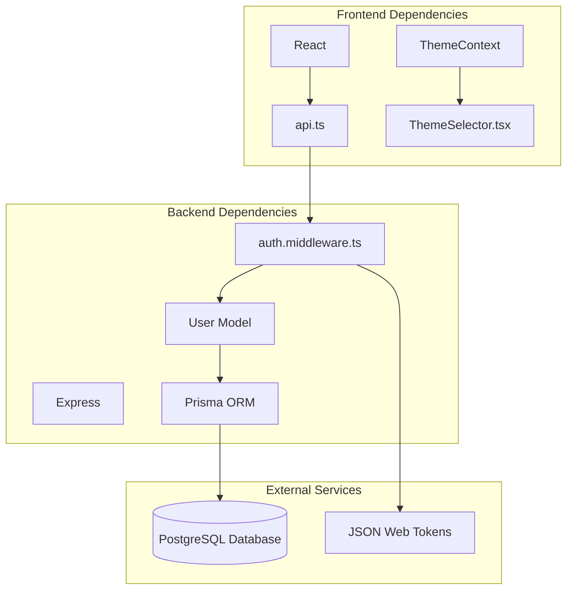

# User Settings Preferences

<cite>
**Referenced Files in This Document**
- [UserSettings.tsx](file://pikzels-clone/client/src/components/UserSettings.tsx)
- [AdminSettings.tsx](file://pikzels-clone/client/src/components/admin/AdminSettings.tsx)
- [extending-user-settings.md](file://pikzels-clone/docs/guides/extending-user-settings.md)
- [user-settings.md](file://pikzels-clone/docs/api/user-settings.md)
- [api.ts](file://pikzels-clone/client/src/utils/api.ts)
- [user-settings.routes.ts](file://pikzels-clone/src/modules/user/user-settings.routes.ts)
- [profile.controller.ts](file://pikzels-clone/src/modules/auth/profile.controller.ts)
- [settings.json](file://.qoder/settings.json)
- [settings.json](file://.vscode/settings.json)
</cite>

## Table of Contents
1. [Introduction](#introduction)
2. [Project Structure](#project-structure)
3. [Core Components](#core-components)
4. [Architecture Overview](#architecture-overview)
5. [Detailed Component Analysis](#detailed-component-analysis)
6. [Dependency Analysis](#dependency-analysis)
7. [Performance Considerations](#performance-considerations)
8. [Troubleshooting Guide](#troubleshooting-guide)
9. [Conclusion](#conclusion)

## Introduction
This document provides comprehensive documentation for the User Settings Preferences system. It covers the frontend implementation, backend APIs, configuration options, and extension guidelines for managing user preferences such as theme selection, language settings, notification preferences, thumbnail defaults, and privacy controls. The system supports authenticated users and integrates with a modern authentication flow using HttpOnly cookies.

## Project Structure
The User Settings functionality spans both the frontend React application and the backend API:

- Frontend components:
  - UserSettings: Main user preference management UI
  - AdminSettings: Administrative configuration panel
  - ThemeSelector: Theme selection and preview
- Backend API:
  - Routes for user settings endpoints
  - Controllers for retrieving and updating settings
  - Authentication middleware for protected endpoints
- Supporting utilities:
  - Authenticated fetch wrapper for secure API communication
  - Documentation for extending settings

**Diagram sources**
- [UserSettings.tsx](file://pikzels-clone/client/src/components/UserSettings.tsx#L1-L653)
- [AdminSettings.tsx](file://pikzels-clone/client/src/components/admin/AdminSettings.tsx#L1-L699)
- [api.ts](file://pikzels-clone/client/src/utils/api.ts#L1-L137)
- [user-settings.routes.ts](file://pikzels-clone/src/modules/user/user-settings.routes.ts#L1-L54)
- [profile.controller.ts](file://pikzels-clone/src/modules/auth/profile.controller.ts#L40-L78)

**Section sources**
- [UserSettings.tsx](file://pikzels-clone/client/src/components/UserSettings.tsx#L1-L653)
- [AdminSettings.tsx](file://pikzels-clone/client/src/components/admin/AdminSettings.tsx#L1-L699)
- [api.ts](file://pikzels-clone/client/src/utils/api.ts#L1-L137)
- [user-settings.routes.ts](file://pikzels-clone/src/modules/user/user-settings.routes.ts#L1-L54)
- [profile.controller.ts](file://pikzels-clone/src/modules/auth/profile.controller.ts#L40-L78)

## Core Components
The User Settings system consists of several key components:

### UserSettings Component
The primary interface for individual user preferences:
- Theme selection (light/dark)
- Language preferences
- Notification toggles (email, push)
- Thumbnail default dimensions and style
- Privacy controls (profile visibility, thumbnail sharing)

### AdminSettings Component
Administrative configuration panel:
- General application settings
- Security configurations
- Email and database settings
- API and storage configurations
- UI/Theme customization options

### Authentication Utilities
Secure API communication using HttpOnly cookies:
- Automatic token refresh on 401 errors
- Centralized authFetch wrapper
- Support for GET, POST, PUT, DELETE operations

**Section sources**
- [UserSettings.tsx](file://pikzels-clone/client/src/components/UserSettings.tsx#L5-L21)
- [AdminSettings.tsx](file://pikzels-clone/client/src/components/admin/AdminSettings.tsx#L27-L49)
- [api.ts](file://pikzels-clone/client/src/utils/api.ts#L44-L102)

## Architecture Overview
The User Settings system follows a client-server architecture with clear separation of concerns:

**Diagram sources**
- [user-settings.md](file://pikzels-clone/docs/api/user-settings.md#L9-L51)
- [profile.controller.ts](file://pikzels-clone/src/modules/auth/profile.controller.ts#L57-L78)
- [user-settings.routes.ts](file://pikzels-clone/src/modules/user/user-settings.routes.ts#L7-L12)
- [api.ts](file://pikzels-clone/client/src/utils/api.ts#L44-L102)

## Detailed Component Analysis

### User Settings Frontend Implementation
The UserSettings component manages state and UI interactions:

**Diagram sources**
- [UserSettings.tsx](file://pikzels-clone/client/src/components/UserSettings.tsx#L39-L86)

#### Settings Data Model
The UserSettings interface defines the structure for preferences:

| Category | Properties | Types | Defaults |
|----------|------------|-------|----------|
| Theme | theme | 'light' \| 'dark' | 'light' |
| Language | language | string | 'en' |
| Notifications | email, push | boolean | false |
| Thumbnail Defaults | width, height, style | number, string | 1280, 720, 'bold' |
| Privacy | profileVisible, thumbnailsPublic | boolean | false |

**Section sources**
- [UserSettings.tsx](file://pikzels-clone/client/src/components/UserSettings.tsx#L5-L21)
- [UserSettings.tsx](file://pikzels-clone/client/src/components/UserSettings.tsx#L39-L86)

### Admin Settings Management
The AdminSettings component provides comprehensive administrative controls:

**Diagram sources**
- [AdminSettings.tsx](file://pikzels-clone/client/src/components/admin/AdminSettings.tsx#L27-L49)

**Section sources**
- [AdminSettings.tsx](file://pikzels-clone/client/src/components/admin/AdminSettings.tsx#L51-L382)

### API Endpoints and Data Flow
The backend provides RESTful endpoints for settings management:

**Diagram sources**
- [user-settings.routes.ts](file://pikzels-clone/src/modules/user/user-settings.routes.ts#L7-L52)
- [profile.controller.ts](file://pikzels-clone/src/modules/auth/profile.controller.ts#L57-L78)

**Section sources**
- [user-settings.md](file://pikzels-clone/docs/api/user-settings.md#L9-L108)
- [user-settings.routes.ts](file://pikzels-clone/src/modules/user/user-settings.routes.ts#L1-L54)
- [profile.controller.ts](file://pikzels-clone/src/modules/auth/profile.controller.ts#L40-L78)

### Extension Guidelines
The system supports extensible settings through documented patterns:

#### Adding New Settings Categories
1. Update the UserSettings interface with new properties
2. Add UI controls in the component JSX
3. Implement handler functions for state management
4. Update backend validation if needed

#### Configuration Examples
Environment-specific configurations exist for development tools:
- Qoder workspace permissions and monitoring settings
- VSCode terminal profiles and default shells

**Section sources**
- [extending-user-settings.md](file://pikzels-clone/docs/guides/extending-user-settings.md#L1-L244)
- [settings.json](file://.qoder/settings.json#L1-L14)
- [settings.json](file://.vscode/settings.json#L1-L25)

## Dependency Analysis
The User Settings system has well-defined dependencies and relationships:

**Diagram sources**
- [UserSettings.tsx](file://pikzels-clone/client/src/components/UserSettings.tsx#L1-L3)
- [api.ts](file://pikzels-clone/client/src/utils/api.ts#L1-L137)
- [user-settings.routes.ts](file://pikzels-clone/src/modules/user/user-settings.routes.ts#L1-L54)

**Section sources**
- [UserSettings.tsx](file://pikzels-clone/client/src/components/UserSettings.tsx#L1-L3)
- [api.ts](file://pikzels-clone/client/src/utils/api.ts#L1-L137)
- [user-settings.routes.ts](file://pikzels-clone/src/modules/user/user-settings.routes.ts#L1-L54)

## Performance Considerations
The User Settings system incorporates several performance optimizations:

- **Efficient State Management**: React's useState and useEffect minimize unnecessary re-renders
- **Debounced Operations**: Settings changes are batched before API calls
- **Caching Strategy**: HttpOnly cookies eliminate localStorage overhead
- **Selective Updates**: Only changed settings are sent to the server
- **Lazy Loading**: Settings are fetched once per session

## Troubleshooting Guide

### Common Issues and Solutions

#### Settings Not Persisting
**Symptoms**: Settings reset after page reload
**Causes**: 
- Authentication failure
- Network connectivity issues
- Database write failures

**Solutions**:
1. Verify user authentication status
2. Check browser console for API errors
3. Confirm database connectivity
4. Review server logs for error messages

#### Theme Toggle Not Working
**Symptoms**: Theme switching has no effect
**Causes**:
- CSS class conflicts
- Browser caching issues
- Incorrect theme state management

**Solutions**:
1. Clear browser cache and reload
2. Check for conflicting CSS classes
3. Verify theme state updates in component
4. Inspect DOM for proper class application

#### API Communication Errors
**Symptoms**: 401 Unauthorized or 500 Internal Server Error
**Causes**:
- Expired access tokens
- Missing authentication headers
- Server-side exceptions

**Solutions**:
1. Implement automatic token refresh
2. Verify HttpOnly cookie configuration
3. Check server-side error logs
4. Validate request payload format

**Section sources**
- [UserSettings.tsx](file://pikzels-clone/client/src/components/UserSettings.tsx#L146-L155)
- [api.ts](file://pikzels-clone/client/src/utils/api.ts#L67-L99)

## Conclusion
The User Settings Preferences system provides a robust, extensible framework for managing user preferences in the Thumbnail Maker application. Its architecture balances simplicity with powerful customization capabilities, supporting both individual user preferences and administrative configurations. The system's use of modern authentication patterns, efficient state management, and comprehensive documentation ensures maintainability and scalability for future enhancements.

Key strengths include:
- Clean separation between frontend and backend concerns
- Comprehensive error handling and user feedback
- Extensible architecture for adding new settings categories
- Secure authentication using HttpOnly cookies
- Well-documented extension guidelines

The system serves as a foundation for continued feature development while maintaining excellent user experience and developer ergonomics.