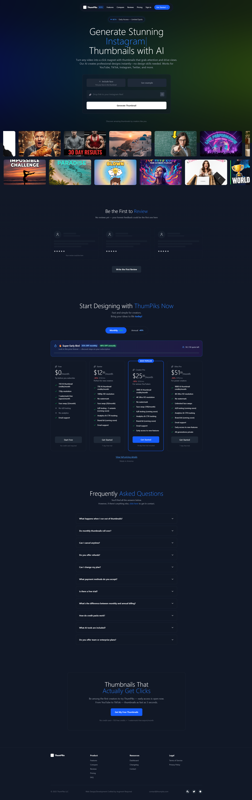
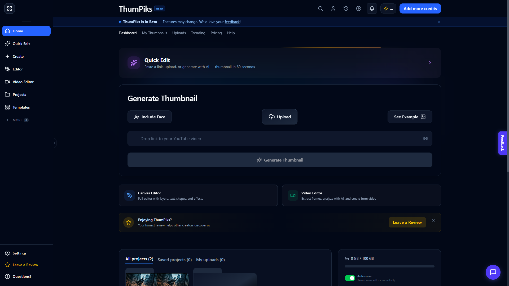

# ThumPiks

**AI-powered YouTube thumbnail studio.** Paste a video link, generate a click-worthy thumbnail with AI, then fine-tune it in a full canvas editor with brand kits, A/B testing, and analytics.

<p align="center">
  <a href="https://thumbnail-maker-studio.netlify.app"><b>Live demo →</b></a> &nbsp;•&nbsp;
  <a href="#try-it">Try it with a free account</a> &nbsp;•&nbsp;
  <a href="#engineering-highlights">Engineering highlights</a>
</p>

<p align="center">
  
  
  
  
</p>



---

## Why I built this

I started making thumbnails as pieces for my own portfolio. The deeper I got, the more I noticed how big the business of YouTube thumbnails actually is, and how clunky and overpriced most of the tools for making them are. So I decided to build the tool I wished existed, and to do it better: paste a link, get a strong thumbnail in seconds, and still have a real editor underneath when you want full control.

ThumPiks is that product. It is live, in beta, and also the largest thing I have engineered end to end, so this repo doubles as the clearest sample of how I design and build full-stack systems.

## What it does

- **AI thumbnail generation** — drop a YouTube/TikTok/Instagram/Twitter link (or a prompt) and generate thumbnails, with an optional "include my face" mode.
- **Canvas editor** — layered, drag-and-drop design with text, shapes, image layers, zoom/pan, and effects.
- **AI editing tools** — background removal, inpainting, face swap, and upscaling, exposed as selectable model tiers.
- **Brand kits** — reusable colors, fonts, logos, and style presets for consistent channels.
- **Visual search** — vector-based search across your own assets.
- **A/B testing & analytics** — compare thumbnail variants and track engagement.
- **Templates** — browse and reuse thumbnail templates.
- **Video tools** — frame extraction and editing plus YouTube trending insights.
- **Projects & organization** — projects with bulk move and organizing, reusable templates, and curated composition layouts.
- **Billing & credits** — Stripe and Polar subscriptions with a credit system.
- **Auth & security** — email/password, Google + GitHub OAuth, MFA (TOTP), and password reset.



## Try it

Live at **[thumbnail-maker-studio.netlify.app](https://thumbnail-maker-studio.netlify.app)**.

The Free plan needs no credit card and includes 150 AI thumbnail credits/month and 1 watermark-free export/month, so you can create a real thumbnail without signing up for anything paid.

## Engineering highlights

These are the parts I am most proud of and the decisions behind them.

### Multi-provider AI load balancer
AI image generation runs behind a purpose-built load balancer (`thumpiks/src/modules/thumbnail/ai-provider-load-balancer.ts`) instead of a single hardcoded provider. It supports:

- **Five selection strategies**: `round-robin`, `least-loaded`, `fastest`, `weighted`, and `failover-only`.
- **Multi-provider failover** across OpenRouter, Comet, Zenmux, OpenAI, and Replicate.
- **Rate-limit detection** with automatic cooldown and reset tracking per provider.
- **Health monitoring** with configurable unhealthy/healthy thresholds and periodic health checks.
- **A priority queue** (`ai-priority-queue.service.ts`) so paid tiers get scheduling priority under load.

Why: image providers are flaky, rate-limited, and priced differently. Treating them as an interchangeable pool keeps generation working when any one provider degrades, and lets me tune cost vs. speed without touching call sites.

### Provider-agnostic billing (Stripe **and** Polar)
Billing is built against one interface (`billing-provider.interface.ts`) with a factory (`billing-provider.factory.ts`) selecting the active provider, plus concrete `stripe`, `polar`, and `demo` implementations and dedicated Polar webhooks. Swapping or running dual providers is a config change, not a rewrite.

### Server-driven model tiers (single source of truth)
Model IDs, credit costs, and labels live only on the backend (`model-tiers.config.ts`) and are served over an API; the frontend fetches them and holds zero hardcoded model data. Swapping a model is a one-line backend change with no client deploy. (Pattern inspired by LibreChat, the Vercel AI SDK provider registry, and Open WebUI.)

### Modular backend
38 feature modules under `thumpiks/src/modules/`, each following a route → controller → service layering with a defined dependency direction. Cross-cutting security middleware (Helmet, rate limiting, input sanitization, secret scanning) is applied across the stack.

### Data model
A 45-model Prisma/PostgreSQL schema covering users, sessions, thumbnails, projects, teams, brand kits, A/B tests, subscriptions, credits, notifications, and audit logs.

### Security posture
Dual-token auth with same-origin cookie proxying (no tokens in the client bundle), MFA (TOTP), OAuth, circuit breakers (Opossum), secretlint pre-commit scanning, and dedicated security config tests.

### Testing & quality
Jest unit/integration tests and Playwright E2E flows (including thumbnail-operation and billing specs), with Husky + lint-staged, secretlint, and Commitizen wired into the workflow.

## Architecture

Monorepo with a clear front/back split:

```
ThumPiks/
└── thumpiks/
    ├── src/                # Express 5 backend
    │   ├── modules/        # 38 feature modules (auth, thumbnail, billing, ai, admin, ...)
    │   ├── middleware/     # Security, auth, error handling
    │   ├── config/         # Security & app config
    │   └── events/         # Event registry
    ├── client/             # React 19 frontend
    │   └── src/
    │       ├── features/   # Feature UIs (ai-chat, ai-tools, editor-mode, ...)
    │       └── components/ # Shared UI + editor
    ├── prisma/             # 45-model schema, migrations, seed
    └── tests/e2e/          # Playwright specs
```


## Roadmap

Features on the way, as listed on the public changelog (published January 2026):

- **Video-to-Thumbnail AI** — upload a video and let AI suggest the perfect thumbnail moments (expected Q1 2026)
- **Browser Extension** — generate thumbnails from YouTube Studio in one click (expected Q1 2026)
- **Competitor Analysis** — analyze competitor thumbnails with AI recommendations (expected Q2 2026)
## Tech stack

**Frontend:** React 19, TypeScript, Vite, Tailwind CSS, Radix UI, Zustand, TanStack Query, React Router, Framer Motion, TensorFlow.js / MediaPipe, Zod.

**Backend:** Node.js, Express 5, TypeScript, Prisma (PostgreSQL), Redis + BullMQ, Passport (OAuth), JWT, Sharp, Cloudinary, Stripe, Polar, Winston / Axiom, Opossum (circuit breakers), Zod.

**Tooling & deploy:** Jest, Playwright, ESLint, Husky, lint-staged, secretlint, Commitizen; Netlify (frontend) and Railway (backend).

## Status & roadmap

ThumPiks is in **public beta / early access**. Plans range from a free tier up to Creator and Ultra Pro, with higher resolution, more face swaps, analytics, and (rolling out) brand kits and A/B testing.

## Contact

Crafted by **Augment Required** — questions or feedback: **150487688+davisk360@users.noreply.github.com**

<sub>© 2025 ThumPiks LLC</sub>
